# 1 Hadoop                                          
## 1.1 讨论：

```
#单
单点上限，单点故障
#集群
存和算 （计算向数据移动）
```

### 简介：

```
组成
	分布式存储系统HDFS （Hadoop Distributed File System ）
	分布式计算框架MapReduce
	分布式资源管理框架YARN
```

### HDFS：

#### 存储模型：

```
1，block
	文件线性切割成块（Block）
	B随便分散存储在集群节点中
	同一文件，每个B的大小同（最后一个可能少），但是不同的文件，可以不同。
	B可以有副本数，副本无序分散不同结点。
		（2.X 默认128M 3blocks） 最小1M
	已上传的B副本数可以调整，大小不行 （副本不要大于节点数）
2，   
   偏移量 offset  （B块的起始位置：索引定位）
   （以byte流形式存在，所以中文：可能前面和后面分开了，在不同块）
   只支持一次写入多次读取，同一时刻只有一个写入者
   可以append在末尾追加数据，但是不能改前面的，（不然整个都变了）
```

#### 架构模型：

#有序组织架构。 Hadoop 是主从架构   访问是CS

```
1，文件包括 元数据MetaData 和 文件数据	
	#两者管理的部分
	元数据 ：（NN）
	数据本身  （DN）
	
2，NameNode节点保存文件元数据：单节点      （NN）
	基于内存储蓄：（磁盘是双向）      
		只存在内存（快）
		持久化	  （备份，单向）
	主要功能：
		接受C的读写服务
		收集D汇报的B列表信息
	metadata：
		文件owership和permissions
		文件大小，时间
		
	  （B的由DataNode上报）
		Block每个位置 （B1：node1,node2...）
		Block列表：大小，Block偏移量，位置信息 (一个D上的B信息)
		（#关于位置（持久化不存）由下面汇报，不然下面死了，不准确）

3，DataNode节点保存文件Block数据：多节点   （DN）
	用本地文件系统存数据  		（Block）
	同时存储自己有的Block的元数据信息文件  (MD5,说明块完整性的：
										即块能不能用)
	
	启动DN时会向NN汇报block信息列表
	通过向NN发送心跳保持与其联系（3秒一次），如果NN 10分钟没有收到DN的心跳，则认为其已经lost，
	并copy其上的block到其它DN

4.SecondaryNameNode：1.X只是持久化用的      （SNN）

5.C--N-—D   （N只告诉，具体自己C,D）
	D和N保持心跳，主动上交B列表
	C与N交互元数据信息
	C与D再交B
	

```


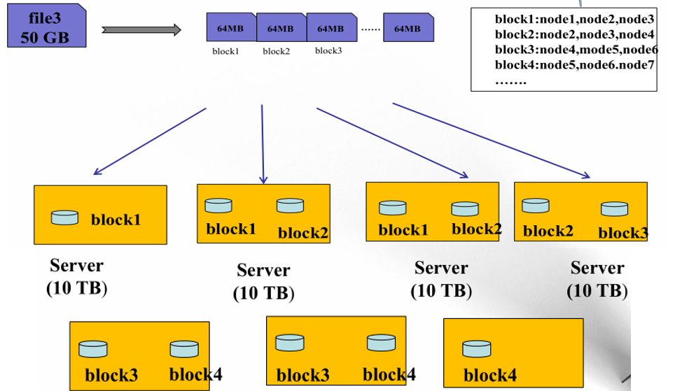

#### 持久化：

1）介绍

```
#持久化就是，内存信息永久保存在磁盘
N的metadata信息在启动后会加载到内存
方法：
	mdata存到磁盘文件名为fsimage（（时点备份）
		#定时
		序列化（慢），反序列（快），内存对象变成二进制文件。
		B的位置信息不会保存在f中
	edits记录对metadata的操作日志
		#时时刻刻
		写（快），恢复（慢）
	二者产生时间和过程：
		format时候产生（整个集群在搭建的时候，还没跑）
		一上来先一起格式化，然后写入edits，
		一定条件下，e和f合并新的f，（然后e清空，接受新指令），再返回该步骤
```

2）SNN

```
它不是NN的备份（但可以做备份），它的主要工作是帮助NN合并edits，减少NN启动时间。
SNN执行合并时机
	根据配置文件设置的时间间隔fs.checkpoint.period  默认3600秒
	根据配置文件设置edits log大小 fs.checkpoint.size 规定edits文件的最大值默认是64MB
#启动，就是反过来。（f 加上，不太大的e）
```


#### 其他比较：

```
优点：
	高容错性
		数据自动保存多个副本
 		副本丢失后，自动恢复 （B管理策略）
 	适合批处理
		移动计算而非数据
		数据位置暴露给计算框架（Block偏移量）
	适合大数据处理
	可构建在廉价机器上
		通过多副本提高可靠性
		提供了容错和恢复 机制
缺点：
	没法做到低延迟数据访问（例下面做不到）（不管多大多小都这分钟）
		比如毫秒级
		延迟与高吞吐率（>1M）
	小文件存取
		占用NameNode 大量内存
		寻道时间超过读取时间（NN维护小的难，太多了，随便放的）
	并发写入、文件随机修改
		一个文件只能有一个写者
		仅支持append

副本放置：
	第一个副本：放置在上传文件的DN；如果是集群外提交，则随机挑选一台磁盘不太满，CPU不太忙的节点。
	第二个副本：放置在于第一个副本不同的 机架的节点上。
	第三个副本：与第二个副本相同机架的其他节点。
	更多副本：随机节点
```


#### 读写流程：

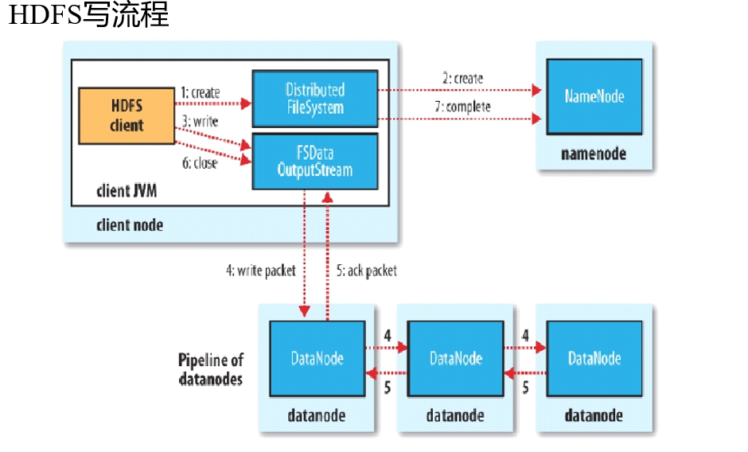

```
C：
	切文件B，
步骤开始： （都是以一块加副本为一轮）
	先和NN联系，生成PATH （C要与哪里DN交流的Path：DN列表）
中：
	文件变成Block，BLOCK还会变成一块一块的（管道滴），用管道通过PATH和第一个节点联系，然后流入下一个。
后： 
	ack ，第一个和C的汇报，其他自己和N汇报 （确认啥情况）
	C再向N汇报完成，然后开始下一个新B

N更新文件状态

集群三种：塔 ，rack，刀片
	机架RACK，有两种，交换机模式。
	（区别：一个是自己有交换机通过一个总的和其他交互		
		另一个是自己交换机直接连接了所有机架）
	一个机架，就是中间那个，然后有多个。

```


```
还是C和N先，然后再C和D
	在Block副本列表（得到的那个Path）中按距离择优选取
	MD5验证数据完整性
	最后把B和成个文件
```

权限：

```
POSIX标准（可移植操作系统接口）：HDFS遵循这个标准

与Linux文件权限类似
	r: read; w:write; x:execute
	权限x对于文件忽略，对于文件夹表示是否允许访问其内容
如果Linux系统用户z使用hadoop命令创建一个文件，那么这个文件在HDFS中owner就是z。
HDFS的权限目的：阻止误操作，但不绝对。
	HDFS相信，你告诉我你是谁，我就认为你是谁。

安全模式：（每次启动时）
	n启动，首先将映像文件(f)载入内存，并执行编辑日志(e)中的各项操作。
	
	一建立文件系统元数据的映射，建一新f文件(不需要SN操作)和一个空的编辑日志。

	此刻n在安全模式。即n的文件系统对于C来说是只读的。(写、删除、重命名都会失败，尚未获取动态信息)。
	
	在此N收集各个d的报告，当数据块达到最小副本数以上时，会被认为是“安全”的， 在一定比例（可设置）的数据块被确定为“安全”后，再过若干时间，安全模式结束
	
    当检测到副本数不足的数据块时，该块会被复制直到达到最小副本数，系统中数据块的位置并不是由n维护的，而是以块列表形式存储在d中。	
```

------


#### 伪分布：

简介

```
角色==进程

namenode
	数据元数据
	内存存储，不会有磁盘交换	
	持久化（fsimage，edits log）
	不会持久化block的位置信息
	block：偏移量，因为block不可以调整大小，hdfs，不支持修改文件，偏移量不会改变

datanode
	block块和MD5
	磁盘
	面向文件，大小一样，不能调整
	副本数，调整，（备份，高可用，容错/可以调整很多个，为了计算向数据移动）

SN

NN&DN
	心跳机制
	DN向NN汇报block信息
	安全模式

client
```

步骤：https://hadoop.apache.org/docs/r2.6.5/hadoop-project-dist/hadoop-common/SingleCluster.html

```
#1，依赖软件ssh,jdk
jdk:
#和前面一样能显示JPS就算成功	
vi /etc/profile
	export JAVA_HOME=/usr/java/jdk1.7.0_67
	export PATH=$PATH:$JAVA_HOME/bin
ssh:
ll –a 
#进入.ssh目录 
ssh-keygen -t dsa -P '' -f ~/.ssh/id_dsa
cat ~/.ssh/id_dsa.pub >> ~/.ssh/authorized_keys
chmod 700  .ssh/  给权限

#2，安装hadoop
安装：
mkdir -p /opt/sxt
tar xf hadoop-2.6.5.tar.gz -C /opt/sxt/
#软件path
vi + /etc/profile
	export HADOOP_HOME=/opt/sxt/hadoop-2.6.5
	export PATH=$PATH:$JAVA_HOME/bin:$HADOOP_HOME/bin:$HADOOP_HOME/sbin
. /etc/profile

二次Path：
#Hadoop的第二次JAVA_HOME 环境变量配置
#在hap软件安装目录下，（/opt/sxt）
cd  /etc/hadoop
	vi hadoop-env.sh
	vi mapred-env.sh
	vi yarn-env.sh
	#自己改JAVA的位置：! echo $JAVA_HOME  显示 /usr/java/jdk1.7.0_67

配置：
1)vi core-site.xml

    <property>
        <name>fs.defaultFS</name>
        <value>hdfs://node1:9000</value>
    </property>
    <property>
        <name>hadoop.tmp.dir</name>
        <value>/var/sxt/hadoop/pseudo</value>
    </property>
	#前者是默认一些的，后者存的地方

2)vi hdfs-site.xml
              
    <property>
        <name>dfs.replication</name>
        <value>1</value>
    </property>
    <property>
        <name>dfs.namenode.secondary.http-address</name>
        <value>node1:50090</value>
    </property>
    #前面副本，后面SNN，，由于伪分布，只能有一个副本

3）vi slaves （DN）
  node1
  #之前配置了node1
  
4）格式化
 hdfs namenode -format  (！只能格式化一次，再次启动集群不要执行）
	#fsimage和Id 唯一集群ID，不对了就改这个。

5）启动
start-dfs.sh

6）角色查看
jps
	2354 SecondaryNameNode
	2457 Jps
	1887 DataNode
	2179 NameNode

7)帮助：hdfs
	hdfs dfs （客户端命令）
#ss -nal 
查看web UI: IP:50070
     创建目录：hdfs dfs  -mkdir -p  /user/root   #PATH	
     查看目录:  hdfs dfs -ls   /
     上传文件： hdfs dfs -put  hadoop-2.6.5.tar.gz   /user/root				
      停止集群：stop-dfs.sh

#软件安装在/opt/sxt
#DN的path信息。fs 系统中的 /user/root	
#文件存在/var/sxt/hadoop/pseudo
```

------

#### 全分布：

```
前期准备：
jdk
hostname：       /etc/sysconfig/network    （起自己的别名）
hosts:          /etc/hosts				  （映射其他主机）
date:		    date 一下更新下时间
安全机制         /etc/sysconfig/selinux   (disabled)
firewall	
windows 域名映射

节点： node06/07/08/09
全分布分配方案：

		  NN		SNN		DN
NODE06		*
NODE07				*		*	
NODE08						*
NODE09						*

#1，秘钥分发

在每个节点上登录一下自己：产生.ssh目录  
#ll -a 查看隐藏目录
从node1向node2/node3/node4分发公钥 (公钥的名称要变化)
scp  id_dsa.pub   node2:`pwd`/node1.pub    （pwd 指当前目录）
各节点把node01的公钥追加到认证文件里：
cat ~/.ssh/node1.pub  >> ~/.ssh/authorized_keys

#2，jdk安装
分发，安装

#3，配置

cp -r hadoop   hadoop-local
#copy node06 下的 hadoop 为 hadoop-local   备份
#管理脚本只会读取hadoop-2.6.5/etc/hadoop目录

先改NN的三个那个JAVA二次path
配置core-site.xml
	存的地方改了full（新的存地址）
配置hdfs-site.xml
	second，副本改
配置slaves
	从节点 (7-9)

#分发/opt/sxt到其他07,08，09节点
scp -r hadoop-2.6.5/ node3:`pwd`

#node06分发/etc/profile给其他节点，并 . 配置文件

#4 操作
#主操作
格式化集群：hdfs namenode -format
#这时候只有主才先有full目录（现在在扔持久化文件）
启动集群：start-dfs.sh

#查看
Jps  查看各节点进程启动情况
错误看日志 /opt/下软件的logs

#上传
for i in `seq 100000`;do echo "hello  sxt $i" >>test.txt; done
	#seq 打印一系列
	#本身大小1.7M
	
hdfs dfs -mkdir -p /user/root
hdfs dfs -D dfs.blocksize=1048576 -put test.txt
#不写路径默认 home路径  即/user/root

#实验是 一个N，两个D，一个又是D又是SN，
	两个副本，分1M一块。
结论：
	#去full找，被严格分开。
	#在文件系统中，显示完整一个的，点开看细节
	#不同副本部分可能在不同结点
```


------


# 2 Hadoop2.X

## 背景：

```
Hadoop 1.0中HDFS和MapReduce在高可用、扩展性等方面存在问题

HDFS存在的问题(2个)
	NameNode单点故障，难以应用于在线场景    HA  highavailable    一时间单个运行
															（HA如果同时工作脑裂）
	NameNode压力过大，且内存受限，影扩展性   F  federation        同时间多个服务

MapReduce存在的问题响系统（？）
	JobTracker访问压力大，影响系统扩展性
	难以支持除MapReduce之外的计算框架，比如Spark、Storm等

Hadoop 2.x由HDFS、MapReduce和YARN三个分支构成；
	HDFS：NN Federation（联邦）、HA；
		2.X:只支持2个节点HA，3.0实现了一主多从
	MapReduce：运行在YARN上的MR；
		离线计算，基于磁盘I/O计算
	YARN：资源管理系统
```


## HDFS 2.X:

```
解决HDFS 1.0中单点故障和内存受限问题。
解决单点故障
	HDFS HA：通过主备NameNode解决
	如果主NameNode发生故障，则切换到备NameNode上
	
解决内存受限问题
	HDFS Federation(联邦)
	水平扩展，支持多个NameNode；
	（2）每个NameNode分管一部分目录；
	（1）所有NameNode共享所有DataNode存储资源
	
2.x仅是架构上发生了变化，使用方式不变
对HDFS使用者透明
HDFS 1.x中的命令和API仍可以使用


```

### HA:


```
数据有动态数据（块位置信息）1，和静态数据（偏移量，大小，权限和日志文件等）2
切换有自动3，手动4.
```

```
主备NameNode

解决单点故障（属性，位置）
	主NameNode对外提供服务，备NameNode同步主NameNode元数据，以待切换
	所有DataNode同时向两个NameNode汇报数据块信息（位置）1
	JNN:集群（属性）(journalnode) （原来linux nfs：net filesystem）2
		过半机制：弱一致性 （不用全都确认成功）
	
	#不能靠 ANN  直接和 StandNN 联系，因为有ack，确认机制，如果有错，会一直卡在那里（强一致）
	#nfs: 还是有问题，自身只有一个，可能又中断（ANN---other---NNstandby）
	#三个JN，从ANN写进日志，，然后备用读。
	
	standby：备，完成了edits.log文件的合并产生新的image，推送回ANN（充当SN）

两种切换选择
	手动切换：通过命令实现主备之间的切换，可以用HDFS升级等场合4
	自动切换：基于Zookeeper实现3

基于Zookeeper自动切换方案（分布式协调系统）：(也是一半机制)
	#ZK三大机制：允许注册，，观察封装时间 ，，函数回调（NN的）
	ZooKeeper Failover Controller：（ZKFC） 故障转移
		监控NN健康状态 和  选举
		在NN上的进程
	开始时候向Zookeeper注册NN，先的为主，Znode
	ZK只帮你看，函数回调，NN们自己决定做啥
		ANN挂掉后，ZKFC通过选举机制告诉ZK，自己挂了，
		然后通知备，备再通过选举变为active，原来的立刻切换成备

```

配置：


```
只要配置ZK和JNN就行

#1，免密
两个nn节点免秘钥
ssh-keygen -t dsa -P '' -f ~/.ssh/id_dsa
cat ~/.ssh/id_dsa.pub >> ~/.ssh/authorized_keys

再给对方公钥。
scp  id_dsa.pub   node1:`pwd`/node2.pub
cat ~/.ssh/node2.pub  >> ~/.ssh/authorized_keys

#2，修改配置
启动前先JN和ZK
1）进入进入hadoop-2.6.5/etc目录 (可以通过变量：cd $HADOOP_HOME)
拷贝hadoop 为 hadoop-full

2）hdfs-site.xml
去掉snn的配置
 <property>
	<name>dfs.namenode.secondary.http-address</name>
    <value>node07:50090</value>
 </property>
 
增加：NN逻辑名称

<property>
  	<name>dfs.nameservices</name>
  	<value>mycluster</value>
</property>
<property>
  	<name>dfs.ha.namenodes.mycluster</name>
 	 <value>nn1,nn2</value>
</property> 

rpc远程服务调用：实际的（eclipse 可以用）
<property>
  	<name>dfs.namenode.rpc-address.mycluster.nn1</name>
  	<value>node1:8020</value>
</property>
<property>
  	<name>dfs.namenode.rpc-address.mycluster.nn2</name>
  	<value>node2:8020</value>
</property>

给浏览器服务的  （超文本传输协议）
<property>
	<name>dfs.namenode.http-address.mycluster.nn1</name>
    <value>node1:50070</value>
</property>
<property>
    <name>dfs.namenode.http-address.mycluster.nn2</name>
    <value>node2:50070</value>
</property>

JNS
<property>
    <name>dfs.namenode.shared.edits.dir</name>
    <value>qjournal://node1:8485;node2:8485;node3:8485/mycluster</value>
</property>
#这个日志存在的集群标识符。

<property>
    <name>dfs.journalnode.edits.dir</name>
    <value>/var/sxt/hadoop/ha/jn</value>
</property>


故障转移（照抄）
<property>
  <name>dfs.client.failover.proxy.provider.mycluster</name>
  	 <value>org.apache.hadoop.hdfs.server.namenode.ha.ConfiguredFailoverProxyProvider</value>
</property>

立刻隔离（确保有错误，立即停止）
#这种方式
<property>
  	<name>dfs.ha.fencing.methods</name>
  	<value>sshfence</value>
</property>
#找私钥的位置
<property>
 	 <name>dfs.ha.fencing.ssh.private-key-files</name>
  	<value>/root/.ssh/id_dsa</value>
</property>

自动切换：
<property>
   <name>dfs.ha.automatic-failover.enabled</name>
   <value>true</value>
 </property>

3)core-site.xml
主
<property>
  <name>fs.defaultFS</name>
  <value>hdfs://mycluster</value>
</property>

存的
hadoop.tmp.dir的配置要变更：/var/sxt/hadoop/ha

ZK
<property>
   <name>ha.zookeeper.quorum</name>
   <value>node2:2181,node3:2181,node4:2181</value>
</property>

4)分发
#先把其他的拷贝下
mv -r hadoop hadoop-full
scp -r hadoop node4:`pwd`


#3,zookeeper 集群（游离）234装
1) 3节点 java 安装 

2) 所有集群节点创建目录: mkdir opt/sxt  
 
3) zk压缩包解压在其他路径下:：
tar xf zookeeper-3.4.6.tar.gz -C /opt/sxt/

4）进入软件conf目录，改名zoo_sample.cfg zoo.cfg
mv  zoo_sample.cfg zoo.cfg

配置内：

并配置 dataDir  
/var/sxt/zk   （-p 一会先创建）
#原来是临时目录会删除

最后加集群节点。(ZK也是主从,,大号先)
#几台，是谁
sever.1=node2:2888:3888
sever.2=node3:2888:3888
sever.3=node4:2888:3888

分发这个软件  


5） #ID
共享创建 /var/sxt/zk目录，
进入各自目录 分别输出1,2，3 至文件 myid
	echo 1 > /var/sxt/zk/myid
	。。。

6） 单节点配置环境变量、并分发 ，共享模式读取profile 
# vi + /etc/profile (两行，加 bin)
export ZOOKEEPER_HOME=/opt/sxt/zookeeper-3.4.6
:$ZOOKEEPER_HOME/bin
source

7） 共享启动zkServer.sh start 集群
#jps 或 zkServer.sh status

#同时启动看谁大，不同时要过半。

8) 启动客户端 help命令查看

1,2,3节点启动jn 集群
-------------------------
hadoop-daemon.sh start journalnode

随意找一个nn节点格式化：
[root@node06 hadoop]# hdfs namenode -format
启动该节点：
[root@node06 hadoop]# hadoop-daemon.sh start namenode
另一nn节点同步：
[root@node07 sxt]# hdfs namenode -bootstrapStandby


格式化zkfc，在zookeeper中可见目录创建：（ZK要先跑起来）
[root@node06 hadoop]# hdfs zkfc -formatZK
在zookeeper 客户端可见：
#进入：zkCli.sh
	[zk: localhost:2181(CONNECTED) 1] ls /
	[hadoop-ha, zookeeper]
	#维护的信息 
	[zk: localhost:2181(CONNECTED) 2] ls /hadoop-ha
	[mycluster]
	这时候是空。（代表集群标识）
	
主启动hdfs集群;
start-dfs.sh

	再次查看zk客户端，可见：（之前空。现在两个的都是关于主）
	[zk: localhost:2181(CONNECTED) 9] ls /hadoop-ha/mycluster
	[ActiveBreadCrumb, ActiveStandbyElectorLock]   
	两个目录的数据，谁是主，谁创建：（可以看到node6）
	 get /hadoop-ha/mycluster/ActiveBreadCrumb
	 get /hadoop-ha/mycluster/ActiveStandbyElectorLock


看信息
node6 node7 50070

实验：变了，只关注主的信息
关闭主：hadoop-daemon.sh stop namenode （挂了）
再启动：hadoop-daemon.sh start namenode（还是备）
或者再  hadoop-daemon.sh stop zkfc（没挂。只是变成了备）


#zk 和集群独立
stop-dfs.sh
共享 zkServer.sh stop

#下次启动
先zk，再启动集群就行（不用再JNN，直接启动集群）

```


### F：


```
#NN都是同种业务 
多个NN同时工作 ： 共享DN数据
在上面封一个FS（接口），分配任务的。（除了大数据任务，还可以简单静态文档例FTP）
	如果没有接口，大数据进去，从A进，就必须找A（因为A给的path地址），
	有了接口，就找FS就行，FS自己帮你找去。
#客户端透明

	
```

------

### Eclispe:

#在windows通过Eclispe 远程控制集群（3.X网页就有这个功能了）可视化了。

一定要对应相应的JDK（1.7.0_17）和插件

​	https://zhuanlan.zhihu.com/p/93091830

#2有DFSloacation 这个， 

#3

1）还有导入hadoop jar  和  junit_4 ：build path ：ADD 后点userlib的

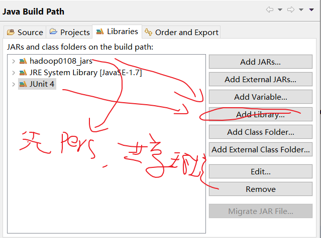

2）共享环境在 pers,java,User lib,,点new,起好名字后，点 external

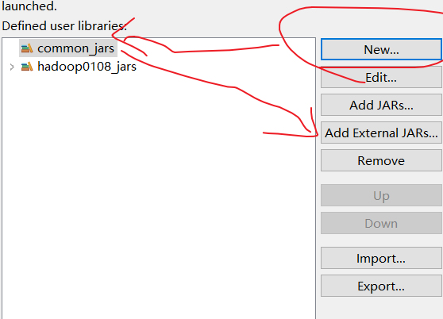

#把 hadoop 的那几个配置信息，放进src。


快捷键：

【ALT +/】 此快捷键能为用户提供内容的辅助提示

【Alt+↓】 当前行和下面一行交互位置

【F2】：给提示

【alt+shift+r 】 批量重命名快捷键 

【ctrl+shift+L】 查看当前eclipse快捷键的配置

【Crtl + 1】：当提示参数或者创建对象的时候，操作，，给提示

【Crtl + 0】: 显示所有方法

【syso】 ： 配合 提示，可以快速println

【fore】:     配合 提示,可以快速增强for

【format】  在source/找   重调格式

```
#总结：
1，HDFS 1.0 ：就是简单的 C -- N （一个）---D（多个）
2，HDFS 2。0 ： 有动态和静态之分（JN，），，，有高可用（zk）,,, 
	#还有有内存受限（F联邦）
```


------

# 3 MR

## 简介：

```
map + reduce (后者线性依赖前者)
#计算向是数据移动，map就是。
```


```
切片，  map，  洗牌（shuffle：涉及网络数据迁移），  reduce

Block <  Split = Map   （块是物理的，split是逻辑上的，map移动到B上，B可能太大了。（B又不能改））
		 分区  =  Reduce
Reduce:一个能多组KEY，但是一个KEY只能同R


#排序工作不要交给R，交互频度慢，（不设置R,默认一个分区） 。
#M只映射KV，分区自动(KV后，自动生成了分区编号 kvp)，传递前，还可以自己k对应的所有v压缩成一个
```


```
细节：内存快
1）map
buffer（缓冲区。128M一般）:   先堆一小波map  ，（不是有一个就给R一个）
	分好区排好序（R决定，自己设定 ），  ：         粗  （可能一个R处理多个k,所以一个分区中混）    
	分区里再二次排序   （一个分区可能混不同k）    ：细     
	
	再压缩，          （先map自己算算k成一个，反正你后面r也要做，不如趁早做了，传输得还小了）
	#得到图中fetch类似那个，长条
	
2) 传输
溢写，多个小buffer变一个文件，再排序，变成整体再发送。  （小buffer有序，大文件还没序呢）
			（缓冲区只有128，可能一个片太大了，所以写完的缓冲区先溢写，然后凑齐，再排序发出去）

3）R 
 R不能一个大文件就弄一次（map多，不然进程挤爆），
 先之前再大文件再合并一次，但不要完全合并（不然浪费时间）


{
（按key排，然后写到小文件分区内有序，，然后合并大文件整体再有序）
#先两次排序（写到buffer内：同个key排序，
然后溢写到小文件，同个分区，不同key排序，可能还有个压缩
然后小文件溢写成一个大文件，大文件内把b的分区排序，

}
```


```
理解：
	Map：
		读懂数据 		！
		映射为KV模型（并且自动P）
		并行分布式
		计算向数据移动
	Reduce：
		数据全量/分量加工（partition：可以group或者一个/group必须相同东西）：（也就是前者范围大于后者） ！
			Reduce中可以包含不同的key
			相同的Key汇聚到一个Reduce中
		相同的Key调用一次reduce方法，不同的停了  		！

	K,V必须使用自定义数据类型（不能基本数据类型 和 String 啥的也不行）
		作为参数传递，节省开发成本，提高程序自由度（不是类的话，可能k,v参数多又要改，用可变参数不好）
		Writable序列化：使能分布式程序数据交互（ Hadoop，）			！
		Comparable比较器：实现具体排序（字典序，数值序等）		 ！
		

java的序列化是一个重量级序列化框架（Serializable），一个对象被序列化后，会附带很多额外的信息（各种校验信息，Header，继承体系等），不便于在网络中高效传输。所以，Hadoop 自己开发了一套序列化机制（Writable）
```

------


## 1.X：

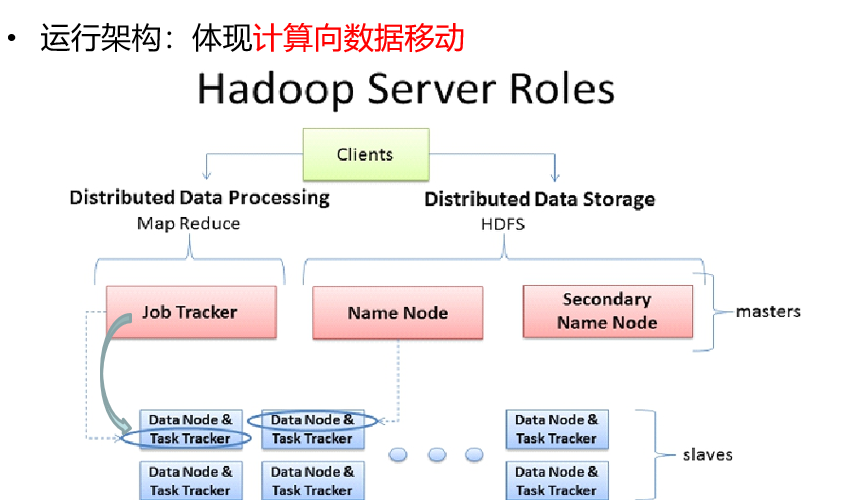

```
C很重要： （作业打成JAR，提交给HDFS：NN。 J去找NN，看任务）
	规划以下：（还有做啥）
		Reduce-Partition 
		块-片- m


J : 
	任务调度 ：和NN沟通，知道任务，知道块位置。
	
	管T，哪个节点开m,哪个开r。
	
	资源管理：整个结点占用情况。（知道节点使用情况，T实时汇报）
	
#J任务太多了，单点
```

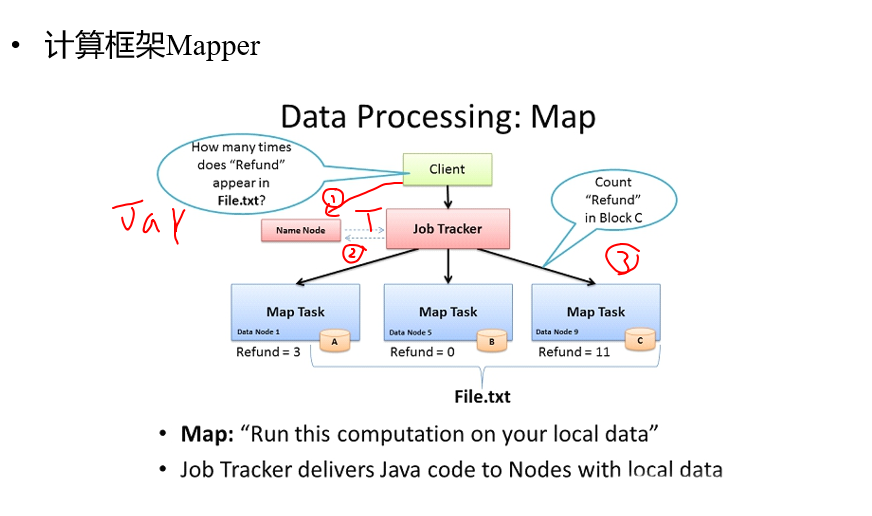

```
#3个块，3个片，3个map。
#自定义K和V。
```

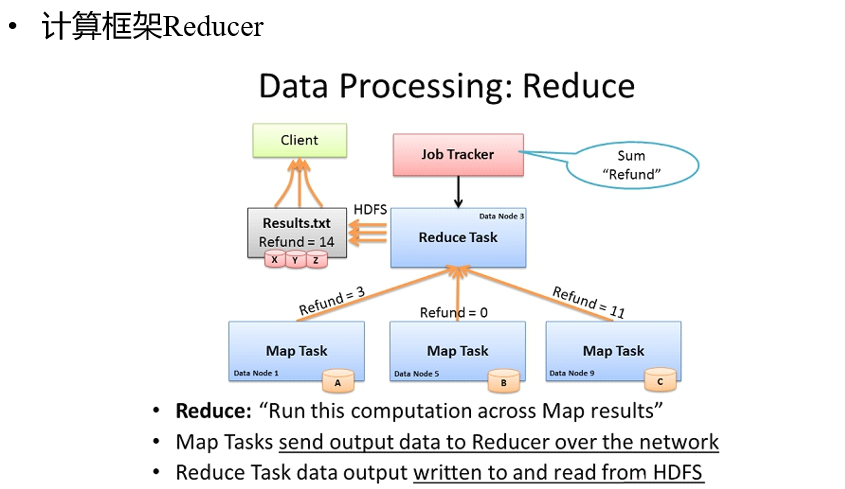

```
#一个K，一个区，一个reduce
#输出结果：
	可以给客服端，还可以存起来，还可以作为下一个Job的输入
```

理解：

```
MRv1角色：
	JobTracker
		核心，主，单点
		调度所有的作业
		监控整个集群的资源负载
		管理T

	TaskTracker：M和R两种
		从节点，自身节点资源管理
		和JobTracker心跳，汇报资源，获取Task（主动）
	

	Client  ！
		作业为单位  job
		规划作业计算分布
		提交作业资源到HDFS，最终提交作业到JobTracker


弊端：
	JobTracker：负载过重，单点故障
	资源管理与计算调度强耦合，其他计算框架需要重复实现资源管理
		不同框架job互相不知道，不知道同一个资源有没有用，如果没用还要再重复申请其他的
		#不同框架对资源不能全局管理

```

------

## 2.X：

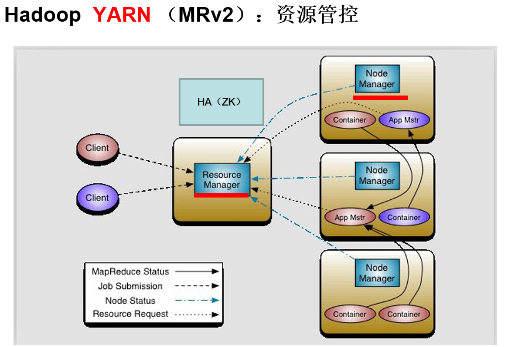

#把资源掌控给宅出来了。 两个红线长服务，一直都在。 Yarn : rm, 和 nm  

#rm自身有HA（ZK管理）

```
理解：

MRv2：On YARN
	YARN：解耦资源与计算
		ResourceManager                   （RM）
			主，核心
			集群节点资源管理
		NodeManager（帮手）                 （NM）
			与RM汇报资源
			管理Container生命周期
			#计算框架中的角色都以Container表示

		Container：【节点NM，CPU,MEM,I/O大小，启动命令】
			默认NodeManager启动线程监控Container大小，超出申请资源额度，kill
			支持Linux内核的Cgroup

	MR ： 调度作业的，（哪个节点 container,用m,用r）
		MR-   ApplicationMaster-Container    （AM）
			作业为单位，避免单点故障，负载到不同的节点 （其他手段：如果AM，没了，RM会建新的）
			创建Task需要和RM申请资源（Container  /MR 1024MB）
		Task- Container

	Client：
		RM-Client：请求资源创建AM
		AM-Client：与AM交互，看任务信息

总结： MR2.0 把两个任务分开。
YARN：有RM （总资源调度 和 启动AM）和 DM 。 （DM又看着本节点的资源情况 和 Container 任务情况）
AM ： 知道作业  和  实际负责计算工作的分配  （与RM申请资源） 
```

#YARN  –Yet Another Resource Negotiator；

```
Hadoop 2.0新引入的资源管理系统，直接从MRv1演化而来的；
	核心思想：将MRv1中J的资源管理和任务调度两个功能分开，分别由RM和AM进程实现
		RM：负责整个集群的资源管理和调度
		AM：负责应用程序相关的事务，比如任务调度、任务监控和容错等

	YARN的引入，使得多个计算框架可运行在一个集群中
		每个应用程序对应一个AM
		目前多个计算框架可以运行在YARN上，比如MapReduce、Spark、Storm等
```

#MapReduce On YARN：MRv2

```
将MapReduce作业直接运行在YARN上，而不是由JobTracker和TaskTracker构建的MRv1系统中

基本功能模块 
	YARN：负责资源管理和调度   RM 和 DM
	AM：负责任务切分、任务调度、任务监控和容错等
		#MapTask/ReduceTask：任务驱动引擎，与MRv1一致

每个MapRaduce作业对应一个MRAppMaster
	AM任务调度
	YARN将资源分配给MRAppMaster
    MRAppMaster进一步将资源分配给内部的任务

MRAppMaster（AM）容错
	失败后，由YARN重新启动
	任务失败后，MRAppMaster重新申请资源

```

## 搭建：

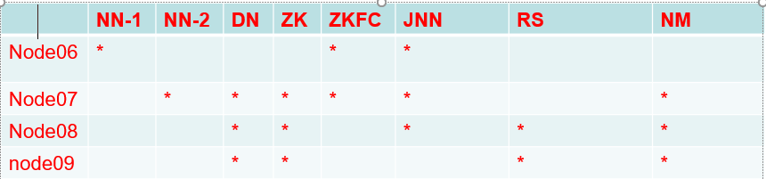

#比之前：

​	加2个RS（减少压力，放3,4）

​	加3个NM（DN上）

```
1，RS免秘钥：
#因为HA，要切换。

3节点 .ssh 目录下： ssh-keygen -t dsa -P '' -f ./id_dsa
		    cat id_dsa.pub >> authorized_keys
		    scp id_dsa.pub node4:`pwd`/node3.pub

4节点 .ssh 目录下 ：
		cat node3.pub >> authorized_keys
		ssh-keygen -t dsa -P '' -f ./id_dsa
		cat id_dsa.pub >> authorized_keys
	        scp id_dsa.pub root@node3:`pwd`/node4.pub
		
3节点 .ssh 目录下：
		cat node4.pub >> authorized_keys


2，配置：
1）mapred-site.xml
==============================
#yarn  
<property>
        <name>mapreduce.framework.name</name>
        <value>yarn</value>
</property>


2）yarn-site.xml: （在伪分布，已经帮忙设置yarn-evn  jdk）
=================================
#洗也归yarn
<property>
        <name>yarn.nodemanager.aux-services</name>
        <value>mapreduce_shuffle</value>
    </property>

<property>
   <name>yarn.resourcemanager.ha.enabled</name>
   <value>true</value>
 </property>

 <property>
   <name>yarn.resourcemanager.cluster-id</name>
   <value>cluster1</value>
 </property>

 <property>
   <name>yarn.resourcemanager.ha.rm-ids</name>
   <value>rm1,rm2</value>
 </property>

 <property>
   <name>yarn.resourcemanager.hostname.rm1</name>
   <value>node3</value>
 </property>
 <property>
   <name>yarn.resourcemanager.hostname.rm2</name>
   <value>node4</value>
 </property>

 <property>
   <name>yarn.resourcemanager.zk-address</name>
   <value>node2:2181,node3:2181,node4:2181</value>
 </property>

3）分发两个文件到：2,3,4节点
scp mapred-site.xml  yarn-site.xml node2:`pwd`
scp mapred-site.xml  yarn-site.xml node3:`pwd`
scp mapred-site.xml  yarn-site.xml node4:`pwd`

3,操作：
1）启动：（什么没起来，就单独去启动）
	A zookeeper
	 
	B node1:hdfs   start-dfs.sh  
	       （注意，有一个脚本不要用，start-all）
  		    #如果nn1 和 nn2没有启动，需要在1，2分：hadoop-daemon.sh start namenode   
	 node1: start-yarn.sh (启动nodemanager)
	        #上面两个等于start-all.sh（还不知道好不好）
	 
	C 在3,4节点分别执行脚本： yarn-daemon.sh start resourcemanager（必须手动）
	
	UI访问： RS ip：8088

2)开始计算能力  (count)：
cd  (sxt的hadoop)/share/hadoop/mapreduce  :有个example.jar （有wordcount）
hadoop jar hadoop-mapreduce-examples-XX  wordcount  path1 path2
	#path2 要空目录或者没有
大象看或者客户端 hdfs  dfs -cat

3)停止：
node1: stop-dfs.sh 
ZK:zkServer.sh stop
node1: stop-yarn.sh (停止nodemanager)
node3node4: yarn-daemon.sh stop resourcemanager （停止resourcemanager）
```

## WC：

手写，

```
步骤：
Src
	添加新的XML（上面那两个配置）
	新的Class  （如图）
```


```
程序
	1，创建类
#1，WC.java
package com.sxt.mr.wc;
import java.io.IOException;
import org.apache.hadoop.conf.Configuration;
import org.apache.hadoop.fs.Path;
import org.apache.hadoop.io.IntWritable;
import org.apache.hadoop.io.Text;
import org.apache.hadoop.mapreduce.Job;
import org.apache.hadoop.mapreduce.lib.input.FileInputFormat;
import org.apache.hadoop.mapreduce.lib.output.FileOutputFormat;

public class WC {
	public static void main(String[] args) throws IOException, ClassNotFoundException,InterruptedException{
		//Create
		Configuration conf =new Configuration(); 
		Job job = Job.getInstance(conf);
		job.setJarByClass(WC.class);
		
		//job rename
		job.setJobName("myjob");
		
		Path inPath = new Path("/user/root/test.txt");
		FileInputFormat.addInputPath(job, inPath);
		Path outPath = new Path("/output/wc");
		// 如果有了输出路径，则先删除
		if(outPath.getFileSystem(conf).exists(outPath))
			outPath.getFileSystem(conf).delete(outPath, true);
		FileOutputFormat.setOutputPath(job, outPath);
		//job规划
		job.setMapperClass(MyMapper.class);
			#你要指定key，v的输出类型。（人家的类已经实现了序列化）
		job.setMapOutputKeyClass(Text.class);
		job.setOutputValueClass(IntWritable.class);
		job.setReducerClass(MyReducer.class);
		
		//submit job  unit all the job is done
		job.waitForCompletion(true);
   }
```


```
	2,设计规划（job）
#2.1 MyMapper
package com.sxt.mr.wc;

import java.io.IOException;
import java.util.StringTokenizer;

import org.apache.hadoop.io.IntWritable;
import org.apache.hadoop.io.Text;
import org.apache.hadoop.mapreduce.Mapper;

//Map: Kin 每行第一个的下标索引，Vin ：一行数据，OUT：字符串，数字
public class MyMapper extends Mapper<Object, Text, Text,IntWritable>  {
	private final static IntWritable one =new IntWritable(1);
	private Text word =new Text();
	//重写map方法，完成map 映射
	public void map(Object key,Text value ,Context context ) throws IOException,InterruptedException {
		StringTokenizer itr = new StringTokenizer(value.toString());
		while (itr.hasMoreTokens()){
			word.set(itr.nextToken());
			context.write(word,one);
		}
	}

}
---------------------------------------------------------
#2.2 MyReducer
package com.sxt.mr.wc;
import java.io.IOException;
import org.apache.hadoop.io.IntWritable;
import org.apache.hadoop.io.Text;
import org.apache.hadoop.mapreduce.Reducer;

public class MyReducer extends Reducer<Text,IntWritable, Text,IntWritable> {

	//迭代计算,不同就调用新的reduce
	//输入是hello 1 hello 1 .....sxt 1,sxt 1
	private IntWritable result = new IntWritable();		
	public void reduce(Text key , Iterable<IntWritable> values, Context context) 
						throws IOException,InterruptedException{
		int sum =0 ;
		for (IntWritable val :values){
			sum += val.get();
		}
			result.set(sum);
			context.write(key, result);		
	   }	
}

```

```
		3，Jar包
			export jar,,传到linux
			hadoop jar wc.jar com.sxt.mr.wc.WC  （包名，类（主类））

#慢（小文件也慢，大文件有一定优势）
```


## 源码：

总共可以分成四部分：
C（Split），map1(映射) , map2(后面操作)，R

### 1）客户端

```
#客户端：Job  (看一下怎么得到的map的数量maps)
核心：
文件路径—B大小—需要多少S—S放容器—容器变数组---拿到数组长度—转换成maps数量

```


```
#具体
```

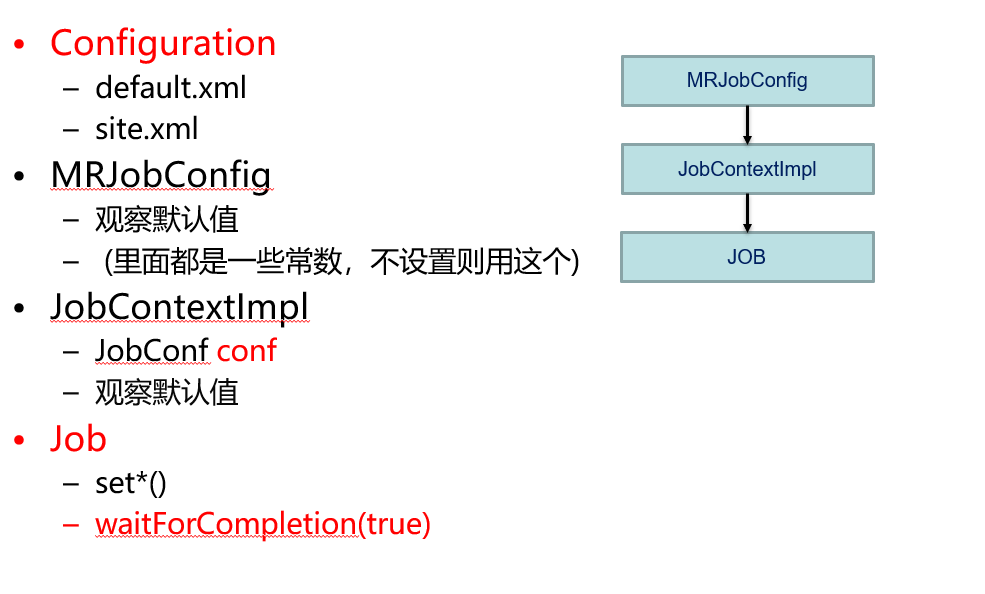


```
#接下来要从块----> 片
最重要的东西：
input.getSplits(job);  （返回Splits 最终信息的列表）
#path,切片起始位置，大小，对应块的位置主机信息。
```

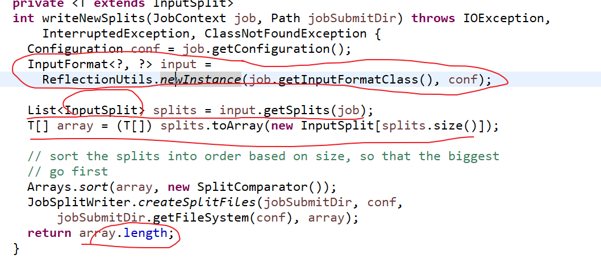

#input实际是子类FileInputFormat的对象

#不设置那个，默认片和块等

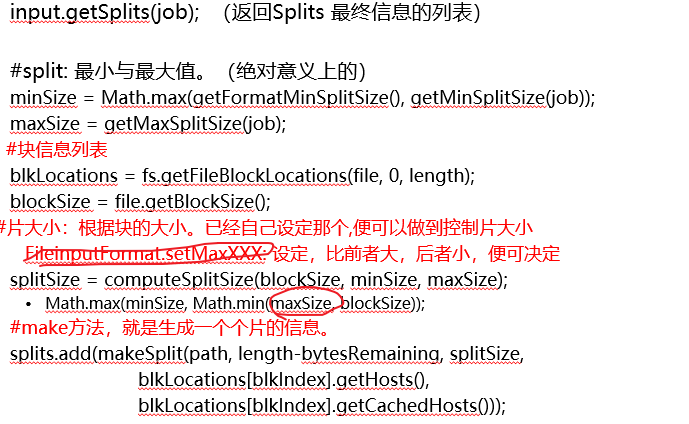

```
minSize片默认最小1字节，或者设定的中 大的，，，，
maxSize得到设定的（不然是就是绝对意义上的最大值 Long包装类，8字节）  
```


### 2）map in

```
#map in : 怎么读取，映射的
核心：
最后有个context 封装了所有东西：（读取器，书写器，片，文件，任务，TaskID）
而读取最后考的是一行读取器。
```


```
1，MyMapper 是自己写的类。
必须要继承Mapper,自己只重写了map。

而从Mapper 可以看出来 run 方法调用的 map.

所以问题如下：
context :输入和也要用
从run 怎么传进来的context，，以及谁调用run
```

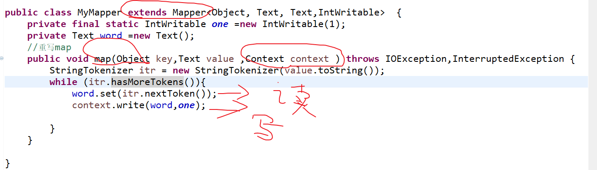


```
#2，具体
RM 在一个节点开启container , c变成变成 AM ，
然后AM 在相应节点创建container变成，M 和R TASK。

M T: 没有main 方法，通过反射来创建对象.（M T 在hadoop jar包中的mapr-client-core中的mapred包）
	里面有run方法  完成了Mapper的run方法调用
	#Mapper，也没有main， 要实例化，也必须反射
	
#有时候，不用R任务。（R拉取数据，太浪费时间了，）

看M T 的run方法：实际调用runNewMapper方法
1) taskContext:  上下文对象
2) 反射创建mapper对象，如果如果没有定义，则默认用Mapper  (前者必须继承后者)
3) 反射创建格式化类。同上（默认指向了TextInputFormat,咱们没定义）
4) 获取（C）之前准备的切片对象信息
5) 行读取器：赋值给input
	​RecordReader—>NewTrackRR– -用TextIF 对象调用creatRR ()
	​生成LineRecordReader：读一行。

6) mapContext :  由MapContextImpl 实例化 （封装读取器，书写器，片，文件，任务，TaskID）
7) mapperContext  由WrappedMapper实例化，，把上面6) 在封装一层进去
	​#context 就是个容器。封装了所有实例化的东西
```

```
8) 然后开始try
	{
		A,调用input.intialize(切片，和 7)   
			A.1）Inputsplit—- 变成Filesplit  (具体的文件啥信息)
			A.2）获取Path 对象，然后开启FS系统，开启FSData输入流(开始读数据了)
			A.3）有个流，seek 方法，，（确定从输入流哪里开始读）
				​然后如果不是第一片，，后面的都要放弃读第一行，因为每片会在最后多读一行
				​（因为只有块的衔接处，才可能出现字符分割:  因为正常数据是不可能没写完就换行的）
				​（这样，当你字符被切开，多一行，可以复原：因为有所有片信息，另一行在别地可以读到）

		最终引用方法：
		B,mapper.run(mapperContext)  (读取都是LineRR的方法，映射都是自己类的map方法)
			B.1)Mapper 的run 就是用来读取数据的，然后调用自己类的	 map（映射数据 和 写出去）。
			#还有行数，就一直调用map。
	}
```

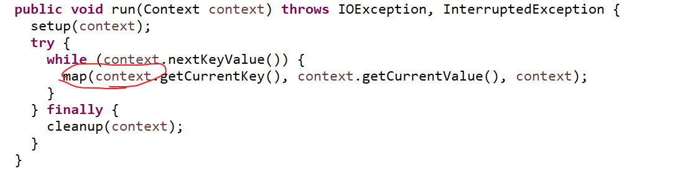

#一个key,一个value

---------------------------------------------

### 3）map out

```
书写器：  缓冲区(排序和压缩) 和 分区
```


```
#1，具体
9) 书写器，RecordWriter    (output)
有任务走，output =  new NewOPCollector(){

	A.createSortingColloector()方法  返回对象  collector(MapOPC的对象)
		#方法返回值：MOPC <k,v>，return collector
		
		而collector 又由collectorClasses 对象的Class 子类反射得到
		而cC 是job.getClasses()  要不自定义(自己写太难)，要不默认 MapOutputBuffer	
		
		有个collector.init （）（实际看MOB 的方法）	
  	
  	
    B.partitions = JobContent.getNumReduce() (找JC 实现类 JCImpl的方法)
		#如果不设置，默认 为1  job.setNumReduce （在规划的时候）
		分区器：partitioner
			1）1个分区，分区号码就是0
			2） 大于1个，可以自定义，不自定义默认（哈希）
```

```
#2，缓冲区事情：（#在3.X mapBuffer  用C写了。快）
1）溢写器（缓存区，写了，多少开始溢写，，和下面的百分比。自定义或默认0.8）
2）缓存区大小： 自定义或者默认100MB  （这是对的）
3）排序器：要不默认，要不自己定义类（要实现接口）
4）比较器：自定义（序列化 （在hadoop是 Writable）和 比较接口）或者默认  （KV都是非基本，要序列化）
5）combiner: 压缩。可以当成map的reduce 可以使用，也可以不用。
	（看业务逻辑，自己先迭代）

逻辑就是：
​小Buffer，排序。然后溢写大文件，排序，然后压缩。
​然后进入传输，进入R前，大文件进入同一个R并行，把该输属于R分区提出来，再排序
​最终进入R的一定是有序的，同时只属于该分区的

#缓冲区形状：
	由条 实际变成了 环 
	环是先KV,I 向两头写，然后当KV,满足溢写条件时。
	在剩余那个空白处，选个分界线。
	然后KV_NEW ,I_NEW开始反向往回写。
	一直反复。（最大程度，保持了，整个东西的占有，不会卡住。）
```

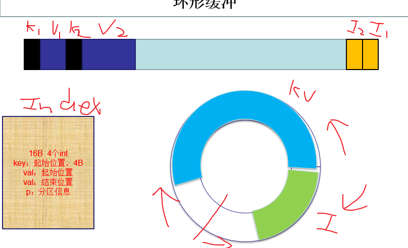

```
目前拿到的数据，就是一长条，然后有序的各个KV。（分区1:kv1,kv2,分区2:kv3,kv4）
```


### 4）reduce

```
#主要是相同的key，调用一次reduce方法。

核心：
有两个循环，
	一个是Reducer 的run，，迭代：只有还有下一个值，就一直调用reduce。
	另一个是MyReducer的reduce方法迭代：  必须是相同key的reduce方法才不会停止
```


```
#都是R Task中然后操作。.:反射出来对象，然后完成一系列操作。（同M Task）
#1，总体
Reducer 有三步：
1）shuffle
	The Reducer copies the sorted output from each Mapper using HTTP across the network.（也就是从map， 读取属于自己的分区） ？是不是还要再排个序
2)sort：确定边界
	SecondarySort:group comparator (找边界的，看下key是否等)
	job.组比较器  （不能改变map输出顺序，只能二次排序也就是鉴定边界）（一般情况就是默认和map一样）
	获取:（自定义（要实现RawComparator接口（这个接口又继承Comparator））或者 默认和map的一样，，即	可以延续，也可以自己再定个新的）
	#如果自定义： 从而可以分离出新的K，然后业务发生变化


3)Reducer run MyReducer的reduce
自己的reduce 也是个迭代的过程。只是如果用增强for循环不明显。
```

#是否有下一个

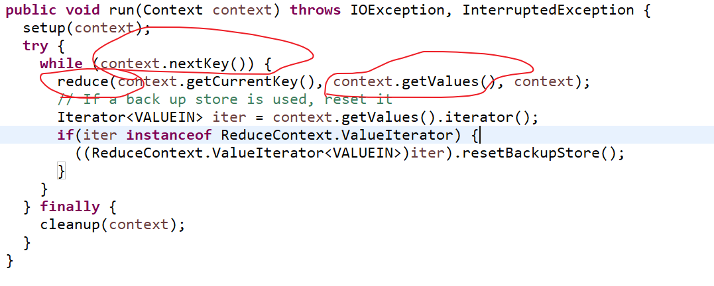

#是否是第一个或者 上下key 同（然后把你数据k,v都更新了）

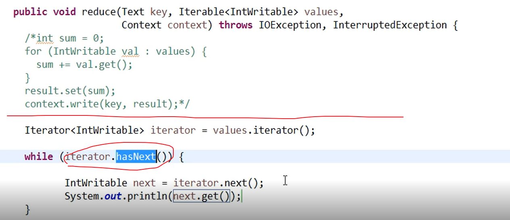

#其实每次迭代，k,v都是新的。（整个过程也就是，如何能在一个大遍历下，再分组遍历。，

​															实际上内外迭代器都是同一个迭代器。）

context.getvalues 其实返回的是迭代器，而且还是和大循环同一个。

#如果key同的，不在一起，开新的reduce结果就不对了


总流程：job mapin（）

---------------

## 实战：

### 0）总起

```
1） 天气集群
主要是熟悉下主要流程，以及自定义类格式
#一定要理解myReducer的流程。大套着小迭代

2） 朋友推荐
主要是思维。怎么设计出RM的map，reduce 中规中矩
# 两种类key，在reduce要进行if分支。

3）PR
主要是一些特殊操作。
#本地，迭代，枚举，新格式输入：改变输入key,value，两种key。

4) tf-idf
主要是分布协同任务（不再是简单迭代）
#本地，次数迭代，分词工具,  
	分区(控制输出，再通过map筛选控制输入)，
	多输入，一个主输入（给map用的），其他缓存输入（setup），
	map方法前面setup(直接用的读取，缓存出bug？？) 获得Hashmap（缓存输入）
	#每个maptask，初始化时调用一次setup(常配合)
	#(FileSplit) context.getInputSplit()看片来自哪里

5) cmf
主要是分布协同，协同推荐商品
#本地，次数迭代，，比较器，分组比较器
多map输入不同地址，Path[]  
NullWritable 类型 使用  
setjar  ：本地运行都可以不写，jar一定要写对，或者写同包下也行。
```


### 1）天气-集群

```
#1，综述
统计每月，哪两天的温度最高。

```


```
#2，流程

1）数据
1949-10-01 14:21:02	34c
1949-10-01 19:21:02	38c
1949-10-02 14:01:02	36c

要输出：
1949-10-01  38
1949-10-02  36
#要一个月的不同两天

Tq 为新类 存时间和气温的
WC 为JOB端，

map的比较器，和 reduce的不一样
（前者是年月正序，温度倒叙，后者分组器只要保证年月一组）
分区器

```

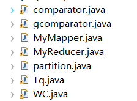

```
2）

2,1）job
		//1,配置
		Configuration conf =new Configuration(); 
		Job job = Job.getInstance(conf);	
		job.setJarByClass(WC.class); 
		job.setJobName("tqjob");
		
		//2，路径
		Path inPath = new Path("/input/tq/test.txt");
		FileInputFormat.addInputPath(job, inPath);
		
		Path outPath = new Path("/output/tq");
		if(outPath.getFileSystem(conf).exists(outPath))
			outPath.getFileSystem(conf).delete(outPath, true);
		FileOutputFormat.setOutputPath(job, outPath);
		
		//3,map
		job.setMapperClass(MyMapper.class);
		job.setMapOutputKeyClass(Tq.class);
		job.setOutputValueClass(IntWritable.class);
		
		//4,比较器
		job.setSortComparatorClass(comparator.class);
		//5，分区器
		job.setNumReduceTasks(2);
		job.setPartitionerClass(partition.class);
		
		//6,组比较器
		job.setGroupingComparatorClass(gcomparator.class);
		//7,reduce
		job.setReducerClass(MyReducer.class);
		
		//8,submit job
		job.waitForCompletion(true);
		
--------------------------

2,2) Tq 实现implements WritableComparable<Tq> 接口
省写属性的set,get方法
@Override
	public String toString() {
		return year + "-" + mon + "-" + day;
	}
	//序列化:注意写出和输入  
	@Override
	public void write(DataOutput out) throws IOException {
		out.writeInt(this.getYear());
		out.writeInt(this.getMon());
		out.writeInt(this.getDay());
		out.writeInt(this.getTem());
		
	}
	@Override
	public void readFields(DataInput in) throws IOException {
		this.setYear(in.readInt());
		this.setMon(in.readInt());
		this.setDay(in.readInt());
		this.setTem(in.readInt());
	}
	//一般情况类的比较
	@Override
	public int compareTo(Tq o) {
		if(this.getYear()==o.getYear())
		{
			if(this.getMon()==o.getMon()){
				return Integer.compare(this.getDay(), o.getDay());
			}
			return Integer.compare(this.getMon(), o.getMon());
		}
		return Integer.compare(this.getYear(), o.getYear());
	}
	
}

---------------------
2,3）myMapper
public class MyMapper extends Mapper<Object, Text, Tq,IntWritable>  {
	//省的map 反复创建。
	Tq tq = new Tq();
	IntWritable t = new IntWritable();
	//重写map
	public void map(Object key,Text value ,Context context ) throws IOException,InterruptedException {
	
		//String[] str=value.toString().split("\t");
		String[] str  = StringUtils.split(value.toString(), '\t');
		
		
		// String不能直接转int
		int t_temp = Integer.parseInt(
						str[1].substring(0,str[1].lastIndexOf("c")) );
		t.set(t_temp);
		
		String string = "yyyy-MM-dd";
		SimpleDateFormat time_temp = new SimpleDateFormat(string);
		
		try {
			Date time = time_temp.parse(str[0]);
			GregorianCalendar date = new GregorianCalendar();
			date.setTime(time);
			
			tq.setYear(date.get(Calendar.YEAR));
			//注意 +1  的括号位置
			tq.setMon(date.get(Calendar.MONTH)+1);
			tq.setDay(date.get(Calendar.DAY_OF_MONTH));
			tq.setTem(t_temp);
			
			
			
			context.write(tq,t);
		}


---------------------
2,4）两个比较器
public class comparator extends WritableComparator{
	Tq a=null;
	Tq b=null;
	
	// ！！！父类构造器，创建出实例：不然报错空指针
	
	public comparator() {
		super(Tq.class, true );
		// TODO Auto-generated constructor stub
	}
	
	
	@Override
	public int compare(WritableComparable a1, WritableComparable b1) {
		a = (Tq)a1;
		b = (Tq)b1;
		int c1 = Integer.compare(a.getYear(), b.getYear());		
		if(c1==0)
		{
			int c2=Integer.compare(a.getMon(), b.getMon());
			if(c2==0){
				return - Integer.compare(a.getTem(), b.getTem());
			}
			return c2;
		}
		return c1;
	}
	
组比较器，一样就是重新在原来key界定 一组reduce
@Override
	public int compare(WritableComparable a1, WritableComparable b1) {
		a = (Tq)a1;
		b = (Tq)b1;
		int c1 = Integer.compare(a.getYear(), b.getYear());		
		if(c1==0)
		{
			return Integer.compare(a.getMon(), b.getMon());
			
		}
		return c1;
	}
	
----------------------

2,5) 分区器
public class partition extends Partitioner<Tq, IntWritable> {

	@Override
	public int getPartition(Tq key, IntWritable value, int numPartitions) {
		// TODO Auto-generated method stub
		return key.getYear()%numPartitions;
	}

----------------------

2,6 )myreducer
public class MyReducer extends Reducer<Tq,IntWritable, Text,IntWritable> {
	Text k = new Text();
	IntWritable v = new IntWritable();
	
	public void reduce(Tq key , Iterable<IntWritable> values, Context context) 
			throws IOException,InterruptedException{
		boolean flag1 = true;
		boolean flag2 = false;
		int day = 0;
		for (IntWritable val :values){
			if(flag1){
				day = key.getDay();
				k.set( key.toString() );
				v.set(val.get());
				context.write(k,v);
				flag1=false;
				flag2=true;
				
			}
			if( flag2 && key.getDay()!=day){
				k.set( key.toString() );
				v.set(val.get());
				context.write(k,v);
				return;
			}
		}
	}
```


### 2）朋友-集群

```
#1， 总起
推荐最有可能的朋友认识

```


```
#2，数据
tom hello hadoop cat
world hadoop hello hiv

思路：找到不是直接好友的人，且而且有多少个间接好友
#整个都中规中矩，不用写了。

1）两中map key（都是： 成对的key，变成字符串）输出，
直接好友，v为0.。另一个是可能是间接好友，v为1.
	定义个方法，让字符串有序，

hello ：tom   1
hadoop ： world  0

2）reduce：求v为1的和，如果有0，就停止本次循环。且不输出了
```


### 3）PageRank-本地

```
#1，总起
本地迭代出最终的PR值。

```

```
#2，数据
1）
A	B	D
B	C

思路：
A 1 B D  变成下面两种key，下面的可以算出给A，投的总票数，写给上面
	A--1 B D
	B--0.5  （计算要同种的同一个key  A--0.5）

```

```
2）
#Node节点 ：存数据的。
public class Node {
	private String[] NN;
	private double PR;
	public static final String fieldSeparator = "\t";

	
	public double getPR() {
		return PR;
	}
	

	public Node setPR(double PR) {
		this.PR = PR;
		return this;
	}

	public String[] getNN() {
		return NN;
	}

	public Node setNN(String[] NN) {
		this.NN = NN;
		return this;
	}

	public boolean haveNN(){
		return NN != null && NN.length >0;
	}
	
	@Override
	public String toString() {
		StringBuilder sb =new StringBuilder();
		
		sb.append(PR);
		
		if(haveNN()){
			sb.append(fieldSeparator).append(StringUtils.join(fieldSeparator, NN));
		}
		return sb.toString();
	}
	// 设置好两个属性如果有
	public static Node fromMR(String v) throws IOException {
		String[] parts = v.split(fieldSeparator);
		
		if(parts.length <1){
			throw new IOException("MORE");
		}
		
		Node node = new Node().setPR(Double.valueOf(parts[0]));
		
		if (parts.length>1){
			node.setNN(Arrays.copyOfRange(parts, 1, parts.length));
		}
		return node;
	}
	
	public static Node fromMR(String v1,String v2) throws IOException{
		return fromMR(v1+fieldSeparator+v2); 
		//1.0  B D
	}

	
}


-------------------

#主文件

//本地运行必须要那两个配置文件
public class Rp {
	
	//0,枚举，，用来保存信息的，可以做到在job端和reduce交互。  conf也可以传递信息
	public static enum Mycounter{
		my
	}
	
	
	public static void main(String[] args) throws IOException, ClassNotFoundException,InterruptedException{
		
		//1,配置 ：没true也行
		Configuration conf =new Configuration(); 
		
			//跨平台，自定帮你修改平台间的符号问题
		conf.set("mapreduce.app-submission.cross-platform", "true");
			//mapred-site 那个配置文件，修改成本地跑，都不需要打成jar包
		conf.set("mapreduce.framework.name", "local" );	
		
		
		
		
		//2，框架
		double d = 0.0000001; //停止条件
		int  i =0;
		
		while(true){
			i++;
			conf.setInt("runCount", i); //往conf，加入跑的次数
			
			FileSystem fs =FileSystem.get(conf);
			Job job = Job.getInstance(conf);
			//job.setJarByClass(WC.class);  不用告诉MR端jar在哪，因为自己本地跑
			job.setJobName("pr"+i);
			
			//2,1,map
			job.setMapperClass(PRMapper.class);
				//要写输出的key,map类型
			job.setMapOutputKeyClass(Text.class);
			job.setOutputValueClass(Text.class);
			
			//2.2.reduce
			job.setReducerClass(PRReducer.class);
			
			//2,3 采用新格式化输入，这样的索引：不再是第几行，而是第一个字符A,,value 就是剩余的
			job.setInputFormatClass(KeyValueTextInputFormat.class);
			
			//2,4 地址 : 前一次输出，为后一此输入
			Path inPath = new Path("/input/pr/");
			if(i>1){
				inPath = new Path("/output/PR/pr"+(i-1));
			}
			FileInputFormat.addInputPath(job, inPath);
			Path outPath = new Path("/output/PR/pr"+i);
			if(fs.exists(outPath))
				fs.delete(outPath, true);
			FileOutputFormat.setOutputPath(job, outPath);
			
			
			//2,5 提交，
			boolean f =job.waitForCompletion(true); 
			if(f){
				System.out.println("success.");
				long sum  = job.getCounters().findCounter(Mycounter.my).getValue();//计数？？
				
				System.out.println(sum);
				double avgd = sum / 4000.0;  //  后面放大了1000, /4 求平均
				if (avgd < d){
					break;
				}
				
			}
				
		}
			
	}
}

//3,1 mapper
class PRMapper extends Mapper<Text, Text, Text,Text>  {
	//A B D
	public void map(Text key,Text value ,Context context ) throws IOException,InterruptedException {
		int RunCount = context.getConfiguration().getInt("runCount", 1); //得到跑第几次，后面那个是如果没有的默认值。
		
		String Page =key.toString(); //A
		Node node =null;
		
		//3,1,1  求整个输出
//		A 1 B D  --1 ，【B D】 
		if(RunCount == 1){
			node = Node.fromMR("1.0",value.toString());
		}else{
			node = Node.fromMR(value.toString());
		}
		context.write(new Text(Page), new Text(node.toString()));//"A:1 B D"
		//3,1,2 求有给出连的票数
		
//		----B 0.5
		if(node.haveNN()){
			
			double v = node.getPR() / node.getNN().length;
			for(String k : node.getNN()){
				context.write( new Text(k), new Text(v+"") );
			}
		}	
	}
}
//3,2 reducer
	//"A 1 B D" 'A 0.5 '  'B 1 A C' --> "A 0.5 B D" 
class PRReducer extends Reducer<Text,Text, Text,Text> {
	
	Node n = null;	
	public void reduce(Text key , Iterable<Text> values, Context context) 
						throws IOException,InterruptedException{
		double sum =0 ;
		for (Text v : values){
			Node sNode = Node.fromMR(v.toString());
			if(!sNode.haveNN()){		
				sum += sNode.getPR();
			}else{
				n=sNode;
			}
		}
		
		//善后
		double newPR = (0.15 / 4.0)+(0.85*sum);
		System.out.println("new PR : "+newPR);
		
		double d=(newPR-n.getPR()); 
		int j = (int)(d*1000);
		j= Math.abs(j);
		
		context.getCounter(Mycounter.my).increment(j);

		context.write(key,new Text( n.setPR(newPR).toString() ) );
	   }
	
}

```


### 4）TF-IDF-本地

```
#1，综述
分三步算出TF-IDF值
```

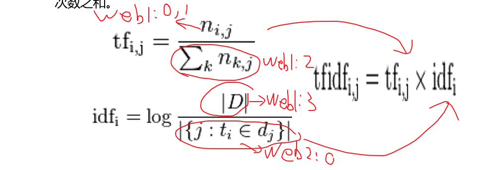

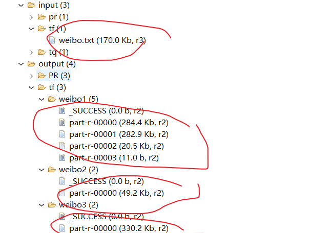

```
#2，数据
3823890210294392	今天我约了豆浆，油条

要输出：
3823890201582094 一小时:4.77068	多:3.13549	还:3.58352。。。。

#整个思路
1）大体分三步，由上图可以看出，各个值的来源

```

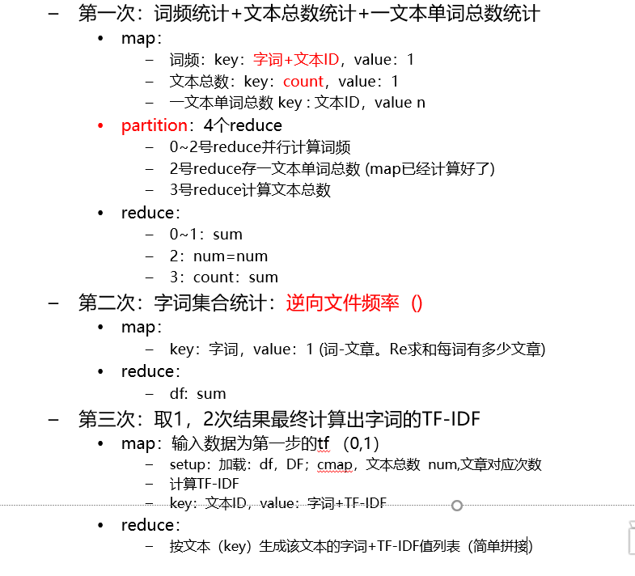


```
#3,代码

1） first :压缩和reduce用的同一个
job：
public class FirstJob {
	public static void main(String[] args) {
		Configuration conf = new Configuration();
		conf.set("mapreduce.app-submission.coress-paltform", "true");
		conf.set("mapreduce.framework.name", "local");
		try {
			FileSystem fs = FileSystem.get(conf);
			Job job = Job.getInstance(conf);
			//job.setJarByClass(FirstJob.class);
			job.setJobName("weibo1");

			job.setOutputKeyClass(Text.class);
			job.setOutputValueClass(IntWritable.class);
			
			// 要把两个特意给分出来，存
			job.setNumReduceTasks(4);
			job.setPartitionerClass(FirstPartition.class);

			job.setMapperClass(FirstMapper.class);
			job.setCombinerClass(FirstReduce.class);
			
			job.setReducerClass(FirstReduce.class);

			FileInputFormat.addInputPath(job, new Path("/input/tf"));

			Path path = new Path("/output/tf/weibo1");
			if (fs.exists(path)) {
				fs.delete(path, true);
			}
			FileOutputFormat.setOutputPath(job, path);

			boolean f = job.waitForCompletion(true);
			if (f) {

			}
		} catch (Exception e) {
			e.printStackTrace();
		}
	}
}

----------------------------------
分区： 使用了正则
public class FirstPartition extends HashPartitioner<Text, IntWritable>{
	Pattern p =Pattern.compile("^[0-9]{16}");		
	public int getPartition(Text key, IntWritable value, int reduceCount) {
		Matcher m = p.matcher(key.toString()); 
		if(key.equals(new Text("count")))
			return 3;
		else if(m.matches())
			return 2;
		else
			return super.getPartition(key, value, reduceCount-2);
			
	}
}

----------------------------------
mapper:弄了三种东西

public class FirstMapper extends Mapper<LongWritable, Text, Text, IntWritable> {
	protected void map(LongWritable key, Text value, Context context)
			throws IOException, InterruptedException {
		//3823890210294392	今天我约了豆浆，油条
		String[] v = value.toString().trim().split("\t");
		
		if (v.length >= 2) {
			
			String id = v[0].trim();
			String content = v[1].trim();

			StringReader sr = new StringReader(content);
			IKSegmenter ikSegmenter = new IKSegmenter(sr, true);
			Lexeme word = null;
			int len = 0; //看一篇doc 有多少词。
			while ((word = ikSegmenter.next()) != null) {
				String w = word.getLexemeText();
				len++;
				
				context.write(new Text(w + "_" + id), new IntWritable(1));
				//今天_3823890210294392	1
			}
			context.write(new Text(id), new IntWritable(len));
			context.write(new Text("count"), new IntWritable(1));
			//count 1
			
		}

reducer： 压缩也同一个
public class FirstReduce extends Reducer<Text, IntWritable, Text, IntWritable> {

	protected void reduce(Text key, Iterable<IntWritable> iterable,
			Context context) throws IOException, InterruptedException {

		int sum = 0;
		for (IntWritable i : iterable) {
			sum = sum + i.get();
		}	
		context.write(key, new IntWritable(sum));
	}
}
```


```
2）sec
job:
try {
			Job job =Job.getInstance(conf);
			//job.setJarByClass(TwoJob.class);
			job.setJobName("weibo2");
			job.setOutputKeyClass(Text.class);
			job.setOutputValueClass(IntWritable.class);
			job.setMapperClass(TwoMapper.class);
			job.setCombinerClass(TwoReduce.class);
			job.setReducerClass(TwoReduce.class);
			
			//mr运行时的输入数据从hdfs的哪个目录中获取
			FileInputFormat.addInputPath(job, new Path("/output/tf/weibo1"));
			FileOutputFormat.setOutputPath(job, new Path("/output/tf/weibo2"));
			
			boolean f= job.waitForCompletion(true);
			if(f){
				System.out.println("执行job成功");
			}

------------------------------
mapper: 不操作  web1:2,3
public class TwoMapper extends Mapper<LongWritable, Text, Text, IntWritable> {

	protected void map(LongWritable key, Text value, Context context)
			throws IOException, InterruptedException {

		// 获取当前 mapper task的数据片段（split）
		FileSplit fs = (FileSplit) context.getInputSplit();
		
		if (!fs.getPath().getName().contains("part-r-00003") 
				&& !fs.getPath().getName().contains("part-r-00002") ) {

			//豆浆_3823890201582094	3
			String[] v = value.toString().trim().split("\t");
			if (v.length >= 2) {
				String[] ss = v[0].split("_");
				if (ss.length >= 2) {
					String w = ss[0];
					context.write(new Text(w), new IntWritable(1));
				}
------------------------------
reducer:
public class TwoReduce extends Reducer<Text, IntWritable, Text, IntWritable> {

	protected void reduce(Text key, Iterable<IntWritable> arg1, Context context)
			throws IOException, InterruptedException {

		int sum = 0;
		for (IntWritable i : arg1) {
			sum = sum + i.get();
		}
		context.write(key, new IntWritable(sum));
	}
}
```


```
3) thd

job: 缓存的出了bug????,,,,map方法只从FileInputFormat.addInputPath 读取。

public class LastJob1 {

	public static void main(String[] args) {
		Configuration conf =new Configuration();
		conf.set("mapreduce.app-submission.cross-platform", "true");
		conf.set("mapreduce.framework.name", "local" );	
		
		try {
			FileSystem fs =FileSystem.get(conf);
			Job job =Job.getInstance(conf);
			//job.setJarByClass(LastJob.class);
			job.setJobName("weibo3");

				
	
/*//			//把微博总数加载到
			job.addCacheFile(new Path("/output/tf/weibo1/part-r-00003").toUri());

			//把每篇单词总数
			job.addCacheFile(new Path("/output/tf/weibo1/part-r-00002").toUri());
//			//把df加载到
			job.addCacheFile(new Path("/output/tf/weibo1/part-r-00000").toUri());
*/
			
		
			//设置map任务的输出key类型、value类型
			job.setOutputKeyClass(Text.class);
			job.setOutputValueClass(Text.class);
			job.setMapperClass(LastMapper1.class);
			job.setReducerClass(LastReduce1.class);
			
			//mr运行时的输入数据从hdfs的哪个目录中获取
			FileInputFormat.addInputPath(job, new Path("/output/tf/weibo1"));
			Path outpath =new Path("/output/tf/weibo3");
			if(fs.exists(outpath)){
				fs.delete(outpath, true);
			}
			FileOutputFormat.setOutputPath(job,outpath );
			
			boolean f= job.waitForCompletion(true);
			if(f){
				System.out.println("执行job成功");
			}
		}
		
--------------
mapper:  setup(采用了直接读取fs ，然后Hashmap保存)   ,,, map方法

public class LastMapper1 extends Mapper<LongWritable, Text, Text, Text> {
	// 存放微博总数
	public static Map<String, Integer> cmap = null;
	// 存放df
	public static Map<String, Integer> df = null;
	// 存放每篇词数
	public static Map<String, Integer> num = null;
	int a = 0;
	
	// 在map方法执行之前
	@Override
	protected void setup(Context context) throws IOException,
			InterruptedException {
		BufferedReader br1=null;
		BufferedReader br2 =null;
		BufferedReader br3 =null; 
		
	
		if (cmap == null || cmap.size() == 0 || df == null || df.size() == 0
				|| num == null || num.size() == 0 ) {
			FileSystem fs = FileSystem.get(context.getConfiguration());
			Path p1= new Path("/output/tf/weibo1/part-r-00003");
			FSDataInputStream in1 = fs.open(p1 );
			br1 = new BufferedReader(new InputStreamReader(in1));
			String line = br1.readLine();
			if (line.startsWith("count")) {
				String[] ls = line.split("\t");
				cmap = new HashMap<String, Integer>();

				cmap.put(ls[0], Integer.parseInt(ls[1].trim()));

			}
			
		
		
			df = new HashMap<String, Integer>();
			Path p2= new Path("/output/tf/weibo2/part-r-00000");
			FSDataInputStream in2 = fs.open(p2 );
			br2 = new BufferedReader(new InputStreamReader(in2));
			while ((line = br2.readLine()) != null) {
				String[] ls = line.split("\t");
	
				df.put(ls[0], Integer.parseInt(ls[1].trim()));
			}
			

			num = new HashMap<String, Integer>();
			Path p3= new Path("/output/tf/weibo1/part-r-00002");
			FSDataInputStream in3 = fs.open(p3 );
			br3 = new BufferedReader(new InputStreamReader(in3));
			while ((line = br3.readLine()) != null) {
				String[] ls = line.split("\t");

				num.put(ls[0], Integer.parseInt(ls[1].trim()));
				
			}
	
		br3.close();
		br2.close();
		br1.close();
	
	}
	}
		

	protected void map(LongWritable key, Text value, Context context)
			throws IOException, InterruptedException {

		FileSplit fs = (FileSplit) context.getInputSplit();

		if (!fs.getPath().getName().contains("part-r-00003") 
				&& !fs.getPath().getName().contains("part-r-00002")) {

			//豆浆_3823930429533207	2
			String[] v = value.toString().trim().split("\t");
			if (v.length >= 2) {
				int tf = Integer.parseInt(v[1].trim());// tf值
				String[] ss = v[0].split("_");
				if (ss.length >= 2) {
					String w = ss[0].trim();
					String id = ss[1].trim();
					try{
					double s = ( tf ) * Math.log(cmap.get("count") / df.get(w));
					NumberFormat nf = NumberFormat.getInstance();
					nf.setMaximumFractionDigits(5); //小数点5位

					context.write(new Text(id), new Text(w + ":" + nf.format( s/num.get(id) ) ) );	
					}catch(Exception e){

					}				
				}
			} 

-------------------
reducer:

public class LastReduce1 extends Reducer<Text, Text, Text, Text> {

	protected void reduce(Text key, Iterable<Text> iterable, Context context)
			throws IOException, InterruptedException {

		StringBuffer sb = new StringBuffer();

		for (Text i : iterable) {
			sb.append(i.toString() + "\t");
		}

		context.write(key, new Text(sb.toString()));
	}
}
```


### 5）Item-CF本地

```
#1，综述
协同有两种：基于人或者商品 （本文）
#人与人相似，然后推荐商品：（不准确，可能一个人买了全家的东西，你就没法看这个人的相似，，）

用六步，计算。
```


```
#2，数据
item_id,user_id,action,vtime  （要去掉第一行）
i161,u2625,click,2014/9/18 15:03
i161,u2626,click,2014/9/23 22:40
i161,u2627,click,2014/9/25 19:09

输出：
u13	i160:58.0,i352:9.0,i192:8.0,i455:7.0,i237:7.0,i304:7.0,i383:7.0,i550:7.0,i319:7.0,i230:7.0,
u14	i25:15.0,i223:8.0,i383:6.0,i428:6.0,i345:5.0,i427:5.0,i152:5.0,i9:4.0,i342:4.0,i419:4.0,
```

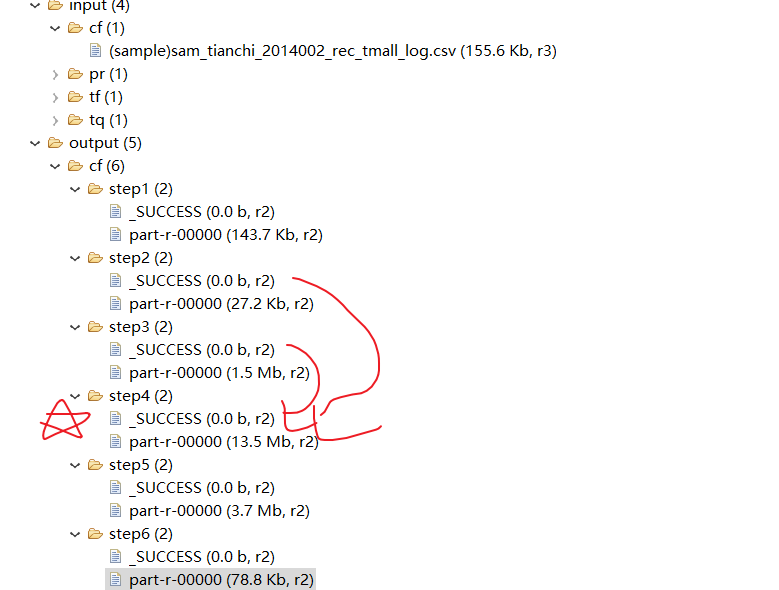

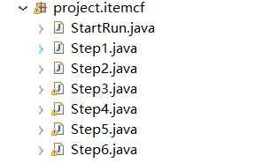

步骤：


```
#3，实现
0)Start:  控制运行哪个，以及有个map（评分映射的）
public class StartRun {

	public static void main(String[] args) {
		Configuration conf = new Configuration();
		
		conf.set("mapreduce.app-submission.corss-paltform", "true");
		conf.set("mapreduce.framework.name", "local");
		
		//所有mr的输入和输出目录定义在map集合中
		Map<String, String> paths = new HashMap<String, String>();
		paths.put("Step1Input", "/input/cf");
		paths.put("Step1Output", "/output/cf/step1");
		paths.put("Step2Input", paths.get("Step1Output"));
		paths.put("Step2Output", "/output/cf/step2");
		paths.put("Step3Input", paths.get("Step2Output"));
		paths.put("Step3Output", "/output/cf/step3");
		paths.put("Step4Input1", paths.get("Step2Output"));
		paths.put("Step4Input2", paths.get("Step3Output"));
		paths.put("Step4Output", "/output/cf/step4");
		paths.put("Step5Input", paths.get("Step4Output"));
		paths.put("Step5Output", "/output/cf/step5");
		paths.put("Step6Input", paths.get("Step5Output"));
		paths.put("Step6Output", "/output/cf/step6");

//		Step1.run(conf, paths);
//		Step2.run(conf, paths);
//		Step3.run(conf, paths);
//		Step4.run(conf, paths);
//		Step5.run(conf, paths);
		Step6.run(conf, paths);
	}

	public static Map<String, Integer> R = new HashMap<String, Integer>();
	static {
		R.put("click", 1);
		R.put("collect", 2);
		R.put("cart", 3);
		R.put("alipay", 4);
	}
}

1）step1: 去第一行去重复
public class Step1 {

	
	public static boolean run(Configuration config,Map<String, String> paths){
		try {
			FileSystem fs =FileSystem.get(config);
			Job job =Job.getInstance(config);
			job.setJobName("step1");
//			job.setJarByClass(Step1.class);//要看谁是job了。
			job.setMapperClass(Step1_Mapper.class);
			job.setReducerClass(Step1_Reducer.class);
			
			job.setMapOutputKeyClass(Text.class);
			job.setMapOutputValueClass(NullWritable.class);
			
			
			
			FileInputFormat.addInputPath(job, new Path(paths.get("Step1Input")));
			Path outpath=new Path(paths.get("Step1Output"));
			if(fs.exists(outpath)){
				fs.delete(outpath,true);
			}
			FileOutputFormat.setOutputPath(job, outpath);
			
			boolean f= job.waitForCompletion(true);
			return f;
		} catch (Exception e) {
			e.printStackTrace();
		}
		return false;
	}
	
	 static class Step1_Mapper extends Mapper<LongWritable, Text, Text, NullWritable>{

		protected void map(LongWritable key, Text value, Context context)
				throws IOException, InterruptedException {
			if(key.get()!=0){ //第一行数据不要
				context.write(value, NullWritable.get());
			}
		}
	}
		 
	 static class Step1_Reducer extends Reducer<Text, IntWritable, Text, NullWritable>{

			protected void reduce(Text key, Iterable<IntWritable> i, Context context)
					throws IOException, InterruptedException {
				context.write(key,NullWritable.get());
			}
		}
}
```


```
2） step2 ：评分
/**
 * 按用户分组，计算所有物品出现的组合列表，得到用户对物品的喜爱度得分矩阵
	u13	i160:1,
	u14	i25:1,i223:1,
	u16	i252:1
 */
public class Step2 {

	
	public static boolean run(Configuration config,Map<String, String> paths){
		try {
			FileSystem fs =FileSystem.get(config);
			Job job =Job.getInstance(config);
			job.setJobName("step2");
			job.setJarByClass(StartRun.class);  //也可以跑成功
			job.setMapperClass(Step2_Mapper.class);
			job.setReducerClass(Step2_Reducer.class);
			job.setMapOutputKeyClass(Text.class);
			job.setMapOutputValueClass(Text.class);
			
			FileInputFormat.addInputPath(job, new Path(paths.get("Step2Input")));
			Path outpath=new Path(paths.get("Step2Output"));
			if(fs.exists(outpath)){
				fs.delete(outpath,true);
			}
			FileOutputFormat.setOutputPath(job, outpath);
			
			boolean f= job.waitForCompletion(true);
			return f;
		} catch (Exception e) {
			e.printStackTrace();
		}
		return false;
	}
	
	 static class Step2_Mapper extends Mapper<LongWritable, Text, Text, Text>{

		 //如果使用：用户+物品，同时作为输出key，更优
		 //i161,u2625,click,2014/9/18 15:03
		protected void map(LongWritable key, Text value,
				Context context)
				throws IOException, InterruptedException {
			String[]  tokens=value.toString().split(",");
			String item=tokens[0];
			String user=tokens[1];
			String action =tokens[2];
			Text k= new Text(user);
			Integer rv =StartRun.R.get(action);
			Text v =new Text(item+":"+ rv.intValue());
			context.write(k, v);
			//u2625    i161:1
		}
	}
	
	 
	 static class Step2_Reducer extends Reducer<Text, Text, Text, Text>{

			protected void reduce(Text key, Iterable<Text> i,
					Context context)
					throws IOException, InterruptedException {
				Map<String, Integer> r =new HashMap<String, Integer>();
				//u2625
				// i161:1
				// i161:2
				// i161:4
				// i162:3
				// i161:4
				for(Text value :i){
					String[] vs =value.toString().split(":");
					String item=vs[0];
					Integer action=Integer.parseInt(vs[1]);
					action = ((Integer) (r.get(item)==null?  0:r.get(item))).intValue() + action;
					r.put(item,action);
				}
				StringBuffer sb =new StringBuffer();
				//遍历
				for(Entry<String, Integer> entry :r.entrySet() ){
					sb.append(entry.getKey()+":"+entry.getValue().intValue()+",");
				}
				
				
				context.write(key,new Text(sb.toString()));
			}
		}
}

3）  同现矩阵
/**
 * 对物品组合列表进行计数，建立物品的同现矩阵
i100:i100	3
i100:i105	1
i100:i106	1
 * @author root
 *
 */
public class Step3 {
	 private final static Text K = new Text();
     private final static IntWritable V = new IntWritable(1);
	
	public static boolean run(Configuration config,Map<String, String> paths){
		try {
			FileSystem fs =FileSystem.get(config);
			Job job =Job.getInstance(config);
			job.setJobName("step3");
			job.setJarByClass(Step3.class); //打成jar包最正规的方式
			job.setMapperClass(Step3_Mapper.class);
			job.setReducerClass(Step3_Reducer.class);
			job.setCombinerClass(Step3_Reducer.class);
//			
			job.setMapOutputKeyClass(Text.class);
			job.setMapOutputValueClass(IntWritable.class);
			
			
			
			FileInputFormat.addInputPath(job, new Path(paths.get("Step3Input")));
			Path outpath=new Path(paths.get("Step3Output"));
			if(fs.exists(outpath)){
				fs.delete(outpath,true);
			}
			FileOutputFormat.setOutputPath(job, outpath);
			
			boolean f= job.waitForCompletion(true);
			return f;
		} catch (Exception e) {
			e.printStackTrace();
		}
		return false;
	}
	
	 static class Step3_Mapper extends Mapper<LongWritable, Text, Text, IntWritable>{

		protected void map(LongWritable key, Text value,
				Context context)
				throws IOException, InterruptedException {
			
			//u3244	i469:1,i498:1,i154:1,i73:1,i162:1,
			String[]  tokens=value.toString().split("\t");
			String[] items =tokens[1].split(",");
			for (int i = 0; i < items.length; i++) {
				String itemA = items[i].split(":")[0];
				for (int j = 0; j < items.length; j++) {
					String itemB = items[j].split(":")[0];
					K.set(itemA+":"+itemB);
					context.write(K, V);
				}
			}
			
		}
	}
	
	 
	 static class Step3_Reducer extends Reducer<Text, IntWritable, Text, IntWritable>{

			protected void reduce(Text key, Iterable<IntWritable> i,
					Context context)
					throws IOException, InterruptedException {
				int sum =0;
				for(IntWritable v :i ){
					sum =sum+v.get();
				}
				V.set(sum);
				context.write(key, V);
			}
		} 
}
```

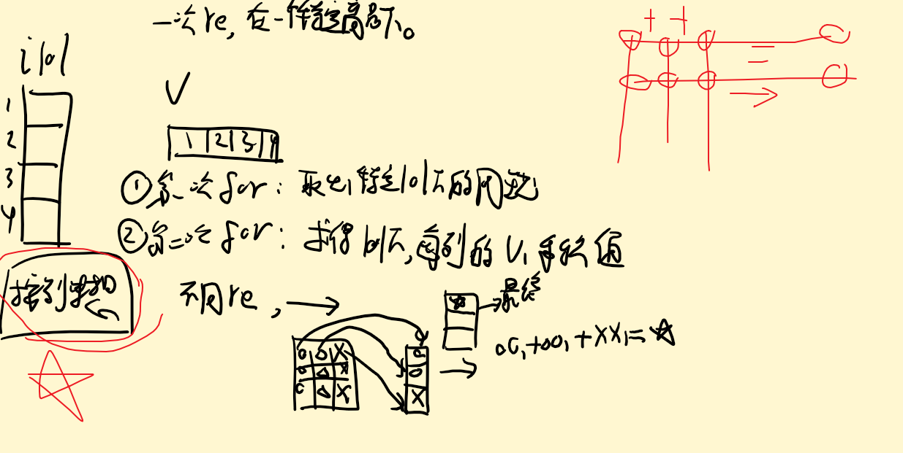

```
#4） 最重要的：  2,3相乘得到对应的列的分值，然后5）求和，得到一个Item分

public class Step4 {
	public static boolean run(Configuration config, Map<String, String> paths) {
		try {
			FileSystem fs = FileSystem.get(config);
			Job job = Job.getInstance(config);
			job.setJobName("step4");
			job.setMapperClass(Step4_Mapper.class);
			job.setReducerClass(Step4_Reducer.class);
			job.setMapOutputKeyClass(Text.class);
			job.setMapOutputValueClass(Text.class);

			// FileInputFormat.addInputPath(job, new
			// Path(paths.get("Step4Input")));
			FileInputFormat.setInputPaths(job,
					new Path[] { new Path(paths.get("Step4Input1")),
							new Path(paths.get("Step4Input2")) });
			Path outpath = new Path(paths.get("Step4Output"));
			if (fs.exists(outpath)) {
				fs.delete(outpath, true);
			}
			FileOutputFormat.setOutputPath(job, outpath);

			boolean f = job.waitForCompletion(true);
			return f;
		} catch (Exception e) {
			e.printStackTrace();
		}
		return false;
	}

	static class Step4_Mapper extends Mapper<LongWritable, Text, Text, Text> {
		private String flag;// A同现矩阵 or B得分矩阵

		//每个maptask，初始化时调用一次
		protected void setup(Context context) throws IOException,
				InterruptedException {
			FileSplit split = (FileSplit) context.getInputSplit();
			flag = split.getPath().getParent().getName();// 判断读的数据集

			System.out.println(flag + "**********************");
		}

		protected void map(LongWritable key, Text value, Context context)
				throws IOException, InterruptedException {
			String[] tokens = Pattern.compile("[\t,]").split(value.toString());
			if (flag.equals("step3")) {// 同现矩阵
				//i100:i125	1
				String[] v1 = tokens[0].split(":");
				String itemID1 = v1[0];
				String itemID2 = v1[1];
				String num = tokens[1];
				//A:B 3
				//B:A 3
				Text k = new Text(itemID1);// 以前一个物品为key 比如i100
				Text v = new Text("A:" + itemID2 + "," + num);// A:i109,1

				context.write(k, v);

			} else if (flag.equals("step2")) {// 用户对物品喜爱得分矩阵
				
				//u26	i276:1,i201:1,i348:1,i321:1,i136:1,
				String userID = tokens[0];
				for (int i = 1; i < tokens.length; i++) {
					String[] vector = tokens[i].split(":");
					String itemID = vector[0];// 物品id
					String pref = vector[1];// 喜爱分数

					Text k = new Text(itemID); // 以物品为key 比如：i100
					Text v = new Text("B:" + userID + "," + pref); // B:u401,2

					context.write(k, v);
				}
			}
		}
	}

	static class Step4_Reducer extends Reducer<Text, Text, Text, Text> {
		protected void reduce(Text key, Iterable<Text> values, Context context)
				throws IOException, InterruptedException {
			// A同现矩阵 or B得分矩阵
			//某一个物品，针对它和其他所有物品的同现次数，都在mapA集合中
			Map<String, Integer> mapA = new HashMap<String, Integer>();// 和该物品（key中的itemID）同现的其他物品的同现集合// 。其他物品ID为map的key，同现数字为值
			Map<String, Integer> mapB = new HashMap<String, Integer>();// 该物品（key中的itemID），所有用户的推荐权重分数。

			
			//A  > reduce   相同的KEY为一组
			//value:2类:
			//物品同现A:b:2  c:4   d:8
			//评分数据B:u1:18  u2:33   u3:22
			for (Text line : values) {
				String val = line.toString();
				if (val.startsWith("A:")) {// 表示物品同现数字
					// A:i109,1
					String[] kv = Pattern.compile("[\t,]").split(
							val.substring(2));
					try {
						mapA.put(kv[0], Integer.parseInt(kv[1]));
										//物品同现A:b:2  c:4   d:8
						//基于 A,物品同现次数
					} catch (Exception e) {
						e.printStackTrace();
					}

				} else if (val.startsWith("B:")) {
					 // B:u401,2
					String[] kv = Pattern.compile("[\t,]").split(
							val.substring(2));
							//评分数据B:u1:18  u2:33   u3:22		
					try {
						mapB.put(kv[0], Integer.parseInt(kv[1]));
					} catch (Exception e) {
						e.printStackTrace();
					}
				}
			}

			double result = 0;
			Iterator<String> iter = mapA.keySet().iterator();//同现
			while (iter.hasNext()) {
				String mapk = iter.next();// itemID

				int num = mapA.get(mapk).intValue();  //对于A的同现次数
				
				
				Iterator<String> iterb = mapB.keySet().iterator();//评分
				while (iterb.hasNext()) {
					String mapkb = iterb.next();// userID
					int pref = mapB.get(mapkb).intValue();
					result = num * pref;// 矩阵乘法相乘计算

					Text k = new Text(mapkb);  //用户ID为key
					Text v = new Text(mapk + "," + result);//基于A物品,其他物品的同现与评分(所有用户对A物品)乘机
					context.write(k, v);
				}
			}
		}
	}
}
```


```
5）求和
public class Step5 {
	private final static Text K = new Text();
	private final static Text V = new Text();

	public static boolean run(Configuration config, Map<String, String> paths) {
		try {
			FileSystem fs = FileSystem.get(config);
			Job job = Job.getInstance(config);
			job.setJobName("step5");
//			job.setJarByClass(StartRun.class);
			job.setMapperClass(Step5_Mapper.class);
			job.setReducerClass(Step5_Reducer.class);
			job.setMapOutputKeyClass(Text.class);
			job.setMapOutputValueClass(Text.class);

			FileInputFormat
					.addInputPath(job, new Path(paths.get("Step5Input")));
			Path outpath = new Path(paths.get("Step5Output"));
			if (fs.exists(outpath)) {
				fs.delete(outpath, true);
			}
			FileOutputFormat.setOutputPath(job, outpath);

			boolean f = job.waitForCompletion(true);
			return f;
		} catch (Exception e) {
			e.printStackTrace();
		}
		return false;
	}

	static class Step5_Mapper extends Mapper<LongWritable, Text, Text, Text> {

		/**
		 * 原封不动输出
		 */
		protected void map(LongWritable key, Text value, Context context)
				throws IOException, InterruptedException {
			String[] tokens = Pattern.compile("[\t,]").split(value.toString());
			Text k = new Text(tokens[0]);// 用户为key
			Text v = new Text(tokens[1] + "," + tokens[2]);
			context.write(k, v);
		}
	}

	static class Step5_Reducer extends Reducer<Text, Text, Text, Text> {
		protected void reduce(Text key, Iterable<Text> values, Context context)
				throws IOException, InterruptedException {
			Map<String, Double> map = new HashMap<String, Double>();// 结果

			//u3  >  reduce
			//101, 11    
			//101, 12
			//同个U下，所有求和
			for (Text line : values) {// i9,4.0
				String[] tokens = line.toString().split(",");
				String itemID = tokens[0];
				Double score = Double.parseDouble(tokens[1]);

				if (map.containsKey(itemID)) {
					map.put(itemID, map.get(itemID) + score);// 矩阵乘法求和计算
				} else {
					map.put(itemID, score);
				}
			}
//			输出同个U下，得所有评分
			Iterator<String> iter = map.keySet().iterator();
			while (iter.hasNext()) {
				String itemID = iter.next();
				double score = map.get(itemID);
				Text v = new Text(itemID + "," + score);
				context.write(key, v);
			}
		}
	}
}

6） 排序：map的 和 组排序的
public class Step6 {
	private final static Text K = new Text();
	private final static Text V = new Text();

	public static boolean run(Configuration config, Map<String, String> paths) {
		try {
			FileSystem fs = FileSystem.get(config);
			Job job = Job.getInstance(config);
			job.setJobName("step6");
//			job.setJarByClass(StartRun.class);
			job.setMapperClass(Step6_Mapper.class);
			job.setReducerClass(Step6_Reducer.class);
			job.setSortComparatorClass(NumSort.class);
			job.setGroupingComparatorClass(UserGroup.class);
			job.setMapOutputKeyClass(PairWritable.class);
			job.setMapOutputValueClass(Text.class);

			FileInputFormat
					.addInputPath(job, new Path(paths.get("Step6Input")));
			Path outpath = new Path(paths.get("Step6Output"));
			if (fs.exists(outpath)) {
				fs.delete(outpath, true);
			}
			FileOutputFormat.setOutputPath(job, outpath);

			boolean f = job.waitForCompletion(true);
			return f;
		} catch (Exception e) {
			e.printStackTrace();
		}
		return false;
	}

	static class Step6_Mapper extends Mapper<LongWritable, Text, PairWritable, Text> {

		protected void map(LongWritable key, Text value, Context context)
				throws IOException, InterruptedException {
			String[] tokens = Pattern.compile("[\t,]").split(value.toString());
			String u = tokens[0];
			String item = tokens[1];
			String num = tokens[2];
			PairWritable k =new PairWritable();
			k.setUid(u);
			k.setNum(Double.parseDouble(num));
			V.set(item+":"+num);
			context.write(k, V);

		}
	}

	static class Step6_Reducer extends Reducer<PairWritable, Text, Text, Text> {
		protected void reduce(PairWritable key, Iterable<Text> values, Context context)
				throws IOException, InterruptedException {
			int i=0;
			StringBuffer sb =new StringBuffer();
			for(Text v :values){
				if(i==10)
					break;
				sb.append(v.toString()+",");
				i++;
			}
			K.set(key.getUid());
			V.set(sb.toString());
			context.write(K, V);
		}

	}
	
	static class PairWritable implements WritableComparable<PairWritable>{

//		private String itemId;
		private String uid;
		private double num;
		public void write(DataOutput out) throws IOException {
			out.writeUTF(uid);
//			out.writeUTF(itemId);
			out.writeDouble(num);
		}

		public void readFields(DataInput in) throws IOException {
			this.uid=in.readUTF();
//			this.itemId=in.readUTF();
			this.num=in.readDouble();
		}

		public int compareTo(PairWritable o) {
			int r =this.uid.compareTo(o.getUid());
			if(r==0){
				return Double.compare(this.num, o.getNum());
			}
			return r;
		}

		public String getUid() {
			return uid;
		}

		public void setUid(String uid) {
			this.uid = uid;
		}

		public double getNum() {
			return num;
		}

		public void setNum(double num) {
			this.num = num;
		}
		
	}
	//按照  UID  和  score  来排序
	static class NumSort extends WritableComparator{
		public NumSort(){
			super(PairWritable.class,true);
		}
		
		public int compare(WritableComparable a, WritableComparable b) {
			PairWritable o1 =(PairWritable) a;
			PairWritable o2 =(PairWritable) b;
			
			int r =o1.getUid().compareTo(o2.getUid());
			if(r==0){
				return -Double.compare(o1.getNum(), o2.getNum());
			}
			return r;
		}
	}
	//组比较器，，放大范围，同个UID就是一组
	static class UserGroup extends WritableComparator{
		public UserGroup(){
			super(PairWritable.class,true);
		}
		
		public int compare(WritableComparable a, WritableComparable b) {
			PairWritable o1 =(PairWritable) a;
			PairWritable o2 =(PairWritable) b;
			return o1.getUid().compareTo(o2.getUid());
		}
	}
}
```


## 总结：

原语：相同key一组，然后sum

思想：分而治之

```
1，流程：

job(分片)--  mapper(in: 读取，映射，out:buffer(压缩，排序)，分区)---re(洗牌，，分组器，，re)
#m和r k,v传承，默认行索引为key，可以重定义（比如，第一个字符为k，其他为v）
1）job:

1.1) 自定义比较器和组比较器 要实现   
	类实现了 RawComparator接口，，你继承类WritableComparator就行
	重写compare(WritableComparable a1, WritableComparable b1) //一定要下面实例化，不然报错
	public comparator() {super(Tq.class, true );}

1.2)分区器，继承extends Partitioner<keyput, vout>
	有几个分区就会写出多少个文件。(配合得到spilt信息，可以进行筛选)

1.3）conf
配置true不重要，重要是如果是本地的一定要有那两个配置文件（不用MapReduce那两个）
	本地setjar 也不重要。


2）mapper
2,1）自定义kv，
实现WritableComparable接口
重写write   readFields 和 compareTo方法

2,2）K，V和其他类实例啥的可以写在外面，
，，K,V等要不Text.set("xxx")不直接写入 new Text("xx")；

2,3）setup
目前缓存bug还没有解决？？？考得是dfs直接读取，解决的。
```

```
2，其他
1）如果hdfs上传本地文件乱码  打开preferences->General->workspace,设置UTF-8；

2）path问题
输入输出path一定要写对，，，输入随便，输出都从绝对路径（/XX）只写到文件夹（/XX）

获取hdfs 文件: 一定要filesystem 然后FSDataInputStream  fs.open得到文件  反之，create

设置job地址 : FileInputFormat.addInputPath /  set..   当你Path为数组时，为多输入。

3）NullWritable.get()  写入。 用于原封不动下一步
```

本地运行，，没有set也行。

该方法的作用是 通过传入的class 找到job的jar包，上图我们设置的class 跟我们的job类位于同一个包中，通过public void setJarByClass(Class cls) 返回的是就是我们job包的jar，所以成功了

如果 我们设置的的class跟主类不在同一个工程中，程序会报错：NotFoundClass
