hbase

# 1 介绍

## 1.1 简介

```
#1，hadoop生态圈
```

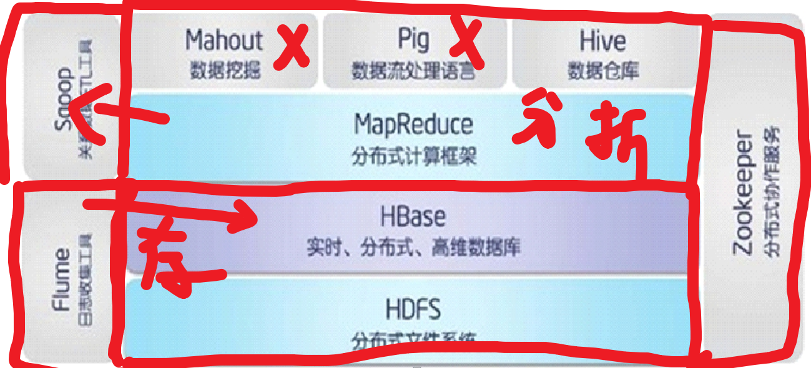


```
#2，Hbase（面向列的K,V数据库）
#Hadoop Database，是一个高可靠性、高性能、
面向列（一行的 列，，都可以不一样，空可以不写）
可伸缩（动态扩展机器，不用关闭集群）
实时读写（传统关系型不可以）   的分布式数据库

#利用Hadoop HDFS作为其文件存储系统,利用Hadoop MapReduce来处理HBase中的海量数据,利用Zookeeper作为其分布式协同服务

#主要用来存储非结构化和半结构化的松散数据（列存 NoSQL 数据库）

#billlion * million的 大小
#速度快原因：往内存写，用LSM结构，读取时顺序读写文件。

```


## 1.2 数据模型

#逻辑表，结构

包括 

row,cf,c,

timestamp,ceil,Hlog

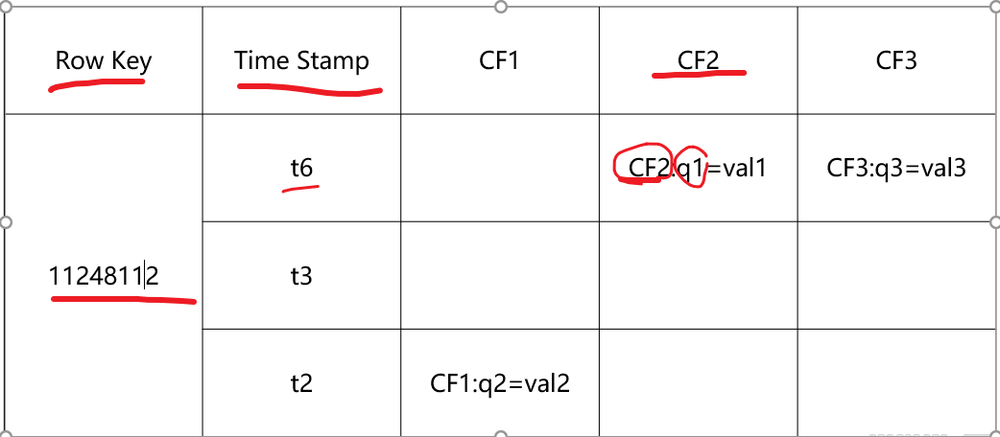


#一行，列族，列名，时间戳(同个ceil下，一个存多个值，超过规定，失效标记，溢写文件，然后合并掉旧的，没了)


```
#1， ROW  KEY
决定一行数据
按照字典顺序排序的。

#Row key只能存储64k的字节数据（一般推荐10-100字节）
#txt 文件  最小4K存储，因而会有磁盘碎片(比如文件大小为8.8K，则大小为8.8K ，但实际要12K)
```

```
#2，Column Family列族 & qualifier列

HBase表中的每个列都归属于某个列族，列族必须作为表模式(schem，就是规则)定义的一部分预先给出。如 create ‘test’, ‘course’； 

列名以列族作为前缀，每个“列族”都可以有多个列成员(column)；如course:math, course:english, 新的列族成员（列）可以随后按需、动态加入；

权限控制、存储以及调优都是在列族层面进行的；（最小单位了，不能再小了）

HBase把同一列族里面的数据存储在同一目录下，由几个文件保存。

```

```
#3，Timestamp时间戳

在HBase每个cell存储单元对同一份数据有多个版本，根据唯一的时间戳来区分每个版本之间的差异，不同版本的数据按照时间倒序排序，最新的数据版本排在最前面。

#时间戳的类型是 64位整型。

#时间戳可以由HBase(在数据写入时自动)赋值，此时时间戳是精确到毫秒的当前系统时间。 
#时间戳也可以由客户显式赋值，如果应用程序要避免数据版本冲突，就必须自己生成具有唯一性的时间戳。

```

```
#4,Cell单元格
（存储的最小单元，，逻辑上）

由行和列的坐标交叉决定；
#单元格是有版本的；

单元格的内容是未解析的字节数组；
由{row key， column( =<family> +<qualifier>)， version} 唯一确定的单元k ,   v。

cell中的数据是没有类型的，全部是字节数组形式存贮。

#“1 ” != 1 的字节数组，，，写的时候要string
```

```
#5，HLog(WAL log)  
（write  ahead log  预写日志 ：数据和操作，防止丢失）


HLog文件就是一个普通的Hadoop Sequence File，     

#Key是HLogKey对象，HLogKey中记录了写入数据的归属信息，除了table和region名字外，同时还包括 sequence number和timestamp，timestamp是” 写入时间”，
（sequence number的起始值为0，或者是最近一次存入文件系统中sequence number。）


#Value是HBase的KeyValue对象，即对应HFile中的KeyValue。

```


## 1.3 架构

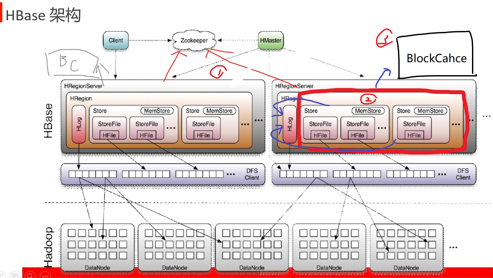

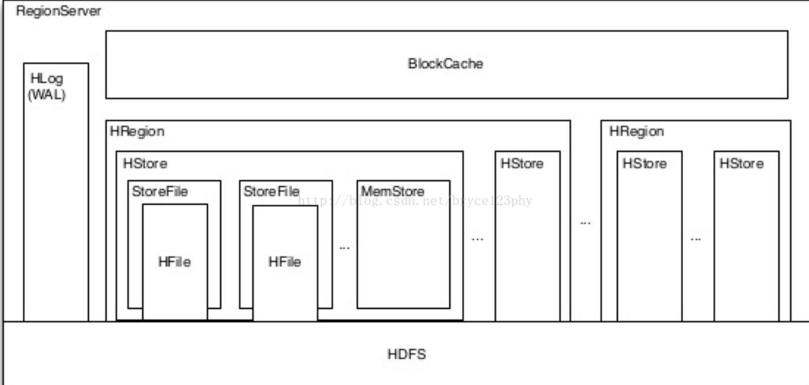

#图中原本三处错误：

1）ZK 和HRS 有联系（是为了监控HRS，汇报给HM的）

2）同个HRS下的HR共享一个HL

3）同个HR还共享一个读缓存BC（保留查询结果的）  （之前记错了，不是所有HRS，共享一个）


```
#1，读写流程

0) 补充
#C 与 HM没有直接联系，，就算HM挂了，C也可以直接读写啥的，，但是不能设计元数据修改（？？HM管这个。）
#zk保留的节点元信息1M ； 内存MS  64M
#一个表可以在多个HR上，多个HR又可能一个或多个HRS

1）写：
--1.1 C访问ZK（得到哪里放了m表节点），然后访问特定节点HRS，访问表数据（HR）。
#Store 是列族
--1.2 先写HL  ； 然后MS，，然后溢写到SF（就是HF，封装下）（然后还要SF小文件先合并，在传输）
#HL不是像后者，HL先往内存写，然后开启另一个线程（异步）检测，有就往DFS写
	HL相当于C0，C1直接怼DFS    （两个类：logAsync,logroller:60分钟打开新的文件写）
#LSM树：C0，小内存，C1大磁盘，，
	SF 是C1那样的，MS是C0块，写完就丢进溢写队列，然后开启新的MS，给下一个写。 


#关系数据库存：B+树存。


2）读：
--2.1 和 1.1 一致。
--2.2
#虽然MS是写缓存，但是还是承担一定读作用

读先从MS，然后内存BC  再磁盘
	（可能东西还没写进磁盘找不到，找到后把东西缓存到BC）
	（BC满了有淘汰机制，先进先走。（这种淘汰不太好））
	
3）排序：两个
MS排序，SF合并又排序  （溢写就是简单把内存写到磁盘，不涉及排序）
```


```
#2，角色
1）Client
包含访问HBase的接口并维护cache来加快对HBase的访问
		#（各个语言的接口，客户端缓存）
#提交任务的

2）Zookeeper
（HA作用）
保证任何时候，集群中只有一个活跃master 

（分布式协调作用）
存贮所有Region的寻址入口。（ZK--HRS--R）

实时监控Region server的上线和下线信息。并实时通知Master（ZK不会主动，是别人注册，问给信息）
	#文件在DFS，又不会丢，HRS只是个读写服务，所以挂了让HM，把这个HRS的服务，转到另一个节点
	#告知M，HRS情况啥的，好做安排
存储HBase的schema和table元数据

```

```
3）Master  （主）
为Region server分配region（一上来和裂变分配的时候）
负责Region server的负载均衡
发现失效的Region server并重新分配其上的region

管理用户对table的增删改操作 （表的操作实际是HM触发）

4）RegionServer （从）
Region server维护region，处理对这些region的IO请求
Region server负责切分在运行过程中变得过大的region
#(等分切分，一个表对多个HR，HR在多个同或不同HRS)
```

```
5）Region  （和表同级或表的一半等等）
HBase自动把表水平划分成多个区域(region)，每个region会保存一个表里面某段连续的数据

每个表一开始只有一个region，随着数据不断插入表，region不断增大，当增大到一个阈值的时候，region就会等分会两个新的region（裂变，按照raw key 平分。）

当table中的行不断增多，就会有越来越多的region。这样一张完整的表被保存在多个Regionserver 上。

6）Memstore 与 storefile            （这两个角色开始负责存数据，上面都是服务）

一个region由多个store组成：一个store对应一个CF（列族）

store包括位于内存中的memstore和位于磁盘的storefile

#写操作先写入memstore，当memstore中的数据达到某个阈值，hregionserver会启动flashcache进程写入storefile，每次写入形成单独的一个storefile
#当storefile文件的数量增长到一定阈值后，系统会进行合并（minor 3-10（让自动触发）、major（手动触发） 所有 compaction），在合并过程中会进行版本合并和删除工作（majar），形成更大的storefile
#当一个region所有storefile的大小和数量超过一定阈值后，会把当前的region分割为两个，并由hmaster分配到相应的regionserver服务器，实现负载均衡

#户端检索数据，先在memstore找，BC，再找storefile
#StoreFile以HFile格式保存在HDFS上。
```

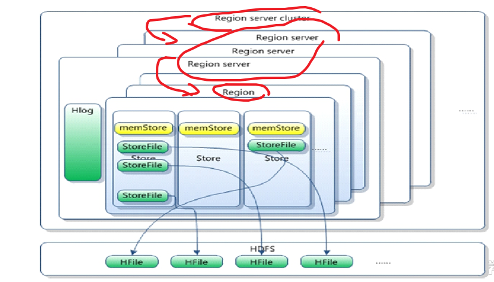

------

# 2 搭建

```
#回顾：
之前集群的安装：/opt/sxt/
	有 hadoop , zk , hive
之前集群的存储：/var/sxt
	有hadoop，ZK  
#hive  是存在 HDFS系统目录下（依托hadoop存储，没单独目录）
```


## 2.1 单机

#单机自带的ZK，所以用那个没有ZK的节点来测试（node1）

#文件存在本地文件系统

#不用Hadoop集群都行


```
#1,搭建
1） hbase上传解压
0.98 hbase 和 protobuf先上传
tar -zxvf -C /opt/sxt/ （自己有一层目录）
删掉docs目录下内容，，（否则后面传给别的节点慢）

2）环境变量 和 配置文件
/etc/profile

hbase-env.sh 
#修改java_home

site的

<property>        
	<name>hbase.rootdir</name>        
	<value>file:///var/sxt/test-hbase/hbase</value> 
</property> 
<property>     
 	<name>hbase.zookeeper.property.dataDir</name>
	<value>/var/sxt/test-hbase/zookeeper</value>               
</property> 
```


```
#2，操作
启动 start-hbase.sh
	#不用集群都可以启动
	#node1：60010
	#hbase-daemon.sh start master  没有h
进入客户端 hbase shell  
#help 查看语句帮助（主要截取四个），ctrl+删  为删除
```

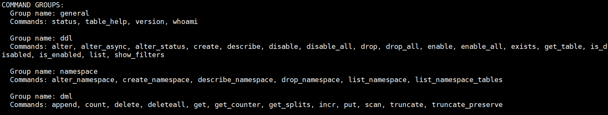

```
#单机在本地文件系统，全分布中都存到HDFS中

1）DDL:
#直接敲会给提示
#create 
create 'ns1:t1', 'f1'----create ‘tbl’ , ‘cf’  (，间不能有空格)

#lsit 
直接展示默认空间下，有啥表


#put
put 'ns1:t1', 'r1', 'c1', 'value' 
put 'tbl','2','cf:name','jx'

#查看结构：
```

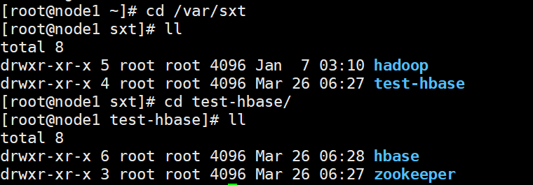

```
进入hbase的data
	#目录内容： （wal 日志，持久化old）
	#命名空间：整个等于databases，默认的（下面结构:表--region–列族--特定格式文件）和  hbase 存元数据的（meta和 namespace 目录）
	
```

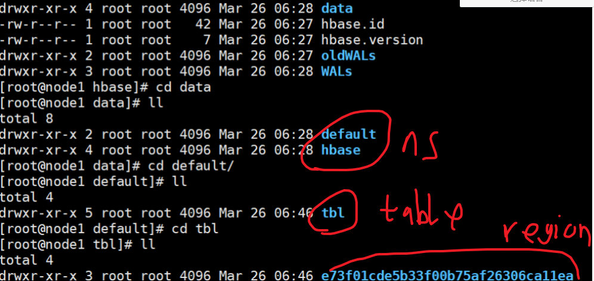

```
#get 或 SCAN(全部) 
get 'tbl','2','cf:name'  get 'tbl','2','cf:name'
scan 'tbl'
```

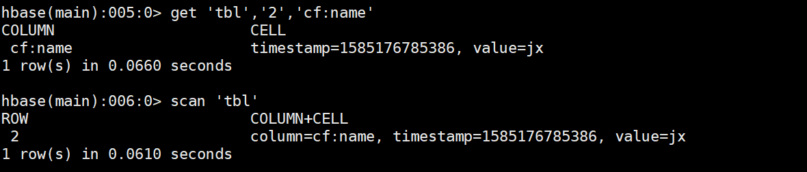

```
#flush 'tbl'
（溢写，不然列族下看不到，还是在内存，，hbase hfile  特定查看文件 -p -m -f）

展示的是：
K: 2/cf:name/1585176785386/Put/vlen=2/mvcc=0 V: jx
等等还有些元数据

	#hbase 参数（主要p:k,v  m: 元数据）
```

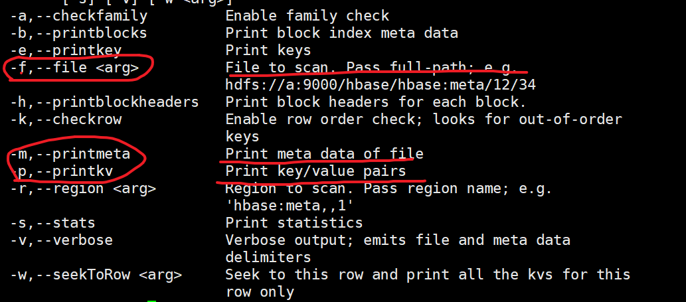

```
desc 'table':给了一些信息
```

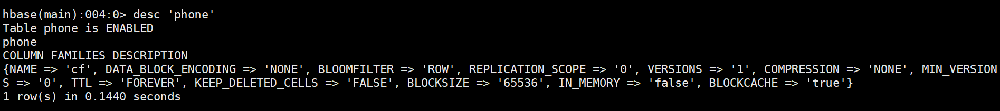

```
2）DML
#delete 
delete 'ns1:t1', 'r1', 'c1', 'ts1’  (时间戳)  
delete 'tbl','2','cf:name'

同样的key的ceil(时间戳会不同)，文件还没被删，但是查看的是最新的。
在cf下目录还有原文件，溢写满三个合并了，cf下只有一个文件，但是原文件被删除了,只剩最新的了，被物理删除了
（即剩一个文件，两行信息）
（是生成三个，然后再合成一个。。这个新文件也会被会一直合并，当再很大时，就不合并了，等于HR层面会显示表很大了，接下来HR操作）
#先内存，然后溢写那个特定文件是类似SF，SF合并成大文件

#test-hbase/hbase 会多个目录 archive：
显出档案，层层下去，显示即刚刚所有文件（显示有三个文件，说明确实是先三个合并一个，不是二+一，直接一个）

```

```
#清空表： truncate 清空，不经过事务
#删表 drop,  要先禁用表，才能删除  disable ‘tbl’
```


```
3)
查看指定命名空间的表，(不是默认的,list)
list_namespace_tables ‘ hbase’   

 形如scan  'ns:tbl'
然后查看元数据，，meta 表
#建新表后，meta会多一行
```

读写流程：ZK---然后这里的元数据----然后rs-----然后R。


## 2.2 分布式

#有两种：伪分布式，和 完全分布式

#将用完全分布式，Hadoop集群必须准备好

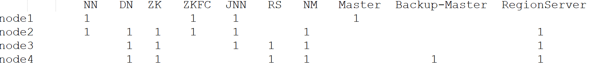

```
#1，搭建,
1）环境准备  
 （网络先弄好）
hostname：       /etc/sysconfig/network    （起自己的别名）
hosts:          /etc/hosts				  （映射其他主机） 

2）免秘钥
 scp  id_dsa.pub   nodeX:`pwd`/nodeX.pub
 cat ~/.ssh/nodeX.pub  >> ~/.ssh/authorized_keys

3）时间同步（35S内）    时间服务器
#data -s ''	
yum install ntp -y
	#出BUG：%s/$releasever/6/g（修改yum  ali源）
ntpdate ntp1.aliyun.com


#开机服务：
chkconfig ntpd on


/var/lock/subsys/local  （目前还没有效果？？）
#本地local 挂载，vi /etc/fstab      （手动挂也行）
/dev/cdrom /media/cdrom iso9660 defaults 0 0


4）jdk环境变量
5）解压   环境变量
 
6）修改配置文件
# hbase-env.sh  ：去#  java_home ，zk=false (124 set nu)
 
# hbase-site.xml

//集群的名字、

 <property>     
	<name>hbase.rootdir</name>     
	<value>hdfs://mycluster:8020/hbase</value>     
 </property>   
 <property>     
	<name>hbase.cluster.distributed</name>    
	<value>true</value>   
 </property>   
 <property>     
	<name>hbase.zookeeper.quorum</name>    
  	<value>node2,node3,node4</value>   
 </property> 
 
 #regionservers  2,3,4
# backup-masters   4  （1上启动，就设置备为4）
  #cp  hdfs-site.xml
 
7）分发 和 分别修改环境变量 scp -r  nodeX:`pwd`
8）启动 (zk,hdfs集群要先启动,时间要一致)
在主master执行start-hbase.sh
#node1:60010
#hbase-daemon.sh start  XX  （HM 写Master，HRS 也同理）
9）停止
 stop-hbase.sh
	#杀  kill -9 XXXX
```


```
#2，操作
zk  客户端进去：zkCli.sh
	#多了hbase目录  存储相关信息。
```

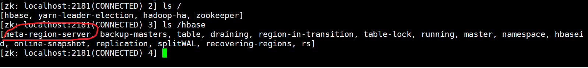

```
ls  没显示 换成 get  meta-region-server

元数据信息 存在 2,3,4 HRS (查看那个 hbase 的 meta表可以更全的看。)

先是ZK---然后元数据信息在哪个节点----HRS----HR


HDFS 存的结构和单机一模一样，，逻辑HDFS node1:50070
开个目录 hbase
```

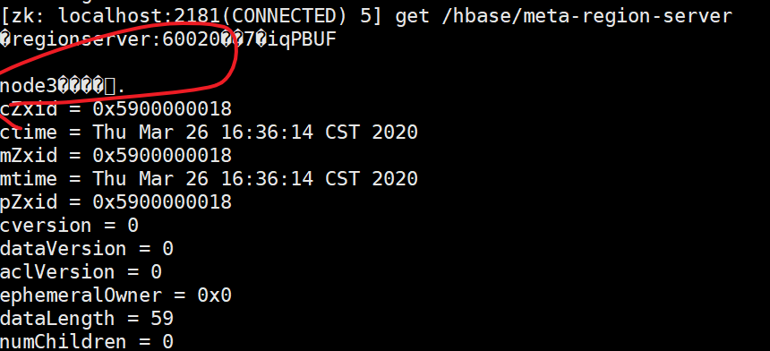

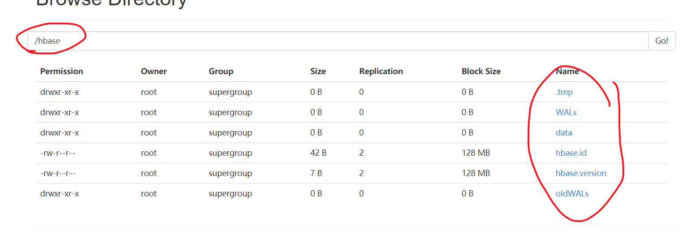


# 3 API使用

hadoop包，hbase包，Junit（类名别用Test，出错）

## 3.1 初始

```
#1，初始化 与 关闭
1）初始化 ： 表管理，表，配置，
	//管理表类
	HBaseAdmin admin =null;
	//表类
	HTable table = null;
	
	String tm = "phone";
	@Before
	public void init() throws Exception{
		//conf
		Configuration conf = new Configuration();
		conf.set("hbase.zookeeper.quorum", "node1,node2,node3");
		
		//admin 和 table 初始化
		admin = new HBaseAdmin(conf);
		table = new HTable(conf, tm.getBytes());
		
	}

2）关闭:ResultScanner 也关闭
@After
	public void destory() throws Exception{
		if(admin!=null){
			admin.close();
		}
	}
```

```
#2，创建 和 插入
1）创建  ： 表描述符，列族描述符，管理表操作
public void createTable() throws Exception{
		//表的描述类
		HTableDescriptor desc = new HTableDescriptor(TableName.valueOf(tm));
		//列族的描述类
		HColumnDescriptor family = new HColumnDescriptor("cf".getBytes());
		desc.addFamily(family);
		if(admin.tableExists(tm)){
			admin.disableTable(tm);
			admin.deleteTable(tm);
		}
		admin.createTable(desc);
	}

2）插入 ：Put一行多列 ，表操作
public void insert() throws Exception{
		Put put = new Put("1111".getBytes());
		put.add("cf".getBytes(), "name".getBytes(), "zhangsan".getBytes());
		put.add("cf".getBytes(), "age".getBytes(), "12".getBytes());
		put.add("cf".getBytes(), "sex".getBytes(), "man".getBytes());
		table.put(put);
	}
```

```
#3，两种遍历：Get：result   Scan:ResultScanner(迭代器)    			 Cell=result:getColumnLatestCell (Cell 变字符串)

1）Get ： 特定row，并且能过滤列
public void get() throws Exception{
		Get get = new Get("1111".getBytes());
		//添加要获取的列和列族，减少网络的io，相当于在服务器端做了过滤
		get.addColumn("cf".getBytes(), "name".getBytes());
		get.addColumn("cf".getBytes(), "age".getBytes());
		get.addColumn("cf".getBytes(), "sex".getBytes());
		Result result = table.get(get);
		Cell cell1 = result.getColumnLatestCell("cf".getBytes(), "name".getBytes());
		Cell cell2 = result.getColumnLatestCell("cf".getBytes(), "age".getBytes());
		Cell cell3 = result.getColumnLatestCell("cf".getBytes(), "sex".getBytes());
		System.out.println(Bytes.toString(CellUtil.cloneValue(cell1)));
		System.out.println(Bytes.toString(CellUtil.cloneValue(cell2)));
		System.out.println(Bytes.toString(CellUtil.cloneValue(cell3)));
	}

2）Scan ： 能规定起始返回，返回迭代器。
public void scan() throws Exception{
		Scan scan = new Scan();
//		scan.setStartRow(startRow);
//		scan.setStopRow(stopRow);
		ResultScanner rss = table.getScanner(scan);
		for (Result result : rss) {
			Cell cell1 = result.getColumnLatestCell("cf".getBytes(), "name".getBytes());
			Cell cell2 = result.getColumnLatestCell("cf".getBytes(), "age".getBytes());
			Cell cell3 = result.getColumnLatestCell("cf".getBytes(), "sex".getBytes());
			System.out.println(Bytes.toString(CellUtil.cloneValue(cell1)));
			System.out.println(Bytes.toString(CellUtil.cloneValue(cell2)));
			System.out.println(Bytes.toString(CellUtil.cloneValue(cell3)));
		}
		rss.close();
	}
	

#如果没有table信息，，可以绑定：
scan.setAttribute(Scan.SCAN_ATTRIBUTES_TABLE_NAME, tablename.getBytes());
```

```
#总结
命令行一列只能一次put，api可以多次，甚至多行list 最后再put
不建议 bytes直接 new String(频繁new 对象占空间),而是Bytes.toString

#src apidocs 有语法使用doc
```


## 3.2 实践

```
#1，两个业务：

1） 人员-角色
--要求：
人员有多个角色  角色优先级
角色有多个人员
人员 删除添加角色
角色 可以添加删除人员
人员 角色 删除添加

--解决
要两张表，一个人员表（有PID，，和对应角色）一个角色表（RIW, 对应人员）。
当你改动一张表时，另一张也要相应修改。
角色优先级：CF一致，K为角色ID，V为自定义的值用来比较的（当你取值时，得到CF，然后按照V打印）
```

#（自动更改：触发器  ,  hbase叫协处理器，，权威PDF那个的高级功能）

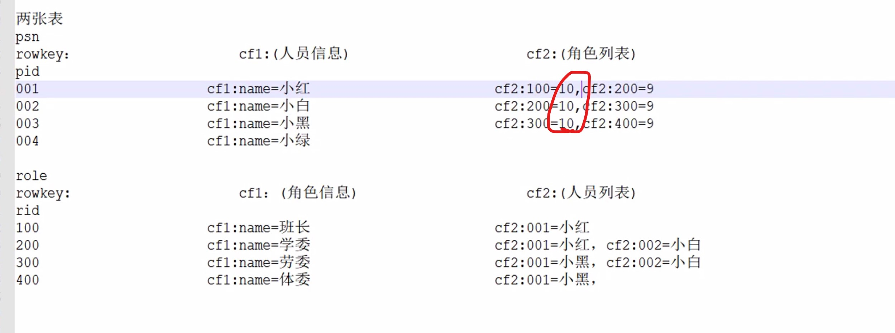

```
2）组织架构 部门-子部门
--要求：
组织架构 部门-子部门
查询 顶级部门
查询 每个部门的所有子部门
部门 添加、删除子部门
部门 添加、删除 

--解决：
一张表，，（ID,,CF1:自己的信息 和 父ID，，，CF2：子信息）
当你改动时，父子都要注意
```

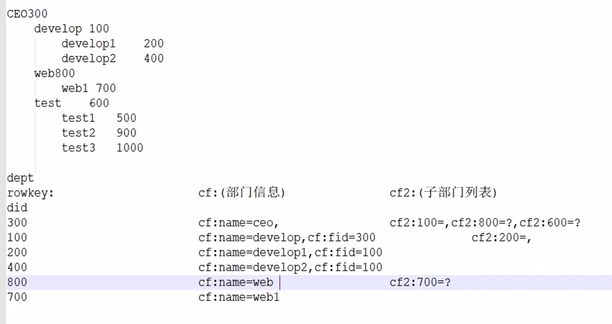

```
#2，实践
题目：（查询时，时间倒序）
手机号		对方手机号		通话时长		时间		通话类型（主叫/被叫）

解决：
一张表，这时候可以把时间当成row-key（手机号_时间），因为作为查询条件了。
倒序实现：大数-时间。

```


```
1）之前的操作： 完成连接，创建表，关闭
//管理表类
	HBaseAdmin admin =null;
	//表类
	HTable table = null;
		
	String tm = "phone";
	@Before
	public void init() throws Exception{
	//conf
	Configuration conf = new Configuration();
	conf.set("hbase.zookeeper.quorum", "node2,node3,node4");
			
	//admin 和 table 初始化
	admin = new HBaseAdmin(conf);
	table = new HTable(conf, tm.getBytes());
			
	}
	@Test
	public void createTable() throws Exception {
		// 表的描述类
		HTableDescriptor desc = new HTableDescriptor(TableName.valueOf(tm));
		// 列族的描述类
		HColumnDescriptor family = new HColumnDescriptor("cf".getBytes());
		desc.addFamily(family);
		if (admin.tableExists(tm)) {
			admin.disableTable(tm);
			admin.deleteTable(tm);
		}
		admin.createTable(desc);
	}
	
	@After
	public void destory() throws Exception {
		
		if (admin != null) {
			admin.close();
		}
	}
```


```
2）准备
SimpleDateFormat sdf = new SimpleDateFormat("yyyyMMddhhmmss");
Random r = new Random();
	
public String getnum(String str){
		//0占左边位位
		return str + String.format("%08d", r.nextInt(100000000));
		}
public String getdate(String str){
		return str + String.format("%02d%02d%02d%02d%02d", r.nextInt(12) + 1, 
		r.nextInt(31)+1, r.nextInt(24)+1,
		r.nextInt(60)+1, r.nextInt(60)+1);
	}
private String getdate2(String string) {
		return string+String.format("%02d%02d%02d", r.nextInt(24),r.nextInt(60),r.nextInt(60));
	}
```


```
3）！！！！！！！！！！！！！！
/**
	 * 10个用户，每个用户每年产生1000条通话记录
	 * #一列属性，就会写一次row，4W row，2.5M 一个Store文件。  
	 * dnum:对方手机号 type:类型：0主叫，1被叫 length：长度 date:时间
	 * 
	 */
```

```
--3.1 简单的插入数据（put变list）
public void insert() throws Exception {
		List<Put> puts = new ArrayList<Put>();
		for(int i =0;i<10;i++){
			String num =getnum("138"); 
			for (int j=0 ; j<1000;j++){
				//属性
				
				String dnum = getnum("177");
				String length = String.valueOf(r.nextInt(99)+1);
				String type = String.valueOf(r.nextInt(2));
				String date = getdate("2018");
			
				//row_key  : getTime 变成了ms
				String rowkey = num + "_" + (Long.MAX_VALUE - sdf.parse(date).getTime());
				Put put = new Put(rowkey.getBytes());
				put.add("cf".getBytes(), "dnum".getBytes(), dnum.getBytes());
				put.add("cf".getBytes(), "length".getBytes(), length.getBytes());
				put.add("cf".getBytes(), "type".getBytes(), type.getBytes());
				put.add("cf".getBytes(), "date".getBytes(), date.getBytes());
				puts.add(put);
			
			}
		}
		table.put(puts);
	}
```

```
-3.2 scan
--3.2.1 简单查看（start,stop）
/**
	 * 查询某一个用户3月份的所有通话记录   条件： 1、row:某一个用户 和 时间
	 * 简单start-stop
	 * @throws Exception
*/	 
	@Test
	public void scan() throws Exception {
		String phoneNumber = "13896203874";
		String startRow = phoneNumber + "_" + (Long.MAX_VALUE - sdf.parse("20180401000000").getTime());
		String stopRow = phoneNumber + "_" + (Long.MAX_VALUE - sdf.parse("20180301000000").getTime());

		Scan scan = new Scan();
		scan.setStartRow(startRow.getBytes());
		scan.setStopRow(stopRow.getBytes());
		ResultScanner scanner = table.getScanner(scan);
		
		for (Result result : scanner) {
			System.out.print(Bytes
					.toString(CellUtil.cloneValue(result.getColumnLatestCell("cf".getBytes(), "dnum".getBytes()))));
			System.out.print("--" + Bytes
					.toString(CellUtil.cloneValue(result.getColumnLatestCell("cf".getBytes(), "type".getBytes()))));
			System.out.print("--" + Bytes
					.toString(CellUtil.cloneValue(result.getColumnLatestCell("cf".getBytes(), "date".getBytes()))));
			System.out.println("--" + Bytes
					.toString(CellUtil.cloneValue(result.getColumnLatestCell("cf".getBytes(), "length".getBytes()))));
		}
		scanner.close();
	}
```

```
--3.2.2 有条件的查看  (过滤器)
/**
	 * 查询某一个用户。所有的主叫电话 条件： 1、row:电话号码 2、col:type=0
	 * 涉及了，row前缀过滤器 和 列过滤器 
	 * @throws Exception
	 */
	@Test
	public void scan2() throws Exception {
		FilterList filters = new FilterList(FilterList.Operator.MUST_PASS_ALL);
		SingleColumnValueFilter filter1 = new SingleColumnValueFilter("cf".getBytes(), "type".getBytes(),
				CompareOp.EQUAL, "0".getBytes());
		PrefixFilter filter2 = new PrefixFilter("13896203874".getBytes());
		filters.addFilter(filter1);
		filters.addFilter(filter2);

		Scan scan = new Scan();
		scan.setFilter(filters);
		//迭代器，占资源，
		ResultScanner scanner = table.getScanner(scan);
		for (Result result : scanner) {
			System.out.print(Bytes
					.toString(CellUtil.cloneValue(result.getColumnLatestCell("cf".getBytes(), "dnum".getBytes()))));
			System.out.print("--" + Bytes
					.toString(CellUtil.cloneValue(result.getColumnLatestCell("cf".getBytes(), "type".getBytes()))));
			System.out.print("--" + Bytes
					.toString(CellUtil.cloneValue(result.getColumnLatestCell("cf".getBytes(), "date".getBytes()))));
			System.out.println("--" + Bytes
					.toString(CellUtil.cloneValue(result.getColumnLatestCell("cf".getBytes(), "length".getBytes()))));
		}
		scanner.close();
	}
#没有后缀过滤器
```

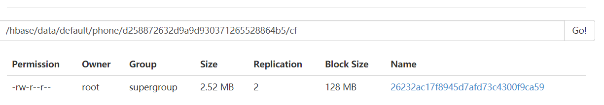

#下面都是就一个文件，Store，因为就一个列族。（按照列族来存的）


## 3.3 Protobuffer

有个使用的doc

### 0）安装

```
编译安装：
1）
先yum grouplist 列出来，， Development tools
yum groupinstall “Development tools”
2)
tar -zxvf XX -C  
./configure (生成makefile)  (- -help       - -prefix= /proto )
make  && make install

#linux 不需要后缀。因为之前指定了打开的方式

3)
./protoc  - - help  帮助 查看命令  
写A.proto 文件
export LD_LIBRARY_PATH=/root/software/proto/lib/ (如果你安装到指定位置的，设置下lib)
/root/software/proto/bin/protoc phone.proto --java_out=./
  
```

#生成一个大的java类（你的文件名A），里面包括你需要OP的类（message），然后OP类都是靠Builder的
#嵌套的话，还需要大OP类，然后外面操作的都是大OP，小OP内部操作，然后add到大的


#hbase scan 直接看不懂了。因为存的是对象，没法用列过滤器了。    即scan的条件筛选没有了意义 

### 1）简单对象

```
#1，phone.proto 文件

package com.jx; 
message PhoneDetail 
 { 
required string   dnum = 1;  
required string  length = 2; 
required string  type= 3;
required string  date = 4;  
}
```

```
#2，操作
1）当列弄成一个对象插入
/**
	 * 10个用户，每个用户1000条，每一条记录当作一个对象进行存储
	 * #一整个CF，写一个row，1W row,一个store文件  1M
	 * @throws Exception 
	 */
	@Test
	public void insert2() throws Exception{
		List<Put> puts = new ArrayList<Put>();
		for(int i = 0;i<10;i++){
			String phoneNumber = getnum("138");
			for(int j = 0;j<1000;j++){
				String dnum = getnum("177");
				String length =String.valueOf(r.nextInt(99)+1);
				String type = String.valueOf(r.nextInt(2));
				String date = getdate("2018");
				
				//保存属性到对象中,,proto
				Phone.PhoneDetail.Builder phoneDetail = Phone.PhoneDetail.newBuilder();
				phoneDetail.setDate(date);
				phoneDetail.setLength(length);
				phoneDetail.setType(type);
				phoneDetail.setDnum(dnum);
				
				//rowkey
				String rowkey = phoneNumber+"_"+(Long.MAX_VALUE-sdf.parse(date).getTime());
			
				Put put = new Put(rowkey.getBytes());
				put.add("cf".getBytes(), "phoneDetail".getBytes(), phoneDetail.build().toByteArray());
				puts.add(put);
			}
		}
		table.put(puts);
	}

2）查看，简单查看一个row。

	// 普通选一行，获取对象，并且已经重写了toString
	@Test
	public void get() throws Exception{
		Get get = new Get("13885671643_9223370522040111807".getBytes());
		Result result = table.get(get);
		PhoneDetail phoneDetail = Phone.PhoneDetail.parseFrom(CellUtil.cloneValue(result.getColumnLatestCell("cf".getBytes(), "phoneDetail".getBytes())));
		System.out.println(phoneDetail);
	}	
```

​	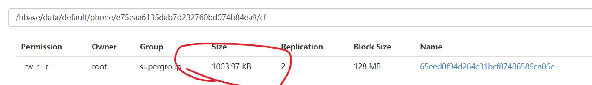


### 2）嵌套对象

```
#1，phone1.proto
package com.jx; 
message PhoneDetail 
 { 
required string   dnum = 1;  
required string  length = 2; 
required string  type= 3;
required string  date = 4;  
 }
message DayOfPhone { 
repeated PhoneDetail  DayPhone= 1; 
} 

大OP类：DayOfPhone，小OP类：PhoneDetail，大JAVA类：phone1
```


```
#2，操作
1） 设定插入条件，在对象的前提下，在嵌套一层
	/**
	 * 10个用户，每天产生1000条记录，每一天的所有数据放到一个rowkey中
	 * #自己设定所有的用户的日期key都是同一天，(虽然日期列不同但key假设同)
	 * #一整个CF，并且都设定了同种row  10row，，一个store文件
	 * @throws Exception 
	 */
	@Test
	public void insert3() throws Exception{
		List<Put> puts = new ArrayList<Put>();

		for(int i = 0;i<10;i++){
			String phoneNumber = getnum("138");
			String rowkey = phoneNumber+"_"+(Long.MAX_VALUE-sdf.parse("20181225000000").getTime());
			Phone1.DayOfPhone.Builder dayOfPhone = Phone1.DayOfPhone.newBuilder();
			for(int j=0;j<1000;j++){
				String dnum = getnum("177");
				String length =String.valueOf(r.nextInt(99));
				String type = String.valueOf(r.nextInt(2));
				String date = getdate2("20181225");
				
				Phone1.PhoneDetail.Builder phoneDetail = Phone1.PhoneDetail.newBuilder();
				phoneDetail.setDate(date);
				phoneDetail.setLength(length);
				phoneDetail.setType(type);
				phoneDetail.setDnum(dnum);
				dayOfPhone.addDayPhone(phoneDetail);
			}
			Put put = new Put(rowkey.getBytes());
			put.add("cf".getBytes(), "day".getBytes(), dayOfPhone.build().toByteArray());
			puts.add(put);
		}
		table.put(puts);
		table.flushCommits();
	}

2）for遍历，可以把值取出来。
	@Test
	public void get2() throws Exception{
		Get get = new Get("13894814471_9223370491187575807".getBytes());
		Result result = table.get(get);
		DayOfPhone parseFrom = Phone1.DayOfPhone.parseFrom(CellUtil.cloneValue(result.getColumnLatestCell("cf".getBytes(), "day".getBytes())));
		int count = 0;
		for (com.jx.Phone1.PhoneDetail pd : parseFrom.getDayPhoneList()) {
			System.out.println(pd);
			count++;
		}
		System.out.println(count);
	}
```

-----


## 3.4 总结

### 1）插入

```
都是Put
#1，无非单个列put，所有row的所有列凑齐list，put
空间没变，但是速度快
#2，在list前提下，先是简单的把列整合成对象，，或是，规定啥row都是一样的，外面大op嵌套简单对象.
空间更小了。
```


### 2）遍历

```
#1，Get  ： 先get出 Result，然后再操作
1) 如果是1).1 的，get可以返回1个row下的特定几列
速度快
2）如果是1).2 的前者，get 返回简单对象，直接打印。
3)如果是1).2 的后者，get 返回迭代简单对象，要迭代
```

```
#2，Scan :  esultScanner迭代
( 1).2,,,，只能scan出所有row 或者 start-stop row，遍历取出来是，简单对象，或者嵌套对象

#都是讨论1).1下
1) start-stop：一定范围的row行（根据确切key范围）
2）where :     特定的行（上面涉及了key的前缀筛选，或者 col ）
```


### 3）其他

```
#存储的文件是Store，以列族为文件，导向。（上面的文件都是一个列族目录一个文件中
（大了，就多块，文件还是一个））
#所以在一个文件中，你写的row_key越大，越多次，文件就越大。

#排序：
可以row_key利用好字典序，，或者自己打印遍历时，K对应V，自己来排序 或者 利用同列版本来进行
```


## 3.5 微博例子

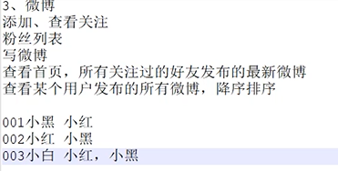


```
1）
就一二要求而言：
表1
row(PID)      CF1（关注族）   CF2（粉丝族）
#一张表解决两张表的事情：实际上也只是省略了一点点的空间（因为你还是要有两个目录，两个文件，同时还是那么多行row，只是省略了一点共有的空间）

2）就三五而言：
 表2
 row (PID_ MAX-time)   CF1  (context内容)
 
当你查看默认时，，通过ID把所有的该用户微博取出，同时是倒叙

3）就四而言。
表3
row(PID)    CF ( sq = context  )  (列名固定住，是个字符串)
#表3 与 表2 联动，当你表2 写微博时，它的粉丝表，就要增加关注。
#同个族，同列，，通过版本来进行排序
 
 #下面例子是，小黑，小红各写了一篇微博
```

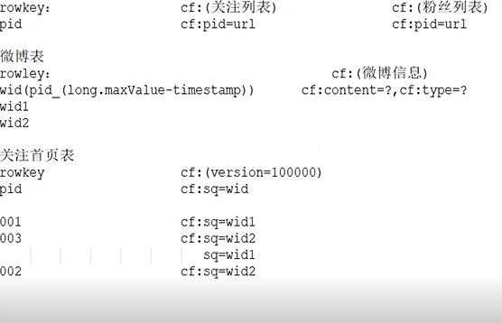

# 4 与MR交互

## 4.1 概述

```
#用SQL，，写Hbase  ： hive , phoenix

MR，能从不同源读取，和写出 数据
#靠Input/OutFormatClass：当你不设置就是默认HDFS交互
#你要设置才能和特定的交互


```


## 4.2 dfs-mr-hbase

要求：hdfs读取，结果读到hbase。 WC

#运行MR的三种方式txt

本地运行，本地模拟yarn。

#hbase -jar

```
#1, 写job类

1）conf 
hdfs连接active的。hbase连接zk。不要配置文件，就conf 加两个
2) Job
设置任务
--2.1 设置map相关的
--2.2 设置re相关的：
hbase必须用那个方法：TableMapReduceUtil.initTableReducerJob（mapreduce包下的）
	​八个参数，表名，re.class，job,后四null,最后f
	​没有聚合 就没有re。但是往hbase，就算没有re，这个方法也要写

#MR从HBASE读写，MR要继承Table啥的,,hdfs 普通MR就行

--2.3 路径提交等
```

```
public class WCRunner {
	public static void main(String[] args) throws Exception {
		//1 conf 设置本地运行
		Configuration conf = new Configuration();
		conf.set("hbase.zookeeper.quorum","node2,node3,node4");
		conf.set("fs.defaultFS", "hdfs://node1:8020");	
		//2
		Job job =Job.getInstance(conf);
		job.setJarByClass(WCRunner.class);
		//2.1
		job.setMapperClass(WCMap.class);
		job.setMapOutputKeyClass(Text.class);
		job.setMapOutputValueClass(IntWritable.class);
		//2.2
		//TableMapReduceUtil.initTableMapperJob();
		TableMapReduceUtil.initTableReducerJob("wc", WCRe.class, job, null, null, null, null, false);
		job.setOutputKeyClass(NullWritable.class);
		job.setOutputValueClass(Put.class);
		//2.3	
//		job.setInputFormatClass(cls);
//		job.setOutputFormatClass(cls);
		FileInputFormat.addInputPath( job, new Path("/input/wc") );
		job.waitForCompletion(true);		
	}	
}
```


```
#2，写Map,Re
1)  Map :普通写法
public class WCMap extends Mapper<LongWritable,Text,Text,IntWritable> {
	@Override
	protected void map(LongWritable key, Text value, Context context)
			throws IOException, InterruptedException {
		String[] vs = value.toString().split(" ");
		//或者 new StringTokenizer(value.toString," ") 生成迭代器
		for (String v : vs) {
			context.write(new Text(v), new IntWritable(1));
		}
		
		
	}
}
2）Re: 继承特定格式， <> 参数，write输出put
public class WCRe  extends TableReducer<Text, IntWritable, ImmutableBytesWritable>{
	@Override
	protected void reduce(Text key, Iterable<IntWritable> iter,
		Context context)
		throws IOException, InterruptedException {
		
		int sum=0;
		for (IntWritable i : iter) {
			sum += i.get();
			
		}
		//row_key = word,,,Cf:c=sum
		Put put = new Put(key.toString().getBytes());
		put.add("cf".getBytes(), "sum".getBytes(), String.valueOf(sum).getBytes());
		context.write(null, put);
		
	}
}
```


```
#3, 运行
1）先hbase 建表
2）本地org 环境
	#第一错，用本地JDK  图3-1
	#第二个注释掉那个错误就行：

3）容易报错：
Text 包，， 要导对
值变成字符串再变成Byte[]
```

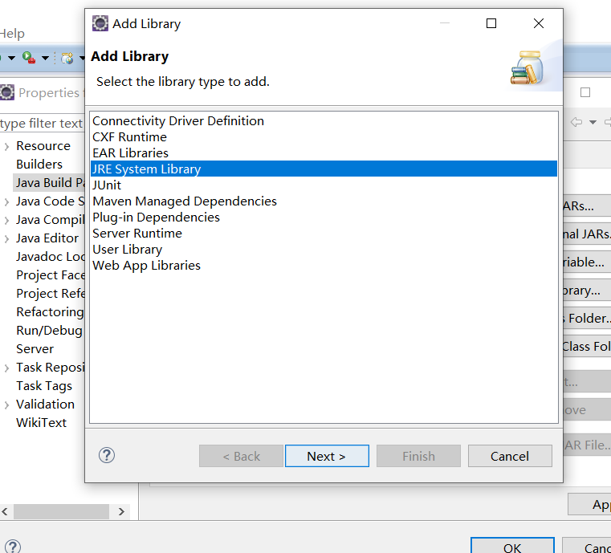


```
#4，一些问题：看源代码解决
#TableMapReduceUtil.initTableReducerJob()

1）最多的参数设置
分区，ZK集群，RS,RSImpl，是否上传集群

2，没指定outputformat
因为那个最长函数帮你set了它的实现类了，
#它的实现了最终又实现了个write  
	（如果是Put,就table.put反之 delete 同理）
	（之所以输出key为空，是因为根本没用到）
#那个最长函数的同类map同理，，决定了输入源是HBase。（有scan,按照row_ke切片的）。

```


hbase—hive？？？


