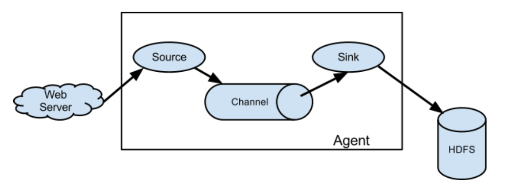
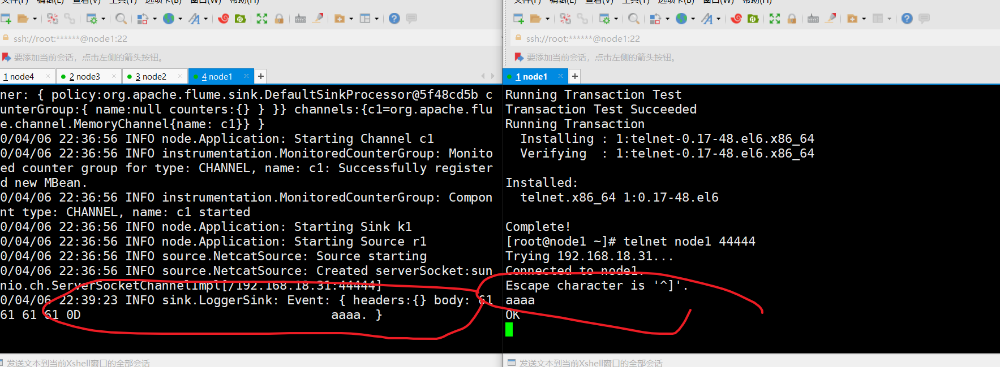
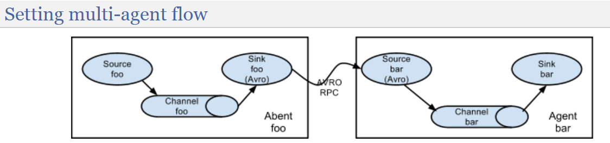
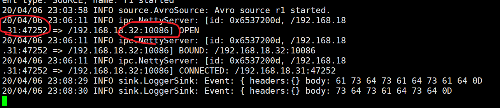
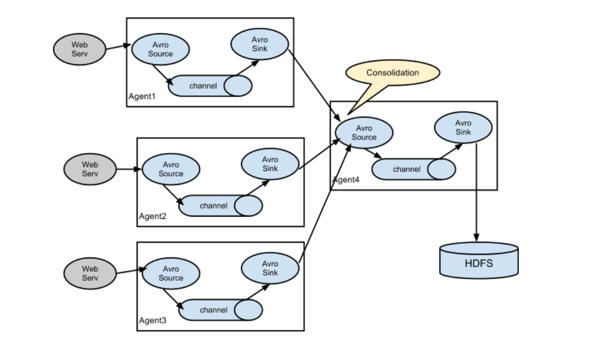
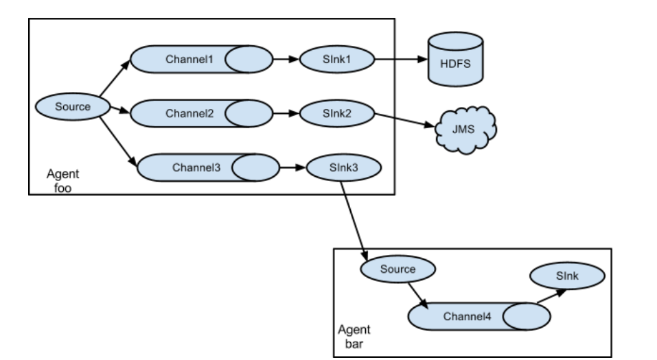
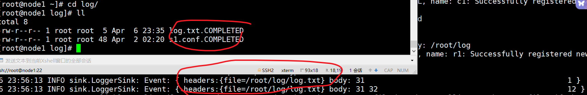
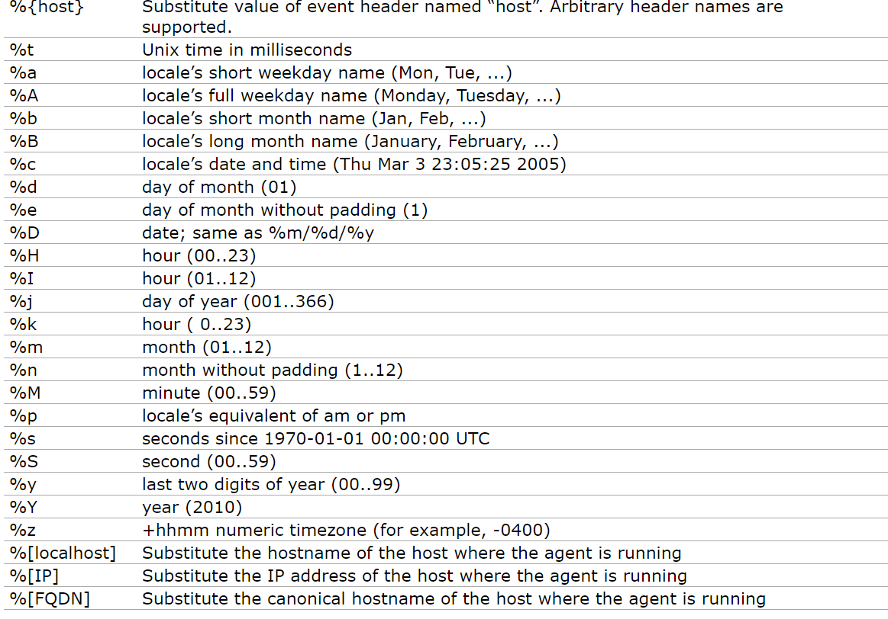
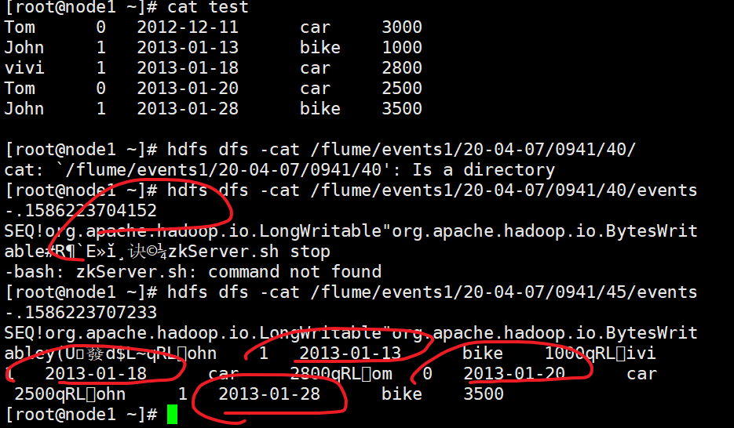
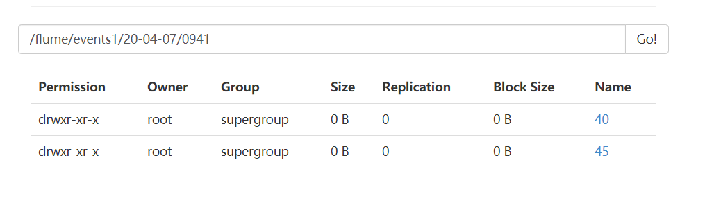

# flume

[User guide ]: http://flume.apache.org/releases/content/1.6.0/FlumeUserGuide.html	"version 1.6 "

# 1 介绍与搭建

## 1.1 介绍

```
日志收集工具：
	从不同源  往一个最终中心放
	源，最终中心，中间有很多种

介绍：
一整个flume 可以叫一个 agent
事件event，就是一行数据

source: 接受数据的，（大多数是用来开一个端口等待别人连接 或者 直接本机文件）
channel:channel 缓一下，（类似上面那个queue，异步，一般是内存）
sink： 发送数据的   （连接别人端口的 ）


```



## 1.2 搭建

netcat输入，控制台输出

```
#1, 安装

上传
解压 tar -xf XX -C
修改conf/flume-env.sh  文件中的JDK目录
 #注意：JAVA_OPTS 配置  如果传输文件过大 报内存溢出时 需要修改这个配置项
配置环境变量  export FLUME_HOME=/opt/sxt/flume-1.6.0
验证   flume-ng version

启动：
就是写好那个配置文件，然后运行命令。
```


```
#2，测试 （最简单的：一台：netcat 读入，自身控制台输出）
1）
# example.conf: A single-node Flume configuration

# Name the components on this agent
a1.sources = r1
a1.sinks = k1
a1.channels = c1

# Describe/configure the source
a1.sources.r1.type = netcat
a1.sources.r1.bind = node1
a1.sources.r1.port = 44444

# Describe the sink
a1.sinks.k1.type = logger

# Use a channel which buffers events in memory
a1.channels.c1.type = memory
a1.channels.c1.capacity = 1000
a1.channels.c1.transactionCapacity = 100

# Bind the source and sink to the channel
a1.sources.r1.channels = c1
a1.sinks.k1.channel = c1

启动：
$ flume-ng agent --conf-file option --name a1 -Dflume.root.logger=INFO,console
（运行conf,,,起个名字和运行conf对应，，，）

2）node1安装 telnet 工具测试
yum install -y  telnet
telnet node1 44444
	#ctrl + ] 然后输入q 退出

这输入，，另一个接收
```




```
#3,理解

就是要自己写 运行的conf
#名称，三个组件  ，连接

#启动时，还会发现了 hdfs hbase hive 的地址
```


## 1.3 其他模式

### 1) 串起来的

#就是把sink，对下一个的source，通过avro(rpc传输的一种)  （其他头和尾和上面一致）



```
#1，安装
分发给，改个etc就行
```

#看官网：source  和 sink  的arvo 那部分

```
#2，测试
node1 :netcat输入，，，输出到node2,,,,node2控制打印输出

1）node1：conf2
# Name the components on this agent
a1.sources = r1
a1.sinks = k1
a1.channels = c1

# Describe/configure the source
a1.sources.r1.type = netcat
a1.sources.r1.bind = node1
a1.sources.r1.port = 44444

# Describe the sink
a1.sinks.k1.type = avro
a1.sinks.k1.hostname = node2
a1.sinks.k1.port = 10086

# Use a channel which buffers events in memory
a1.channels.c1.type = memory
a1.channels.c1.capacity = 1000
a1.channels.c1.transactionCapacity = 100

# Bind the source and sink to the channel
a1.sources.r1.channels = c1
a1.sinks.k1.channel = c1


2）node2:conf3

# Name the components on this agent
a1.sources = r1
a1.sinks = k1
a1.channels = c1

# Describe/configure the source
a1.sources.r1.type = avro
a1.sources.r1.bind = node2
a1.sources.r1.port = 10086

# Describe the sink
a1.sinks.k1.type = logger

# Use a channel which buffers events in memory
a1.channels.c1.type = memory
a1.channels.c1.capacity = 1000
a1.channels.c1.transactionCapacity = 100

# Bind the source and sink to the channel
a1.sources.r1.channels = c1
a1.sinks.k1.channel = c1
```


```
3）测试
先启动后面的，然后线面的  （node2，开启端口，让node1连接）

$ flume-ng agent --conf-file option3 --name a1 -Dflume.root.logger=INFO,console
$ flume-ng agent --conf-file option2 --name a1 -Dflume.root.logger=INFO,console

node1 利用Telnet 同测试
#node2 显示 node1 连接上了node2
#同时传输成功
```



```
#3，理解
只是变化了组件。其他没变。
这只是剩下两个的基石：需要多层。
```


### 2）多对一

#就是有多个输入，先到一个，，最后再汇总输出。



```
因为你要保存的最终地址，可能不能一次接受多个 （不然例如 hdfs工作量大）

问题：
#最后那个flume 挂了怎么办，，高可用，但一般不用，因为很稳定
#节点，可以做HA，与 端点，一般不做HA  
```


### 3）一对多

#一个输入，多个channel，就可以多个输出



```
#JMS  java 消息服务

#常用于 把数据分别 离线实时分析 两份
```

------


# 2  三个组件

```
Source、Channel、Sink有哪些类型
    
#Flume Source
	Source类型 	              | 说明
	Avro Source 	            | 支持Avro协议（实际上是Avro RPC），内置支持
	Thrift Source 	          | 支持Thrift协议，内置支持
	Exec Source 	            | 基于Unix的command在标准输出上生产数据
	JMS Source 	              | 从JMS系统（消息、主题）中读取数据
	Spooling Directory Source | 监控指定目录内数据变更
	Twitter 1% firehose Source|	通过API持续下载Twitter数据，试验性质
	Netcat Source 	          | 监控某个端口，将流经端口的每一个文本行数据作为Event输入
	Sequence Generator Source | 序列生成器数据源，生产序列数据
	Syslog Sources 	          | 读取syslog数据，产生Event，支持UDP和TCP两种协议
	HTTP Source 	            | 基于HTTP POST或GET方式的数据源，支持JSON、BLOB表示形式
	Legacy Sources 	          | 兼容老的Flume OG中Source（0.9.x版本）
-----------------------------
#Flume Channel
	Channel类型 	  说明
	Memory Channel 	           | Event数据存储在内存中
	JDBC Channel   	           | Event数据存储在持久化存储中，当前Flume Channel内置支持Derby
	File Channel   	           | Event数据存储在磁盘文件中
	Spillable Memory Channel   | Event数据存储在内存中和磁盘上，当内存队列满了，会持久化到磁盘文件
	Pseudo Transaction Channel | 测试用途
	Custom Channel 	           | 自定义Channel实现
-----------------------------
#Flume Sink
	Sink类型 	说明
	HDFS Sink 	        | 数据写入HDFS
	Logger Sink 	      | 数据写入日志文件
	Avro Sink 	        | 数据被转换成Avro Event，然后发送到配置的RPC端口上
	Thrift Sink 	      | 数据被转换成Thrift Event，然后发送到配置的RPC端口上
	IRC Sink    	      | 数据在IRC上进行回放
	File Roll Sink 	    | 存储数据到本地文件系统
	Null Sink 	        | 丢弃到所有数据
	HBase Sink 	        | 数据写入HBase数据库
	Morphline Solr Sink | 数据发送到Solr搜索服务器（集群）
	ElasticSearch Sink 	| 数据发送到Elastic Search搜索服务器（集群）
	Kite Dataset Sink 	| 写数据到Kite Dataset，试验性质的
	Custom Sink 	      | 自定义Sink实现

#还有任意位置kafka
```


----------------

## 2.1 source

### 1）netcat   /  avro / kafka

### 2）exec （文件）

```
 #1，介绍
 #输入为指定命令，多为文件数据流啥的，结束就退出了

#常常只用tail -f 监控文件 （没有f,就光打印末尾了，然后停止了）
```


```
#2，测试
1）  conf4
# example.conf: A single-node Flume configuration

# Name the components on this agent
a1.sources = r1
a1.sinks = k1
a1.channels = c1

# Describe/configure the source
a1.sources.r1.type = exec
a1.sources.r1.command = tail -F /root/log.txt

# Describe the sink
a1.sinks.k1.type = logger

# Use a channel which buffers events in memory
a1.channels.c1.type = memory
a1.channels.c1.capacity = 1000
a1.channels.c1.transactionCapacity = 100

# Bind the source and sink to the channel
a1.sources.r1.channels = c1
a1.sinks.k1.channel = c1


$ bin/flume-ng agent --conf-file option4 --name a1 -Dflume.root.logger=INFO,console

2）
没有文件不报错
touch log.txt
echo "1" >> log.txt

#能够打印新增加的文件时间
#但是当你重新连接时，这个flume会把该文件默认最新10个再打印一遍 （tail 本身就是打印末尾，默认10）
-n, --lines=K            output the last K lines, instead of the last 10;
						or use -n +K to output lines starting with the Kth
      --max-unchanged-stats=N


改进：
a1.sources.r1.command = tail -F /root/log.txt -n 1
#这样每次重新连接的时候，打印的就可以只多一行
```


### 3）spooling   (目录)

```
#1，介绍
#文件不存在不报错，，目录要先存在

监控目录
#效果是把文件放进去的文件内容显示了。

参数：
#fileSuffix	  .COMPLETED	  文件后缀，默认这个后缀，文件输入后改后缀，有后缀的文件不读了
#fileHeader	   false		  开启后，输出时候，Header会加上绝对路径
```


```
#2，测试
1)conf5
# example.conf: A single-node Flume configuration

# Name the components on this agent
a1.sources = r1
a1.sinks = k1
a1.channels = c1

# Describe/configure the source
a1.sources.r1.type = spooldir
a1.sources.r1.spoolDir = /root/log
a1.sources.r1.fileHeader = true


# Describe the sink
a1.sinks.k1.type = logger

# Use a channel which buffers events in memory
a1.channels.c1.type = memory
a1.channels.c1.capacity = 1000
a1.channels.c1.transactionCapacity = 100

# Bind the source and sink to the channel
a1.sources.r1.channels = c1
a1.sinks.k1.channel = c1


2) 测试
先见目录
bin/flume-ng agent --conf-file option5 --name a1 -Dflume.root.logger=INFO,console
#通过后缀，可以车体解决类似文件tail那个问题 （不会重连反复读）
```




## 2.2 sink

### 1）logger / avro / File roll  / ES / kafka

```
#命令行 / 串 / 本地文件 / ES / kafka
```

### 2）hive / hbase

```
#看官网就是要有，二者特有的东西
```

### 3）hdfs(动态目录)

```
#1，介绍
依靠设置的参数，可以动态生成目录，同时控制生成文件。

1）一般参数 
type	   –	hdfs
hdfs.path	–	HDFS directory path (eg hdfs://namenode/flume/webdata/)

#path 后面跟东西，控制生成目录的格式  例pathXXX/%Y-%m-%d/%H%M/%S（生成这种格式的目录）
```




```
2）控制参数
（Name下面都省略hdfs，，，0 表示不启用）
```

Name                									-   default                                                       -     描述


2.1)  重要参数

```
#roll 控制啥时候生成新文件  （条件达到，sink会关闭文件流，开个新的）   ！！！！！！！！！！
```

| rollInterval | 30   | s            |
| ------------ | ---- | ------------ |
| rollSize     | 1024 | bytes        |
| rollCount    | 10   | num of event |

```
#round 配饰path，控制当你在传输文件时，生成目录，                 ！！！！！！！！！！！！
```

| round      | false  | 不用，默认关闭      |
| ---------- | ------ | ------------------- |
| roundValue | 1      | s                   |
| roundUnit  | second | 单位 / hour /minute |


```
#两个重要的： 用本地时间，，给一个操作的时间（such as open, write, flush, close.）
```

| useLocalTimeStamp | false | 要想准确时间，true                  |
| ----------------- | ----- | ----------------------------------- |
| callTimeout       | 10000 | 慢主机要设置大，不然没操作完关了 ms |


2.2）其他参数

```
#前缀后缀
```

| hdfs.filePrefix  | FlumeData |                                      |
| ---------------- | --------- | ------------------------------------ |
| fileSuffix       |           |                                      |
| inUsePrefix      |           |                                      |
| inUseSuffix      | .tmp      |                                      |
| emptyInUseSuffix | false     | f表示使用中，用上面，用完移除，t用空 |


```
#补充
--fileType:
有 SequenceFile（前面会有标注）, DataStream（不压缩） or CompressedStream（用这个就要给出codec）

--idleTimeout
当你是监控文件的时候，如果不管，就一直停在那里，控制关闭没联系的（设置下）
完成标志：Writer callback called.

```

| idleTimeout       | 0            | 多久，关闭无交流文件                |
| ----------------- | ------------ | ----------------------------------- |
| batchSize         | 100          | events  多少条缓冲                  |
| codeC             |              | 压缩                                |
| fileType          | SequenceFile |                                     |
| maxOpenFiles      | 5000         | 文件打开数                          |
| minBlockReplicas  |              | 副本，不写默认hdfs一致              |
| writeFormat       |              | “Text” or “Writable” (the default). |
| threadsPoolSize   | 10           | IO线程数                            |
| rollTimerPoolSize | 1            | 文件滚动线程数                      |
| timeZone          | Local Time   | 时区名字                            |


```
#2，操作
1）conf6
# Describe/configure the source
a1.sources.r1.type = spooldir
a1.sources.r1.spoolDir = /root/log
a1.sources.r1.fileHeader = false

# Describe the sink
a1.sinks.k1.type = hdfs
a1.sinks.k1.hdfs.path = /flume/events/%y-%m-%d/%H%M/%S
a1.sinks.k1.hdfs.filePrefix = events-
a1.sinks.k1.hdfs.round = true
a1.sinks.k1.hdfs.roundValue = 5
a1.sinks.k1.hdfs.roundUnit = second
a1.sinks.k1.hdfs.useLocalTimeStamp = true
a1.sinks.k1.hdfs.callTimeout = 60000

# Use a channel which buffers events in memory
a1.channels.c1.type = memory
a1.channels.c1.capacity = 1000
a1.channels.c1.transactionCapacity = 100

# Bind the source and sink to the channel
a1.sources.r1.channels = c1
a1.sinks.k1.channel = c1
```


```
2）实践
flume-ng agent --conf-file option6 --name a1 -Dflume.root.logger=INFO,console

效果：
没文件时，先不生成目录。。
当你传输时，才有目录的变化，到了规定的时间间隔，就产生对应的目录，以及下面分别生成文件

（40 s  45s 分别有一个文件，就是按照规定生成的）
```





```
其他：
当你省略后面 时分秒 的path的时候，只有前面的路径，，就算有round,,也不再产生路径 ，都放在最开始一个目录下 （直到你的年月日发生变化自动变） 
（path 不写全hdfs    是因为访问的时候已经找到了入口）

roll 和 round 配合：
round 控制一个阶段，产生一个目录，在下面生成文件
roll  控制什么时候，旧文件关闭，生成新文件
```


## 2.3 内存

### 1）内存 / JDBC /file /kafka

```
内存（一般内存），，，JDBC（放到数据库），，本地磁盘 ,,kafka
```


