# sqoop

[官网]: http://sqoop.apache.org/

# 1 介绍 与 架构 与安装

## 1.1 简介

```
#1，简介
Sqoop:将关系数据库数据 与hadoop生态 数据进行转换的小工具
#版本：(完全不兼容，，1用的多)
	s1  ： 1.4.X  （我们用1.4.6）
	s2  :  1.99.X
```

## 1.2 架构

```
#2，架构
1）架构
sqoop架构非常简单，是hadoop最简单的框架。
sqoop1由client端入口，接入hadoop，任务通过解析生成对应的maprecue执行
#没有re
```

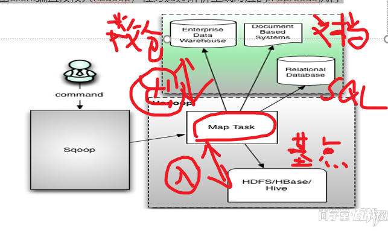

```
2）基于hdfs为基准线  导入导出、
```

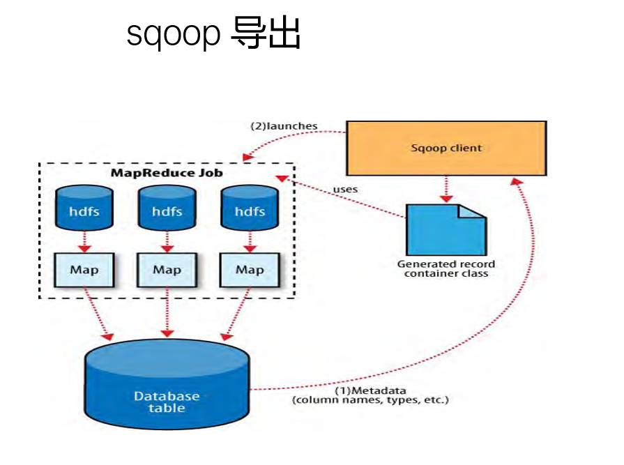


## 1.3 安装

```
#1，安装
#我们以操作hive 与 mysql 之间数据转换为例
#所以把sqoop 安装在有hive 的 node4 上

步骤：
#解压  ：tar -xf -C
#环境变量
#数据库驱动 jar包  （sqoop 节点要连接数据库）
cp mysql-connector-java-5.1.10.jar /sqoop-install-path/lib

#重命名配置文件(本来是指定一系列组件的地址，，etc齐了不用配)
mv sqoop-env-template.sh sqoop-env.sh

#如果不想测试有提醒：修改bin下的configure-sqoop（环境监测）
去掉未安装服务相关内容；例如（、HCatalog、Accumulo）：
进去搜索，然后注释

```


```
#2，测试

版本
sqoop version
数据库  （指定连接就行，你要展示数据库，所以不要指定数据库）
sqoop list-databases -- connect jdbc:mysql://node1:3306/ --username root --password 123456

help
```

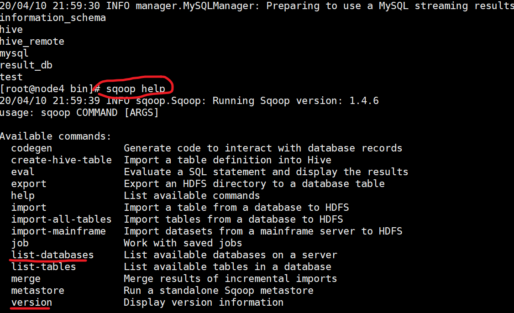


[1.4.6 user guide]: http://sqoop.apache.org/docs/1.4.6/SqoopUserGuide.html

# 2 使用

## 2.0 格式

```
#1，命令行
sqoop  然后后面写一堆
#2，文件
sqoop  --option -flie

命令行问题：
命令行   sql要  这个\` sql\`    
分割符  直接写 \t  分割变成了t 类似的  要写 \`\t\`
```


## 2.1 导入

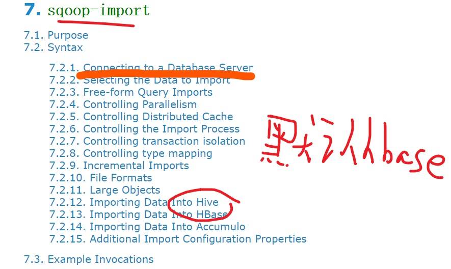

### 1）都先连接sql

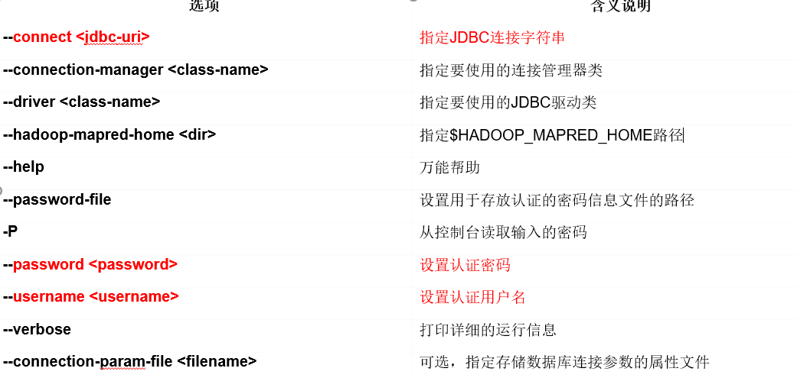


### 2）导入

#### --默认hdfs

```
#1，导入控制参数 （默认存hdfs）

1)参数图
```

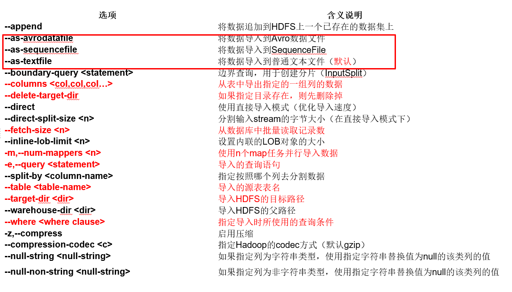

```
#2，实践 

1） option1  (简单连接，导入到hdfs)

import
--connect
jdbc:mysql://node1:3306/result_db
--username
root
--password
123456
--as-textfile
--columns
browser_name,browser_version
--table
dimension_browser
-m
1
--delete-target-dir
--target-dir
/sqoop

```

```
#效果：

sqoop --options-file option1

提示直接导入可能更快
--direct

#没有目录，能自动生成hdfs目录
#默认从sql读取，分割 逗号
```

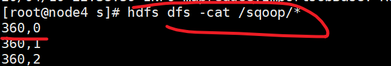


```
2） option2  (用SQL语句，导入到hdfs)

import
--connect
jdbc:mysql://node1:3306/result_db
--username
root
--password
123456
--as-textfile
-m
1
--delete-target-dir
--target-dir
/sqoop
-e
select * from dimension_browser where $CONDITIONS and id > 20
```

```
#效果：
用SQL了，不用写table 和 选择列了
-e
但是不管有没有条件都要写  where $CONDITIONS
有条件了，再and
```

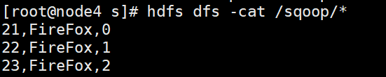

#### --hive

#都是要先连接

```
#1，添加新的参数

再hdfs基础上，添加的参数
（hdfs 的目录一定要指定 ，hive-import也标识，以及选择hive表）
```

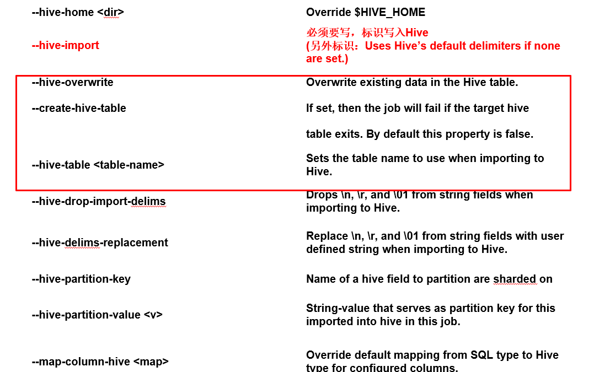


```
#2，实践
option4  （导入到hive中。hdfs转存目录一定要写，测试分隔符）

import
--connect
jdbc:mysql://node1:3306/result_db
--username
root
--password
123456
--as-textfile
-m
1
--delete-target-dir
--target-dir
/sqoop
-e
select * from dimension_browser where $CONDITIONS and id > 20
--hive-import
--create-hive-table
--hive-table
browser
--fields-terminated-by
,
```


```
#效果： （如果用命令行，要看2.0格式要求）

1）必须写tartget -dir  （用来暂存的）
导入数据时，，先从sql查数据    然后暂存hdfs到指定目录，，
然后再导入到hive中存储的目录（然后删除hdfs目录）。
（相当于  hive 的  load  hdfs中文件，会被迁移到hive下  ）

2）指定分隔符  (这个是写出的分隔符，，还有个sql读取分隔符) 
	（默认是^A：连dfs -cat 看不出直接查看不出，）

#直接hive看不出，因为在这里都是空格区分

--设定的：（一般设定成逗号，因为可以和导出sql配合）
用dfs -cat  就可以看出来

--不设定  （发现是hive的默认 ^A）
用dfs 都看不出。必须用本地的 cat -A 才可以
	hive 中输入 dfs  get 下来，，， 
	然后commad 输入 cat  -A 查看，，

下图：显示了设定的 逗号
```

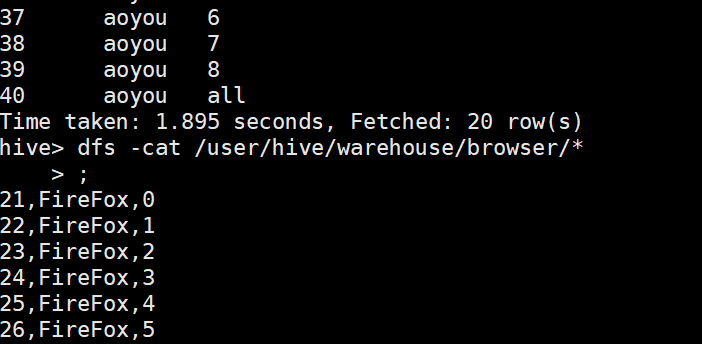


#### --hbase

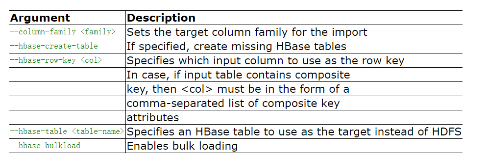


## 2.2 导出

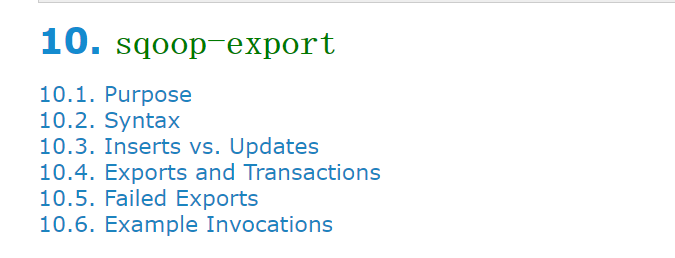

#都是从hdfs导出，，都一样 hive/hbase（不用附加新参数）

### 1）先连数据库

同上

### 2）导出

```
#1，参数
#都是hdfs 导出
#注意sql 的分隔符
```

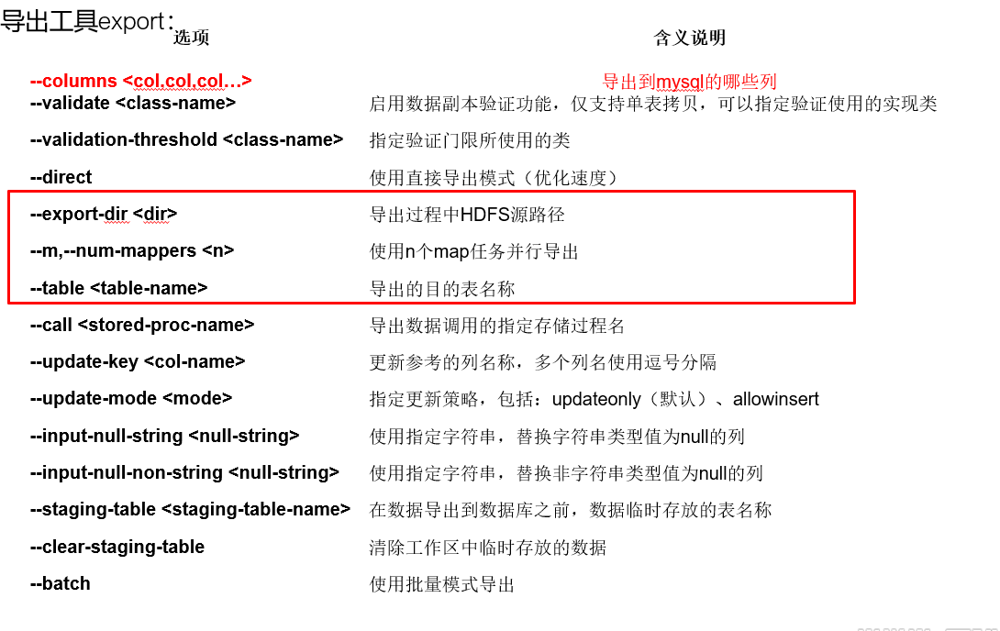

```
#2，时间
option5  
（ 把hive 导回到 mysql的另一个表中，，，注意现有sql表，以及sql分隔符）

export
--connect
jdbc:mysql://node1:3306/test
--username
root
--password
123456
-m
1
--columns
id,browser_name,browser_version
--export-dir
/user/hive/warehouse/browser
--table
s_browser

```

```
#效果：
#连接， 和 导出到sql

不会自己创建表，要先有sql表

默认识别逗号分隔
	（如果，hdfs用的 逗号分割符，SQL就不用指定，不然如果hdfs默认，sql要用 \001(^A 必须在文件这么写)） 
--input-fields-terminated-by   
```

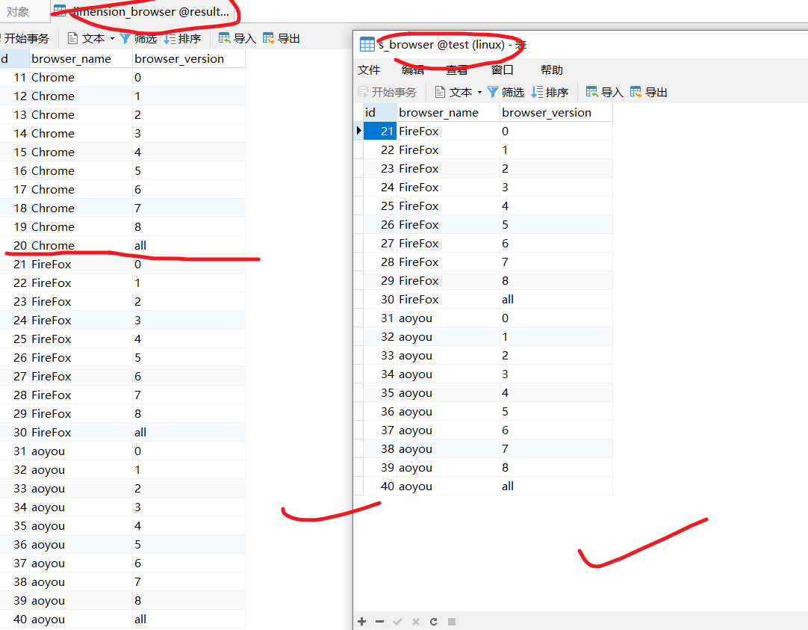


