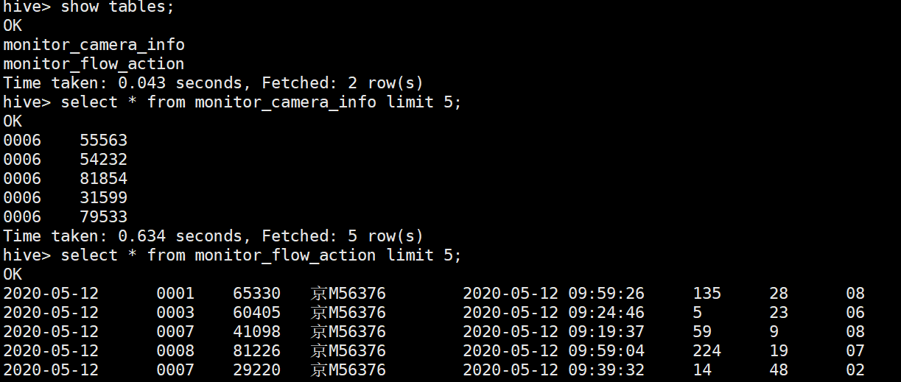
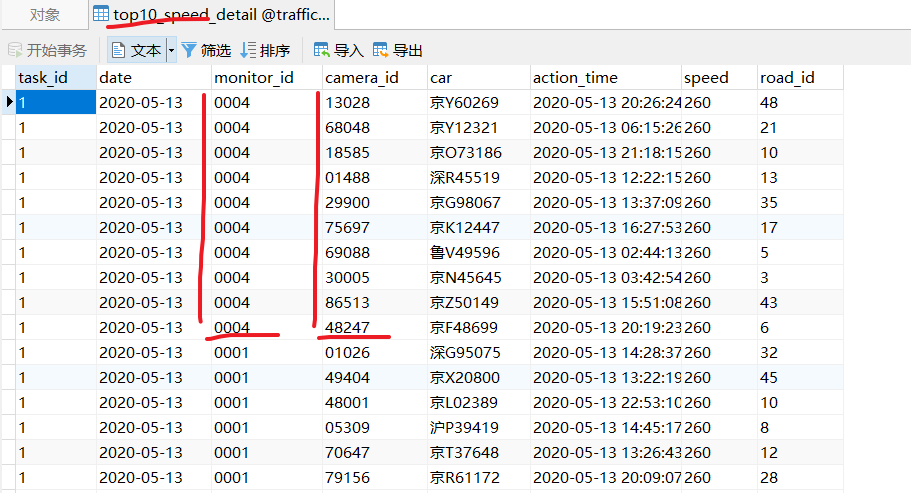
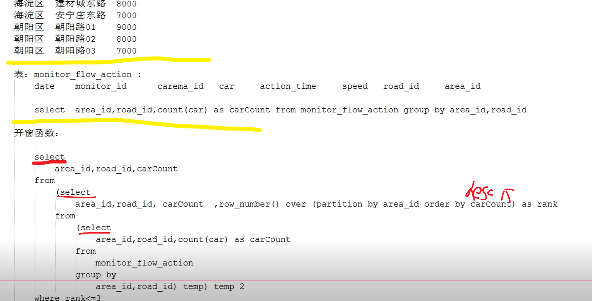

# 车流量监控项目

# 1 概述

## 1.1 项目效果目的

#类似如下


```
#图概述： （本项目没有实现这个前端）
一个图片就是一个功能，同行的功能就是一个模块
四个模块用core,,streaming ，sql  实现

#概念：
摄像头：用来监控数据的
卡口： 一条道路上的，某个方向上的 所有摄像头逻辑总和   （一对多）

#目的：
把讲过的东西练习下
同时介绍一些调优
```


## 1.2 通用知识

### 1）名词的大小

```
#一般量的值如下：

7字段  1W  对应 1M   
一天传统项目 100G  ， 互联网项目500G


测试集群，，3到5台
服务集群，，传统5-10 ，十多台  互联网 30 -几十台  （CDH管理）
对于一个核，双线程的，，spark core可以配双核
```


### 2）处理流程图


```
#一般流程如上
#分别处理两套数据，不要离线和实时混合共用，，不然有延迟
```


### 3）任务提交

#最次也是脚本，不要手写输入命令行

#本项目，我们开发的是下面那个jar部分


```
#1，脚本 
#sh脚本如何传参
vi:
	echo "i love $1 and $2"   （ 靠$ ）
```


```
#2，平台化
1）概述：
执行前，在网页上点出自己的需求，（用了个mysql做中转），然后查出参数，调用linux脚本，执行命令
执行中，在网页可以看运行情况，有问题可以点重试  (这是一个用mysql中转的好处，可以接着获取参数)


2）问题：
#java 怎么调用linux脚本
	核心：
		Process proc = Runtime.getRuntime().exec(“sh 脚本 参数”);
		还要消耗缓冲区，不然阻塞，拿不到结果
		proc.waitFor();


#传参：
   怎么传如上
   传taskID，是在代码后面解析的时候，再去查的表，获取自己要的业务参数


3）测试：
def main(args: Array[String]): Unit = {

//准备脚本
val cmd = "sh /root/test/test.sh " + args(0) + " " + args(1)
System.out.println("cmd = " + cmd)

//执行脚本
val process = Runtime.getRuntime.exec(cmd)
    /**
      * 可执行程序的输出可能会比较多，而运行窗口的输出缓冲区有限，会造成waitFor一直阻塞。
      * 解决的办法是，利用Java提供的Process类提供的getInputStream,getErrorStream方法
      * 让Java虚拟机截获被调用程序的标准输出、错误输出，在waitfor()命令之前读掉输出缓冲区中的内容。
      */
val bufferedReader = new BufferedReader(new InputStreamReader(process.getInputStream))
var flag = bufferedReader.readLine()
while (flag != null){
      System.out.println("result ---- " + flag)  //或者写到个文件
      flag = bufferedReader.readLine()
    }
bufferedReader.close()

//等待脚本执行完成
process.waitFor()

}

#运行：
	打成jar包，大包丢到集群 java -jar MySpark-1.0-SNAPSHOT-jar-with-dependencies.jar a b
	      （大包有依赖，且指定了谁是主类）

4）实际
#实际脚本内容应该是 spark --master url --class jarPath taskI
#假如使用tomcat实现平台化，那么tomcat应该部署在客户端 
```


------


# 2 解析

## 2.0 全局

### 1）包介绍


### 2）知识点

```
#core
1） 
	有自定义累加器的知识
	有maven项目打jar包注意：目录不能有中文，全包就直接，不全包提交补全jar   （？反向搜包）
3） 广播变量 + map类的tran 算子  代替join
4） 二次排序
5） 广播过滤  和 分区取topn           
7） 广播过滤，和 分区 排序
8） 不是随机抽取，而是按比例抽取
9） collectAsMap  不像collect弄成list，，直接map  和 广播参数
 
#sql :
10）
	开窗函数，，，自定义UDAF，，sql自动join变成广播参数
	两种数据倾斜的情况

#streaming：
11）窗函数  ，  .mapValues（操作元祖的value）
```


## 2.1 数据

```
#1，数据格式

1）monitor_flow_action表 ： （某个卡口下摄像头的具体信息）

日期	      卡口ID	 摄像头编号  车牌号	     拍摄时间	           车速	  道路ID   区域ID
2018-11-05	0008	67268	  京S05494	2018-11-05 06:27:25	  98	  20	  04


2） monitor_camera_info  ： （卡扣本对应的摄像头编号 ）
卡扣编号   摄像头编号 
0006	  42244
0006	  68871
0006	  66213 
....      ....


```


```
#2，产生数据

（两种：本地运行时：每次都重新产生数据，，， 集群运行时，从已经在hive的数据读 ）

1）本地
#com.spark.spark.test下的MockData.java

1.1）生成monitor_flow_action临时表：
list--->rdd--->动态DS--->注册临时表 
	#java ：DS<row> 就是DF
	#弄临时表是为了后面的操作

~List<Row> dataList = new ArrayList<Row>();

~产生数据:
 {
   3000辆车->随机经过小于300个摄像头->8个区域->50个道路->四位9个卡口->五位99999摄像头
   ->时间->速度
 }
 
~JavaRDD<Row> rowRdd = sc.parallelize(dataList)
~StructType cameraFlowSchema = DataTypes.createStructType(Arrays.asList(
    DataTypes.createStructField("date", DataTypes.StringType, true),
    DataTypes.createStructField("monitor_id", DataTypes.StringType, true),
    DataTypes.createStructField("camera_id", DataTypes.StringType, true),
    DataTypes.createStructField("car", DataTypes.StringType, true),
    DataTypes.createStructField("action_time", DataTypes.StringType, true),
    DataTypes.createStructField("speed", DataTypes.StringType, true),
    DataTypes.createStructField("road_id", DataTypes.StringType, true),
    DataTypes.createStructField("area_id", DataTypes.StringType, true)
    	));
~Dataset<Row> ds = spark.createDataFrame(rowRdd, cameraFlowSchema);

~ds.registerTempTable("monitor_flow_action");


------------------------------------

1.2）生成monitor_camera_info临时表：
list--->map--->list--->rdd--->动态DS--->注册临时表

~Map<String,Set<String>> monitorAndCameras = new HashMap<>();

~产生数据:
 {
  把之前的list  弄成 map  ( key：monitor_id ， value:hashSet(camera_id))
  然后再加点假数据，使得monitor_id能对应更多的camera，用来模拟坏的卡点
 }
 
~dataList.clear();
~dataList.add(row); （遍历map，变成list）
~StructType monitorSchema = DataTypes.createStructType(Arrays.asList(
	   DataTypes.createStructField("monitor_id", DataTypes.StringType, true),
	   DataTypes.createStructField("camera_id", DataTypes.StringType, true)
    		));
~rowRdd = sc.parallelize(dataList);
~Dataset<Row> monitorDF = spark.createDataFrame(rowRdd, monitorSchema);

~monitorDF.registerTempTable("monitor_camera_info");
```


```
2）集群

2.1）生成两个数据文件
#com.producedate2hive.Data2File

2.2) 导入Hive: 两种方法
 ​ 通过代码，spark操作hql   (#com.producedate2hive.Data2Hive)
 ​ hive -f      （文件第一行是 关闭关键字检查，，省得和date等冲突）
{ 
  #启动
      zk , hdfs , yarn, 
      mysql ,hive-c ,hive-s

  #hive:		
	  traffic 数据库
      hive -f createHiveTab.sql
}

#hive 的数据如下
```




```
#3，准备mysql

先建立traffic库，然后运行traffic.sql 文件
创建如下表
```


#task 表 （时间都修改下）


## 2.2 操作

java写的2.3

## ---------------------

## ---------------------

## *--core1：流量监控模块*

#com.bjsxt.spark.skynet.MonitorFlowAnalyze  ： 1-7 都在

#taskid : 1


### 1）卡扣监控

#### --概述

```
1)  大体思路：
卡口： groupbykey ， 比较两个表的list 的数量，，能看出该卡口的正常或者异常
摄像头： 还是上面那样，，在flow表的list出现了的就是正常，而camera表没出先得就是异常

#举例：
正常的卡扣数 					7
异常的卡扣数					2
正常的摄像头个数			  1000				
异常的摄像头个数			  5	
异常的摄像头详细信息			0001:33333,44444  ~00005:12814,87463,99123

2）实现
核心就是累加器  ： 为了分布式的 统计东西  （4+1自定义=5，，，然后可以整成一个自定义累加器就行）
```


#### --代码流程图


```
#图和代码有一定偏差
1）
上面是处理f表的，最后得到rdd4：(m_id  , c_count | c_info | count  )
下面是处理c表的，最后得到rddD
	#c_info是list，表示该m_id下，有哪些c的
中间第一个是 下面.leftjoin(上面)得
中间最后那个RDD是为了下一个功能做的准备

2)
在求最后一个RDD时，过程用到了累加器，来统计结果 
累加器需要个action激活，但多次action，就会反复统计结果
	在第二条路：sortbykey虽是tran算子，但里面有act，会导致结果不准确
```


#### --代码

```
#代码概述
总共是三部分：
  准备工作 ：弄出两个数据，，查到参数（里面日期参数，后面用到）
  上： 求出了实际的数据
  下中：
  	下：求出了标准的数据
  	中： 比较数据，用累加器求到结果
  	
#最终效果：
把累加器的东西存到了数据库，monitor_state表中
拿到了为了下一个功能的rdd
```


```
#1，准备工作

1）获得本地的临时表 或者 使用Hive的traffic库

if(onLocal) ： MockData.mock(sc, spark);
else        :  spark.sql("use traffic");

#不管本地还是集群，都用统一的代码，通过配置文件的onLocal来实现选择
#因为sparksql 能运行sql 和 hivesql  ，而且表啥的名字也一样  所以才可以这样。

-----------------

2) 通过查mysql,traffic库的task表 ， 把该行，封装到一个Task的对象
// 拿到task 的key
long taskId = ParamUtils.getTaskIdFromArgs(args,Constants.SPARK_LOCAL_TASKID_MONITOR);

//封装到Task（自定义）对象
Task task = taskDAO.findTaskById(taskId);
 { 
  #ctrl +t  看实现 或者点左边小绿button
  里面查询："SELECT * FROM task WHERE task_id = ?"
  里面还有封装成Task类
 }
 
-----------------

3) 拿到参数，然后弄成JSONObject
JSONObject taskParamsJsonObject = JSONObject.parseObject(task.getTaskParams());
#将 task_parm字符串转换成json格式数据 （有时间 和 topNum）
```


---------------


#开始执行代码流程图的 RDD操作

```
#2，上面那条路 ：实际的

1）RDD1  
#取指定日期内，monitor_flow_action中车流量数据，返回JavaRDD<Row>
#数据--> DS（限制了日期）-->RDD1

JavaRDD<Row> cameraRDD =
SparkUtils.getCameraRDDByDateRange(spark, taskParamsJsonObject);
{
 String sql = //下面是固定住的，源码是为了拿到规定时间内的表f数据
 "SELECT * FROM monitor_flow_action  WHERE date>=startDate AND date<= endDate ";  

Dataset<Row> monitorDF = spark.sql(sql);
return monitorDF.javaRDD(); 
}

2）创建累加器

SelfDefineAccumulator monitorAndCameraStateAccumulator = 
new  SelfDefineAccumulator();	spark.sparkContext().register(monitorAndCameraStateAccumulator,"SelfAccumulator");

```

```
#管理累加器的详解
~1.6 和 2.X 的区别
	1.6只有accumulator，，2.X有double / long  accumulator
	自定义累加器也有变化

~自定义：（核心就是要定义出：初始值，分区内加，总分区加）
```

```
#1.6:
Accumulator<String> XX = sc.accumulator("", new X());
{继承：implements AccumulatorParam<String>
实现：zero,addAccumulator, addInPlace方法
}
```

```
#2.3:（在这个例子中，用一个累加器，把东西弄成一个字符串，来完成的）
（ isZero 要和 reset（每个分区初始值）  东西一致 ，不然报错
   add  ， merge:  共用了同个加的逻辑
   value  ,copy
）
```

​	

```
3）RDD2 
#将row类型的RDD 转换成kv格式的RDD   k:monitor_id  v:row
#和持久化

JavaPairRDD<String, Row> monitor2DetailRDD = getMonitor2DetailRDD(cameraRDD);

{#就是弄出m_id 和 row
   cameraRDD.mapToPair(new PairFunction<Row, String, Row>() {
			private static final long serialVersionUID = 1L;

			@Override
			public Tuple2<String, Row> call(Row row)  {
				return new Tuple2<String, Row>(row.getString(1),row);
			}
		});
}
monitor2DetailRDD = monitor2DetailRDD.cache();

4）RDD3：
#按照卡扣号分组，对应的数据是：[Row1,Row2.....]  该m_id 下的所有list
JavaPairRDD<String, Iterable<Row>> monitorId2RowsRDD = monitor2DetailRDD.groupByKey();

5）RDD4：  
#RDD3: < monitor_id,List<Row> >  ---->RDD4 ： <m_id, info > 
#"monitorId=0001|cameraIds=00001,00002,00003|cameraCount=3|carCount=100" (这就是info)

JavaPairRDD<String, String> aggregateMonitorId2DetailRDD = aggreagteByMonitor(monitorId2RowsRDD);
{
 #计数，去重计数cIDs (list.contains)，把不重的c拼起来
 
 monitorId2RowRDD.mapToPair( 
   new PairFunction<Tuple2<String,Iterable<Row>>,String, String>() 
    {
	public Tuple2<String, String> call(Tuple2<String, Iterable<Row>> tuple) 
     {
      count=0
	  list = new ArrayList<>();
	  tmpInfos = new StringBuilder()
	  
	  while(tuple){ count+=0 ; list.add(该camera没有) ; tmpInfos.append(camera)}
	  
	  return  m_id | infos | count | list.size	  
	  }
	  
    } )	
}

```


--------------------------


```
#3,下面和中间那条路
#RDD a    -->  RDD ：carCount2MonitorRDD （最后一个）

JavaPairRDD<Integer, String> carCount2MonitorRDD = checkMonitorState
(sc,spark,aggregateMonitorId2DetailRDD,taskId,taskParamsJsonObject,monitorAndCameraStateAccumulator);

```

#这个方法里面的

```
1）下面  ： 标准的

df --> rdd A -->rdd b---rdd D

JavaRDD<Row> standardRDD = standardDF.javaRDD();

JavaPairRDD<String, String> monitorId2CameraId = standardRDD.mapToPair

//直接获得了含有标准的信息
("monitorId","cameraIds=xxx|cameraCount=xxx")

JavaPairRDD<String, String> standardMonitor2CameraInfos=monitorId2CameraId.groupByKey().mapToPair
```


```
2）中间的： 完成累加器的更新   

//标准的 . left(实际的)，，，就是为了以标准的为基准


JavaPairRDD<String, Tuple2<String, Optional<String>>> joinResultRDD =
standardMonitor2CameraInfos.leftOuterJoin(monitorId2CameraCountRDD);

//最核心的部分，这里调用累加器更新
JavaPairRDD<Integer, String> carCount2MonitorId = joinResultRDD.mapPartitionsToPair

{ 

。右边没值{ 只更新累加器的3个异常部分，monitorAndCameraStateAccumulator.add，然后跳出本次循环  
。有值  （有值的时候，才表明能有有车流量）
 {
 。。先 比较camera_count，
    相同，说明全是正常的，只先更新两个正常的   
    不同，就要具体看哪个摄像头实际中没有的，然后先更新坏的卡口，  好坏的摄像头，坏的具体对应

 。。然后更新车的流量
 }
#返回给一下功能用的rdd (carCount,monitorId)

}

```

```
#累加器：
normalMonitorCount=0|normalCameraCount=0|
abnormalMonitorCount=0|abnormalCameraCount=0|abnormalMonitorCameraInfos= 

```


```
3）结束
//激活累加器，也触发tran
carCount2MonitorRDD.count();
	 	 

//往数据库表  monitor_state 中保存 累加器累加的五个状态（也就是这个功能的结果）
saveMonitorState(taskId,monitorAndCameraStateAccumulator);


```

---------------

#### --运行

#本地 + 集群

```
#1，本地：
配置文件my.properties ：spark.local=true
修改数据库，task表，时间参数为运行的当天
然后直接点运行，查看数据库的结果
```


```
#2，集群
配置: local改成false
打包：自带的（删除target,clear,package）  或者 assem插件 那个
效果： 大包有依赖的，，，小包没依赖的自己加json 和mysql两个依赖 
						（double shift 搜，然后show explorer 能在文件系统找到然后复制）


#提交：最后加个参数1。
1）大包：

标准提交命令：
./spark-submit  --master spark://node2:7077,node3:7077 --class com.bjsxt.spark.skynet.MonitorFlowAnalyze /root/test/TrafficProject-1.0-SNAPSHOT-jar-with-dependencies.jar 1


2）小包：
提交命令加，jar逗号   djar冒号
./spark-submit --master spark://node2:7077,node3:7077 --jars /root/test/mysql-connector-java-5.1.47.jar,/root/test/fastjson-1.2.11.jar --driver-class-path /root/test/mysql-connector-java-5.1.47.jar:/root/test/fastjson-1.2.11.jar  --class com.bjsxt.spark.skynet.MonitorFlowAnalyze /root/test/TrafficProject-1.0-SNAPSHOT.jar 1


#反向搜包？？？
```


### ---------------------

#m指卡口

### 2）流量top5的m1

```
 /**
	* 获取车流排名前N的卡扣号
	* 并放入数据库表  topn_monitor_car_count 中

	* 输入是  (car_count , id  )
	* 返回的是topN的rdd (monitor_id,monitor_id)
	 */
	 
JavaPairRDD<String, String> topNMonitor2CarFlow =
getTopNMonitorCarFlow(sc,taskId,taskParamsJsonObject,carCount2MonitorRDD);

{

~List<Tuple2<Integer, String>> topNCarCount = carCount2MonitorId.sortByKey(false).take(topNumFromParams);


~往topn_monitor_car_count 中插入车流量最多的TopN数据

~JavaPairRDD<String, String> monitorId2MonitorIdRDD = sc.parallelizePairs(monitorId2CarCounts //这个是(m_id,m_id)的list );

}
```


### 3）m1下车的信息

#动态广播

#### --流程图

#上面是数据，下面是过滤的条件


#改进


```
问题：Join有shuffle，
改进： (广播变量  +   map类（map，filter等等）的tran算子（没有shuffle））， 代替join
```


#### --改进

```
 /**
	  * 获取topN 卡口的车流量具体信息，存入数据库表 topn_monitor_detail_info 中
	  
	  * 输入刚刚2）中的rdd(m_id,m_id)，  和 之前上路的数据 rdd2（m_id , row）
	  *没有返回值
 */
 getTopNDetails(taskId,topNMonitor2CarFlow,monitor2DetailRDD);

#靠两种方法进行给数据过滤，，然后对一条数据，把行的所有信息弄塞进一个类，然后输出到数据库
```


```
#1，原本

topNMonitor2CarFlow.join(monitor2DetailRDD)
.mapToPair(里面返回m_id, row).foreachPartition()

{#在for
把row信息 和 taskid 塞进TopNMonitorDetailInfo类
然后弄到数据库里去
}
```


```
#2，优化 ： 
//获得过滤list
List<String> topNMonitorIds = topNMonitor2CarFlow.map(取一个m_id).collect();

//获得javasc
JavaSparkContext jsc = new JavaSparkContext(topNMonitor2CarFlow.context());

//广播
Broadcast<List<String>>broadcast_topNMonitorIds=
jsc.broadcast(topNMonitorIds);

//过滤数据，，然后插入到数据库
monitor2DetailRDD.filter(
里面是这样过滤：broadcast_topNMonitorIds.value().contains(monitorTuple._1) )
foreachPartition()
```

#top5 下的所有车信息


### 4）高速top5的m2

#二次排序

```
#1，概述

#规定啥是高速，，已经比较的规则
（如下，从上往下，依次比较，先多的的就高速）
						A		 B              卡扣
	speed >=120		高速 1		1              个数
	90<=speed<120 	中速 2		10	
	60<=speed<90	正常 3		2
	speed<60		低速 10		20
```


```
#2，代码
/**
	*获取车辆高速通过的TOPN卡扣
	
	*输入上路的rdd3  （m_id ,[row1,row2.....]）
    *返回list，然后遍历打印结果
    
    */ 
#rdd3 --> rdd <X类（自定义的，塞进四个速度分段属性）>
--->sortBykey.take 返回list --> 调整下list

 
 1）
List<String> top5MonitorIds = speedTopNMonitor(monitorId2RowsRDD);
{
~A.mapToPair(里面返回 speedSortKey, monitorId  )
  {#自定义类，塞进4个 mTP用来记该m_id下四个速度分段的个数 的属   
   {
   implements Comparable<SpeedSortKey>,Serializable
   
   @Override
   public int compareTo(SpeedSortKey other) 
   #平手时依次比较个数，不平手谁多就返回大   
   }
   
  }
~list = B.sortByKey(false).take(5) (返回~Tuple2<SpeedSortKey, String>)
~再for 遍历，返回list里面的monitorIds弄成新的list
}

2）
for (String monitorId : top5MonitorIds) {
	System.out.println("车辆经常高速通过的卡扣	monitorId:"+monitorId);
	 	 }
```


### 5）m2下的top速度

#广播过滤，分组取topn

```
 /**
	* 获取高速TOPN卡扣，每个卡扣中速度最快的前10名，并存入数据库表 top10_speed_detail 
	
	*输入是 刚刚4）的top5m_id 的list  ， 和 上路的rdd2  （m_id ,row）
	*没有返回值
	*/
		
getMonitorDetails(sc,taskId,top5MonitorIds,monitor2DetailRDD);

#要先广播过滤出top的数据，，然后分组，，取top10（有直接list 或者 固定数组 两种）
top5MonitorIdsBroadcast = sc.broadcast(top5MonitorIds)
monitor2DetailRDD.filter(top5MonitorIdsBroadcast.value().contains(monitorIds))

.groupbykey().foreach() {有两种}
然后弄到数据库中
```


```
#1，固定数组：
String monitor_id = tuple._1;
Iterator<Row> rowsIterator = tuple._2.iterator();
				 
Row[] top10Cars = new Row[10];  
while (rowsIterator.hasNext()) {
	Row row = rowsIterator.next();
	long speed = Long.valueOf(row.getString(5));  
	for(int i = 0; i < top10Cars.length; i++) {


该分组，每个row， 最多循环10次，
	如果是第一次，直接插第0个，然后break
	如果不是，就去比较本row值 和循环的值，
		如果更大，就取代当前位置，后面的值往后移，然后break
		如果更小，本次循环啥也不做，接着下一个数组得位置

		if(top10Cars[i] == null) {
			top10Cars[i] = row;
			break;
			} 
		else {
			long _speed = Long.valueOf(top10Cars[i].getString(5));  
				if(speed > _speed) {
					for(int j = 9; j > i; j--) {
						top10Cars[j] = top10Cars[j - 1];
						}
			        top10Cars[i] = row;
			        break;
			    }
		}
    }    
}		 
```

```
#2，直接list
list = IteratorUtils.toList(rowsIterator)
Collections.sort(list , new Comperator<Row>{自己return 比较规则 然后要返回数字 ?1:-1  }  )
```

#top5 下的前10个车速度




### ---------------------

### 6）两区域碰撞分析

```
#1，概述
#碰撞是指，哪些是 在一个东西中 和 另一个东西同时出现的
  （东西有  区域  或者  卡口）
  
区域  01,02中这一天同时出现的车辆

	01：（car,row） 02:(car,row)
	(car,row).join(car,row)
	
	01:car  02:car
	car02.intersection(car02)
```


```
#2，代码
  
/**
	*区域分析
    *输入json类，，和 参数
    *没有返回值，，里面打印结果
 */
 CarPeng(spark,taskParamsJsonObject,"01","02")
 
 {
 // 两个区域的数据rdd
 JavaRDD<Row> cameraRDD01=SparkUtils.getCameraRDDByDateRangeAndArea(spark, taskParamsJsonObject,area1);

cameraRDD02；

// 取车牌属性并且去重
JavaRDD<String> distinct1 = cameraRDD01.map(取属性).distinct();

distinct2;

//取交集，打印结果
distinct1.intersection(distinct2).foreach(打印结果)
 }
 
 
#distinct，intersection  都是shuffle
```


### 7）车轨迹

#### --流程图


```
#车轨迹，是一辆车，把出现的卡口，按时间顺序排序
#本例是 统计卡扣0001下20个车辆的轨迹  -- take(20)

上面是得到这20辆车
下面是在所有数据中，找到这20辆车，然后按时间排序
```


#### --代码

```
//没有返回值，不存数据库，就打印下就行

#1,上面：

List<String> cars=cameraRDD.filter( return "0001".equals(row.getAs("monitor_id")+""))
.map(return row.getAs("car")+"").distinct().take(20);

bc = sc.broadcast(cars);


#2，下面:
cameraRDD.mapToPair(car , row ).filter(return bc.value().contains(tuple._1) )
//开始求轨迹
.groupByKey().foreach()
{
	List<Row> rowList = IteratorUtils.toList(tp._2.iterator());
	Collections.sort(rowList,new Comparator<Row>() { 要return  1 or 0 or -1 } )

}

#用原生的list sort
#注意comparate   里面的 可以用 ?:简化
```


## *--core2:*

#com.bjsxt.spark.skynet.RandomExtractCars  ： 8在

#taskid : 2

### 8） 随机抽取车

#### --流程图

```
#1，概述
有sample算子， 但是纯随机                   是随机抽样  
现在的要求，是对每个时间段，按数量的比例抽      是比例抽样
（以后训练模型,要这种数据，避免数据全是某种）

```


```
#2,原理图
核心就是求出 每个时间段的和a1 以及 每天的所有时间段总和a2
某天某时段抽取的车数量：  car_sample * a1/a2

#实际靠给数量，然后弄成下标抽
#本例
	每天的抽取数，总抽取数直接平分了，，所以只考虑某天时间段a1 / 某天总和 a2
	并且只有一天数据
```


```
1）图概述

#右边一圈是1-6 rdd， 还有3个map   ； 左边是A-D rdd
右边：
	是利用广播弄出的map,来过滤抽取car
左边：
	先获取car的详细信息，然后求这些的轨迹


2）图一些细节
右边：
  dayHour是因为可能不是一天，，，只要车辆信息，所以car就行
  要避免一个key（同一时间段）下，重car太多了
  
  ​两个和值： 可以用countBykey  得map1 ，然后弄成多天的嵌套map2，然后再核心map3
				
  ​抽取： 
          靠随机的list，，长度是要抽的个数，，值是要抽的下标
          #也可以直接在rdd4中， 求[car...]的size，然后再求总的，不用右边那条路

   效果：一对多，是为了下一步： 求具体的信息

左边：
   抽出的车，的车轨迹


3）其他
#数据库：
圈1：random_extract_car        ：抽的车牌号
圈2：random_extract_car_detail_info ： 车牌号加具体信息
圈3：car_track            ：轨迹
//1 和 2 select distinct  和 3 的行数一致，，并且小于100。

```


------


#### --代码

```
#1，准备工作  （和 1） 类似）: 到rdd1这步
1）本地或者集群


2) 查task表 ， 然后弄到json对象
// 这个id是2了
long taskId = ParamUtils.getTaskIdFromArgs(args,Constants.SPARK_LOCAL_TASKID_EXTRACT_CAR);

JSONObject taskParamsJsonObject = JSONObject.parseObject(task.getTaskParams());

3) rdd1
JavaRDD<Row> cameraRDD = SparkUtils.getCameraRDDByDateRange(spark, taskParamsJsonObject);
```


```
#2,抽取车辆，并且有具体信息的

##方法返回rdd C
	 抽取的车辆信息插到random_extract_car表中,
 	 将抽取的car的详细数据放入了random_extract_car_detail_info 表中
 	 返回了(car,Row)

JavaPairRDD<String, Row> randomExtractCar2DetailRDD = randomExtractCarInfo(sc,taskId,taskParamsJsonObject,cameraRDD);
```

```
{0
~rdd2 :
  dateHourCar2DetailRDD=cameraRDD.mapToPair(返回"dateHour"="date_hour","car"="车牌XX"  )
  
~rdd3: 同时间段，没有重的了
  dateHour2DetailRDD = dateHourCar2DetailRDD.distinct();

----------------------------

1）拿到有抽取索引的map3
~map1 ：countByKey<dateHour,car_count>
  countByKey = rdd3.countByKey();

~map2：dateHourCountMap<date,<Hour,count>>
	{
	//通过遍历map1的k和v, 把原来的k 拆成date 和hour，
	//下面是核心逻辑，先判断date有无，在就直接更新<hour,count>，，没有就先弄个
	 Map<String, Long> hourCountMap = map2.get(date);
			if(hourCountMap == null){
				hourCountMap = new HashMap<String,Long>();
				map2.put(date, hourCountMap);
			}
			
			hourCountMap.put(hour, count);
	
	}

~map3: dateHourExtractMap<date,<Hour,list(抽取数长度的随机索引)>>
  
  {3-1
   //先前工作: 这就直接每天平均分了
   ~~extractNumPerDay = extractNums(表查的,100辆) / d3.size();
   
   //核心
   ~~for( 按照天拿里面的map )  
   {3-2
     //准备工作:
      该天总的车流量
      和上面一样的操作，弄map3,查map3的该date有无，然后要更新<hour,list>
   
     //更新核心,是个for,遍历map.value，也就是<hour,count>
   	 {里面就是：count/总流量  * extractNumPerDay，然后随机list }   
    3-2} 
    
  3-1}
  
----------------------------
----------------------------

2） 抽取
~sc.broadcast(dateHourExtractMap);

~ rdd5: extractCarRDD 把抽取结果存到数据库: random_extract_car表
    rdd3.groupbykey.flatMaptoPair     (返回 car,car)
   {
     当你循环t._2.iterator，也就是[car,car..]
     你要从这抽取，广播中该时间段的下标，而循环也可以看做0,1..给了下标 
     存到数据库中
    }

~rdd6: rdd5.distinct()  
  (去掉了总时间下的重car，对实际结果没有影响，因为你要过滤的数据是完整的，所以join没有关系)
   
  
----------------------------
----------------------------


3）过滤具体信息的
~rddA ：
	car2DetailRDD = cameraRDD.mapToPair  (返回 car，Row)

~rdd C： 返回 （car,row） 抽取的车辆详细信息插入random_extract_car_detail_info表中。
  rdd6.join(rdd A).mapPartitionsToPair()


0}
```


```
#3, 对这些车轨迹分析

1）获得轨迹rdd ：carTrackRDD<String,String>
	#(car,"dateHour=2017-10-18|carTrack=monitor_id,monitor_id,monitor_id...")

JavaPairRDD<String, String> carTrackRDD = getCarTrack(taskId,randomExtractCar2DetailRDD);

{
groupByKey().mapToPair(里面对row list,进行时间排序，返回上面格式的rdd)
}

2）保存到数据库：car_track
saveCarTrack2DB(taskId,carTrackRDD);
{
.foreachPartition （整理下，然后弄到表中）

}
```


#### --运行

```
本地测试，效果是产生了三张表

表1，表2的distinct ，表3 的行数都是一样的，但是小于了100 （是因为，求每个小时的抽样数，除法是取整的）
```

#表1


#表2


#表3


----

## –core3:

#com.bjsxt.spark.areaRoadFlow.onitorOneStepConvertRateAnalyze ：9在

#taskid     5

### 9）流量转换率

#### --流程图


```
#1，概述
1）举例
一辆车的轨迹：0001->0002->0001->0003->0001->0002
卡扣0001到卡扣0002的车流量转化率：2/3
	
	0001,0002,0003,0004,0005：		
		0001,0002：
			经过卡扣0001又经过卡扣0002的车辆数/经过卡扣0001的车辆数
		0001,0002,0003：
			经过卡扣0001,0002又经过卡扣0003的车辆数/经过卡扣0001,0002的车辆数
		。。。。。。

2）核心
先求轨迹，然后匹配字段
```


#### –代码

```
#1，准备工作   : 到rdd1这步
1）本地或者集群

2) 查task表 ， 然后弄到json对象
// 这个id是5了
long taskId = ParamUtils.getTaskIdFromArgs(args, Constants.SPARK_LOCAL_TASKID_MONITOR_ONE_STEP_CONVERT)

JSONObject taskParam = JSONObject.parseObject(task.getTaskParams());

3) 拿到要操作的卡口流(1,2,3,4,5),然后并广播
String roadFlow = ParamUtils.getParam(taskParam, Constants.PARAM_MONITOR_FLOW);
final Broadcast<String> roadFlowBroadcast = sc.broadcast(roadFlow);

3) rdd1
JavaRDD<Row> rowRDDByDateRange = SparkUtils.getCameraRDDByDateRange(spark, taskParam);
```


```
#2，弄出轨迹 和 匹配字段
1）rdd2: car,row
JavaPairRDD<String, Row> car2RowRDD = getCar2RowRDD(rowRDDByDateRange);

2）rdd2-->rdd3--->rdd4
JavaPairRDD<String, Long> roadSplitRDD = generateAndMatchRowSplit(taskParam,roadFlowBroadcast,car2RowRDD);
{ 
#car2RowRDD.groupByKey().flatMapToPair(new PairFlatMapFunc<Tuple2<String,Iterable<Row>>,String,Long>)  	                                 (输入，<car,[row1，row2..]>，，返回 )
 {
  
  2.1) 求轨迹，弄成字符串
  	while(iterator.hasNext()){ 把这次输入的car的所有row，弄成个list rows }
    Collections.sort(rows, new Comparator<Row>(){自定义比较器})
  	String carTracker = roadFlowBuilder.toString().substring(1);    
  
  2.2）匹配， 弄成list[(split,splitcount),...]
  	拿到广播字符串，弄成list a
  	循环遍历， 组合a，(让1  ; 1,2 ; 1,2,3 ..一共五次), 然后去看轨迹中该split，有多少个
  	(核心是 carTracker.indexOf(tmpRoadFlow,index), 用来判断有没有，，同时又能改变Index完成移动  )
  }

}
#效果 :类似下面的数据
("0001",3)
("0001,0002",2)
("0001",13)
```

```
#3，计算
1) 准备
Map<String, Long> roadFlow2Count = getRoadFlowCount(roadSplitRDD); 
{
	rdd5 : 总的结果   <组合，组合总count> reduceBykey
	两种获取map的方式:
		.collect-->list ---> map
		Map<String, Long> map = sumByKey.collectAsMap();}
}

2) 计算
Map<String, Double> convertRateMap = computeRoadSplitConvertRate(roadFlow(广播参数),roadFlow2Count);
循环遍历， 依旧(让1  ; 1,2 ; 1,2,3 ..一共五次), 然后取出下一次count / 前一次count 就是转化率了

#效果： 最多模拟出现四个转换率
```


----

## ---------------------

## ---------------------

## –sql:

#com.bjsxt.spark.areaRoadFlow.AreaTop3RoadFlowAnalyze ：10）

#taskid    4

### 10）区流量t3的路

#### --基础

```
#明显是SQL开窗函数形式：靠A分组，靠B取topn，取出C

上面是最终展示的结果

中间是数据来源，以及没有开窗只能做到，分组之后，算出每个区下的道路下的流量，，没办法取几个

下面是基础的实现：
	最内层，是获取必要的数据
	中间，  是添加开窗
	在外，  是最终的
```



#### --延伸

```
#1，概述

添加功能： 把该分组区域道路内 的卡口流量情况统计出
海淀区   建材城西路 10000 	0001=3000|0002=4000|0003=3000
海淀区   建材城东路	8000	0004=3000|0005=5000

#明显看出，这是在获取必要数据的时候，要增加新的字段

#数据：
tmp_car_flow_basic:
		area_id		area_name		road_id		monitor_id  	car 

#伪SQL：
select             ！
	area_name,road_id,car_count,monitor_infos
from 
	(select        ！
		area_name,road_id, car_count,monitor_infos,row_number() over (partition by area_name order by car_count desc) as rn 
	from 
		(select    ！
			area_name,road_id,count(car) as car_count,UDAF(monitor_id) as monitor_infos
		from 
			tmp_car_flow_basic 
		group by 
			area_name,road_id)  tmp_area_road_flow_count)   tmp
where rn<=3

```


```
#2，代码 (除了UDAF的)

1）准备工作 ： 拿到数据的临时表

#因为要用开窗函数，用到Hive,所以要集群提交
spark=SparkSession.builder().appName(Constants.SPARK_APP_NAME).config("spark.sql.autoBroadcastJoinThreshold", "1048576000").enableHiveSupport().getOrCreate();
( 
  table1 join table2  : 会涉及到了shuffle，而如果能广播最好
  当小于参数值（默认为10M）的表会广播，10M = 10485760字节
)

#拿到task参数 是4对应的， 然后弄到json对象

# 获取指定日期内的参数 (areaId,row)
JavaPairRDD<String, Row> areaId2DetailInfos = getInfosByDateRDD(spark,taskParam);

# 拿到 区ID对应区名称 的rdd，(area_id,area_name)
JavaPairRDD<String, String> areaId2AreaInfoRDD = getAreaId2AreaInfoRDD(spark);

#动态创建DF，注册临时表
generateTempRoadFlowBasicTable (spark,areaId2DetailInfos,areaId2AreaInfoRDD)
{
 //拿到Row RDD :JavaRDD<Row> tmpRowRDD = areaId2DetailInfos.join(areaId2AreaInfoRDD).map()
  (广播表了，能<id , (row,name)> ， 然后map  return RowFactory.create(areaId, areaName, roadId, monitorId,car);   )
  
 //拿到属性schema ， 得到DF

 //然后注册临时表 ： df.registerTempTable("tmp_car_flow_basic")

}
```

#task表


#area_info表


```
2) 核心操作

# 最内sql： 临时表tmp_area_road_flow_count
generateTempAreaRoadFlowTable(spark);
	执行最内sql,注册临时表 (group_concat_distinct（monitor_id)）是完成扩展功能的UDAF )
	还有个tsqlText : 后面弄来解决数据倾斜的sql
{
数据格式：
		  area_name  road_id    car_count      monitor_infos
		  海淀区		01		 100	  0001=20|0002=30|0003=50
}

# 核心:
getAreaTop3RoadFolwRDD(spark);	
	最后存入到了hive  的result库，areaTop3Road表中
```


```
3）UDAF实现：
#概述：
本身八步，三个重要  :  初始值，  局部聚合，  总聚合
底层是RDD分区来操作 （想成，目前分区上分散着区域道路数据； 然后弄成同区域道路在一个分区，然后聚合总m_infos）
	局部    每次操作前某RDD分区的某区域道路(key) ： 然后一条条数据输入 ,   输出是该分区内 ，某区域道路的结果
	总的    每次操作后某区域道路的分区(key到一个分区了)， 输入的是之前所有分区中的该key结果，，输出是总的结果
	#  前分区：局部 ----->  后分区 ：总的

#操作：
在1) 准备工作中，注册UDAF spark.udf().register("group_concat_distinct",new GroupConcatDistinctUDAF());
{
#核心都是，先确定好每次方法时，输入是谁，，然后看buffer中，有没有input输入的结果，没有加上，有就更新buffer
}
```


```
#3，运行：
1）准备：
修改task表中的 id=4的时间
要集群运行，所以参数改成false
hive有result库

2)集群启动提交
```


-----

#### --数据倾斜

```
#1, 在把区名字ID表 和 数据表 join时，可能数据倾斜
解决：（join的第一种情况：广播解决）
.config("spark.sql.autoBroadcastJoinThreshold", "1048576000")，变成了广播

#2，最内层sql，的UDAF，groupByKey,可能某个区域道路数据太多了，导致数据倾斜
解决: (同key多，聚合的情况：双重聚合解决)
1）
在1）准备工作注册 	都是UDF函数
spark.udf().register("concat_String_string", new ConcatStringStringUDF(), DataTypes.StringType);
spark.udf().register("random_prefix", new RandomPrefixUDF(), DataTypes.StringType);
spark.udf().register("remove_random_prefix", new RemoveRandomPrefixUDF(), DataTypes.StringType);


2）概述  （注册tmp_area_road_flow_count的时候， 弄DF时把sql改成sqlText就行）
1：合并key加前缀
2：有前缀的统计部分结果
3：去前缀
4：去前缀的key,  car_count sum总和 同时 统计该Key的info 

```


---

---

## ---------------------

## ---------------------

## -streaming:

#com.spark.spark.test.MockRealTimeData   往kafka写数据

### 11）实时拥堵统计

#### --概述

```
#项目需求: 
	每隔5s，统计过去5min的 九个卡口的九个平均速度
#模式： 
	kafka + streaming 2.X  java写
#伪代码：
ka数据: <id,v>  :  DStream<ConsumerRecord<String, String>> ds1 = KafkaUtil.createDirectStream(xxxx)    只要value ,一行数据  :  DStream<String> ds2 = ds1.map(...)
	
有卡口，有速度，个数      (直接一步，，或者   间接最后mapV操作V)	
//DStream<String,tuple2(speed,1)> ds3 = ds2.map((monitor_id,(speed,1)))
DStream<String,speed> ds3 = ds2.map((monitorid,speed))
DStream<String,tuple2(speed,1)> ds3 = ds3.mapValues(speed=>{(speed,1)})

某卡口下 速度总和，个数总和  :窗口函数
Dstream<monitorid,tuple2<SpeedCount,carCount>> ds4 = ds3.reducdByKeyAndWindow(
	(tuple2<Speed,1> t1,tuple2<Speed,1> t2)=>{new Tuple2<t1._1+t2._1,t1._2+t2._1>})

求各个卡口下平均值
ds4.foreachRDD(....)

```


#### –代码

```
#1，往kafka写数据
MockRealTimeData类 : 每50ms ，往"RoadRealTimeLog" 主题写
```

```
#2，操作
1）准备：
conf  : local 和 name
JavaStreamingContext jssc = new JavaStreamingContext(conf, Durations.seconds(5));
jssc.sparkContext().setLogLevel("WARN");

jssc.checkpoint("./checkpoint");

。。。

最后  jssc.start ,awaitTermination,stop
```


```
2) 获取kafka数据，ds1
JavaInputDStream<ConsumerRecord<String, String>> carRealTimeLogDStream = KafkaUtils.createDirectStream(
				jssc,
				LocationStrategies.PreferConsistent(),    //分布策略
				ConsumerStrategies.<String, String>Subscribe(topics, kafkaParams));
```


```
3)  计算
realTimeCalculateRoadState(carRealTimeLogDStream);
{
//ds2 ：只要v ,string，一行数据
JavaDStream<String> roadRealTimeLog = adRealTimeLogDStream.map{ return .value()}

//ds3:  先(m_id ，speed)，，然后（m_id,(speed,1)）
JavaPairDStream<String, Integer> mapToPair = roadRealTimeLog.mapToPair{字符串split的 [1] , [5] }

JavaPairDStream<String, Tuple2<Integer, Integer>> monitorId2SpeedDStream = 
				mapToPair.mapValues{ new Tuple2<Integer, Integer>(speed, 1)  }

//ds4: 优化的窗口函数
JavaPairDStream<String, Tuple2<Integer, Integer>> resultDStream = 
 monitorId2SpeedDStream.reduceByKeyAndWindow (+,-, Durations.minutes(5), Durations.seconds(5))

//统计总的:
resultDStream.foreachRDD()
 {
rdd.foreachPartition() {  while (iterator.hasNext()) {  m_id ， speed/count }      }
 （Tuple2<String, Tuple2<Integer, Integer>> iterator，，，直接把所有卡口的数据拿去了 ）
 }
}

```


```
#3， 运行：
#运行时
一直每5s显示9个卡口的平均速度

#为啥当停止产生数据时,然后停streaming，再启动streaming还有数据？ (表现为显示一段时间  那个停止时的数据)
   （因为隔5s显示前5min的平均值，而停止后启动，输入的数据只有最后的偏移量那个）
	没设置auto.reset，也没有设置ka提交，  
	（没设置提交这个参数,也没有给定手动的管理，，，所以就是cp管理偏移了）
	所以再启动时没有offset，所以用默认最大的offset，也就是停止时那个

```


# 3 调优

## 3.0 Spark比MR快

```
#1.	Spark比MR快的原因？
	1)	Spark的计算结果可以放入内存，支持基于内存的迭代，MR不支持。
	2)	Spark有DAG有向无环图，可以实现pipeline的计算模式。
	3)	资源调度模式：Spark粗粒度资源调度，MR是细粒度资源调度。
	4）资源复用：
	  Spark中的task可以复用同一批Executor的资源。
	  MR里面每一个map task对应一个jvm，不能复用资源。

```


## 3.1 资源调优

```
#1，搭建集群
在spark安装包的conf下spark-env.sh 
	SPARK_WORKER_CORES
	SPARK_WORKER_MEMORY
	SPARK_WORKER_INSTANCE (一个节点有多少W)

```


```
#2，提交任务
1）提交命令选项：（./spark-submit --master xxx ）
	--executor-cores
	--executor-memory
	--total-executor-cores
	(等等一系列的)
#standalone是默认 1个节点1个EX，，yarn是默认总共两个

2）配置信息：（在Spark-default.conf中设置 以spark开头的）
	spark.executor.cores
	spark.executor.memory
	spark.driver.memory
	spark.driver.cores
	spark.max.cores  (总的核)
    (等等)
```


## 3.2 提高并行度

```
#1,原则：
一个core一般分配2~3个task,每一个task一般处理1G数据
```


```
#2,提高并行度的方式:
1) 如果读取的数据在HDFS上，降低block块的大小

//创建的时候
2.1) sc.textFile(path,minNumpartition) 
2.2) spark.defalut.parallelism ---- 默认RDD的并行度
	如果minNum有，就 mN和B比较
	         没有，就min(2 , mN)

3) sc.parallelize(list,numPartitions) 一般用于测试
4) sc.makeRDD(xx,num)

//算子类的
5.1) coalesce(num,shffle=true) /repartition  :为了增
5.2) reduceByKey(x,num),distinct(num),join(x,num) .... 

//其他:
6)  spark.sql.shuffle.partitions 200 
7) streaming: 
	r模式  : spark.streaming.blockInterval = 200ms
    D模式  : 与读取topic一致

```

```
8）自定义分区器
#概述：
rdd.partitionBy(new Partition{}自定义分区器)
	因为可以传入分区个数，所以可以提高并行度
	必须作用kv格式的rdd，才有。 （这就是RDD五大特性之一）

#实践:
new Partition{
override def numPartition =  X 多少个

override def getPartition(key:Any) : Int =  逻辑 (key.toString.toInt,能拿到原来的分区，然后再操作,可以 k%X)
}
```


## 3.2 代码调优

```
总目的：
	减少磁盘IO
	减少内存使用
	减少网络传输
```


### 1）RDD本身

#### --避免创建重复

```
#1,避免创建重复的RDD
在执行效率上没有区别，但是代码乱,后面可能都可能没执行
```


#### --重复的持久化

```
#2，重复使用的RDD,进行持久化
1）cache:
	MEMORY_ONLY

2）persist：
	MEMORY_ONLY
	MEMORY_ONLY_SER
	MEMORY_AND_DISK_SER
	#一般不要选择带有_2的持久化级别。

3）checkpoint:
	如果一个RDD的计算时间比较长或者计算起来比较复杂，一般将这个RDD的计算结果保存到HDFS上，这样数据会更加安全。
	如果一个RDD的依赖关系非常长，也会使用checkpoint,会切断依赖关系，提高容错的效率。

```


### 2）算子挑选

#### --避免shuffle类

```
广播变量+map类的transformation类算子代替join
	算子：filter、map、flatMap等等
	场景：使用广播变量来模拟使用join,：一个RDD比较大，一个RDD比较小。（小RDD才好广播）
```


#### --预聚合的shuffle

```
#1，概述
combiner概念：
	在map端，每一个map task计算完毕后进行的局部聚合。
combiner好处：
	降低shuffle write写磁盘的数据量。
	降低shuffle read拉取数据量的大小。
	降低reduce端聚合的次数。
有combiner的shuffle类算子：
	reduceByKey:     map端是有combiner的，在一些场景中可以使用reduceByKey代替groupByKey。
	aggregateByKey
	combineByKey

```


```
#2，介绍上面三类算子
1）reduceByKey 
map端 初始值，局部聚合，然后re端再总聚合
```


```
2）combineByKey

rdd.combineByKey(v=>{v+"hello"}, (s:String, v)=>{s+"@"+v}, (s1:String, s2:String)=>{s1+"#"+s2})


​  每个分区，某key，第一个的值，初始化方法

​ （s,v） s是某分区，某key的操作后的值，，如果该分区，该key还有值，就s和该值预聚合，然后接着下去  

​ (s1,s2)   s1 是一个分区，某key的操作后的值， s2是另一个分区，这个key的操作后值，，再合并，然后接着下去

#效果:
      * 0号分区：("zhangsan", 10), ("zhangsan", 20), ("wangwu", 30)
      * 1号分区：("lisi", 40), ("zhangsan", 50), ("lisi", 60)
      * 2号分区：("wangwu", 70), ("wangwu", 80), ("lisi", 90)
      
 ("zhangsan", 10hello@20#50hello),("lisi",40hello@60#90hello),("wangwu", 30hello#70hello@80)     
```


```
3）aggregateByKey

rdd1.aggregateByKey("hello")((s, v)=>{s+"~"+v}, (s1, s2)=>{s1+"#"+s2})
//柯里化

​  和1） 初始化类似，某个分区的某个key弄个初始值

​  （s,v） 如果该分区，该key还有值，就s和该值预聚合， （一上来是先初始值和该key第一个值） 

​   和3）类似

效果:("zhangsan",hello~10~20#hello~50),("lisi",hello~40~60#hello~90),("wangwu",hello~30#hello~70~80)
```


```
#总结：

1) 拿来统计WC类似的

2,3）自定义操作的
	2 在初始化是把key第一个的值，覆盖了，所以预聚合时候，直接弄第二个值
	3 初始化和1 一样，弄个key的初始值，，预聚合的时候，先初始值和第一个值
```


#### --高性能算子代替

```
使用reduceByKey替代groupByKey

mapPartition，foreachPartition， flatMapPartition

filter后使用coalesce减少分区数
使用repartition和coalesce算子操作分区。

使用使用repartitionAndSortWithinPartitions替代repartition与sort类操作
{
#自定义分区器 3.2有介绍  
#自定义比较器 或者有默认。
rdd.repartitionAndSortWithinPartitions( 
		new Partitioner(){}  ，new MySort(){})
}

```


```
使用广播变量可以大大的降低集群中变量的副本数。
不使用广播变量：变量的副本数和task数一致。
使用广播变量:变量的副本数与Executor数一致。
广播变量最大可以是多大?
ExecutorMemory*60%*90%*80%

```


### 3）使用策略

#### --使用广播变量   

```
#概述
Ex用到D端的变量：
	不用广播变量在每个Executor中有多少task 就有多少变量副本
	用广播变量在每个Executor中只要一份Driver端的变量副本

#好处：
Ex中的task执行时共享该Executor中的那份变量副本。这样的话，可以大大减少变量副本的数量，从而减少网络传输的性能开销，并减少对Executor内存的占用开销，降低GC的频率。
```

​              

#### --使用Kryo序列化

```
#1, 在Spark中，主要有三个地方涉及到了序列化：
	1)在算子函数中使用到外部变量时，该变量会被序列化后进行网络传输。
	2)将自定义的类型作为RDD的泛型类型时（比如RDD<XX>，XX是自定义类型），所有自定义类型对象，都会进行序列化。因此这种情况下，也要求自定义的类必须实现Serializable接口。
	3)使用可序列化的持久化策略时（比如MEMORY_ONLY_SER），Spark会将RDD中的每个partition都序列化成一个大的字节数组。
```

```
#2, Kryo序列
Kryo序列化机制，比本身默认的Java序列化机制，速度要快，序列化后的数据要更小，大概是Java序列化机制的1/10
之所以默认没有用，是因为Kryo要求最好要注册所有需要进行序列化的自定义类型，麻烦，但是为了性能可以用

#使用：
Sparkconf.set("spark.serializer", "org.apache.spark.serializer.KryoSerializer")
.registerKryoClasses(new Class[]{SpeedSortKey.class})
```


#### --使用恰当数据结构

```
#java中有三种类型比较消耗内存：
	对象，每个Java对象都有对象头、引用等额外的信息，因此比较占用内存空间。
	字符串，每个字符串内部都有一个字符数组以及长度等额外信息。
	集合类型，比如HashMap、LinkedList等，因为集合类型内部通常会使用一些内部类来封装集合元素，比如Map.Entry。
	
	
#使用
在Spark编码实现中，特别是对于算子函数中的代码中
尽量使用字符串替代对象，使用原始类型（比如Int、Long）替代字符串，使用数组替代集合类型

```


#### --使用fastutil

```
扩展了Java标准集合框架（Map、List、Set；HashMap、ArrayList、HashSet）的类库，提供了特殊类型的map、set、list和queue；能够提供更小的内存占用，更快的存取速度；

好处在于，fastutil集合类，可以减小内存的占用，并且在进行集合的遍历、根据索引（或者key）获取元素的值和设置元素的值的时候，提供更快的存取速度。fastutil的每一种集合类型，都实现了对应的Java中的标准接口（比如fastutil的map，实现了Java的Map接口），因此可以直接放入已有系统的任何代码中。

#要导包
```


## 3.3 调节

### 1）数据本地化

```
#1，介绍
五种数据本地化的级别
```


```
#2,调节

1）发送task的流程

举个例子，可能总共task要1000个，先1号线弄200个，1满了就2号线弄300个，2满了就3号线弄500个，（依次降级发送）
```


```
2）调节
3s    60min
6s    40min
9s    30min
12s   50min

#调长等待时间，，耗时可能减少，然后再上升  
	(等待时间长，就是让本级别的task先处理数据，然后腾出资源，也就是本级别增加task)
   （可以结合UI，看哪部分耗时长）

#参数:
 spark.locality.wait          默认3s (下面三个默认都是这个)
spark.locality.wait.process       
spark.locality.wait.node
spark.locality.wait.rack

等待时间不能调大很大，虽然task的执行级别高了，但整个Application的执行时间反而加长。

3）查看
jobUI ： 4040 Stages界面有显示级别 和 耗得时间
```


### 2）内存

#### --堆内

#运行任务用的

```
#1，JVM堆内存介绍
```


```
1）介绍
  JVM堆内存分为一块较大的Eden和两块较小的Survivor，每次只使用Eden和其中一块Survivor，
当回收时将Eden和Survivor中还存活着的对象一次性复制到另外一块Survivor上，最后清理掉Eden和刚才用过的Survivor。
也就是说当task创建出来对象会首先往Eden和survivor1中存放，survivor2是空闲的，当Eden和survivor1区域放满以后就会触发minor gc小型垃圾回收，清理掉不再使用的对象。会将存活下来的对象放入survivor2中。
如果存活下来的对象大小大于survivor2的大小，那么JVM就会将多余的对象直接放入到老年代中。
	//Ed和s1满了就 小gc ---> 够就s2，不够加老年代

  如果年轻代的内存不是很大的话，就会经常的进行minor gc，频繁的minor gc会导致短时间内有些存活的对象（多次垃圾回收都没有回收掉，一直在用的又不能被释放,这种对象每经过一次minor gc都存活下来）频繁的倒来倒去，会导致这些短生命周期的对象（不一定长期使用）每进行一次垃圾回收就会长一岁。年龄过大，默认15岁，垃圾回收还是没有回收回去就会跑到老年代里面去了。 	
   //内存小了，老小gc ----> 老往老年代里面放
   
   这样会导致在老年代中存放大量的短生命周期的对象，老年代应该存放的是数量比较少并且会长期使用的对象，比如数据库连接池对象。这样的话，老年代就会满溢（full gc 因为本来老年代中的对象很少，很少进行full gc 因此采取了不太复杂但是消耗性能和时间的垃圾回收算法）。不管minor gc 还是 full gc都会导致JVM的工作线程停止。  
   //老年代满了就 fullgc了
	
#1.7 出现了新生代，，1.8以后新生代变成了对外内存
#不管minor gc 还是 full gc都会导致JVM的工作线程停止
```

```
2）堆内存不足造成的影响：
	频繁的minor gc。
	老年代中大量的短生命周期的对象会导致full gc。
	gc 多了就会影响Spark的性能和运行的速度。 (因为执行不运行了)
```

```
#2，spark里的堆内存调优  （就是core里面的内存管理）
1）意义
Spark JVM调优主要是降低gc时间  (可以修改Executor内存的比例参数)
{
RDD缓存、task定义运行的算子函数，可能会创建很多对象，这样会占用大量的堆内存。
堆内存满了之后会频繁的GC，如果GC还不能够满足内存的需要的话就会报OOM。
比如一个task在运行的时候会创建N个对象，这些对象首先要放入到JVM年轻代中。比如在存数据的时候我们使用了foreach来将数据写入到内存，每条数据都会封装到一个对象中存入数据库中，那么有多少条数据就会在JVM中创建多少个对象。
}

2) 调优
Spark Executor堆内存中存放（以静态内存管理为例）：RDD的缓存数据和广播变量（spark.storage.memoryFraction 0.6），shuffle聚合内存（spark.shuffle.memoryFraction 0.2）,task的运行（0.2）
	提高Executor总体内存的大小
	降低储存内存比例或者降低聚合内存比例

3）查看gc
JobUI中job->stage->task
```


#### --堆外

#传数据用的

a

```
#等待时长
为了当map端，可能在GC连接不上，延长下等待时间
（失败显示  shuffle file cannot find）

#调节堆外内存
Spark底层shuffle的传输方式是使用netty传输，netty在进行网络传输的过程会申请堆外内                           （netty是零拷贝, 之前的kafka也是零拷贝）
真正处理大数据的时候，这里都会出现问题，导致spark作业反复崩溃，无法运行；此时就会去调节这个参数，到至少1G（1024M），甚至说2G、4G。
```


### 3）shuffle

#就是core里面的shuffle调优


## 3.4 数据倾斜

```
#概念
MR：在shuffle之后，某个 reduce task 处理数据相对于其他task来说 数据量大
Hive：Hive表中某列下的key非常多，其他key相对少，未来使用这张表join 或者group by  这列时就会有数据倾斜
Spark：和MR类似，某个task处理的 某个分区的数据量非常大，其他的task处理的数据量少
	 （对于读hdfs文件，一开始是没有倾斜的，，也是有shuffle，才出现：一开始task的分区就是B个数，然后大小就都是B大小128M，当有s后，就分布不均匀了） 
```

### 1）一些场景

#### --操作倾斜hive表

```
#业务：
一上来频繁操作的hive表，都是倾斜的

#解决：
看能不能后面的业务(group by或者join等shuffle)提前，把操作提前在hive，spark真正操作可能就不用那么倾斜了  
（只Hive倾斜一次，spark相对不倾斜）
```


#### --少数倾斜的key

```
#业务：
导致倾斜的key就少数几个，而且对计算本身的影响并不大的话，比如99%的key就对应10条数据，但是只有一个key对应了100万数据，从而导致了数据倾斜。 (这个key本身也是异常数据)

#解决：
如果我们判断那少数几个数据量特别多的key,不是特别重要的话，那么干脆就直接过滤掉那少数几个key。比如，在Spark SQL中可以使用where子句过滤掉这些key或者在Spark Core中对RDD执行filter算子过滤掉这些key。

如果需要每次作业执行时，动态判定哪些key的数据量最多然后再进行过滤，那么可以使用sample算子对RDD进行采样，然后计算出每个key的数量，取数据量最多的key过滤掉即可。
  (sample 抽样，找到倾斜的少量的key，直接使用filter 过滤这些key，之后再计算)
```


#### --k多，分区少

```
#业务：
如果数据量大，key比较多，分区数较少

#解决：
增大并行度
```


#### --同k多,要聚合

```
#业务：
数据量大，key多，但是相同的key多，
对RDD执行reduceByKey等聚合类shuffle算子 或者 在Spark SQL中使用group by语句进行分组聚合时
(同key多导致，要聚合操作的时候，都跑向一个分区了)

#解决：
双重聚合
{
将同k加随机前缀，变成多个不同的k，可以让原本被一个task处理的数据分散到多个task上先做一次聚合
接着去除掉随机前缀，再次进行全局聚合，就可以得到最终的结果。
}
```


### 2）join场景

```
#join的总结
join 会有shuffle，导致如果某个key的数量太多了，该key就会去同一个分区，从而数据倾斜

#操作：
第一种，在一大一小RDD时，能够直接广播，避免shuffle
第二种，不能广播，但只有少量key倾斜，因而拆分正常的，和该些key，然后该些key的rdd，进行双重聚合，能够有多task。
第三种，不能广播，但有大量key倾斜，没避免拆分了，直接不倾斜的扩容，倾斜的双重，然后聚合
（二三的磁盘会大量增加占用，因为扩容了，，但内存不会处理不了因为pipeline管道，都是一条一条的)

```

#RDD大小 ， 倾斜情况

#### --大小，大倾斜

```
#业务:
在对RDD使用join类操作，或者是在Spark SQL中使用join语句时，而且join操作中的一个RDD或表的数据量比较小（比如几百M或者一两G）,同时大的有数据倾斜

#解决： （在3.2 的算子挑选的避免shuffle类，有介绍）
使用Broadcast变量与map类算子实现join操作，进而完全规避掉shuffle类的操作，彻底避免数据倾斜的发生和出现。
(当你shuffle的时候，这就会发生数据倾斜)
```


```
#延伸例子：（解决倾斜后，运行还是很慢)
慢是因为，小的rdd广播后，大的rdd每个还是要一一比较小的
解决： 
	用分桶思想，给小的再封一层范围，，这样大的比较先找范围，再在这范围内一一比较

```


#### --大大，少倾斜

```
#业务：
两个RDD/Hive表进行join的时候，数据量都比较大，无法采用上面的广播，那么此时可以看一下两个RDD/Hive表中的key分布情况。
如果出现数据倾斜，是因为其中某一个RDD/Hive表中的少数几个key的数据量过大，而另一个RDD/Hive表中的所有key都分布比较均匀，那么采用这个解决方案是比较合适的。

#解决：
对倾斜的RDD抽样确定少量倾斜的key，分拆RDD，对另外一个RDD也按照这个倾斜的Key分拆，
倾斜的key组成的RDD随机加前缀+膨胀 join ，正常的RDD 正常join，
最后将结果union一起
```


#### --大大，多倾斜

```
#业务：
两个RDD 要join，都比较大，而且一个RDD中有大量的倾斜的key，那么进行上面的分拆key也没什么意义

#解决：
直接对倾斜的RDD进行随机加前缀，对另外一个RDD进行扩容。
```


## 3.5  报错解决

```
#1.shuffle file cannot find：磁盘小文件找不到。  （提高传数据的容忍度 和 能力 ）
1)	connection timeout 
提高建立连接的超时时间，或者降低gc，降低gc了那么spark不能堆外提供服务的时间就少了，那么超时的可能就会降低。

2)	fetch data fail  
提高拉取数据的重试次数以及间隔时间。 

3)	OOM/executor lost 
提高堆外内存大小，提高堆内内存大小。

#2.	reduce OOM
BlockManager拉取的数据量大，reduce task处理的数据量小
解决方法：
	降低每次拉取的数据量
	提高shuffle聚合的内存比例
	提高Executor的内存比例
#3，序列化问题

#4，Null值问题

```

