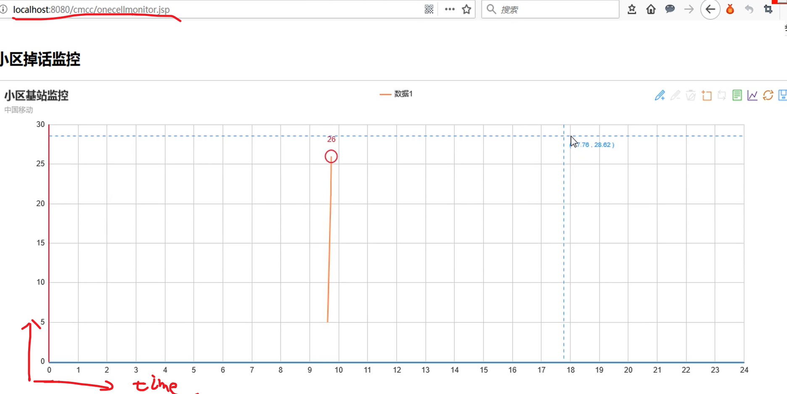
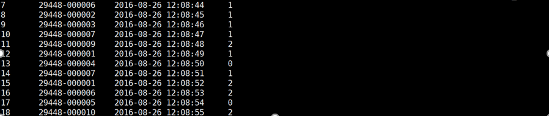
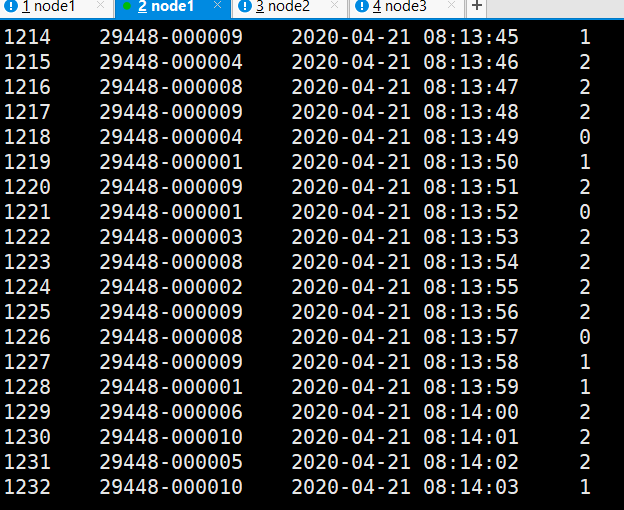
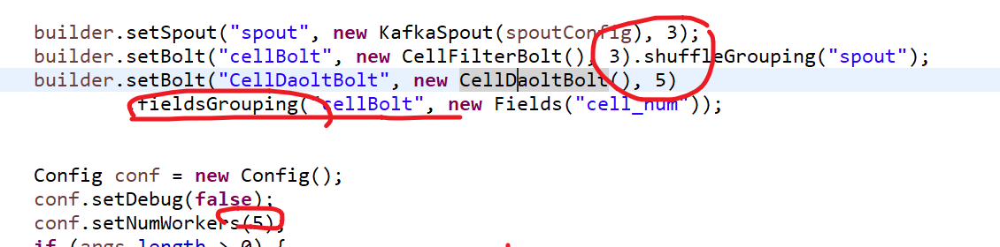
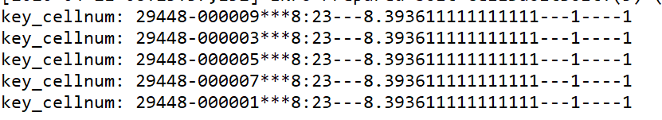
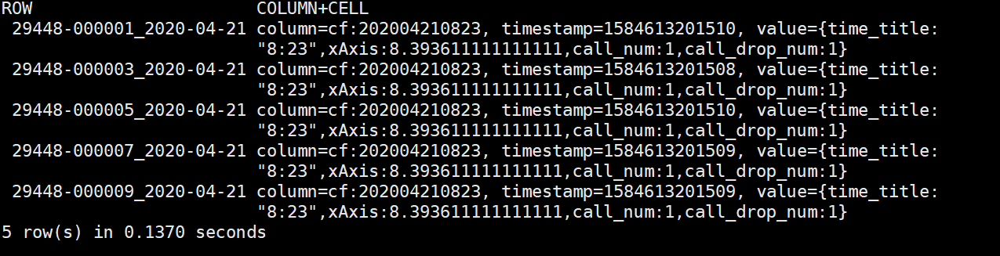
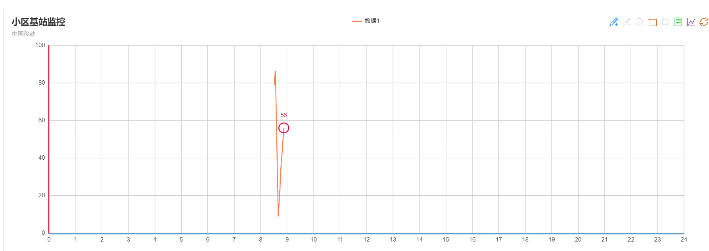
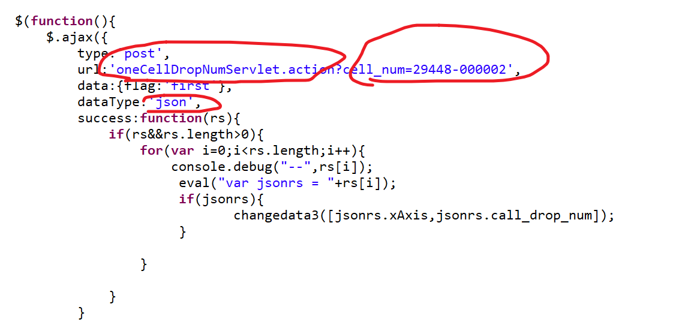

实时统计并绘图 掉话数


# 0 总起

[通信的术语]: /source
[流    程]: /source


## 0.1 需求展示

```
#按区号来显示掉话数
（程序选择显示哪个区）
```



## 0.2 数据

```
#自己模拟造数据
#实时性: 只需要一小部分数据，当前的就行

格式：
ID    区号ID    时间   通话类型
（通话类型 0,1,2 正常，非正常：完全没信号和断断续续）
```




## 0.3 流程


```
#分为两大类：

后端：
从造数据开始，一直实时分析，然后存到hbase中

前端：
从hbase拿数据，然后实时绘制局部刷新的图形网页

#集群的结构：
zk: 1,2,3    （ka 和 （storm单独本地不用写，和Ka在一起才写））
ka: 1,2,3 API写进数据
storm : 本地模拟
habse : 4  （单机，自身搭建了zk,所以要和上面的zk分开）

```


# 1 后

## 1.0 包介绍

#写两个配置类  和 date 

## 1.1  生产到Ka

```
#1，代码分析

写数据（继承了Thread类：构造，和 run）

#成员变量作用 提升作用域

1）构造：(参数：topic) （作用：把变量都赋值了）  
写好Properties配置类，创建producer ，赋topic

--------------------------------

2）run:
// messageStr: 2494 29448-000003 2016-01-05 10:25:17 1

核心：producer.send(new KeyedMessage<Integer, String>(topic, messageStr));

```


## 1.2 启动KA

```
#先启动ZK，然后启动KA集群：
bin/kafka-server-start.sh config/server.properties

#运行写数据程序

#然后测试 消费监控主题（from or not -from-beginning 区别）
bin/kafka-console-consumer.sh --zookeeper node1:2181,node2:2181,node3:2181 --topic mylog_cmcc
```



## 1.3 storm

```
1）读K  kaspout  （KZK，主题，sZK）

2）分析后存到hbase
过滤bolt：  切割后，过滤只要时间（到天就行了），区号，掉话状态
特定bolt:   小区编号字段 分发
	​	把总通话 和掉话 数据分别存到两个map中 （区号：个数）
	​	hbase实现类，，5s批量处理
		{
		 拿到  [12:30 ,,12.5]   (时：分 ，，X坐标 为上限24，整连续下，用double )	
         遍历 区号
				打印查看
				用自己写的habse，完成值插入
		}

#五个进程， 3 3 5 线程
```




## 1.4 hbase

```
#1,搭建单机
```

```
#2，测试
#先启动habse,建表:
	start-hbase
	hbase shell
	create 'cell_monitor_table','cf'

#启动本地storm

#查看hbase表数据
```





--------------

# 2 前

```
#1，步骤
部署到Tomcat,然后启动
properties 搜web probject settings 看到 路径  + 访问页（webRoot ）

localhost:8080/cmcc/onecellmonitor.jsp  
```



```
#2，分析
onecellmonitor.jsp   ： 局部刷新：ajax（可在这修改小区编号）
servlet：反射网页后端，，用gson操作
```




