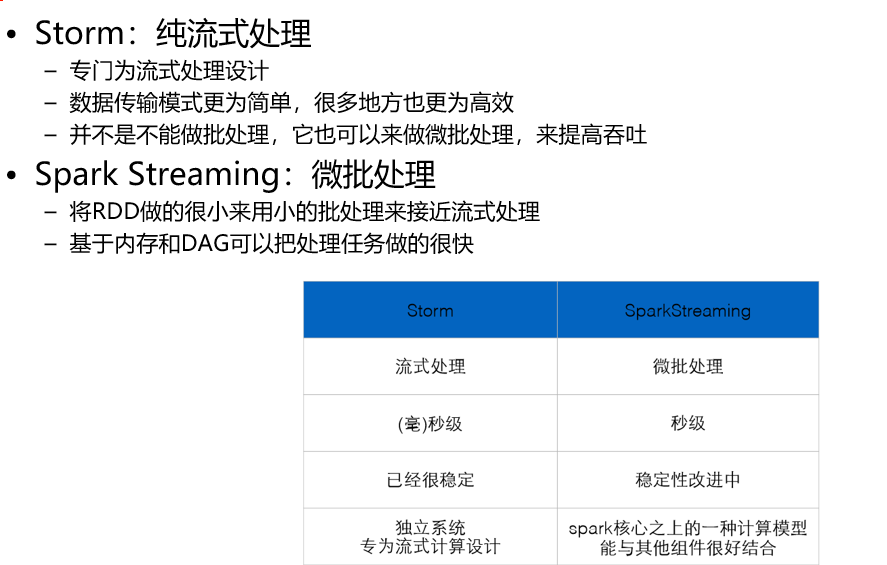
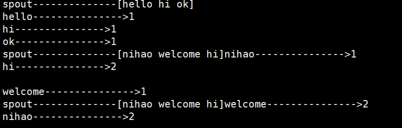
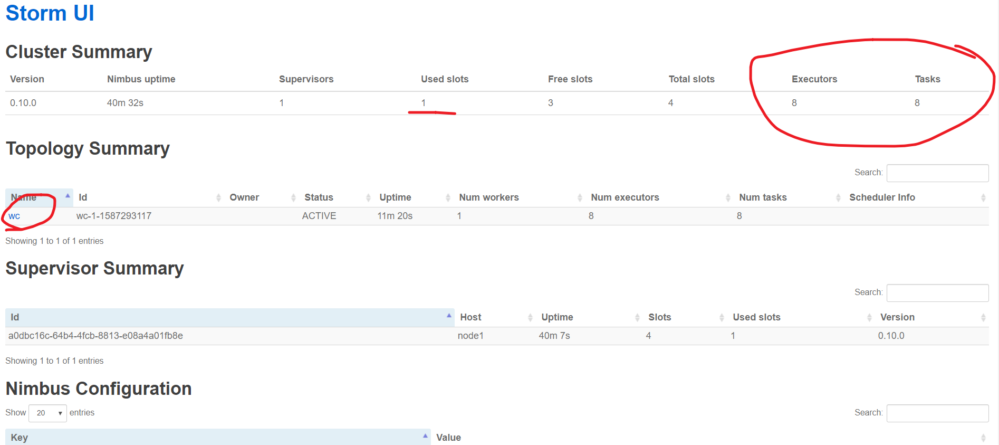
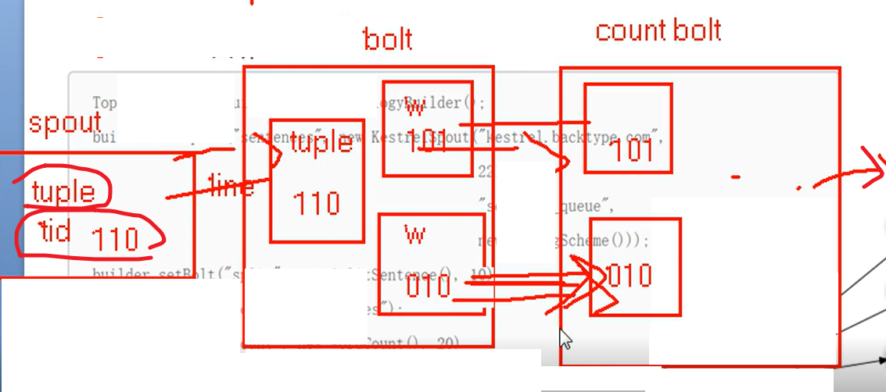
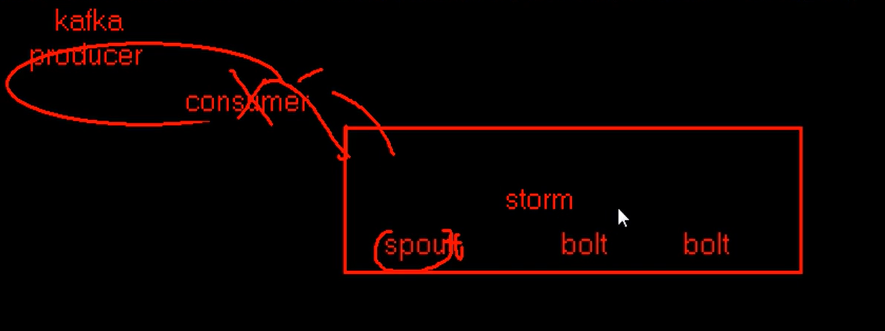
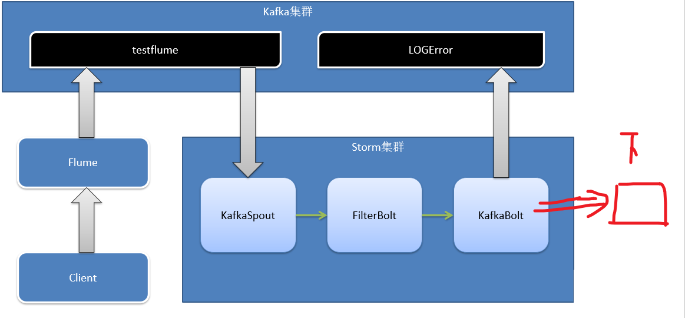

# storm

# 1 介绍

## 1.1 特点

```
Storm是个实时的、分布式以及具备高容错的计算系统

1）实时：
Storm进程常驻内存 
Storm数据不经过磁盘，在内存中处理

#（storm开启后不自动停止,hadoop会停止然后重新再开始）

2）可靠：
异常处理  （节点坏了，工作进程坏了）
消息可靠性保障机制(ACK) （就消息传导的问题）

#可维护： 有webUI可以看到

可以用来做实时数据统计的
```


## 1.2  流式处理

```
#1，基础介绍

1）架构
	#大数据模型一般都是 主从，主做高可用
	#角色，进程

Nimbus: 
	资源调度，任务分配，jar包  （压力低于 job tracker）
Supervisor:从
 	监督进程：布置任务，开启关闭w
Worker ：
	工作进程:具体工作的


#还有ZK

2) 编程模型
DAG （Topology 就是整个job）
Spout ：数据源头
Bolt  ：具体数据处理

3）数据传输 （现在netty）
ZMQ（twitter早期产品）
	ZeroMQ 开源的消息传递框架，并不是一个MessageQueue
Netty
	Netty是基于NIO的网络框架，更加高效。（之所以Storm 0.9版本之后使用Netty，是因为ZMQ的license和Storm的license不兼容。）

```


```
#2，流式处理

1）分类 （异步 与 同步）
#同步异步：都要实时的，快，，就是方向不同而已

异步：
#Cli提交好小数据后，就不管了了
#消息队列：因为消息不会消失，数据一定能被接受
#最后展示：（数据是不断更新的，）
```


```
同步：
#CLi提交数据后，立马返回结果
#Drpc:分布式的，把东西交给集群处理，然后拿到返回结果
```


```
#2，对比  （批，流，微批）
```





# 2 本地例子

#本地得意思是，在win or linux 模拟出


## 2.1 计算模型

```
1）Topology ：DAG有向无环图实现 （类似job）
对于Storm实时计算逻辑的封装
一系列通过数据流相互关联的Spout、Bolt所组成的拓扑结构

#生命周期：此拓扑只要启动就会一直在集群中运行，直到手动将其kill，否则不会终止
（区别于MapReduce当中的Job，MR当中的Job在计算执行完成就会终止）

2）Stream  :数据流
从Spout给Bolt、或上一个Bolt给下一个Bolt，所形成的这些数据通道叫Stream
Stream声明时需给其指定一个Id（默认为Default）
	#实际开发场景中，多使用单一数据流，此时不需要单独指定StreamId

3）Tuple ：元组
Stream中最小数据组成单元
```

```
4）Spout ：数据源
一般会从指定外部的数据源读取元组发送到拓扑中
一个Spout可以发送多个数据流（Stream） 
	#可先通过OutputFieldsDeclarer中的declare方法声明定义的不同数据流，发送数据时通过SpoutOutputCollector中的emit方法指定数据流Id（streamId）参数将数据发送出去
	
Spout中最核心的方法是nextTuple，该方法会被Storm线程不断调用、主动从数据源拉取数据，再通过emit方法将数据生成元组（Tuple）发送给之后的Bolt计算


5）Bolt :数据处理
单： 不能一步就完成，多个串联，，解耦
并： 同时进行速度更快 （类似map，）

一个Bolt可以发送多个数据流（Stream）
	可先通过OutputFieldsDeclarer中的declare方法声明定义的不同数据流，发送数据时通过SpoutOutputCollector中的emit方法指定数据流Id（streamId）参数将数据发送出去

Bolt中最核心的方法是execute方法，该方法负责接收到一个元组（Tuple）数据、真正实现核心的业务逻辑
```


## 2.2 sum例子

```
#1，说明
1+2+3.。。。。。
s(每次变量值+1，然后发送出去)，，b（累加）

```

```
#2，实践
先把storm 173个那个jar 弄成Path 
（#这个的好处，是打成jar包，，不会包括）
每次创建spout 和 bolt类，，找到继承那个Baserich

1）Spout
public class SumSpout extends BaseRichSpout {
	private Map conf;
	private TopologyContext context;
	private SpoutOutputCollector collector;
	int i =0;
	
	@Override
	public void open(Map conf, TopologyContext context, SpoutOutputCollector collector) {
		this.conf = conf;
		this.context=context;
		this.collector = collector;
		
	}

	@Override
	public void nextTuple() {
		//V 继承arraylist，，然后参数是可变参数，
		List tuple = new Values(++i);
		this.collector.emit(tuple);
		System.err.println("i--------------"+i);
		try {
			Thread.sleep(1000);
		} catch (InterruptedException e) {
			e.printStackTrace();
		}

	}


	@Override
	public void declareOutputFields(OutputFieldsDeclarer declarer) {
		//F  可变参数，，发的参数声明，一一对应
		declarer.declare(new Fields("i"));;

	}

}

2）
public class SumBolt extends BaseRichBolt {
	private Map conf;
	private TopologyContext context;
	private OutputCollector collector;
	private int sum = 0;
	
	@Override
	public void prepare(Map conf, TopologyContext context, OutputCollector collector) {
		this.conf = conf;
		this.context=context;
		this.collector = collector;

	}

	@Override
	public void execute(Tuple input) {
		
		//获取数据
		int i =input.getIntegerByField("i");
		sum  += i ;
		System.out.println("sum--------------"+sum);
			
	}

	@Override
	public void declareOutputFields(OutputFieldsDeclarer declarer) {
		// TODO Auto-generated method stub

	}

}

3）主
public class Test {

	public static void main(String[] args) {
		TopologyBuilder tb =new TopologyBuilder();
		tb.setSpout("sumspout", new SumSpout());
		tb.setBolt("sumbolt", new SumBolt()).shuffleGrouping("sumspout");
		
		//本地集群
		LocalCluster lc = new LocalCluster();
		lc.submitTopology("sum", new Config(), tb.createTopology());
	}
}

```


```
#3，总结
1）主
主类把所有拓扑都弄上，然后设置本地运行。
#要注意，下游要写上分发策略

2）Spout:
open： 初始化
nextTuple:封装可变参数发送数据  ,当你开启拓扑后，就一直循环运行着
declareOutputFields :和发送的数据，相对应。用来给下文识别的

3）Bout:
prepare : 初始化
execute ： 核心处理数据，，要通过上文的声明来取数据，也是一直循环
	#若还有下文，则还要发数据
declareOutputFields：
```


## 2.3 WC例子

```
#1，说明
行 -- > 单词 ---> map计数
```


```
#2，实践
#一个 spout  两个 bolt

1）spout

public class WCSpout extends BaseRichSpout {
	private SpoutOutputCollector collector;
	String[] text ={
			"nihao welcome hi",
			"hello hi ok",
			"nihao jx hello"
	};
	Random r = new Random();

	@Override
	public void open(Map conf, TopologyContext context, SpoutOutputCollector collector) {
		this.collector = collector;
		
	}
	@Override
	public void nextTuple() {
		//V 继承arraylist，，然后参数是可变参数，
		List line = new Values(text[r.nextInt(text.length)]);
		this.collector.emit(line);
		System.err.println("spout--------------"+line);
		Utils.sleep(1000);

	}

	@Override
	public void declareOutputFields(OutputFieldsDeclarer declarer) {
		//F  可变参数，，发的参数声明，一一对应
		declarer.declare(new Fields("line"));

	}

}

2）
public class WCSplitBolt extends BaseRichBolt {

	private OutputCollector collector;
	private int sum = 0;
	
	@Override
	public void prepare(Map conf, TopologyContext context, OutputCollector collector) {
		this.collector = collector;
	}
	@Override
	public void execute(Tuple input) {
		
		//获取数据, 处理数据，发送数据
		String line = input.getString(0);
		String[] ws = line.split(" ");
		for (String w : ws) {
			this.collector.emit( new Values(w) );
		}		
	}
	@Override
	public void declareOutputFields(OutputFieldsDeclarer declarer) {
		declarer.declare(new Fields("w"));
	}
}

3）
public class WCBolt extends BaseRichBolt {

	Map<String, Integer> map = new HashMap();
	@Override
	public void prepare(Map conf, TopologyContext context, OutputCollector collector) {

	}
	@Override
	public void execute(Tuple input) {
		String w = input.getStringByField("w");
		map.put(w, map.containsKey(w) ? map.get(w)+1 : 1 );
		System.out.println(w+"--------------->"+map.get(w));
		
	}
	@Override
	public void declareOutputFields(OutputFieldsDeclarer declarer) {

	}
}
```


### 1）单线程

```
#还是以前的分发策略（轮训） 就行，反正单线程

public class Test {
	public static void main(String[] args) {
		TopologyBuilder tb =new TopologyBuilder();
		tb.setSpout("wcspout", new WCSpout());
		tb.setBolt("wcsplitbolt", new WCSplitBolt()).shuffleGrouping("wcspout");
		tb.setBolt("wcbolt", new WCBolt()).shuffleGrouping("wcsplitbolt");
		
		//本地集群
		LocalCluster lc = new LocalCluster();
		lc.submitTopology("wc", new Config(), tb.createTopology());
	}
}
```


### 2）多线程

```
当两个bolt都并行时候，还用轮训可能最后单词不再一起，

#中间并行：没有问题
#下面并行：同一个单词没法汇聚一起
要不只能再加一个，把单词聚合起来 （MR，规定了所有K只能一个R）
或者，改变最后一个的分发策略，，用filed区别
（这样就同一个W，只到一个bolt）

tb.setBolt("wcsplitbolt", new WCSplitBolt(),3).shuffleGrouping("wcspout");
tb.setBolt("wcbolt", new WCBolt(),3).fieldsGrouping("wcsplitbolt", new Fields("w"));
```


```
#3，总结
1) 主：
多线程，，set有个重载  规定线程数并行
有不同的分发策略

2）spout:
随机生成数据方式
storm自己休眠的utils

3）bolt:
又可以收数据，又可以发数据
获得值：要不通过名字，要不就下标
三元操作符：逻辑操作map输出结果

```

## 2.4 分发(获取)策略

#分发策略是后者定义的，如何去获取前者数据的方式（可以想成是前者如何发）

```
#1，介绍
1）Shuffle Grouping 
随机分组，随机派发stream里面的tuple，保证每个bolt task接收到的tuple数目大致相同。
轮询，平均分配 

2）Fields Grouping
按字段分组，比如，按"user-id"这个字段来分组，那么具有同样"user-id"的 tuple 会被分到相同的Bolt里的一个task， 而不同的"user-id"则可能会被分配到不同的task。 

3）All Grouping
广播发送，对于每一个tuple，所有的bolts都会收到 

4）Global Grouping
全局分组，把tuple分配给task id最低的task 。

5） None Grouping （和Shuffle grouping效果一样）
不分组，这个分组的意思是说stream不关心到底怎样分组。目前这种分组和Shuffle grouping是一样的效果。 有一点不同的是storm会把使用none grouping的这个bolt放到这个bolt的订阅者同一个线程里面去执行（未来Storm如果可能的话会这样设计）。 

6） Direct Grouping 
指向型分组， 这是一种比较特别的分组方法，用这种分组意味着消息（tuple）的发送者指定由消息接收者的哪个task处理这个消息。只有被声明为 Direct Stream 的消息流可以声明这种分组方法。而且这种消息tuple必须使用 emitDirect 方法来发射。消息处理者可以通过 TopologyContext 来获取处理它的消息的task的id (OutputCollector.emit方法也会返回task的id)  

7） Local or shuffle grouping
本地或随机分组。如果目标bolt有一个或者多个task与源bolt的task在同一个工作进程中，tuple将会被随机发送给这些同进程中的tasks。否则，和普通的Shuffle Grouping行为一致

8） customGrouping
自定义，相当于mapreduce那里自己去实现一个partition一样。

```


```
#2, 实践

1） spout
一个默认流发两个东西，，读文件流，是有新的一行，就发一行

public class MySpout implements IRichSpout {

	private static final long serialVersionUID = 1L;

	FileInputStream fis;
	InputStreamReader isr;
	BufferedReader br;

	SpoutOutputCollector collector = null;
	String str = null;

	@Override
	public void nextTuple() {
		try {
			while ((str = this.br.readLine()) != null) {
				// 过滤动作
				collector.emit(new Values(str, str.split("\t")[1]));
			}
		} catch (Exception e) {
		}

	}

	@Override
	public void close() {
		try {
			br.close();
			isr.close();
			fis.close();
		} catch (Exception e) {
			e.printStackTrace();
		}
	}

	@Override
	public void open(Map conf, TopologyContext context, SpoutOutputCollector collector) {
		try {
			this.collector = collector;
			this.fis = new FileInputStream("track.log");
			this.isr = new InputStreamReader(fis, "UTF-8");
			this.br = new BufferedReader(isr);
		} catch (Exception e) {
			e.printStackTrace();
		}
	}

	@Override
	public void declareOutputFields(OutputFieldsDeclarer declarer) {
		declarer.declare(new Fields("log", "session_id"));
	}

	@Override
	public Map<String, Object> getComponentConfiguration() {
		return null;
	}

	@Override
	public void ack(Object msgId) {
		System.out.println("spout ack:" + msgId.toString());
	}

	@Override
	public void activate() {
	}

	@Override
	public void deactivate() {
	}

	@Override
	public void fail(Object msgId) {
		System.out.println("spout fail:" + msgId.toString());
	}

}

2）bolt

@Override
	public void execute(Tuple input) {
		try {
			valueString = input.getStringByField("log");

			if (valueString != null) {
				num++;
				System.err.println(input.getSourceStreamId() + " " + Thread.currentThread().getName() + "--id="
						+ Thread.currentThread().getId() + "   lines  :" + num + "   session_id:"
						+ valueString.split("\t")[1]);
			}
			collector.ack(input);
			// Thread.sleep(2000);
		} catch (Exception e) {
			collector.fail(input);
			e.printStackTrace();
		}

	}

	@Override
	public void prepare(Map stormConf, TopologyContext context, OutputCollector collector) {
		this.collector = collector;
	}

	@Override
	public void declareOutputFields(OutputFieldsDeclarer declarer) {
		declarer.declare(new Fields(""));
	}

```

```
3) 测试
数据：www.taobao.com	XXYH6YCGFJYERTT834R52FDXV9U34	2017-02-21 12:40:49

		builder.setSpout("spout", new MySpout(), 1);

// shuffleGrouping其实就是随机轮训发 做到了负载均衡
//		builder.setBolt("bolt", new MyBolt(), 2).shuffleGrouping("spout");
#平分数据，在文件加一行数据，接着输出一行

------------------------------

// fieldsGrouping其实就是MapReduce里面理解的Shuffle,根据fields的hash
//		builder.setBolt("bolt", new MyBolt(), 2).fieldsGrouping("spout", new Fields("session_id"));
#按照属性来分：处理数据数量可能不一样

------------------------------

// 只往里面taskId小的那个里面去发
//		builder.setBolt("bolt", new MyBolt(), 2).globalGrouping("spout");

------------------------------

// 等于shuffleGrouping
//		builder.setBolt("bolt", new MyBolt(), 2).noneGrouping("spout");

------------------------------

// 广播
		builder.setBolt("bolt", new MyBolt(), 2).allGrouping("spout");
```


# 3 架构搭建

## 3.1 架构


```
#1，架构设计
#降低主从耦合性：淡化主的作用 

进线程理解： W 进程 ->ex线程->task线程  （ex在并行时，是多个）

worker是任务进程（进程是申请资源） （像一个s节点，可以有多个w，就是多个Job） （默认4个）
ex是具体实施线程（一个ex一般是，除非设置只一个task任务，但是可以有多个ex，即多个task线程）

对比：（比rs任务重）
```


```
#2，任务流程

#注意指向箭头是主动
#JAVA对象传导，要序列化（解决版本不兼容啥的问题）

ZK交接权利了（任务调度，监控信息）
taskid:32 加横线 36位

总起：
n 把任务都给 ZK了
s只负责启动关闭，，具体任务要w自己看
```


```
#3，目录树结构
```

[storm 和 zk 的目录树 ]: \source


-----------------

## 3.2 伪分布式

```
#1，步骤
1）有java，Python
java -version
python -V

2）解压
tar xf
#伪分布式：没必要改配置，ZK也不用配置（和HBASE的伪分布式一样，自带）
配置环境变量

3）创建日志目录
重定向，日志信息输出
mkdir logs

3）启动
#2>&1  &    把错误标准输出到1，，后台
#storm 直接回车，能看到所有命令

storm dev-zookeeper >> ./logs/zk.out 2>&1 &
storm nimbus >> ./logs/nimbus.out 2>&1 &
storm supervisor >> ./logs/supervisor.out 2>&1 &
storm ui >> ./logs/ui.out 2>&1 &

#storm logviewer >> ./logs/logviewer.out 2>&1 & （浏览器看运行日志）

（启动缓慢  config–>XX，，）
（#能全部config变了，然后ss -nal 端口有8080，标识全部启动完毕）

4) WEB
worker当做任务数，EX 和 T 默认1比1，，像并行，就多个EX就行，T自然也多个了
```


```
#2,实践
1）API 修改
主类中用if 选择模式
Config conf = new Config();
		if (args.length > 0) {
			try {
				StormSubmitter.submitTopology(args[0], conf, tb.createTopology());
			} catch (AlreadyAliveException e) {
				e.printStackTrace();
			} catch (InvalidTopologyException e) {
				e.printStackTrace();
			}
		} else {
		//本地集群
		LocalCluster lc = new LocalCluster();
		lc.submitTopology("wc", conf, tb.createTopology());
		}

#本地模式：指模拟出storm，用不到自己搭建的集群
#用到哪个打哪个

2）提交到集群
storm help jar
#伪分布集群 任务会自动提交到，…/storm-local/nibus/inbox
```




```
#本地跑：storm jar wc.jar  count.Test
集群跑 ：storm jar wc.jar  count.Test wc    （加参数：任务名字） （这样，目录下才有Jar）

--进程，，和线程数量： 
一个supervisor一个JOB一个进程，  然后1+3+3线程 ，多了一个是因为有个ACK

--查看acker： 直接看，或者可视化（注意箭头，和 粗细）
```




```
--acker: 介绍  
消息完整性保障：任何一个环节有问题：bolt 给ACK：然后丢给SPOUT重来（保证最后数据一定能收到）

​	#容缺机制：第一个问题，错了，原始数据全部重来，能保证一定被处理，但是不能保证处理几次。。
	？？个人认为，你给每次轮回的数据加个标签，只要处理出错的不就好了
​	#大部分不用，，除非要精确的，像只要宏观数据的
​	#本身是个监控线程，占内存
​	#在调用的时候，每次都要向spout要不ack确认收到数据删缓存，要不fail,重发数据
```

```
3）结束
停止任务 storm kill wc -w 1  (秒，，，slots 和其他的又恢复了，)
关闭storm  : killall java
```


## 3.3 全分布式

#和伪分布式最大区别：配置文件，和 ZK

```
#1，安装
         Nimbus    Supervisor   Zookeeper
node1      1                       1
node2                 1            1
node3                 1            1

1）都安装好Zk
启动ZK（启动自己配置的ZK），看模式是否正确
#拿hadoop那个笔记里面的配置
#scp  要root分发

2）
node1作为nimbus，
开始配置
$ vim conf/storm.yaml
storm.zookeeper.servers:
  - "node1"
  - "node2"
  - "node3"
storm.local.dir: "/tmp/storm"
（XXXX/inbox/  配置前面的路径）

nimbus.host: "node1"

supervisor.slots.ports:
    - 6700
    - 6701
    - 6702
    - 6703

在storm目录中创建logs目录 （删掉之前的）
$ mkdir logs

（分发）集群其他服务器 ，配置其他的环境变量

3）启动 (ZK已经启动)
node1：
storm nimbus >> ./logs/nimbus.out 2>&1 &
storm ui >> ./logs/ui.out 2>&1 &

node2,3:
storm supervisor >> ./logs/supervisor.out 2>&1 &

node1:8080
```


```
#2, 测试
测试从节点提交任务看看 ：
能提交成功   (jar 放到了之前设定的路径，，同时只出现主节点上)
#谁都能提交，但是处理只能主
```


```
#只用了一个槽位, 8个ex  8个task
（就一个从节点运行，同时就启动了一个job进程，，1+3+3+1个 线程，）
（一个进程处理一个任务，，一个线程处理一个task组件）

#8个线程端口都一样，，（同一个槽位任务）
```


## 3.4 并发机制

```
#1，总起
在核心过程中，
是一个worker进程处理一个任务，然后所有组件都是线程，默认一个线程处理一个组件（可能会一对多，但必须是同种任务）


现在为了并发：
一个任务，多个worker进程，然后线程也是双份，一个线程也就处理一个组件

#都是在一个从节点上，完成了数据流的整个处理，原来只是才有单进程多线程，处理的，
现在可以在一个或多个节点上，开启多个进程，多个线程处理
```


```
#2，
1）介绍
```


```
2）设置
设置Worker进程数
Config.setNumWorkers(int workers)

设置Executor线程数
TopologyBuilder.setSpout(String id, IRichSpout spout, Number parallelism_hint)
TopologyBuilder.setBolt(String id, IRichBolt bolt, Number parallelism_hint)
：其中， parallelism_hint即为executor线程数

设置Task数量
ComponentConfigurationDeclarer.setNumTasks(Number val)

例：
Config conf = new Config() ;
conf.setNumWorkers(2);

TopologyBuilder topologyBuilder = new TopologyBuilder();
topologyBuilder.setSpout("spout", new MySpout(), 1);
topologyBuilder.setBolt("green-bolt", new GreenBolt(), 2)
               .setNumTasks(4)
               .shuffleGrouping("blue-spout);


注意：
进程 和 线程  写的是总的，每个要自己平分的，
task 是指总的的task数，要自己平分，然后指一个线程处理多少个任务  （默认是1个）
```


```
#3，Rebalance – 再平衡
#动态调整Topology拓扑的Worker进程数量、以及Executor线程数量  （task设定好了就不能改了）

#支持两种调整方式：
	通过Storm UI
	通过Storm CLI

#两个节点
假设以前：
2 10 12  (一个节点 ，一个ack，2,1,1 个线程)
	   EX  task
spout ：4  4
bolt1 : 2  2
bolt2 : 2  4

```

```
现在
storm rebalance wc  -w 2   -n 4  -e bolt2=4 

4 12 12  (一个节点一个ack（还是两个节点），， 然后都是一个线程一个任务)
	   EX  task
spout ：4  4
bolt1 : 2  2
bolt2 : 4  4

#之前是一个进程要跑多个线程，现在跑的进程都跑一个线程，跑的线程也只跑一个组件
#task只能提前设定好，不能修改，所以可以提前设置大了

#下面是实际结构，，考虑时，还是可以用逻辑，操作没变
```


## 3.5 容错机制

```
#1，容错机制：
1）总体分类
```


```
2）就介绍宕机 （因为架构设计的好处，所以虽然有错误，但影响总体不会变大）

#ni：
	对现在的情况不会有重大影响， 权利都交给了ZK，（从和主同时挂了才有影响：在从节点有问题后，ZK会拿到信息，但是要汇报给nimbus，ni要重新分配，这时候Ni有影响。）（新的任务传不进来了，）
	
	自己启动自毁，然后重新启动，
（现在这种单节点还可以，但是1.X 还是推出了高可用）

#zk: 
	自身不会出啥问题 （对内快速选举）

#s:
	ZK收到问题，ZK知道该S的任务，然后重新找个

#worker:
	S发现worker进程问题，尝试重试跑起来，ZK也看着WOrker，实在不行，在找别的
```


------


```
#2，消息完整性
1）介绍
#怎么知道哪里出了问题？
16位二进制数，XOR，，，完整传导运算后是0  （假如没收到，就是与000…做异或，也就是本身）

#知道错了然后呢？
然后spout看TID，，有问题，就在推一边数据  fail方法

#问题：能至少收到一次，但被重复，，storm本身大部分用在宏观上，错误可接受。
```



```
3）代码
#spout:
	除了发输出值，还要MID ,   (spout没设置，不弄这个操作)   成功ack,失败fail （在spout自己重写）
#bolt:
	发锚点（收到的数据：还有老的ID） 和 处理的数据  
	a=collector.ack(锚点) ，，异常就执行fail（锚点）
```


## 3.6 事务

```
#1，介绍
完善消息保障机制，重发数据后，反复处理的问题

核心思想就是：tuple配个tranID,,一起存到最后数据库中，只要没有ID时，库才存。
（配合ACK，（保证消息（tuple） 被 且 仅被处理一次））
```


```
#2，实现

1）Design 1
#按ID顺序来tuple操作一个

缺点 ： 存的时候，要反复IO，同时 整个过程中，只能TUPLE只能一个一个来
```


```
2）Design 2
#顺序一次操作一个BATCH （里面并行）

缺点： 整个过程中只能一次一个Batch，其他进程不用的时候浪费了资源
```


```
3）Design 3

#上面两个都是没处理完，不能处理下一次数据
#这个是可以多个数据一起并行，但是最后要停在最后一个Bolt

因为三种都是要按顺序存
```


```
#3，
管理状态 （tranID  和 元信息：批次的大小 和下表索引  ）
```


# 4 DRPC

#也就是用于同步，，之前都是异步

## 4.1 介绍

```
DRPC (Distributed RPC ： remote procedure call ）
#分布式远程过程调用
就是和rmi 很像，给服务器数据，服务器提供计算服务，然后返回结果

DRPC Server 负责接收 RPC 请求，并将该请求发送到 Storm中运行的 Topology，等待接收 Topology 发送的处理结果，并将该结果返回给发送请求的客户端。

```


#arg 决定了集群提供啥服务，，不同topology分别有个容器，里面是该top的处理流程

## 4.2 自动 手动

```
输入：ID。请求服务名称。data
输出：ID，result

现在的问题是：能够实现了一个topo的多个处理流程，？？？？？？？？？？？？？？
但是怎么操作drpc，，多种服务？？ （是一个任务中用方法加多种服务，，还是创建多个任务完成多种服务）
```


```
#1，自动（用框架）

1）代码
public class BasicDRPCTopology {
	public static class ExclaimBolt extends BaseBasicBolt {
		@Override
		public void execute(Tuple tuple, BasicOutputCollector collector) {
			String input = tuple.getString(1);
			collector.emit(new Values(tuple.getValue(0), input + "!"));
		}

		@Override
		public void declareOutputFields(OutputFieldsDeclarer declarer) {
			declarer.declare(new Fields("id", "result"));
		}

	}
	
---------------------------------------------------------------------

	public static void main(String[] args) throws Exception {
//1		LinearDRPCTopologyBuilder builder = new LinearDRPCTopologyBuilder("exclamation");
	
//2 	builder.addBolt(new ExclaimBolt(), 3);

		Config conf = new Config();

//3
		if (args == null || args.length == 0) {
			LocalDRPC drpc = new LocalDRPC();
			LocalCluster cluster = new LocalCluster();

			cluster.submitTopology("drpc-demo", conf, builder.createLocalTopology(drpc));

			for (String word : new String[] { "hello", "goodbye" }) {
				System.err.println("Result for \"" + word + "\": " + drpc.execute("exclamation", word));
			}

			cluster.shutdown();
			drpc.shutdown();
		} else {
			conf.setNumWorkers(3);
			StormSubmitter.submitTopologyWithProgressBar(args[0], conf, builder.createRemoteTopology());
			

		}
	}
}
```


```
2）解析
#实现前后，，只关注中间

main函数中:
//1   线性拓扑：创建服务名称 给线性的_function 属性
//2   看addBolt  : （原来是set,容器才是add,而且没有spout，因此要具体看）
	#最终是把处理bolt的流程丢到容器里去，，将来用的时候，遍历
    add重载方法：
	先传给BasicBoltExecutor 的_bolt属性
	然后_components.add(bolt)  给线性的属性（如果处理步骤有多个bolt，为了能按顺序操作）
	
//3，
	A) 本地
	--多了个本地drpc，，提交的时候，丢进了drpc
	--createLocalTopology->createTopology (DRPCSpout(_function,drpc))	
		#spout: nexttuple: emit(Values(args,returninfo),,,messgid 信息完整性保证用的)
	create:  核心
		spout和bolt（有随机ID）  （前）
		遍历容器：添加bolt       （中）
		设置聚合Bolt和结果bolt:  （后）
 
	--调用：args 和 info	
```


```
#2，手动
1）代码
public class ManualDRPC {
	public static class ExclamationBolt extends BaseBasicBolt {

		@Override
		public void declareOutputFields(OutputFieldsDeclarer declarer) {
			declarer.declare(new Fields("result", "return-info"));
		}
		@Override
		public void execute(Tuple tuple, BasicOutputCollector collector) {
			String arg = tuple.getString(0);
			Object retInfo = tuple.getValue(1);
			collector.emit(new Values(arg + "!!!", retInfo));
		}

	}

	public static void main(String[] args) {
		TopologyBuilder builder = new TopologyBuilder();
		LocalDRPC drpc = new LocalDRPC();

		DRPCSpout spout = new DRPCSpout("exclamation", drpc);
		builder.setSpout("drpc", spout);
		builder.setBolt("exclaim", new ExclamationBolt(), 3).shuffleGrouping("drpc");
		builder.setBolt("return", new ReturnResults(), 3).shuffleGrouping("exclaim");

		LocalCluster cluster = new LocalCluster();
		Config conf = new Config();
		cluster.submitTopology("exclaim", conf, builder.createTopology());

		System.err.println(drpc.execute("exclamation", "aaa"));
		System.err.println(drpc.execute("exclamation", "bbb"));

	}
}

2）分析
就是没有用那个drpcBuilder，，自己添加到tb
```


## 4.3 本地 集群

#上面都是本地

```
集群：

#1，搭建好storm的 drpc服务
修改配置，，提供服务一台就行，，然后分发
drpc.servers:
	-"node1"

启动集群：
ZK
主：nibb  drpc  ui
从：sup
把就打成一个JAR

开始任务。
#这个任务会一直启动，，等着客户端传输数据
```


```
#2，实践
（CS架构，在JAVA中连接）
连接上drpc服务器，，然后选择服务，传输数据
public class MyDRPCclient {

	public static void main(String[] args) {
		

		DRPCClient client = new DRPCClient("node1", 3772);
		
		try {
			String result = client.execute("exclamation", "11,22");
			
			System.out.println(result);
		} catch (TException e) {
			e.printStackTrace();
		} catch (DRPCExecutionException e) {
			e.printStackTrace();
		} 
	}
}
```


# 5 kafka

## 5.1 kafka介绍

[官网]: https://kafka.apache.org/
[文档]: /source

```
#1，介绍

1）概念：
Kafka是一个分布式的消息队列系统(Message Queue)
	分布：处理快速，同时横向扩展
	消息队列：可靠性


2）组件：
#集群由ZK维护

多个Broker服务器组成，
每个消息都要在topic内。 （一个topic可以有一个或多个分区）
同一topic内部的消息按照一定的key和算法  被分区存储在不同的Broker上。（分区logs记录着分布）


Kafka只保证一个分区内的消息有序，不能保证一个主题的不同分区之间的消息有序。
(想要保证所有的消息都绝对有序可以只为一个主题分配一个分区)
分区上，又有该主题的唯一ID偏移量 (不管有没有被消费，ka都保留记录：为了能有不同消费者，同时消费记录不会冲突，接着消费)
```


```
3）生产消费者：
#必须要写上topic
```

--------------------------------------

#主要关注搭建和使用

```
#2，搭建 
1）安装
解压，
修改配置文件 server.properties
（自己的编号，，和 ZK:2181）
分发，然后修改编号
sed -i -e 's/broker.id=.*/broker.id=XX/' /opt/sxt/kaf*/config/server.properties

2）启动
A、启动Zookeeper集群。
B、启动Kafka集群。
分别在三台服务器上执行以下命令启动：
bin/kafka-server-start.sh config/server.properties

3) 关闭
直接杀死 或者 ctrl+c ：（慢是因为需要时间把消息同步下）
```


```
#3，测试
#开个标签页
1）要topic：  
#创建
bin/kafka-topics.sh --zookeeper node1:2181,node2:2181,node3:2181 --create --replication-factor 2 --partitions 3 --topic test

(--replication-factor：指定每个分区的复制因子个数，默认1个
--partitions：指定当前创建的kafka分区数量，默认为1个
--topic：指定新建topic的名称）
)
#查看list
bin/kafka-topics.sh --zookeeper node1:2181,node2:2181,node3:2181 --list

#查看描述
bin/kafka-topics.sh --zookeeper node1:2181,node2:2181,node3:2181 --describe --topic test
```


```
2）生产数据  ：阻塞，，输入数据   （生产是告诉broker信息）
bin/kafka-console-producer.sh --broker-list node1:9092,node2:9092,node3:9092 --topic test

3）消费数据：
再开个标签页：拿数据，无序，但分区内有序 （之前屯了数据）
已经启动好了，再发，再拿数据就是有序的，
bin/kafka-console-consumer.sh --zookeeper node1:2181,node2:2181,node3:2181 --from-beginning --topic test


结果分析：
当你第一次生产时：
	生产数据是每个分区轮训存，
	拿数据是拿完一个分区的（有序），再拿其他的（整体无序）
接着生产时：
	生一个拿一个，有序
	
#当你再开一个标签页时：（数据被消费了，还是被保留，让其他消费者来）
	如果还是从头，从头把数据都消费了（之前存的所有数据）
	如果不是，则是等待新的数据到来（现在没数据）
```


## 5.2 storm

```
#1，架构
#spout直接变成了消费者
#storm 提供了支持。
```



```
#2，使用 （既可以生产也可以消费，一般消费）

#主题和节点啥的 要知道 （消费者知道 zk,生产者知道ka）
#storm把之前的topology 中spout（收），bolt（发）改成对应的kaf的类。


#storm看中，数据量一次一次的，，数据不会丢失
```


#ka上游还有数据，推送，因此引出flume

## 5.3 flume

```
#1，架构
flume: 作为生产者 
flume  支持KAFA
```

```
#2，使用
（去官网 kafka sink：）
ka节点（因为是生产者）
ack：0不管,1主节点，-1全部同步 确认
```


## 5.4 f->k->s

#本案例用来过滤：字符ERROR，输出回kalka，一般是直接下一步

(kafka 和 storm 都要ZK)



### 1）配置f

```
#1，安装
#flume: 一个节点就行，
解压
修改配置
flume-env.sh.template 文件改为flume-env.sh
flume-env.sh 文件中的export_java ,变为 export JAVA_HOME=/usr/java/jdk1.7.0_67

```

```
#2，部署：（写那个启动的配置文件）
1）kf.conf
a1.sources = r1
a1.sinks = k1
a1.channels = c1

# Describe/configure the source
a1.sources.r1.type = avro
a1.sources.r1.bind = node1
a1.sources.r1.port = 41414

# Describe the sink
a1.sinks.k1.type = org.apache.flume.sink.kafka.KafkaSink
a1.sinks.k1.topic = testflume
a1.sinks.k1.brokerList = node1:9092,node2:9092,node3:9092
a1.sinks.k1.requiredAcks = 1
a1.sinks.k1.batchSize = 20

# Use a channel which buffers events in memory
a1.channels.c1.type = memory
a1.channels.c1.capacity = 1000000
a1.channels.c1.transactionCapacity = 10000

# Bind the source and sink to the channel
a1.sources.r1.channels = c1
a1.sinks.k1.channel = c1
```

```
2）解析
source:是自己开启端口，等连接
sink: 是生产者找到KA集群
```

#先等kafa启动

### 2）data->f->k

```
#1，操作

#先启动ZK,然后启动KA。
#然后一个新node1启动flume:
bin/flume-ng agent  -n a1 -c conf -f conf/fk.conf  -Dflume.root.logger=INFO,console
```

```
#2,测试

1）KA
#没有主题，也能消费，卡在那里了  :又一个新node1
bin/kafka-console-consumer.sh --zookeeper node1:2181,node2:2181,node3:2181 --from-beginning --topic testflume

----------------------------

2）用API 操作flume
#avro是flume之间传输用的
#自己写连接flume服务器
#代码：
public class RpcClientDemo {
	
	public static void main(String[] args) {
		MyRpcClientFacade client = new MyRpcClientFacade();
		client.init("node1", 41414);
		for (int i = 10; i < 20; i++) {
			String sampleData = "Hello Flume!ERROR" + i;
			client.sendDataToFlume(sampleData);
			System.out.println("发送数据：" + sampleData);
		}

		client.cleanUp();
	}
}

class MyRpcClientFacade {
	private RpcClient client;
	private String hostname;
	private int port;

	public void init(String hostname, int port) {
		this.hostname = hostname;
		this.port = port;
		this.client = RpcClientFactory.getDefaultInstance(hostname, port);
	}

	public void sendDataToFlume(String data) {
		Event event = EventBuilder.withBody(data, Charset.forName("UTF-8"));
		try {
			client.append(event);
		} catch (EventDeliveryException e) {		
			client.close();
			client = null;
			client = RpcClientFactory.getDefaultInstance(hostname, port);
		}
	}
	public void cleanUp() {
		client.close();
	}
}

3）结果
然后KA有数据变化，，（帮你弄好了主题）
```


#现在数据在kafka中，开始后面storm消费

### 3）k->s->k

#1,  代码

```
0）,处理逻辑
public class LogFilterTopology {
	public static class FilterBolt extends BaseBasicBolt {
		@Override
		public void execute(Tuple tuple, BasicOutputCollector collector) {
			String line = tuple.getString(0);
			System.err.println("Accept:  " + line);
			// 包含ERROR的行留下
			if (line.contains("ERROR")) {
				System.err.println("Filter:  " + line);
				collector.emit(new Values(line));
			}
		}

		@Override
		public void declareOutputFields(OutputFieldsDeclarer declarer) {
			// 定义message提供给后面FieldNameBasedTupleToKafkaMapper使用
			declarer.declare(new Fields("message"));
		}
	}
```

```
1），k->s
public static void main(String[] args) throws Exception {
		TopologyBuilder builder = new TopologyBuilder();

		String topic = "testflume";
		ZkHosts zkHosts = new ZkHosts("node1:2181,node2:2181,node3:2181");
		// /MyKafka，偏移量offset的根目录，记录队列取到了哪里
		SpoutConfig spoutConfig = new SpoutConfig(zkHosts, topic, "/MyKafka", "MyTrack");
		
//上面的ZK是kafa的，这个ZK是storm的
		List<String> zkServers = new ArrayList<String>();
		System.out.println(zkHosts.brokerZkStr);
		for (String host : zkHosts.brokerZkStr.split(",")) {
			zkServers.add(host.split(":")[0]);
		}

		spoutConfig.zkServers = zkServers;
		spoutConfig.zkPort = 2181;
		// 是否从头开始消费
		spoutConfig.forceFromStart = true;
		spoutConfig.socketTimeoutMs = 60 * 1000;
		// StringScheme将字节流转解码成某种编码的字符串
		spoutConfig.scheme = new SchemeAsMultiScheme(new StringScheme());

		KafkaSpout kafkaSpout = new KafkaSpout(spoutConfig);

		// set kafka spout
		builder.setSpout("kafka_spout", kafkaSpout, 3);

		// set bolt
		builder.setBolt("filter", new FilterBolt(), 8).shuffleGrouping("kafka_spout");
```

```
2），s->k
KafkaBolt kafka_bolt = new KafkaBolt().withTopicSelector(new DefaultTopicSelector("LogError"))
				.withTupleToKafkaMapper(new FieldNameBasedTupleToKafkaMapper());

		builder.setBolt("kafka_bolt", kafka_bolt, 2).shuffleGrouping("filter");

		Config conf = new Config();
// set producer properties.
		Properties props = new Properties();
		props.put("metadata.broker.list", "node1:9092,node2:9092,node3:9092");
	
		props.put("request.required.acks", "1");
		props.put("serializer.class", "kafka.serializer.StringEncoder");
		conf.put("kafka.broker.properties", props);

		conf.put(Config.STORM_ZOOKEEPER_SERVERS, Arrays.asList(new String[] { "node1", "node2", "node3" }));

		// 本地方式运行
		LocalCluster localCluster = new LocalCluster();
		localCluster.submitTopology("mytopology", conf, builder.createTopology());

	}
}
```


```
#2，操作
本实践是本地模拟出storm，，然后从k读数据，再写回k。

#先消费监控新的主题：（写出去，也可以不创建主题，自动）
bin/kafka-console-consumer.sh --zookeeper node1:2181,node2:2181,node3:2181 --from-beginning --topic LogError

#然后运行java代码：
k2打印了k1的数据

然后修改f的输出数据:
	两个K监控都是拿到了新增的数据。
	（但是后者KA 只有含有ERROR才有）
```


### 4）设计


```
#flume 结构是多对一
#最后是交给DB（可以存HABSE）
```


