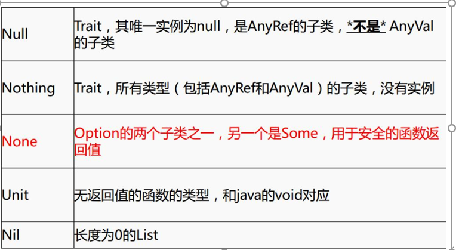
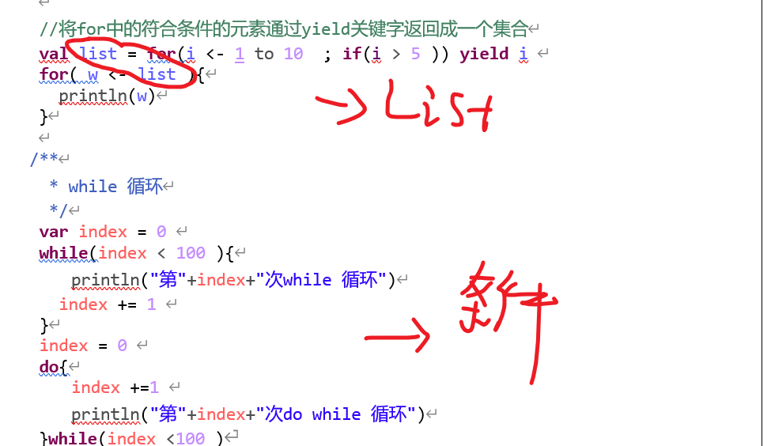

# scala

[scala文档]: /source

# 1 介绍和安装

```
#1，介绍
Spark1.6用的是scala2.1,而2.0用的是2.11以上
#所以下面都是scala2.11

#2，特性：
```


```
#3，安装  （详细看word文档，，一共四种推荐三种）
#可以都先1.8JDK

1)
	msi:路径写对  :q 退出
2)
	scalaElipse: 必须要1.8
3)
	IDE ：注意安装上scala插件和 选上jdk  （可以设置copy eclipse的快捷键）
```


# 2 基础

## 2.1 数据类型

```
#1，类型介绍

基本上面都是java有的类型，只是大小了
下面常出现的就是Unit  和 Nothing
```


```
#2，类型结构
```


```
#3，易混概念
#Trait就是上面所说的特质
None指 
	Option类似map，None表示get(key)无值，Some 相反

```



## 2.2 常变量声明

```
#无论啥类型，都用val(常) , var(变) 修饰
#类型可省略，写也是写在后面 XX:Int

例：
val a = 10
#val a:Int = 10  
(后面的类型，一般不写，自动推断，基本在形参的时候才写)
(也可以自动加上, val a =10 后面输入.var 可以弹出)
```


## 2.3 类和对象

### 1）基本操作

```
#1，概述

#同一包，不能有同个类名

1）object：(当做静态类，拿来当做main的入口)
相当于java中的单例，object中定义的全是静态的,相当于java中的工具类，
Object不可以传参，对象要传参，使用apply方法。

2）class：
类中可以传参，传参一定要指定类型，有了参数就有了默认了构造。
类中的属性默认有getter和setter方法
```

```
3）其他：
#每行后面都会有分号自动推断机制，不用显式写出“;”
#建议命名使用驼峰命名法
#当new class 时，类中除了方法【除构造方法】不执行，其他都执行。
#val更利于回收，非变量参数一般用这个
```


```
#2，操作
#选object ，只是帮你构建了个 obj，，生成.scala文件

1）创建obj (以及main方法的书写) ， cls (以及构造的重载)
obj {
	def main(args:Array[String]): Unit = {
	
	}
}

#cls 一定有参数， this 没有返回类型和等号那部分，也不推断 ,一般方法省略都是省类型
class (x:X){
	def this(){
	//就是类的参数 看下面操作代码
	}
}
```

```
2）测试属性啥的
在Obj中：
#可创建class对象： 
	val p =new P(X,X)
	并且可以打印一系列p的非private属性，可以给cls形参也加上var，这样也全局可见了
```

```
3）测试执行  （与java不同是：在非main中还可以执行命令）

先从obj开始,  先打印
使用class时要new ,有new，才执行cls里的命令
```


```
#3，代码
class P(val xname :String,xage:Int){
  private val name = xname
  var age = xage
  var gender = 'M'

  println("******* Person Class *********")
  def this(yname :String,yage:Int,ygender:Char){
    this(yname,yage)
    this.gender = ygender
  }
  println("====== Person Class =======")
}

object ClassAndObj {
  println("####### Lesson_ClassAndObj Object #####")
  def main(args: Array[String])={
    /**
      * 类和对象测试
      */
    //1.1 简单测试
    val p =new P("a",20)
    println(p.age)
    println(p.xname)
    //1.2 测试执行

  }
}
```


### 2）obj 的apply


### 3）伴生 类 和 对象

在同一个scala文件中，class名称和Object名称一样时，这个类叫做个对象的伴生类，这个对象叫做这个类的伴生对象，他们之间可以互相访问私有变量。（先obj，然后cls，当考虑变量赋值的时候）
*/


---


## 2.4 trait

```
#1，介绍
Trait(特征) 类似于 Java 的接口 ，但是可以实现或不实现
#类继承了Trait要实现Trait中没有实现的方法

格式：
trait XX{ }

#不可以传参数
#类可以继承多个   用 extends  with
```

```
#2，操作

1）实现了方法
trait Read {
  def read(name:String) ={
    println(s"$name is reading...")
  }
}
trait Listen {
  def listen(name:String) ={
    println(s"$name is listening...")
  }
}

class Human() extends Read with Listen{

}
object Lesson_Trait1 {
  def main(args: Array[String]): Unit = {
    val h = new Human()
    h.read("zhangsan")
    h.listen("lisi")

  }
}

2）有没实现的方法
trait IsEquale{
  def isEqu(o:Any):Boolean
  def isNotEqu(o:Any) :Boolean =  !isEqu(o)  （调用上，实现了方法）
}

class Point(xx:Int,xy:Int) extends IsEquale {
  val x = xx
  val y = xy

  override def isEqu(o: Any): Boolean = {     （重写没实现的方法）
    o.isInstanceOf[Point]&&o.asInstanceOf[Point].x==this.x
    #.asInstanceOf[Point] 很重要，，能够any变成该类
  }
}
object Lesson_Trait2 {
  def main(args: Array[String]): Unit = {
    val p1 = new Point(1,2)
    val p2 = new Point(1,3)
    println(p1.isNotEqu(p2))
  }
}
```


## 2.5 样例类

```
#1，介绍
就是用case 修饰的特殊类
	实现了类构造参数的getter方法（构造参数默认被声明为val），当构造参数是声明为var类型的，它将帮你实现setter和getter方法。  （也就是自动属性，赋值和能修改啥的）
	
	默认帮你实现了toString,equals(比较内容，而不是地址)，copy和hashCode等方法。	
	可以new, 也可以不用new


```


```
#2，实现
case class Person1(var name:String,age:Int)

object Lesson_CaseClass {
  def main(args: Array[String]): Unit = {
    val p1 = new Person1("zhangsan",10)
    val p2 = Person1("lisi",20)
    val p3 = Person1("wangwu",30)

#case类，啥都没写，，
当时自动帮你赋值给属性了，同时var能修改
还重写了一些列的函数
```


## 2.6 匹配 和 偏函数

```
#1，模式匹配 match
1) 基本
就是写个函数，，然后把东西 匹配case模式，然后表达式得对应的 

2)格式
（case 模式=>表达式）

3)注意
不仅可以匹配不同类型的值 还可以匹配类型
从上到下顺序匹配，如果匹配到则不再往下匹配
case _ 任意，，放末尾
的最外面的”{ }”可以去掉，，因为是一个语句
匹配过程中，1.0 会变成 int 的1

4）实践
 def main(args: Array[String]): Unit = {
    val tp = (1,1.2,"abc",'a',true)
    val iter: Iterator[Any] = tp.productIterator
    iter.foreach(MatchTest)
  }

  def MatchTest(o:Any) =
    o match {
      case i:Int=>println(s"type is Int ,value = $i")
      case 1=>println("value is 1")
      case d:Double=>println(s"type is Double ,value = $d")
      case s:String=> println(s"type is String ,value = $s")
      case 'a'=> println("value is c")
      case _=>  println("no match...")
    }
```


```
#2，偏函数
1）
没有match啥的，方法省略写，要写偏函数的返回类型
偏函数，只能匹配值，匹配上了返回某个值  
返回类型  :PartialFunction[A,B]  A是匹配的类型，B是匹配上返回的类型

2）
def MyTest :PartialFunction[Any,Int] ={
    case "abc"=>2
    case 1 => 1
    case _ => 200
  }
  def main(args: Array[String]): Unit = {
    val result: Int = MyTest(1)
    println(result)
  }
```


## 2.7 逻辑操作

### 1）if

```
if  
#和java一模一样  但都一个时可以写成一行 
if(p.age <20) println("1") else println("2")
```

### 2）to - until

```
#用途：（拿来遍历的）
to : 返回 [X,Y] 的Range 数组
until : 返回[X,Y)

#用法：
#是个操作符所以有两种用法
#后面是步长

1 to (10,2)  or 1.to(10,2)   
until 一样

#注意：
X,Y不仅仅是直接的数字，还可以是变长量
```

### 3）for

```
#1，普通循环 :
是靠  <-  遍历数组等的 （Range,Vector等等）

#2，多重循环： 用; 分开
9 9 乘法表
 for(i <- 1 to 9  ; j <- 1 to i ){
      print(s"$i * $j = "+ i*j +'\t')
      if (i==j) println
    }
    
 #3，循环可加条件 可用分号或空格分开
 也可以用在多重循环中
 
 #4，用yield 配合条件  可以筛选出for中符号条件的，存到Vector中
 
 val result = for(i <- 1 to 3 if(i<2);j<- 1 to 3 if(j<2)) yield  (i,j)
 #返回：Vector((1,1))。，也是类似容器
```


### 4）foreach

```
#假设s为容器啥的 ,,元素为e
只能用在 s.foreach( func(e) )

#注：
里面要用函数，同时参数类型必须和元素e一致
表示遍历的时候，对每一个元素使用func方法

#配合：
func常常写成匿名函数，同时可化简
	匿名函数 变量只用一次，就println（_）
	又只传了一个参数，就println	
	
s.foreach(elem=> println(elem))
s.foreach(println(_))
s.foreach(println)
```


### 5）while




### 6）其他知识

```
#s” $a ”  取a得值， 不要靠+拼字符串了   （${XX.a},,如果是用啥.的）

#方法 没有参数可省略 ()
#没有break 和continue
#没有 ++count++ ,
```


# 3 方法与函数

#下面标题命名是 函数标出，，其实二者没啥区别

## 3.1 定义方法

```
#1，格式

#其实函数也有类型：  fun: (Int,Int) => Unit
def fun (a: Int , b: Int ) : Unit = {
   println(a+b)
 }

```


```
#2，注意
1）参数：
规定方法的传过来的参数为val。（即方法内不能修改参数,,形参也不能手动加,除了类 能val/var）
参数一定要指定类型

2) return 和 返回类型
如果使用了return,那么方法体的返回值类型一定要指定
没有return，默认将方法体中最后一行计算的结果当做返回值返回。并且推断返回类型

（特：递归的要显式表明返回类型 ，，函数作为返回也要显式，，匿名不能显式写出）

3）其他：
省略了方法名称和方法体之间的“=”，无论方法体最后一行计算的结果是什么，都会被类型转化，值丢弃，返回Unit

一行写完就省略{}
```


## 3.2 递归 嵌套

```
#1，递归
#一定要写返回类型

def fun2(num :Int) :Int= {
      if(num ==1)
        num
      else 
        num * fun2(num-1)
    }
```

```
#2，嵌套
就是方法里面写法
```


## 3.3 默认 可变参

```
#1，参数有默认值的
参数覆盖是左向右的，填满就代表全覆盖，不满就是到哪就是哪
专门覆盖就指定名称

def fun3(a :Int = 10,b:Int) = {
      println(a+b)
    }
fun3(b=2)
```

```
#2，可变参数
#注意内部  foreach配合匿名  加上_ 或者写成最简
#想不同类型混合，就Any*

def fun4(elements :Int*)={
    }
println(fun4(1,2,3,4))

```


## 3.4 匿名函数

```
#1，综述
“=>”就是匿名函数，常用充当方法的参数
() => {}  为格式，因此不能写返回类型
```


```
#2，分类
有无参数：
有无返回类型
```


```
#3，赋匿名函数
1）赋值给变常量，（一般val）

#不写函数类型也没事， 同时系统也不自动补全
var fun1: String => Unit =   (s: String) => {
      println(s)
    }

2）赋值给函数
#函数类型可自动补全
 def fun:(Int,Int)=>Int =    (a:Int,b:Int)=>{
        a+b
    }
    
#综上，同时二者要是形参写错了，也不编译报错，但是运行出错 
所以还不如二者都不手动写。
```


## 3.5 偏应用函数

```
配合下划线，参数后面可以沿用

 def log(date :Date, s :String)= {
      println("date is "+ date +",log is "+ s)
    }    
    val date = new Date()
    log(date ,"log1")
    log(date ,"log2")
    log(date ,"log3")
    
    //想要调用log，以上变化的是第二个参数，可以用偏应用函数处理
    val logWithDate = log(date,_:String)
    logWithDate("log11")
    logWithDate("log22")
    logWithDate("log33")

#这里显示了，scala的特性，，与java可以混编，调用了java.util.Date的包
```


## 3.6  高阶函数

```
#1，参数是函数
def fun(a:Int,b:Int):Int =  a+b

 def fun1(f:(Int,Int)=>Int,s:String):String = {
     val i: Int = f(100,200)
      i+"#"+s
    }

直接传引用，或者写匿名  （fun _.var可以显示出函数类型）
val result = fun1(fun,"scala")
val result = fun1((a:Int,b:Int)=>{a*b},"scala")

#常用于，，数据定了，传入处理的逻辑
```


```
#2，返回是函数
//1，2,3,4相加 （柯里化可缩写）
    def hightFun2(a : Int,b:Int) : (Int,Int)=>Int = {
      def f2 (v1: Int,v2:Int) :Int = {
        v1+v2+a+b
      }
      f2
    }
    println(hightFun2(1,2)(3,4))
    
 #返回个函数，不用写()，函数名就表示类型了，，，
 #要用的时候这样 （）（） 
```

```
#3，结合
 //函数的参数是函数，函数的返回是函数
 
def f(v1 :Int,v2: Int):Int  = v1+v2

def hightFun3(f : (Int ,Int) => Int) : (Int,Int) => Int = {
      f
    } 
    
println(hightFun3(f)(100,200))
println(hightFun3((a,b) =>{a+b})(200,200))
    //如果函数的参数在方法体中只使用了一次 那么可以写成_表示
    println(hightFun3(_+_)(200,200))  （和foreach那个像，连其他的也省略了）

```


## 3.7 柯里化函数

```
#返回的高阶函数，简写
def fun7(a :Int,b:Int)(c:Int,d:Int) = {
      a+b+c+d
    }
    println(fun7(1,2)(3,4))
```


## 3.8  5个_作用

```
1）在偏应用中，省略重复的

2）在foreach  和 高阶 等等，，目的是匿名函数的参数只用一次，  省()=>{} 直接 _加逻辑
								(例  {a:Int,b:Int}=>{a+b} 变成  _+_ )
3）函数名 加 _  .var  就能看到函数类型  (X,X) => XX

4) 元组组织   ._1  ._X

5) 在match 中充当任意匹配  case _
```


#字符串 和 集合的常用方法都是看Word文档

# 4 字符串

```
#1，介绍
String 是 java.lang.string中的
所以有String  和 可变长的StringBuilder   （Buffer就是导入JAVA的了）
#和java一样，Str能不能变是指内部能不能换变化，，整体变量变，是看val/var
```


```
#2，常用
String  直接 “ ”  或者 new
StringBuilder    new

scala  只要字符串同，，== ，都是相等的（和java不一样，java,new是不同的）
```


---

# 5 集合

#格式基本都是创建，遍历，方法，可变长等等


## 5.1 数组

```
#0，常见问题
1）创建：
#一般都写上同类型的
new 的 一定要写[T]，可以写Any
可以直接Array，默认Any的，，但在多维中，一定要写[T]

2) 使用
可以 arr()  ( [] 都变成())
```


```
#1，创建

1）一维
new Array[String](3)   (像动态的，然后用的是cls)
直接Array[XX]			 （像静态的，用的是Obj）

 //创建类型为Int 长度为3的数组
 val arr1 = new Array[Int](3)
  //赋值
    arr1(0) = 100
    arr1(1) = 200
    arr1(2) = 300
//创建String 类型的数组，直接赋值
val arr2 = Array[String]("s100","s200","s300")
 
2）多维：
#最好这样:动态加静态
val arr3 = new Array[Array[Int]] (3)
array(0) = Array[Int](1,2,3)
```


```
#2,遍历
1)一维
arr1.foreach(println)   (匿名函数简写了)
for(elem<-arr1) println(elem)

2)二维 ：就用二重for
arr3.foreach(arr=>{arr.foreach(println)})
for( arr<-arr3 ; a<-arr){}
```

```
#3,一些方法
val array: Array[String] = Array.fill(5)("hello")  (初始化数组)
val arrays: Array[String] = Array.concat(arr1,arr2) (拼起来)
```

```
#4，可变长
val arr =ArrayBuffer[Int](1,2,3)
arr.+=(4)   
arr+=(5)
arr.+=:(100)
arr.append(7,8,9)
 
.+  + 效果一样
+=: 插入到前面，，只能一个参数
```


## 5.2 list

```
#0，问题

1)创建：
只有一种静态的，直接创建
不用写泛型，就默认Any，可以指定泛型，一般写同一类
#Nil长度为0的list

2）取值
也可l（）
```


```
#1，创建
val list = List[Int](1,2,3)

#2，遍历
for(elem<-list) println(elem)
list.foreach(println)
```

```
#3,方法

# 都是 list.func()  里面 加匿名函数进行元素的操作

1)
map : 1 对 1 ， 回来还是对应个数的数组
val result: List[Array[String]] = list.map(s => s.split(" ") )

flat : 1对多  ，，完全打平了
val result: List[String] = list.flatMap(s=>s.split(" "))
```


```
2）filters 过滤 选择符合的true 的值
val result: List[String] = list.filter("hello scala".equals) (匿名简写)

3）count 数满足的true 数
val i: Int = list.count(s =>s.length < 4)
```

```
#4，可变
和array 基本一致
```


## 5.3 set

```
#问题：
创建： 只有静态直接
不用写泛型，就默认Any，可以指定泛型
#写了重，也自动去重
```


```
#1,创建
val set = Set(1,"abc",3)

#2，遍历
foreach，for

#3，方法

1）集合间 ： 
有.func(), .&()  ,直接 X & X
#都是前弄后，最后一个不用写()

交集：intersect ,&
并  ：union    |
差集: diff ,&~
子集：set1.subsetOf(set2)

2)集合操作
set.max
set.min
set.mkstring("分隔符")

set.filter(_ >= 2).foreach(println)  （最简了）

3）变list，array
set1.toArray / toList
```


```
#4，可变
不是Buffer，是同名，靠包来区分
set.add(100)

#其他和上面一致
```


## 5.4 map

```
#问题：
创建也是只有静态，只是k,v（看k,v 实际是元组，因可以._1）有多种标识
不用写泛型，就默认Any，可以指定泛型

#相同的key，后面取代前后的V

```


```
#1，创建
Map[String,Int](1 –>”bjsxt’)
Map((1,”bjsxt”))

#2，取map的值
map.get(“1”).get  
map.get(100).getOrElse(“no value”)：如果map中没有对应项，赋值为getOrElse传的值

#map.get() 得到option[] (Some  or None) , 
	再get,前者得值，后者报错，防止报错，所以有上面第二种

3,遍历
1）map
直接for,foreach   得到 (K,V),(K1,V1)  
#map.foreach( e => println(e._1))  （没法简了）

# k,v 都是返回Iterable，这是所有集合的接口
2) key
val keys: Iterable[String] = map.keys
keys.foreach(key=>{
	val value = map.get(key).get
	 println(s"key = $key ,value = $value")
 })
3) value
val values: Iterable[Int] = map.values
values.foreach(println)
```


```
#3，方法：
1）map间
.++   后面的替换前
.++ : 前面的替换

2） 通过对map整体，，选择_1,_2 可以进行一定操作
#count                                     （之前的foreach没法省到_）
val countResult  = map.count(_._2.equals("bjsxt"))
    
#filter
map.filter(_._2.equals("shsxt")).foreach(println)
    
#contains ： 含key
 println(map.contains(2))
    
#exist                              (全写)
println(map.exists(f =>{
f._2.equals("xasxt")
 }))

```

```
#4，可变：
import scala.collection.mutable.Map  （和set 导类似）
val map = Map[String,Int]()
map.put("hello",100)
map.put("world",200)
map.foreach(println)

```


## 5.5 元组

```
#0 问题
元祖没有[T]这个写法  (可以不同类型，还可以叠加元祖)
，，一共三种写法
._XX 取值，
最多22个参数
```

```
#1，创建
val tuple = new Tuple1(1)
val tuple2 = Tuple2("zhangsan",2)
val tuple3 = (1,"ada",)

#2，取值
val t = Tuple2((1,2),("zhangsan","lisi"))
println(t._1._2)

#3，遍历 （和其他容器都不一样） （返回的是迭代器，和map的kv像）
val tupleIterator = tuple22.productIterator

tupleIterator.foreach(println)

while(tupleIterator.hasNext){
      println(tupleIterator.next())
    }
    
#4，方法
//toString   (或者不写，，打印的是(x,x,x) )
 println(tuple3.toString()) 

//翻转，只针对二元组
println(tuple2.swap)
    

```


## 5.6 总结

```
总结：
arrary,,list,,map,,set  ：都是可变与不可变  默认是不变，
tuple 只有不变

1）可变
array ，list 是Buffer
set  ，map   要想变不变共存，导入上一层包，引用的时候，带上就行。
(scala.collection.mutable /immutable )


2）创建
array ：两种创建（new ，直接），可不同类型
list : 一种   (直接)，，可不同类型
set： 一种 （直接），，可不同类型
map ： 一种 （直接，但kv有两种标识 k->v or (k，v)）,,可不同类型
元组  ： 三种  （不能写类型，，可以存任何类型）

3）遍历
map有k,v啥的遍历，，和其他都可以for啥的
元祖不能for 啥的，，只能先得到iter 然后像map的k,v一样，遍历迭代器 (while 或者 foreach)

#容器方法都是，func(XX) 然后XX是匿名，有的可以简写
```


# 6 隐式转换

## 6.1 概述

```
#定义：
隐式转换是在Scala编译器进行类型匹配时，如果找不到合适的类型，那么隐式转换会让编译器在作用范围内自动推导出来合适的类型。

#作用：
说白了，就是让你，加上原来没有的东西  （有点像java的装饰器）

#注意：
同一类型的隐式 值，函数，类，在同一个作用域不能两次
（作用域：同个Obj,同个Cls）
```


## 6.2 值 与 参数

```
#1，说明

#作用：
写个值，让函数具有没有手动传入的参数

#注意： （参数名字和值名字随意，不用一致）
1）同类型的参数的隐式值只能在作用域内出现一次，同一个作用域内不能定义多个类型一样的隐式值。
2）一个方法只有一个参数是隐式转换参数时，那么可以直接定义implicit关键字修饰的参数，调用时直接创建类型不传入参数即可
3）一个方法如果有多个参数，要实现部分参数的隐式转换,必须使用柯里化这种方式,隐式关键字出现在后面，写一次就好了
```

```
#2，实践
class t{
  implicit val zs = "zhangsan"
}
object T_i {
  def Student(age:Int)(implicit name:String,i:Int)= {
    println( s"student :$name ,age = $age ,score = $i")
  }
  def Teacher(implicit name:String) ={
    println(s"teacher name is = $name")
  }

  def main(args: Array[String]): Unit = {
    implicit val zs = "zhangsan"
    implicit val sr = 100

    Student(18)
    Teacher
  }

}

#上面的隐式值 zs 对下面的一点影响都没有
#implicit 的参数要写在后面，且写一次就好了。
```


## 6.3 函数

```
#1，说明

#作用：
写个函数，让实例具有没有的方法

#注意;
1）A对象没有某种方法，而B有,通过定义个隐式函数，传A类对象，返回B。
2）隐式函数只与函数的参数类型和返回类型有关，与函数名称无关，所以作用域内不能有 相同的参数类型 和返回类型的  仅仅不同名称隐式转换函数。
```

```
#2，实践
class Animal(name:String){
  def canFly(): Unit ={
    println(s"$name can fly...")
  }
}
class Rabbit(xname:String){
    val name = xname
}

object Lesson_ImplicitFunction {

  implicit def rabbitToAnimal(rabbit:Rabbit):Animal = {
      new Animal(rabbit.name)
  }

  def main(args: Array[String]): Unit = {
    val rabbit = new Rabbit("RABBIT")
    rabbit.canFly()
  }
}

```


## 6.4 类

```
#1，说明

#作用：
写个类，让实例具有没有的方法和属性

#注意：
1）写个隐式类B，传入实例A，A就具有B的属性和方法了
2）隐式类必须定义在类，Obj，伴生对象中 （不能外面）
3) 隐式类只能有一个参数 （实例A）
4）同范围内，不能出现同类型参数的隐式类
```

```
#2，实践

class Rabbit(s:String){
  val name = s
}

object T_i {
  implicit class Animal(rabbit:Rabbit){
    val tp = "Animal"
    def canFly() ={
      println(rabbit.name +" can fly...")
    }
  }

  def main(args: Array[String]): Unit = {
    val rabbit = new Rabbit("rabbit")
    rabbit.canFly()
    println(rabbit.tp)
  }
}
```


-------------------------

# 7 Actor模型

```
#1，概要
1）介绍 Actor
Actor 可以理解成，自动解决了共享锁的Thread
大家都是在自己的Actor中，与其他Actor交互，
	发送是异步，非阻塞，不用等回复
	靠消息队列，自己收到的消息也是自己去检查，不是等
	消息是先后排序
	
2）Akka
底层用Actor实现的库
	#Spark1.6 前用的AKKA
	#1.6      二者结合
	#以后      用的是netty
	
```


```
#2，实践
#有个actor.jar

1）给Actor发消息

#总结：
--要自己继承Actor类，然后new出来。

--Actor会一直执行 act方法，，while循环保证一直运行。
	里面和macth匹配很像，只不过是receive

--要发送，就必须要先启动，然后给谁发 就是  X ！ “ ”


class myActor extends Actor{
  
  def act(){
    while(true){
      receive {
        case x:String => println("get String ="+ x)
        case x:Int => println("get Int")
        case _ => println("get default")
      }
    }
  }
}

object Lesson_Actor {
  def main(args: Array[String]): Unit = {
    
    //创建actor的消息接收和传递
    val actor =new myActor()
    //启动
    actor.start()
    //发送消息写法
    actor ! "i love you !"

  }
}


```

```
2）Actor间通信
#总结：
不同ACtor通信，就不同的类。
实现自动通信： (start后不管了)
	A2类能够传入A1类的参数，这样A2能给A1发消息 （A1 不能再传A2类，，做不到）
	为了让A1，能给A2发，就必须有A2的actor，，因此A2发消息的时候，可以把自己也封进去
	#new 类的时候，除了方法啥的，剩下都执行，所以A2 自动actor ! Message(this,"i love you !")
	#同时又靠case 样例类，自动实现了一些赋值啥的，

case class Message(actor:Actor,msg:Any)

class Actor1 extends Actor{
  def act(){
    while(true){
      receive{
        case  msg :Message => {
          println("i sava msg! = "+ msg.msg)
          
          msg.actor!"i love you too !"
          }
        case msg :String => println(msg)
        case  _ => println("default msg!")
      }
    }
  }
}

class Actor2(actor :Actor) extends Actor{
  actor ! Message(this,"i love you !")
	def act(){
		while(true){
			receive{
  			case msg :String => {
  			  if(msg.equals("i love you too !")){
  			    println(msg)
  			   actor! "could we have a date !"
  			  }
  			}
  			case  _ => println("default msg!")
			}
		}
	}
}

object Lesson_Actor2 {
  def main(args: Array[String]): Unit = {
    val actor1 = new Actor1()
    actor1.start()
    val actor2 = new Actor2(actor1)
    actor2.start()
  }
}

```


----

# 8 Spark WC

[详情看word]:  /source	"3.2.5 maven"

## 8.0 maven介绍

```
maven  管理包和项目的  
（一个项目下能同时写 java  和 scala）
（不需要自己加lib，写在pom.xml，然后自动管理下载）

#按装好了，右边maven 视图可以管理

1）
配置/conf/settings
	local  设置下载本地目录
	设置镜像  阿里的


2）创建maven项目
archtype  选quickstart 那个模板
然后设置一系列的东西，选下maven的安装目录（或者配置环境变量）

#设置自动导入 pom.xml  ，写pom.xml（配置包的）
内容：
	包
	插件  ;可以写scala代码
	还有下面注释的

#自动下载

#不同目录  不同代码
{
把目录变成source，，建个javacode,,scalacode
然后建包，写代码}

其他：

#项目右键sync 刷新     然后右边 maven  clean，，如果出现啥导入包不存在删除
#pom.xml 可以搜所要的包的书写格式
```


## 8.1 scala 实现

```
#1，步骤 ： 
lines -->words--->(word ,1 )-->(word,all)

建data数据

conf 设置资源  和运行名称 运行模式
context  通往集群的唯一通道,,，，，因为它才能创建RDD

Spark 底层是 RDD [srting] （放了读进来的数据，可以想成list）

flatmap     RDD [srting]   
map   : tuple(word,1)        RDD [（srting，Int) ]   元祖
RDD方法    reduceByKey(匿名函数)

{	
	相同的key  分组
	{int , int}=> int    
	#  a b c ，先a + b =c  然后 a 变成c 
	#如果只有一条数据不进这个
}

打印结果

```


```
#2，代码
1）
object WC {
  def main(args: Array[String]): Unit = {
    val conf = new SparkConf()
    conf.setAppName("wc")
    conf.setMaster("local")

    val sc = new SparkContext(conf)
    val lines: RDD[String] = sc.textFile("./data/words")
    val words: RDD[String] = lines.flatMap(line => {
      line.split(" ")
    })
    val pairWords: RDD[(String, Int)] = words.map(word => {
      new Tuple2(word, 1)
    })
    val result: RDD[(String, Int)] = pairWords.reduceByKey((v1: Int, v2: Int) => {
      v1 + v2
    })

    result.foreach(println)
    
  }
}

-----------------

2）简化版
匿名中，只出现一次的参数全部_
然后方法可以叠在一起。

object WC2 {
  def main(args: Array[String]): Unit = {
    val conf = new SparkConf()
    conf.setAppName("wc")
    conf.setMaster("local")

    val sc  = new SparkContext(conf)

    sc.textFile("./data/words").flatMap(_.split(" ")).map((_,1)).reduceByKey(_+_).foreach(println)

    sc.stop()
  }
}
```

## 8.2 Java实现

```
#1，注意

区别：
Conf 以外，，都要写成 JAVAcontext  JAVARDD JAVAPairRDD
不能用map,要words.mapToPair


快捷键：
main ---- psvm
提醒  ---- alt + enter

java匿名可以用lamda 表达式


#2，实现
public class WC_java {
    public static void main(String[] args) {
        SparkConf conf = new SparkConf();
        conf.setAppName("wc");
        conf.setMaster("local");

        JavaSparkContext sc = new JavaSparkContext(conf);
        JavaRDD<String> lines = sc.textFile("./data/words");
        //进来string，出去也是string
        JavaRDD<String> words = lines.flatMap(new FlatMapFunction<String, String>() {
            @Override
            public Iterator<String> call(String line) throws Exception {
                return Arrays.asList(line.split(" ")).iterator();
            }
        });
        JavaPairRDD<String, Integer> pairWords = words.mapToPair((PairFunction<String, String, Integer>) s -> new Tuple2<>(s, 1));
        JavaPairRDD<String, Integer> result =pairWords.reduceByKey((Function2<Integer, Integer, Integer>) (v1, v2) -> v1+v2);

        result.foreach(new VoidFunction<Tuple2<String, Integer>>() {
            @Override
            public void call(Tuple2<String, Integer> t) throws Exception {
                System.out.println(t);
            }
        });
        sc.stop();

    }
}
```


