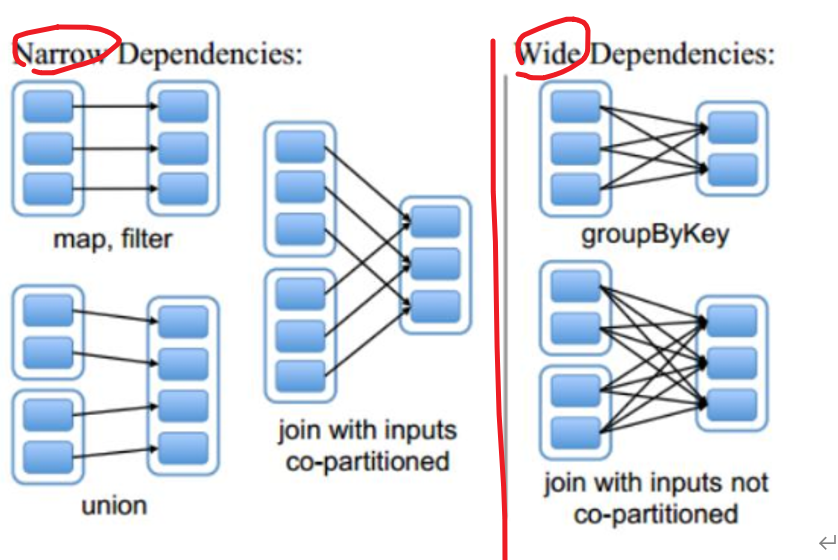
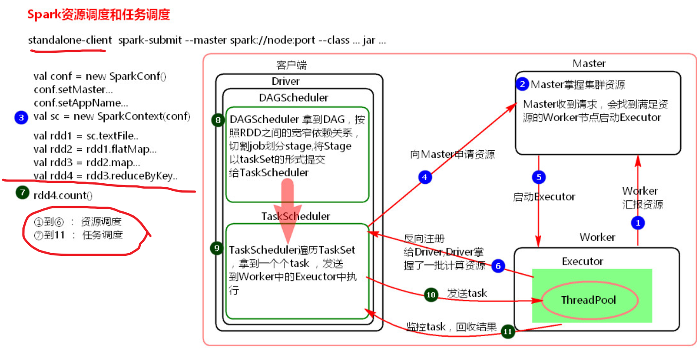
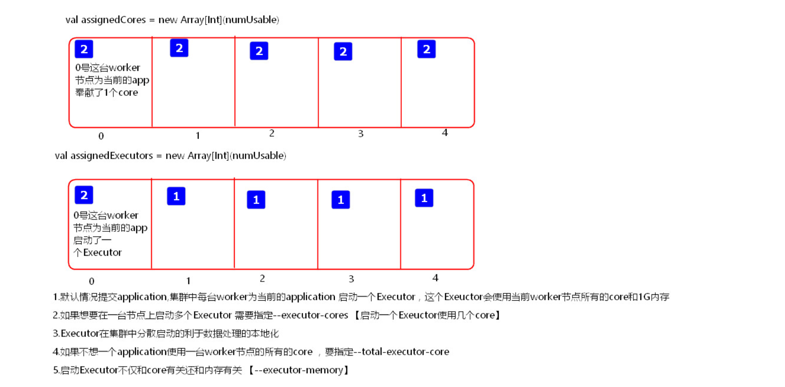

# Core

#以Spark 1.6 和 2.3 混讲  （二者在Core区别不大，在stream 和 SQL有一定区别）

# 1 spark 介绍

## 1.1 概述

```
#1，概念
Apache Spark 是个计算引擎 ，
有MR所具有的的优点，同时Job的输出结果可以保存在内存中 
	(一个application 能有很多 Job)
	(MR每次job结束，re的结果进磁盘。）
能结合机器学习等

#2，特点
#快： （数据处理一般在迭代的任务，快得多，其他差不多）
	内存迭代  （job结束，不放磁盘，放内存，下一个Job再调用快）
	任务都是小小的DAG模块
#语言多:
	scala ， python ，java，R，SQL 等等  
#模块多:
	stream，core,sql,ml
#运行模式 :（资源调度的）
	主要四个：
		Local ， Standalone(spark集群自带的调度)
		Yarn(因为spark实现了AM接口)，Mesos （apache的国外多）
	其他：
		kubernetes : 虚拟出好多镜像  ， cloud 云服务器上
		
		
```


## 1.2 技术栈 


```
#下面是资源管理，中间是存数据的，上面是处理数据的
```


## 1.3 与mr 比较

```
#1，回顾 MR

buffer 溢写到小文件中，分区排序
小文件合并大文件     ， 按分区顺序排好
```


```
#2，比较
```


----

# 2 核心RDD

## 2.1 RDD理解和创建

```
#1，介绍
```


```
#2，补充

#RDD粗暴理解，就当成list，里面元素存着数据

partion与Block  一对一  ； 后面的RDD与上面RDD一一对应  
	（出错了，还可以再生成一次）
	（P读B，默认一对一，可调整，）（这两点控容错） 
	（p<B，是因为有时候启动task慢，越多分区，总时间慢，多分区可备份）

RDD组合成Lineage （DAG  ：L指总的逻辑）
RDD是逻辑上的，再一层partion，， 但二者都实际不存数据

算子对各自的p操作，得到对应的p，  (算子里面是自己写的逻辑)
每次task 会调用方法 ，得最佳的p位置。  （一个task 处理一个分区）


学了后面之后（可以看 2.1的创建和4.2的资源调度的计算EX ），可以得出：
(spark: 参数决定了启动EX的情况，，分区决定了实际task情况（分区和 并行度和读取的块相互有关）)
```


```
#3，创建RDD的三种
1）方式
Sparkcontext
	textfile(地址，minPartitions )
	MakeRDD(Array[](),,等容器啥的)
	parallelize(和上面一样list一系列容器啥的，  ， numSlices分区) 


-----------------------------------

2）testfile（地址，X） 并行介绍

​ X不传，就是defaultMinPartitions

 ~testFile有个默认的并行度n，在配置文件里设置，spark.default.paralleism
  	 默认 （
      local :  和本地core有关  setMaster(“local”)  local[1]  简写就是1  所以一般本地是1个
      Mesos: 8个
      其他： max  (all cores ,  2)
          ）
  ~然后defaultMinPartitions=  min( 2,  上面的默认并行度p )  

​传了的话  是minPartitions，，就只看这个值
	这个值  表明分区数能大于这个值
	（如果你读的是HDFS，B数量大于这个，就task是B的数量，，如果小于，task是这个的值）

#task一定和分区数一致，但是和B，核啥的就要综合考虑
#后面可以改变并行度，，repartition啥的
```


## 2.2 执行简图


```
（JVM进程：  D放在spark客户端上，，W和 M都是spark集群上的进程，，standalone资源调度框架弄得）

#D：任务调度
发task  收results。
（JVM内存很小，有的算子的result是回收的，大了会OOM）

#W：
Standalone资源调度框架里面资源管理的从节点

#M：
Standalone资源调度框架里面资源管理的主节点
```

## 2.3 代码流程

```
#conf  : 
必须 application名称 和 运行模式 master
选择 ：运行资源 配置项 (k，v)
	#spark资源  就core  和  内存

#context: 得RDD
	#context 也可以设置一些东西。（比如关闭打印日志啥的）

#然后一系列算子对RDD操作，算子里面写逻辑

#关闭上下文
```


## 2.4 算子

#在spark 2.3中测试

### 0）概述

```
#1，介绍
转换算子是操作数据，然后action算执行以下然后下一个job，
而持久化是在不同job 某个RDD数据是否保留的策略 

1）transformation ：转换算子
延迟操作，等action后，才执行
#都是算子，里面写逻辑，返回还是算子。	（sample sortbykey 不写逻辑，只写参数）

2）action 		 ：行动算子
有几个action 就有几个job，
#返回的不是算子                    （foreach 写逻辑）

3）持久化算子
也是懒执行，action 执行。持久化的单位是partition
cache 和 persist 是在一个appli内 保留数据
checkpoint   永久保存在一个磁盘目录，还能切断联系


#完整的叫 application   ，，，由多个job，组成
#只有一个job，执行tran 和 per 持久化就没有意义
```


```
#2,代码书写问题：
#File 选 Struture 把文件变成sorce 和右边maven 调整图  能改变导入的maven路径等等  和 刷新包

#scala代码缩写 :
匿名中：
	只用一次可以用_代替 ，如果只有这一个函数参数，还可以省略_ _  和函数()
一般函数：
	没有参数，就省略()

#java也可以 .var  和 alt + enter（给提示的） 那个快捷键一样 给出类型 

#sc.serLogLevel(“Error”),,, 少打印东西
#sc.stop  就是close
```


### 1）Transform~

#RDD[ X] , 只能也是类似scala类，就一个[ ]类型参数，记住了  ，元祖用()

```
#1，scala

1）总述
map:	  一对一
flatmap:  一对多
filter:
reduceByKey :
sort：       逻辑是：  匿名函数选谁 ， 是否正序 
sortbykey    按照key排序，   逻辑是 ： 是否正序                          ~~~
			#操作 ：如何按照v排序   
			（先map1对1，swap tuple，然后排序，然后map再转回去)

sample:  参数  (bool:是否放回，，double:在范围左右抽，，随机种子: Long类型) ~~~
					#double >1.0，看看就是几倍
```


```
2) 实践
//map
    lines.map(_+"#").foreach(println)
//flatmap
    lines.flatMap(_.split(" ")).foreach(println)
//filter
    lines.filter("hello java".equals).foreach(println)
-----------------------
    val words = lines.flatMap(one=>{one.split(" ")})
    val pairWords = words.map(one=>{(one,1)})
    val reduceResult = pairWords.reduceByKey((v1:Int,v2:Int)=>{v1+v2})
//sortBy
   reduceResult.sortBy(_._2,false).foreach(println)
// sortBykey
     val result  = reduceResult.map(_.swap).sortByKey(false)
     result.map(_.swap).foreach(println)
//sample
    val result= lines.sample(true,3,100L).foreach(println)
```

#scala  

​		匿名都一样，没有一系列的逻辑分别，还可以省略东西，简单多了

​		返回也都是RDD[ x]  是元组k,v 就RDD[（X,Y）]

#java    

​		匿名用的都不一样，而且泛型也不一样。 

​		（没输出 就voidFunc<输入类型>  1个参数，

​			输入输出，就Func，2个输入就Func2  ,,   输出元组，就FlatMapFunc）

​		返回 一般是JavaRDD<X> , 是元祖 必须要写JavaPairRDD<X, Y>（不能简单map。只能Mtp）

```
#2，java   

1） 综述 
filter   : Function <v1,v2>  左边输入，右边输出

map      : Func v1,v2       返回V2 元组不能用这个map
		  JavaRDD<Tuple2<String, String>> 
mapToPair  PairFunc V1,V2,V3      要用这个 返回元组    ！！！
		  JavaPairRDD<String, String>
#操作测试
#要是要是变KV，就mtp

flatMap   ：FlatMapFunc<v1,v2>  
			要return  先Arrat.aslit 然后.iterator


reducebykey  Function2<v1,v2,v3>

sortbykey  :只有这个     填个是否正序 参数            ~~~~~
#操作： 按照V 排序
	(出一条，还是多条，又要kv 格式 又因为是java，所以是mtp)	
	（Pair  变PAir  还是要mtp，，不能m）


sample                写三个参数就好了             ~~~~~
```

[2）实践]: /source	"看source的java代码"


---


### 2）Action

```
#1,scala

1) 综述
foreach     要写逻辑(算子foreach是拿来遍历RDD的)   	  ~~~~~

count : Long                     			       !!!!
collect  : 拼回去，Array				  			!!!!

#上面两个都是是回收的，回到Driver


first： 第一条数据   	take(1)
take  :  array    	take（前几条）

```

```
2)实践
#没其他参数的，不写括号也没事
//foreach
    lines.map(_+ "#").foreach(println)

//fisrt 和 take
    val result :Array[String] = lines.take(5)
    result.foreach(println)
    val str: String = lines.first()
    println(str)

//collect
    val result: Array[String] = lines.collect()
    result.foreach(println)   
    #普通foreach 遍历容器

//count
   val l: Long = lines.count()
   println(l)
```


```
#2，java
1）概述
forech  VoidFunc      ： 打印RDD的
其他：
#java打印就好好打印，

```

[2）实践]:  /source 	"看source的java代码"


### 3）持久化

```
#1，概述

#用途： （cache persist  和 checkpoint）
因为转化算子是操作数据，本job结束就结束了，
而若是在一个application 中反复用到同个算子，则要又要计算这个算子，同时还要大量IO
但一般持久化，还是在整个application 结束，而结束，
这时，可以选择checkpoint，，永久持久化，来保存状态

（c 和 p只是做到了不同Job,快速引用，cp：出错回溯，可以切断之前联系，从这开始 ）
#其他：
都是懒执行
调用时候  X.持久 或者  Y = X.持久  都行  （但是Y=X. 后面不能再更算子，不然返回是结果）

unpersist  可以把 cache 卸载，，在后面job用不到这个算子，就可以就卸载了  （这个不是懒执行）

```


```
#2，cache:

1) 介绍
持久化在内存的
实际cache () = persist()=persist(StorageLevel.Memory_Only)

2）实践
第一个job中，算子要计算，从IO读
第二个job中，算子在内存中找
#200M+文件大小      用时：4000ms  --- 100ms
```


------


```
#3，persist
#可以控制持久化级别

1）级别介绍
#参数顺序如下
磁盘，内存
堆外： 只有用内存存储系统才有  ，一般都false
不序列化：  不序列化，用的时候，不用反序列化快， 但是占用空间大 
副本：默认1个副本

（存磁盘的部分就一定序列化，省空间） 
（内存 and 磁盘，，是指内存不够了，再磁盘，，，同时存磁盘的一定也序列化）
```


```
2）使用
RDD.persist(XXX)
#选择优先级：
m_only > m_only_ser > m_and_d > m_a_d_s
```

------------------

```
#4，checkpoint

1）介绍
cp将RDD持久化到磁盘指定目录，还可以切断RDD之间的依赖关系。
cp目录数据当application执行完之后不会被清除。

#当DAG中RDD断了，已经弄好了cp:  要弹性恢复RDD时，如果有cp, 切断了cp前联系，数据从cp开始, 恢复
	（所以把cp设置在需要大量时间的RDD上）
	 (在得到cp过程中优化 ：放个cache)

2）作用
后面特殊场景用cp： 保留状态的
	不用随便用，不然恢复全优先磁盘了 （有时候，直接重新内存计算还快）
	后面拿来存元数据信息的，，保留
	
3) 获取cp流程

#先过一遍lineage (就是RDD链)，，然后到了action，开始往前回溯，看到cp，做标记，
	（因为到了一个action,才开始执行tran 和 持久化算子）
#然后从头开始，开个新的job 再一次次计算RDD，看哪个是cp,然后把结果存到指定目录

#切断之前依赖关系，如果后面出现问题，则优先从cp恢复 

#优化：
在cp的RDD,先cache，这样action后，虽然，还是要回溯，但新的job ,cp的RDD不用计算，直接内存中拿到

4) 注意：
#只有一个job时候，没必要cache  和p
	因为，当appli 结束就清，，cache和p又是懒执行，只有当action，才执行，,都结束了没意义  
#不要处处写cp
```

```
sc.setCheckpointDir("./checkpoint");
JavaRDD<Integer> parallelize = sc.parallelize(Arrays.asList(1,2,3));

parallelize.checkpoint();

```


### -补充算子1：

#RDD[]只有一个参数，元祖写()，java写JDDpair

#### –Tran

```
#tran
1）
----join 四个：

join  ：  RDD[ (k,v )  ]   RDD[(   String , (Int, Int)   )   ]   
		#rdd1 ("a",1) 和 rdd2 ("a","a"),("a","b") 中的key，可以被多次使用，
			（每次拿一个，去比较另一个的所有）
		#(a, (1,a))  (a,(1,b))，，，先后join，只影响后面的书写前后

left  ：  RDD[(K,(  V1,option[ V2]  ))]   左为主，左边一定出现，，option看k有没有v2的值 
															（配合getOrElse）
right       RDD[ (k ,  (option[v1]    , v2)) ]
full         RDD[ (k   ,  (option[v1]  , option[v2]) )  ]    

结果如下(d,(None,Some(1)))

# 和多的分区保持一致，，分区就是和hadoop的Block概念类似，就是把东西分多少
（getNumPartiton  能看到有几个分区）

-----union   
RDD[(k,v)]    RDD[(k,v)]    就是把所有的都往下扩展
# 和分区和 一样，，就是简单的合起来


----交差集：
intersection
#父RDD分区多的一致
subtract
#与subtract前面  的RDD的分区数一致。


----mapPartiosns ：按分区操作
#map: 里面就是反复，mp这样，就一个分区操作一次
#要返回结果迭代器


----distinct  ：去重
( 内部是这个 实现的map+reduceByKey+map)

----cogroup  ： join是把二者同key弄元祖 ， 这个是同key,分别弄集合
a.coggroup（b）  
RDD[  (  key ,(   Iterable[v_a]  , Iterable[v_b]   )  )  ]
#所有的key都出现，前面的[] 是a中某key的所有v集合，，谁没有就是空的 集合
#结果 (c,(CompactBuffer(1，2,3),CompactBuffer()))  类似

#分区是父多的
```

```
2）scala 
val conf = new SparkConf().setAppName("test_suanzi").setMaster("local")
    val sc = new SparkContext(conf)
    sc.setLogLevel("Error")
    val RDD1 = sc.parallelize(List(("a",1),("b",1),("c",1)) ,3 )
    val RDD2 = sc.parallelize(List(("a",1),("b",1),("d",1)) )
    #1，join 等等集合操作类似的
    RDD1.join(RDD2).foreach(println)

    val RDD3=sc.parallelize(List(("a",1),("b",1),("c",1),("d",1),("e",1),("f",1)) ,3 )
    #分区操作
    RDD3.mapPartitions(iter => {
      println("数据库连接")
      val l = ListBuffer[(String,Int)]()   //必须要写[] 类型，参数就一个，元祖用()
      iter.foreach( tp => {
          l.+=(tp)
          println("操作")
      }) //简写报错
      println("关闭")
      l.iterator            //必须变成iter
    }).count()
	
    val RDD4 = sc.parallelize(List("a","a","b"))
    RDD4.distinct()
    
    val value: RDD[(String, (Iterable[Int], Iterable[Int]))] = RDD1.cogroup(RDD2)
    value.foreach(println)
```


------

#### –Act

```
# action
foreachPatrtion   不要返回值 就用这个 （mapP有返回值） 
```


### -补充算子2

#补充更多是操分区的，，索引的一些算子

#### –Tran

```
#tran

1) 

--mapPartitionWithIndex :       
参数（index,iter）
#类似于mapPartitions,除此之外还会携带分区的索引值，  


--repartion    增减分区
#都是执行宽依赖，，产生shuffle       程序图：


--coalesce     是否洗牌的增减  （减）
参数（numPartitions,bool）
#第二个参数设置会不会有shuffle， 默认false,没有shuffle，全去同一个新分区
#注意： 减一点问题没有，  ，，如果是增：false，没有效果，分区啥的都不变
   
{
#repartion 是coal repartition(numPartitions) = coalesce(numPartitions,true)
#因此增分区，就re得了
}


--zip:   常用于机器学习 （train_x,train_y 合并在一起）
#RDD[v1]  RDD[V2] –> RDD[ (V1,V2) ]   
#v1,v2 数量要一致。

--zipindex:   自己 和下标合并
#就是RDD[v1]   —>    RDD[   (V1, index）]  index是下标


--groupByKey:  把自己的v,用k聚在一起。
RDD[ (  k  ,  v)  ]   —> k ,( v1,v2,v3… )  
#补充1中的算子，是两两RDD，聚在一起


--------------------------------------

2）java格式
#有的tran也是不用写逻辑

--mapPartionWithIndex:
#参数 ( Func2<integer,  iterator1  , iter..2>   , false)
	Func  按分区处理，前面int 是 分区号， iter1是输入，iter2是输出 
	后面false是继承父的分区 （java的参数必要要写这个）


--re  和 coa ：  没有逻辑，直接写参数 JAVARDD.XX(XX)


--zip 和 zipindex  ：  也是没有逻辑直接写
输出是k,v 格式，所以返回JAVAPairRDD


#总结：JAVA返回的RDD，要看scala中返回的类型，如果是[(K，V)]  要写成JAVAPAIRRDD
```


#### --Act

```
--reduce：    一直相加总的，，不是kv的RDD
#就是 rdd[v]       v  -> long    

--countbykey:    按照key，来数个数     （要作用kv格式的rdd）
#rdd[(k,v)]    –> Map [k,num]    
#Map类：有两个参数，所以填[k,num]

--countbyvalue      :   是把整个当做整体，，完全同算一组     （ 任意格式的RDD）
-> map [ (k ,v ) ,num]（k,v格式的）  或  map[ all  , num   ]  （任意格式的）

```


## 2.5 例子

### 1）pv,uv

```
#1, 一些概念
pv   浏览一次，就算一次。
UV   iP 或 用户   只算一次

#2，操作
按网站求PV
按网站求UV
统计每个网站的前三个地域


#3，代码

1）数据类型
ip              address  date   timestamp   userid           webSite     action
109.171.221.190	澳门	2020-04-27	1587991	61756109537	www.dangdang.com	Regist


#  X  | 1  表示按为来或，可以保证数据最小是1
#下面 _  , _也不能缩写了，因为一个参数出现了多次


2）PV 和 UV
 val file =sc.textFile("./data/pvuvdata")
val tp =file.map( line => ( line.split("\t")(5)  , line.split("\t")(4) ))
tp.cache()
val pv = tp.countByKey()
    
val uv = tp.distinct().countByKey()
 
```

```
3）统计地域
val groupTrans = lines.map(one=>{(one.split("\t")(5),one.split("\t")
(1))}).groupByKey()

groupTrans.map(  tp=>{
      val site = tp._1
      val localIterator = tp._2.iterator
      val localMap = mutable.Map[String,Int]()
      while(localIterator.hasNext){
        val currentLocal = localIterator.next()
        if(localMap.contains(currentLocal)){
           val count = localMap.get(currentLocal).get+1
           localMap.put(currentLocal,count)
         }else{
           localMap.put(currentLocal,1)
         }
       }
	val newList: List[(String, Int)] = localMap.toList.sortBy(tp=>{-tp._2})
      
     ( site,  newList.take(3)   )

    }
    ).foreach(println)


#注意：
整个就是groupbykey，把自己的同key，的v弄成list，，然后再弄个map,来操作，(涉及分组排序)

里面的逻辑：
contains：看map有没有某个Key
sortBy  : 想要倒序，就符号
take 取前几个，，（takeRight 后几个）
a.toBuffer  b.toArray   不变 与可变转化数组  （如果不知道长度是多少，先弄个可变，然后变成定长）
```


### 2）分组取TOP-N

```
想取出，某key下前N个值 （像上面）

#方法：
1）插入比较法
用特定N长度数组，比较插值，，慢，但是一定能完成

2）list容器
里面直接放进list，用list的sort （负号），数据很大时，进行不了（OOM）

3）变小
每组Key, 值单独弄成个RDD，然后一一进行算子的sort，take操作， ，能当数据很大时进行，但麻烦
（一次操作中，只有这一组，不会oom）

#RDD算子等啥的运行在D，，  而EX上只能运行里面的逻辑（所以不能逻辑里面套RDD算子啥的）
```


### 3）二次排序

```
#比较两个东西以上

#实现：
就是自己定义个对象是怎么个比较法

# scala :   Ordered[SecondarySort] with Serializable
# java  :   implements Serializable,Comparable<SecondSortKey>


class SecondarySort(val first:Double, val second:Double) extends Ordered[SecondarySort] with Serializable {
  override def compare(that: SecondarySort): Int = {
    if(that.first == this.first){
      return (that.second-this.second).toInt
    }else {
      return  (that.first - this.first).toInt
    }
  }
}
```


### 4）广播变量

```
1)  概述

D中定义的东西，EX中要用到， （EX只能运行 算子里面的逻辑），，            造成内存问题
	如果不处理 ： 每个EX中，有多少task，就有多少份	
	如果用了广播变量： 每个EX，只有一份。有个blockManager去管理广播变量

2) 操作

#在D中先广播出去，y=sc.broadcast(x)
#EX 和 D中使用      ，y.value


val list = List("hello xasxt")
val broadCast = sc.broadcast(list)
val lineRDD = sc.textFile("./words.txt")
lineRDD.filter { x => broadCast.value.contains(x) }.foreach { println}


3)两点注意：
	不能发RDD，RDD是逻辑集合，，可以先回收，collect，变成数据再发
	不能修改，，你要是修改了其他task怎么用
```


### 5）累加器

```
1） 概述

D中定义的东西，，EX中累加，                               EX只有各自的分区结果，同时D的东西没值

	不用，       EX分区分别只加到自己的结果（因为没有下一步），，但D还是不变
	用累加器，    D把EX的分区结果,拉回来，自己总起来，  （EX还是老样子，D有正确的总值）

#还有自定义怎么加，加啥

2）操作 (2.X 和 1.X 有变化)

#建值：  
	2.X  : y= sc.longAccumulator or  sc.doubleACCumulator  ()
	1.X  : y= sc.accumulator(num)
#加值：  y.add(num)
#得值： 
	2.X   ：D 和 EX 都能 直接对象 和 获得值  XX.value 
	1.6   ：EX中只能直接对象

val spark = SparkSession.builder().appName("test").master("local[2]").getOrCreate()   //local2 结合之前的知识，可以看出有两个分区
val sc =spark.sparkContext
val rdd1 = sc.textFile("./data/words")

var i =sc.longAccumulator
val rdd2 = rdd1.map( x =>{
          i.add(1)
          println(i.value)   //获得值
          x
        })
rdd2.collect()     //因为累加器要act一下
println(i)         //直接对象


#我用了local[2],,让并行度为2 
不管用不用累加器，EX都是显示各自的结果，，不用：D一直是0，，用了就能正确拉回来求和
```


# 3 搭建

## 3.1 搭建2.3

### 1）步骤

```
#1，机器说明
3个 spark节点 （1个M，2个W） ， 1 个spark 客户端（提交appli的节点）
#为了后面yarn提交任务： 所以NM要和spark集群同个，
			（自己调整之前的分布：个人认为：nodemanager要在spark集群上，看提交过程就知道）
			 (从hadoop项目集群的快照操作，然后调整一定大小和核数： 我是2G内存，2个核)

课程的布局：
1    2   3    4    5
N1   N2  D    D    D
R    R   N    N    N 
Z    Z   Z
HI      HIVE
M   W     W   cli
```


```
#2，搭建
1）改yarn节点分布
yarn-site
修改RM节点

--------------------------

2）jdk 换成8
解压到自己设定目录，分发java
全修改配置
	/etc/profile
	注释，重写，path的小区别 (export PATH=$JAVA_HOME/bin:$PATH)

#之前是rpm java ，，现在是tar，要改下指向（rpm 才会自动弄指向）
全执行 
	ln -sf  ~/software/jdk8/bin/java  /usr/bin/java

#java -version 和 指向正确才表示换jdk成功

-----------------------------

3）其他修改  （所有节点的配置）
hadoop-env.sh ： 改java地址
yarn-env.sh   :  改java地址
yarn-site.xml  ： 关闭检查虚拟内存，不然报错
	<property>  
		<name>yarn.nodemanager.vmem-check-enabled</name>  
		<value>false</value>  
	</property>


客户端的 /etc/profile  :
	export HADOOP_CONF_DIR=$HADOOP_HOME/etc/hadoop 
------------------------------

4）搭建spark集群：
#把两个配置文件备份：在文件后面添加就行
slave
	node3
	node4

en.sh
	SPARK_MASTER_IP:node2     (2.X推荐用_HOSt)
	SPARK_MASTER_PORT:7077
	SPARK_WORKER_CORES:2
	SPARK_WORKER_MEMORY:3g


分发给其他节点 （客户端只是需要spark这个包，和hive 很像）

#启动 standalone框架，，（不启动这个，，yarn也能能操作spark集群）
sbin  ./start-all.sh
node2:8080    (7077是交作业的端口，8080是web的)
```


### 2）端口

```
#1，修改UI端口： （和tomcat端口冲突）（执行优先级  先找A>B>C）

A 上面en.sh
B export 临时修改 
	export 查看出信息，找到WEB。。PORT
	export  -n XX  : 修改PORT

C   vi sbin/start-master.sh  也能改端口
```


```
#2，端口总结
50070 ：hdfs UI
8020  : hdfs 内

8088  : mr   UI
2181  : ZK
6379  : redis
9083  : hive 的元数据端
60010 ： hbase

9092  : kafka 

8080  ：spark UI
7077  : spark 内
18080 : spark history UI
```


### 3）测试

#spark自带的examples  (用 standalone 和 yarn 分别测试)

```
#1，解析
1）介绍
求PI是多少，，用概率，，圆中点的个数 与 总个数 之比 = pi*r**2 / (2r * 2r)
object SparkPi {
  def main(args: Array[String]) {
    val spark = SparkSession
      .builder
      .appName("Spark Pi")
      .getOrCreate()
    val slices = if (args.length > 0) args(0).toInt else 2
    val n = math.min(100000L * slices, Int.MaxValue).toInt 
    val count = spark.sparkContext.parallelize(1 until n, slices).map( { i =>
      val x = random * 2 - 1
      val y = random * 2 - 1
      if (x*x + y*y <= 1) 1 else 0
    }).reduce(_ + _)
    println(s"Pi is roughly ${4.0 * count / (n - 1)}")
    spark.stop()
  }
}

2）解析
SparkSession 整合了 conf 和 context   （2.0推荐这么写）
parallelize([输入的个数-1]， 输入的RDD分区 （也是tasks数目） )
RDD.map(里面如果园内转化为1).reduce（不是同组求和，就是一直加下去）：最后求到有多少个圆内点


-----------------------------------

#2,实践
都是客户端节点提交，省集群压力

1）用 spark 自带的资源管理框架 默认client，所以命令行能看到执行过程 和 结果
./spark-submit --master spark://node2:7077 --class  org.apache.spark.examples.SparkPi ../examples/jars/spark-examples_2.11-2.3.1.jar 100

#到主类名，，jar包  ，，和 参数

(askSchedulerImpl:54 - Adding task set 0.0 with 100 tasks  100个分区，100个tasks)

```


```
2）用yarn  也是client  也能看到执行过程 和 结果

#如果fail，看yarn的WEB 日志，如果是显示version52，就是说明jdk还是没配置好，
	（是在不行就卸载了jdk7） （ps -ef | grep java  可以看到所有用到java的程序所用的版本）
#如果其他错，拿日志，搜下就行


#要先启动zk 和 hadoop 和 yarn   （可以关闭standalone测试，说明完全是靠yarn资源调度）
./spark-submit --master yarn --class org.apache.spark.examples.SparkPi ../examples/jars/spark-examples_2.11-2.3.1.jar 100
```


## 3.2 提交简图1


```
#总结


1） 框架
#s:
靠的是自己的 M 和 W 来调度资源
任务执行在W上的EX


#y:
靠的是RM 和 NM开启的AM 调度资源
任务执行在AM开启的EX上

-----------------------------

2）模式
#client:   命令行看得执行，和 结果
	   （因为D是在交任务的客户端上，能显示信息，大量任务会网卡冲突，因此只适合测试）
		(当你默认提交的时候，都是clint)
 
#cluster

3）整体流程都是：
框架启动，得到资源情况
提交任务，因模式区别，不同启动D，
因框架区别，，s是D申请资源，开启的执行进程 ； y 是AM操作
最后D 与 执行进程交互： 发task,,回收结果，，监控task运行
```


### 1）standalone

```
#1, client （两个写法，问题是D全在客户端上）

1） 代码
./spark-submit 
--master spark://node2:7077  --class path  args

./spark-submit --master spark://node1:7077  
--deploy-mode client  --class path  args

2）理解
启动standalone，，W汇报M资源
提交任务：（node4:、）
	客户端交任务，启动D，然后D申请M资源
	M看要用的W，，然后告诉D，
	然后D (发task,,回收结果，，监控task运行) —–   w   
```


#W上也是开启EX                      ！！！！！！！！！！！！！


```
#2，cluster （一个写法，D随机在W上）

1）
./spark-submit --master spark://node2:7077  
--deploy-mode cluster --class path  args

2）

启动集群，，W汇报M资源
提交：
	客户端交任务 ，向M申请启动D，M随机找个W 启动D ，D向M申请资源
	M看要用的W，，然后告诉D， 
	然后D (发task,,回收结果，，监控task运行) —–   w   

#D随机在W启动，，C没有网卡流量激增问题


C看不倒东西，，因为就提交个任务就完事了，生产环境
看UI  ： 任务提交变化，先D，然后Runningappli,然后结束都关闭这两个，coml 多了一个完成的
		（看WEB UI complete 标准正确输出，找结果）
```


#yarn 没有spark start-all，也能运行

#yarn 要启动hadoop start-all

### 2）yarn

```
#1，client  (三种，AM负责要资源了，不是D)
1）
./spark-submit --master yarn  --class path  args

--master yarn–client

--master yarn --deploy-mode  client 

2）
汇报 ， RS知道资源
提交：
	D在客户端启动，向RS 要AM ，AM要资源，弄执行进程EX
	Ex  反向注册D，  
	然后D (发task,,回收结果，，监控task运行) —–   EX   
#Ex有资源，，运行task的  AM用来启动EX的，
```


-----


```
#2，cluster （两种）
1）
./spark-submit --master yarn-cluster  --class org.apache.spark.examples.SparkPi ../examples/jars/spark-examples_2.11-2.3.1.jar 100

--master yarn --deploy-mode cluster 


2）
汇报资源：RS知道
提交：
	客户端向RS，随机AM
	（AM就是D了，AM加个D的功能）


#客户端变成running后，，退出来都没事，，s集群还在运行中
#也是看不到执行和结果  也是yarn -UI 看job日志

```


## 3.3 提交参数

conf,cont           都是Driver,  （这个代码不要写死，参数设置）

RDD的算子内的逻辑 ：EX

```
#通用：
--master  MASTER_URL, 
	可以是spark://host:port, mesos://host:port, yarn,  yarn-cluster,yarn-client, local
--deploy-mode  DEPLOY_MODE, 
	Driver程序运行的地方，client或者cluster,默认是client。
--class  CLASS_NAME, 
	主类名称，含包名
--jars  ，逗号分隔的本地JARS, 
	分发给executor依赖的第三方jar包
--driver-cLass-path 
	Drive的jar	
--files   用逗号隔开的文件列表,
	分发给executor的文件
--conf
	这里spark的配置属性  代码里不要写死
--driver-memory
	Driver程序使用内存大小（例如：1000M，5G），默认1024M
--executor-memory
	每个executor内存大小（如：1000M，2G），默认1G


#设置核啥的，不同框架不同
#Spark standalone with cluster deploy mode only:
--driver-cores
	Driver程序的使用core个数（默认为1），

#Spark standalone or Mesos with cluster deploy mode only:
--supervise
	失败后是否重启Driver，仅限于Spark  alone或者Mesos模式

#Spark standalone and Mesos only:
--total-executor-cores
	executor使用的总核数，仅限于SparkStandalone、Spark on Mesos模式

#Spark standalone and YARN only:
--executor-cores
	每个executor使用的core数，Spark on Yarn默认为1，standalone默认为worker上所有可用的core。

#YARN-only:
--driver-cores
	driver使用的core,仅在cluster模式下，默认为1。
--queue 
	QUEUE_NAME  指定资源队列的名称,默认：default
--num-executors
	一共启动的executor数量，默认是2个。
--kebers啥的： 
为了安全   hdfs，不能随意访问
```


-------------------------

## 3.4 spark-shell

### 1）操作WC

```
#1，概述
是Spark的scala REPL(Read-Eval-Print-Loop),即交互式shell。
支持使用scala语言来进行Spark的交互式编程。

#2，操作
启动ZK ，standalone ,HDFS

随便一个连接； ./spark-shell --master spark://node2:7077
	#在2.X 弄好了缩写  SparkContext ->sc   Session-->spark


#3，测试WC
sc.textFile("hdfs://node1:8020/input/wc").flatMap(_.split(" ")).map((_,1)).reduceByKey(_+_).collect()

结果：
res1: Array[(String, Int)] = Array((hive,1), (linux,2), (hadoop,2), (windows,1), (hbase,1))

注意：
#一个job，两个stage
#端口是hdfs拿数据的端口 8020
#没有collect，shell显示结果
#在之前的提交，全是本体，也可以从hdfs读东西，但是要配置地址啥的

```


### 2）WEB-UI

### ---UI验证介绍--

#### -Jobs

```
#0，介绍

1）进入node2:8080
是spark的UI，显示了个  spark-shell 是长application，，一直不会消失，
然后点后面那个名字看提交JobUI ：http://node1:4040/   （前面点进去是看EX，用来看日志输出结果的）

#shell 啥也没设置用掉了所有的核 , 有两个EX
#该shell中运行不同，，还是这个app，然后增的是，里面那个job
```


------

#jobs:


```
2）job-UI大体介绍

#大体：
~jobs 和 stages 都是两层结构，也就是在本页面，点description,就能看到详细的东西
   (第一层东西:  , Jobs                  , Stages)
  （第二层东西：  ，Jobs:显示stage内容     ， Stages：显示task）
~下面展示的过程是，从jobs-->jobs:stage---->stages:task   
   (从jobs界面能走通到stages:task,而不经过Stages)
															
#讨论：
为什么有四个Task：  

按理文件只有一个B，然后只有一个分区，然后1个task，，然后两个stage 2个task
因为testfile没设置minP, 所以是 min( max(all_cores, 2  )  , 2  )  =2，所以是四个

```

#从jobs-->jobs:stage---->stages:task


#### -jobs : stage

```
#2,jobs : stage

涉及到了shuffle, 
suffle  write  ，  shuffle read
```


#### -stages: task

```
#3,stages: task  （可以看是否数据倾斜的）
~下面看所有tasks信息  和 把每个EX上的tasks聚合展示

~上面看信息
   。。event  time : 
    	(zooming 可缩放，，看不到就鼠标放上去好了) 
       （不同的长条，，绿色差异大可能数据倾斜）
  。。DAG  该stage的视图   和 addition ： 给中间加一些额外的属性


~中间： 
。。四分点的 一些属性，，，看   在stage  的所有并行task，   水平分布情况

```


### ---其他介绍---

```
#1，storage  （看持久的）

1）测试持久
一开始是懒执行 ，所以没有执行，UI也看不到，，
当action后， 可以看到UI中，关于持久这个RDD的一些信息
	#原来是45 B的， 大小更大了，，在内存数据膨胀了（加了标记信息 同时反序列了）

2）卸载是立即执行的
rdd.unpersist()
#UI就啥也没了
```


#### 


```
#2，其他
1) environment  和 Executors

#EX:
```


```
2）未来可以 SQL  和 streaming
```


---


## 3.5 其他配置

### 1）配置历史服务器

#当把上面shell关了，UI中app 就从run 变成了 complete ，同时也看不到job ui了

#而配置历史服务器，就是让关了app ,也能看到

```
#1，搭建

1）客户端配置

#spark-defaults.conf

//开启记录事件日志的功能
spark.eventLog.enabled           true
//设置事件日志存储的目录  (目录在启动前，要先有)
spark.eventLog.dir              hdfs://mycluster:8020/spark/history
//设置HistoryServer加载事件日志的位置
spark.history.fs.logDirectory   hdfs://mycluster:8020/spark/history
//日志优化选项,压缩日志  （采用压缩，，hdfs 用.lz4压缩格式，现在看不懂了）
spark.eventLog.compress         true

2) 客户端启动  （从hdfs读数据了，所以spark要先启动hdfs了）
sbin  : ./start-history-server.sh

node1:18080   (客户端节点)

```


```
#2，测试
客户端 bin : ./spark-shell --master spark://node2:7077 --name myapp1
	#可以设置个shell名字，也就是appname
	#然后关闭shell
客户端 启动历史服务器
然后看UI 18080


结果：
点APP ID 就调到了这个app的 job UI上
```


### 2）M->HA

#xshell，  复制的设置

```
#1,概述
Master 大量被用，但只有一个，如果挂了，将无法提交APP，所以要高可用
#在源码中，操作后，存到一个持久化对象，所以才可以用来存信息 和 恢复

#方法：
fileSystem(文件系统)  ： 存储M元信息，，失败了，要手动
zookeeper（分布式协调服务）： 自动切换
```


```
#2，搭建靠ZK的HA ，spark集群中操作

官网 Deploying，点standalone  有high  availability

1) 主配置

env:

export SPARK_DAEMON_JAVA_OPTS="-Dspark.deploy.recoveryMode=ZOOKEEPER -Dspark.deploy.zookeeper.url=node2:2181,node3:2181,node4:2181 -Dspark.deploy.zookeeper.dir=/sparkmaster"

#注意：  -D是分隔符后面不能有空格，两个D之间有空格，，ZOO大写

2）分发


3）启动
原来的start-all  
然后找一个节点当备 start-master.sh   （我选node3）

#注意：启动都是找env，，，所以备的要修改，Master为自己

```


```
#3,测试

1）自动切换测试
启动两个UI，，node2:8080 node3:8080  (node3看到standby)

然后关node2，node3能接管

#再重启，也是不会自己切换回去。
#四个状态： standby –>recovering--> completeing_recovering --> ALIVE
#主备切换过程中不能提交Application


2) 测试运行app中，中断M

#提交任务：./spark-submit --master spark://node2:7077,node3:7077 --class org.apache.spark.examples.SparkPi 
../examples/jars/spark-examples_2.11-2.3.1.jar 100
（把M都写上）

#效果：
~提交完任务：
	资源调度完了，，在运行任务的时候，M挂了 自动切换：一点影响没有  
	（  因为和Master没有关系，只有D和EX，之间操作）

~在提交任务时候：
     还在资源调度，，M挂了 能自动切M   ：有影响，但能自动调整  ，然后完成任务
```


------


# 4 资源 和 任务

## 4.1 理解

### 0）准备

#### *-RDD宽窄依赖 和 stage*

```
#1，宽窄
1）分类
RDD之间的依赖关系  ：又分为窄依赖和宽依赖。

2）判断
从父的角度，是对应 一一就是窄，如果父一对多就是宽
#因为，一对多，宽就会有Shuflle （因为，涉及父的分区 要把文件拆开IO操作了，才能一对多）

3）一些图展示
```




```
#2，stage 理解：  
三个问题：     stage是什么，，计算模式，，，分区和task

1）stage是什么
说白了就是  ：一个stage是由一组并行的task组成，，前后的stage，像mr的map 和 reduce，完成不同任务
		（从后往前看，，根据宽窄划分一个job的DAG，把job的RDD划分成更大的有依赖的stage来处理）
细说：
{
	Spark任务会根据RDD之间的依赖关系，形成一个DAG有向无环图，
	DAG会提交给Driver的 DAGScheduler，DS会把DAG划分相互依赖的多个stage，
	划分stage ，遇到宽依赖就划分stage,
	每个stage包含一个或多个并行的task任务。 （task是像管道一样的，贯穿一个stage中的RDD分区）
	然后将这些task以taskSet的形式提交给D中的TaskScheduler。
    然后TS以一个个task发送给W的EX执行
}

```


```
2）计算模式  （task pipeline）
#拿WC job 举例 ： 
	·reduceByKey是shuffle，宽依赖，所以这里划分DAG,    有两个Stage
	·在stage1中， 
		有两个分区，所以有两个并行的task管道，  （可以解释partition放的是逻辑，不是数据）
		··就一个task而言，（也就是一个分区）
			数据是一条条读的，然后顺着管道，经过一系列的分区处理，然后落地磁盘。
			（所以不要求很大内存，不是一下子把所有B的数据都读下去，传递）
			（所以例如在上面的图中，txFile-->flat-->map  都是一条一条数据来的，不是全数据）
	·先stage1，然后stage2

#细节：
--和MR比较：
{
 #spark: stage1可以当做map, stage2 re   （MR也是一个一个读）
 #mr:    map也可以做到stage1写成一个map,但是若是弄多个小mr，就慢了  
 
 更重要的是：
​mr落地磁盘要上传HDFS，更慢，
​当这个job结束，前面map的小步骤，数据都没了， Spark可以持久化到内存，所以当你后面要用数据又更慢
#所以 spark适合迭代 （spark是1+1+1=2，，MR是1+1=2 2+1=3）
}
--stage的并行度：
#决定：由本stage的最后一个RDD决定
#提高：在shuffle等方法 设置大的numpartition

--数据何时落地：
	RDD持久化 和 shuffle时

```


```
3）分区和task
#基本概念
	分区放的是逻辑操作，task贯穿分区 
	并行的task逻辑可能不同 （一个stage的最后RDD，可能依赖多种RDD，如下面的图所示）


#多task理解：
每个task都是一个管道，在不同节点并行处理数据
不同节点上，有ex  ，ex可以设定核数  
（如果ex没有多核，在一个节点上，多个task是没有大意义的，像进程和线程）
（上面的WC，是在有数据的节点，有一个EX，然后每个EX有一个task）
```


#### *-application整体线*


```
#application线：
	一个appli --> 多个job （action算子切） ---> 一个Job 多个stage(宽依赖切)
	一个stage，多条lineage，（一个lineage里面是相同的task）
	所以最终就是多个task并行

#一个appli 对应着自己的一组D 和EXs 和接受与分区一致数量的task计算逻辑，并行
```


#### *-任务切分发送*

#任务调度的一些细节


```
#1，细节   （中间那两个是DRIVER的）


一个Job，，提交一个DAG （里面是lineage组合）
DS ：
	宽依赖，切JOB，得stages，发tasksets (taskset封一个stage的并行task) ）
TS:
	遍历tasksets，一个个发送同taskset的并行task到W  


------------------------------

#2，注意：

1）task失败处理：
TS 重试3次，---》 然后DS，里面的某个stage重试4次，发这个stage的taskset,
#如果DS失败，则说明这个Job失败，，，随意application也就失败了
#job是顺序执行的，如果这个Job失败了，但之前的job的操作结果依旧成功，


2）task缓慢处理
TS   重开个task执行计算，，和原来的task比，谁先计算完就用谁 
（缺点：如果是ETL 数据库等操作，会被反复，，所以默认是关闭的）

（慢的原因：数据倾斜  或者这个缓慢处理机制是否被开启）
```


#### -*粗细资源申请*

#资源申请的一些细节


```
spark是： 一开始，一次把所有资源都申请了，下一个job，直接从任务调度开始

#分类：
粗粒度申请： 

把所有appli的资源都要了，不够，就一直等，task只用专注计算就行了
，同时只有最后一个task结束，才会释放所有资源

细粒度： MR 
不会申请完所有的资源，task要自己申请，同时一个task完，就释放自己的资源，
因而资源充分，但是速度慢


#spark也有细粒度， 如果不用资源了，可以放出去，要的时候再拿，但是不建议开启这个动态，因为可能被别的占了

```


### 1）图解2




```
为了简单理解，基本正确， 但一切以下面的源码分析为正确标准

#1，资源调度	
standalone 框架启动; Master掌握好资源
然后D启动  COntext 创建，里面启动两个Sche

4： TS 求资源，M 收到请求，在W开启EX
6： EX里面有线程池pool，，，EX反向注册TS，，，D有了计算资源

# 至此，完成资源调度  

-------------------------

#2，任务调度

7：到了一个action，一个job开始，

DS，分stage，，stage变成tasksets
TS,拿到set，，遍历，然后发task给EX

TS，，回收EX的结果

#  至此，完成任务调度

```


## 4.2 源码

```
提示：
下面展示基本以 spark 2.3   standalone 的cluster 为例

操作：
	import导入，选maven 然后设置好maven环境，然后更新maven  （有的直接file，选open打开也行）
	打开view 的structure视图   （m是方法 ，V是变量)
	（在看源码的过程中， new 对象时，除了方法啥的，剩下都执行）
```


### 0）总结图解3

以无参数提交，，standalone 的 cluster 为例

#### *-图解*

```
#1，启动过程：
集群命令行输入启动：
   先准备好ENV通信环境（能够处理数据，和接收其他节点数据） ， 然后注册启动自己  （1启动自己）   
   M得到 Workerinfo信息

#2，资源调度
1）从提交app  到 启动Driver
客户端命令行输入submit XXX:
 -提交app，匹配submit，发送请求D                    （1又涉及准备ENV,然后其他的节点）
 -M得Dinfo，然后schdule找W启动DW                   （2看自己的dinfo，算东西，发启动D）
 -W：							[启动完D，ts申请资源]
  --W启动了Dwarrap（里面有自己的代码） ,
  --W启动app:加载自己的代码，然后执行代码；目前只到Context：创建ts,ds, ts发给M
  												

2)  计算资源，启动EX的
 -M注册完appinfo，然后根据参数来计算要分配的资源       (2看自己的appinfo,算东西，发启动EX)
 -W启动EX                                               

#3, 任务调度
 -接着回到加载自己，执行后面的代码逻辑，遇到一个action就是一个job，开始操作
 -DS切stage，然后ts发送taskset给EX
 -EX的Threadpool运行
```


下面是数组图，一些注意事项

#### *-注意*

```
#1，spark中的EX，task 和storm 的比较

1）比较

spark： 
	W是节点，多个EX平分W的核，，EX里面线程池说白了就是  一个taskpipeline弄线程顺下去 
      [task 有点像storm的   一个线程处理完 一整条从spout到 bolt流程]
      [一个EX多个task，每个task分不到自己都是1核，没有大意义]

storm:
	一个节点默认四个Worker1 进程，一个W1，可以多个EX1（都是一个核，不是平分）
		[一个EX1，一般是一个task1，这样是一个线程处理完 一整条从spout到 bolt流程]
		[想并行，就多EX1，如果仅是一个EX多个task，本身就是一个线程来回操作task，没有大意义]


2）根本原因： storm是 一个节点可以四个Worker进程，一个EX只一个核
#因此：spark可以做到一个EX下，多个task是有意义的，而storm只是一个线程来回切换

-------------------------------------

#2，操作

1）通信环境都是，，先准备好ENV环境，，然后根据塞得东西，（自己塞自己，或者别人塞得）操作
	处理只有一条路线，接收有两条路线  ： 自己给自己的命令，，或者别的节点发的命令
	
	
2）用了多次的操作：
	有setup，    就会自己塞进自己队列，直接处理
	shedulcle  ：遍历D 或者 app注册信息，发送下一步启动东西请求


-------------------------------------

#3，计算资源，启动EX详情
(spark: 参数决定了启动EX的情况，，分区决定了实际task情况（分区和 并行度和读取的块有关）)

1）结论： 下面是不考虑内存情况下

#先是不设定 t-core   :    所有W被沾满所有核。
	~没设定ex-core  : 
	   依次轮训，但每个W只能启动一个EX（因为那个数组2，一直为1），，每次EX加1个核，
       直到所有W核都满了，  (一个W只有有一个EX，该EX占满本W核，，，所有W核被沾满)
       
	~有设定ex-core ： 
	  依次轮训，每个节点启动EX，核数+ex-core,
	  直到所有W没核了，     (一个W有多个EX，一个EX只有ex-core核，，所有W核被占满)

#设定   t-core  ：    
	~没设定 ex-core ： 
	依次轮训，但每个W只启动一个EX，然后核数+1，
	直到达到总核要求，      （一个W有一个EX，EX有多核，   所有EX总核 等于t_core）
	
	~有设定ex-core：  
	依次轮训，启动EX，核数+ex-core，，
	一直下去，直到总核要求   （一个W有多个EX，每个EX只有ex_core核，直到总核 等于t-core）

！！简单来说，
	就是不设置t，就要占所有W的核，不设置ex，每个W只有一个ex （内存按照EX来算，默认一个1G）
！！注意：
	如果涉及考虑内存要按节点具体看的： 不能把几个节点的内存拼起来来看
	一个app 全占了资源，那另一个app的状态就是waiting  (Inital job has not accepted  XXX)


因此如果特定个数的EX： 设定t_c总核数，，设定e-c一个EX要多少核，，就能自动算有多少EX，然后轮训放EX

（在传回参数时，只传回了数组1，因为可以自动计算数组2：
		没有e-c，就都一个EX，有e-c，根据数组1取值v,,然后分别v/e-c,,能算出数组2）
```



### 1）M,W等启动

```
#总体逻辑：

集群中操作：
start-all --> 然后分别找到对应的类运行 ---> 准备rpc环境(能够收发处理) ---> 注册顺便onstart

#/core/src/main/scala/org.apache.spark/deploy/Master/Master.scala  


#总结：
数据 ：  Endpoint 往ENV的队列reciever，，take 或者 offer 
		里面Inbox的顺便完成一系列操作，例如starton 

Master主类的main方法两大步骤： （类继承了RpcEndpoint）
	RpcEnv.create
	#准备好ENV 环境 ：   能处理  同时  能接收其他节点的  （两个操作都是找dispatcher类）
	
	rpcEnv.setupEndpoint（名字 ，启动类）
	#注册顺便启动    ：  用dispathcer直接处理 ：inbox弄个starton，，然后reciever.put(Master)
```


#### *-准备env*

```
#1，概述
环境准备 ： 先是准备好能处理的进程   然后启动能收东西的进程
```

```
#2，源码分析

#底层是netty通信

#Master类下：
main —> startEN AND EP 方法 
--》 RpcEnv.create ---》NettyRpcEnvFactory().create(config)    


create中的   NettyRpcEnv （准备处理的东西）   和   startNettyRpcEnv （启动能接受）

```

```
1）NettyRpcEnv：

1.1 ）new Dispatcher                        ：  一直接收，处理

！先threadpool，调用MessageLoop
  ！！ML中：循环
	{
	  收数据 receivers:LinkedBlockingQueue[EndpointData]）是个队列
	  处理   实际是inbox的方法  （inbox封了EP， inbox的process 就是case匹配一系列消息）
	   ！！！ class Inbox(
    			val endpointRef: NettyRpcEndpointRef,
   				val endpoint: RpcEndpoint  )
   	}

---------------------------

1.2 ) new  transportContext              :   初始好，用来开启服务的
#传入Handler参数
private val transportContext = new TransportContext(transportConf,
    new NettyRpcHandler(dispatcher, this, streamManager))
```


#至此，处于   能够把队列的数组，取出来处理的 环境中


--------------------


```
2）startNettyRpcEnv   (收其他节点发的消息的)

匿名的startServer  是transportContext.createServer(端口，IP啥的) -->new transportServer 

！有个init初始化方法:  （这就启动好了env环境，，下面是具体的细节）
 ！！靠chilidHandler方法，这个初始化网络通信管道（管道传入rpcHandler参数）
  ！！！然后包装下去， 把请求，客户端，响应 的Handler 弄一起 TransportChannelHandler
   ！！！！TCH 有channelRead方法 : if 匹配 Request 和 Response 等请求，
   	！！！！这些请求： 里面有个rpcHandler.recieve方法。
   	 ！！！！recieve 里面  又回到上面ENV的 dispatcher.postRemoteMessage()


#postMessage中
{
  data=endpoints.get(endppointName) 到通信邮箱名称，
  然后data.inbox.post(message),然后recevier.offer(data)     
  (在上面是take())
  
```

#至此，开启env ，能够把收到的消息，弄到队列里


#### *-注册启动*

```
#1，概述
联系上了上面的准备环境，直接塞进inbox启动，然后数据弄队列
```

```
#2，源码分析

main —> startEN AND EP 方法
 -->masterEndpoint: RpcEndpointRef = rpcEnv.setupEndpoint( ENDPOINT_NAME,new Master())
 
 
 #Master  本类，继承RpcEndpoint
 
```

```
NettyRPCenv 的setup:    dispatcher.registerRpcEndpoint(name, master)  (联系了上面，让上面来处理)

{
！里面有new  EndpointData （这个就是队列里的东西，也是中Dispatcher类定义的内部类）
  ！！然后构造初始化 new  inbox  (准备环境之中没执行这些步骤，这里执行传入数据）
  ！！–>inbox  锁住，塞一个启动方法， messages.add（onStart）	
	
！ 然后recevier.offer  （然后回到上面MLoop，开始操作，启动Master,注册了）
```

#至此，，直接塞入注册和启动，完成处理。


### 2）资源调度

```
#总体逻辑

客户端操作：
~spark-submit XX ->  本地找到对应类运行 -->提交a,请求D    ：（客户端-->M）

~在W中，启动D，启动a                  					： （W的D-->M）

~在M中，注a ,计算EX资源                  				： （ M-->W）

~在D中，注EX，W中，启EX                                 ： （ W-->D-->W)


#注意：
客户端交app：还在匹配运行命令行
W启动好D，加载DW类后启动完app:  开始运行自己写的代码的conf 和context （代码夹在了DW类中）
				  			 同时Context中，弄好了TS,DS
D的TS申请注册app,申请资源EX
```


### - - Driver - -

#### *交a,求D*

```
#1，概述
客户端提交，，执行脚本里的类，，完成本地的env,, 启动onStart顺便发送D的请求

#org.apache.spark.deploy.SparkSubmit
```


```
#2，源码分析

在SparkSubmit类的  main方法中
```

```
1） 匹配命令行提交模式的参数，完成本地通信环境ENV

设置参数   appArgs = new SparkSubmitArguments(args)
参数匹配   appArgs.action macth{ 
			 case SparkSubmitAction.SUBMIT => submit(appArgs, uninitLog)
			#还可以匹配KILL，REQUEST_STATUS 
		  }
-------------（开始注意）-----------------------
submit方法: （得到CMC，实例启动， 请求D）

 ！四元组 = prepaENV()   准备方法（一系列输入参数匹配提交的方式）  关注chilidMAINclss  
	val (childArgs, childClasspath, sparkConf, childMainClass) = prepareSubmitEnvironment(args)
  ！！CMC 是什么？是ClientAPP类的名字  ，在上面准备方法中：
	（ 之前做了一系列的匹配
		if ( 是stand - cluster) 里面判断是rest格式提交，还是正常格式
		~正常格式下： childMainClass = 		STANDALONE_CLUSTER_SUBMIT_CLASS=classOf[ClientApp].getName()	
	 ）

+++++++

 ！doRunMain()  里面 调用runMain(childArgs, childClasspath, sparkConf, childMainClass, args.verbose)  （传入上面的CMC）
  ！！runMain
	{0
	加载mainClass = Utils.classForName(CMC)  ,, 
	实例化  app: SparkApplication = mainClass.newInstance()
	app.start()    ：（点进去是接口要ctrl + t 看实现  ，就是clientAPP的方法 ）
   
   ！！！{1   （ 像上面的ENV准备 和  但这个启动onstart是给Master 发送DriverWrapper）
		rpc通信  : RpcEnc.create(“driverClient” 叫这个名字，IP，端口啥的) 
		启动请求  ：rpcEnc.setupEndpoint(“client” , new ClientEndPoint())  

	！！！！{2 （ctrl + t 看实现 回到了dispatcher.registerRpcEndpoint(name, endpoint)  ）

						有EndPointData  有inbox，inbox里面就会塞个mssage,add(onStart)

						然后队列recievers.offer(data)
			 
					3}
	#一样的开启了能处理消息，，接收消息的环境 ，，同时自动启动注册，往队列塞进了个onStart方法
	
	！！！！ 那个dispatcher 的 MLoop那里，，从队列拿，然后处理是inbox.process （里面就是endpoint.onStart() ）  

		1}
	0}					
	
```

```
2）启动，发送请求D
onStart做了什么：
{
   匹配了launch ， mainclass=“org….worker.DriverWrapper“ 
   给master申请启动D，并期待回复  ：asyncSendToMaster And ForwardReply( 参数是把上面的MC封装)
 }

```

#至此，完成了请求D，脱离客户端，开始向集群的M操作


#### *启D,启app*

```
#1，概述
Master（注册好Dinfo）找到地方启动W的D，，，，W加载DriverWrap类（含有自己代码)， 启动完application ， 初始化context,conf（自己代码的SC创建TS,DS）  ， TS请求M注册app

```


```
#2，源码

1）看Master接受请求，发送请求D，然后W启动D
#看Master :

recieveAndReply  里面 case匹配上面封装的参数  (方法最后简单reply，客户端一些情况)
！看看master是不是活的
 ！！活的话  
  ！！！driver=createDriver 返回driverinfo  (就是图的 Driverinfo）
  ！！！waitingDrivers  +=driver

  ！！！schedule方法

  #schedule方法：{0
~shuffleAliveWorkers =Random.shuffle(workers.toSeq.filter(活的)) 随机打散拿活的W的list （workers是图上的workINFO.,）
~有多少活的,,numWorkersAlive
~找到有效的Worker的EP ，发送D
 ~~for (driver <-  waitingDrivers.toLIst)
   {  while ( < numWA )
	{  然后if 判断内存和核，是否能启动D，然后launchDriver(worker,driver)
		~lDriver里面是worker.endpoint.send(LaunchDriver(driver.id, driver.desc)) 
					（拿到w的EP，发送）
	}  }  
	#startExecutorsOnWorkers()  （这里APPinfo没有东西，所以里面没有效果）
0}

---------------------------------

#看Woker 类，recieve方法接收
recieve方法  ：581行 匹配LaunchDriver(driverId, driverDesc) 的情况
！re里面driver.start   里面就是初始化DW


(启动完了DW，就开始启动application,)
```


```
2）启动完app, 发送注册app
DriverWrap类  ：里面的main

{0
~有mainClass  这个MC 是我们写的代码
~加载Utils.classForName(MC) 
~mainclass.invoke  初始化  

​	（启动好了application，开始执行自己的代码）

~{1 #自己new的SparkConf  和 Context
  ~~{ context类：
   ~~~SparkEnv ： 任务调度的Env
   ~~~val (sched, ts) = SparkContext.createTaskScheduler
   ~~~{ 这个create里面匹配master 后面的 spark://  ，返回 （backend一些数据，，和TS）
       scheduler = new TaskSchedulerImpl(sc)
       backend = new StandaloneSchedulerBackend  :  创建一堆数据啥的
       scheduler.initialize(backend)
       (backend, scheduler) ： 返回
       
       }
	# _dagScheduler = new DAGScheduler(this)	（new 出DS，顺便开启能处理东西的进程：后面任务调度中有具体解释）	
   ~~~TS.start (实现类的lmpl –> 然后实际是backend.start，找上面SSB的 -> super.start)
       {
		 command  = Command("XX.executor.CoarseGrainedExecutorBackend"	（EX要用）	
		 塞到了appDesc，然后又做参数，弄到了一个对象client  
		 client.start() ：
			{向所有的Master ，send注册app的 （未来可以搭高可用）  }
		}		
	}
  1}
0}

```

#至此，弄好了D，app，，然后向M发送注册a的请求，为了弄EX

​		

### - -Executor- - 

#### *注a, **`计算EX`***

```
#1，概述
在M中注册appinfo，, 然后又调用schedule（遍历没有完成的appinfo，然后计算资源，发送EX请求）

#schedule，有Dinfo，就操作外面，有Ainfo就操作里面
```


```
1）注册appinfo
#看master:recieve  匹配接收这个RegisterApplication

registeApllcation(app：: ApplicationInfo    )方法        
 !waitingApps += app  (这就是注册好了Ainfo)
```

```
2) 计算资源，请求EX

#还在recieve这个方法中：  （还是以无参数   的 standalone cluster 启动）

shecdule() (又回到了上面请求启动D一样，，但是没有waitingDrivers，直接操作里面)

 ！startExecutorsOnWorkers 方法： for(app <- waitingApps)
{0
！！一个EX多少核 （不--executor-core 就默认）coresPerExecutor = app.desc.coresPerExecutor.getOrElse(1)


--------
！！然后if判断  app.coresLeft该app剩余总核 大于  CPE， 才会开启下面的流程
	[ requestedCores （该app能用总核，不total-executor-core，就是无穷大）- 	coresGranted （已经分配的核） ]

  {1
	。用资源过滤W, ，核多的在前，，返回usableWorkers ：Array[Winfo]	

--------------
​   。assignedCores = scheduleExecutorsOnWorkers函数( app, UW，spreadAPP )
			[第一个application信息, 最后是否轮询参数  在conf默认设置为true  ]

	{2	#先弄一些属性
	 。。是否设置了 -ex-core-         coresPerExecutor 
     。。没有就默认每个EX core先为1，   minCoresPerExecutor
     。。没有设置参数就是true          oneExecutorPerWorker （在每个W 是否加多EX重要）
     。。默认 一个EX 1G 				memoryPerExecutor
     。。可用的W个数                  UW
     。。重要两个数组对象： 对应W节点有核数1，，有多少EX数2       !!!!!!!!!!!!!!!!
     。。coresTOAssign  :  能分配的总核数，要么本app还剩核，要么所有W还有核
        （CTA= min( 该appcoresLeft， usableWorkers.map(_.coresFree).sum  ) ）
```

`#scheduleExecutorsOnWorkers 函数部分图`：

​					(最后只返回数组1，每个W上有多少核，因为ex-core 要么有，就可以算数组2，没有EX就是1)


-------------------------

`#canLaunchExecutor 用来接下来过滤的函数`


```
	。。定义条件函数：canLaunchExecutor  
			
	。。freeWorker = (0 until numUsable).filter(CLE)    返回能启动的W下标数组

----------------------------

​	。。while（flag1：freeWorkers.nonEmpty）  接下来多重循环
	  {3
		---> 遍历freeW中的W节点pos ---> 最内侧循环 ：先设置keepScheduling = true,  
		然后 while (flag2 : ks&& CLE(pos)  )
		{4	

		 ~CTA能分配核数   - =    启动一个EX的核数  minCoresPerExecutor
		 ~数组1   该位置数组值 加这个MCP
		 ~数组2   该位置  （没设定-ex-core，if OEP就=True  执行一个W就是1个EX ， 否则EX+=1）
         				[ 保证没有-ex-co下，，每个节点上只有一个EX，有就EX不断增加 ]
		 ~ if (spreadAPP)   ks=false–>   flag2 就false  -->开始下一个W节点(轮训)
		 ~ 一直最内循环，直到flag2不满足才下一个W ， 不然一直本W   
          4}

		 。。。最外循环内：  freeW 函数过滤 ，没有能用的W  ，flag1=false
        3}
        #多重循环结束


​	  。。返回数组1  assignedCores
```

​		

```
讨论：
spreadAPP 之前默认为Ture 表名是数组轮训的来，一个个下一个，而为flase后，先一个W弄满，在下一个节点，二者都是如果不满足要求了，就停止了  

#举例
如1个EX 5个核 或者 5个EX 分别1个核：只有EX上才能弄task，如果是轮训，数据可以本地化，不用移动，因为哪里都有EX，如果最差情况，就还要移动数据到本一个节点）


关注： 循环中，，对两个数组得操作
```

​	

#开始请求启动EX			

```
   。 for (pos <- 0 until usableWorkers.length if assignedCores(pos) > 0) {
        #遍历有效的节点，，请求开启对应W，，个数的EX
       		allocateWorkerResourceToExecutors(
            app, assignedCores(pos), app.desc.coresPerExecutor, usableWorkers(pos))
        }
```


```
   private def allocateWorkerResourceToExecutors(
      app: ApplicationInfo,
      assignedCores: Int,
      coresPerExecutor: Option[Int],
      worker: WorkerInfo): Unit = {
    
    #不同W节点有多少EX  ：与上面也对应，没有设置-ex-core, 每个W就启动1个EX  ，有设置，就可以除出来
    val numExecutors = coresPerExecutor.map { assignedCores / _ }.getOrElse(1)
    
    #每个EX 的核  ：没设置-ex-core, 该EX就有本数组的值（这里实验是，该W节点的所有核）， 
    val coresToAssign = coresPerExecutor.getOrElse(assignedCores)
    
    for (i <- 1 to numExecutors) {
      val exec: ExecutorDesc = app.addExecutor(worker, coresToAssign)
      launchExecutor(worker, exec)
      app.state = ApplicationState.RUNNING
    }
  }
```

#至此，M注册M 和 发送请求EX结束，，，（本次实验：让所有的W启动一个EX，所有的核，每个EX1G）


#### *注EX，启EX*

```
#1，概述
W 先反向 D 注册 EX    ，，  然后W启动EX。
```


```
#2，源码
W中receive 这个launchExecutor

{   
   #在上面注册a中，D给M 发送了封有"XX.executor.CoarseGrainedExecutorBackend"数据
   CoarseGrainedExecutorBackend   
  	~启动： 
      {
	     这个类的main，然后rpcEnvSetupEP (“EX” ,new 这个类) :注册通信邮箱
	       ~~也是有Onstart 方法： 向Drive r 注册  （Driver 接受，并回复，已经注册）
	  }
	~receive D的回复，然后  new Excutor (里面有threadpool，，等着跑task) 
	
}


#通信模型： （上面也是这么通信，这里只是顺便再说一次）
处理只有一条路线，接收有两条路线  ： 自己给自己的命令，，或者别的节点发的命令

在这里setup，就是自己给自己的命令，先给D发消息，然后D走的是接受别的节点那条路线，然后收到回复
依次类推。
```


--------------------

### 3）任务调度

```
#总体逻辑

#在启动完app，执行自己代码，然后运行完sparkcontext等：

~在D中：
	接着运行自己的代码，，当你运行到第一个action算子，
	也像之前，开始自己塞进队列中，然后DS自己从中处理，
	切分Stage，然后TS发送taskset给EX，
	
~在EX中，
	开始用线程池运行task
```


#### -*切stage*

```
#1，概述

先是介绍怎么把东西塞进队列中，，然后介绍什么时候开启的处理进程，，，然后介绍怎么切分以及发送
```


```
#2，源码

1）塞一个job  （app遇到action算子，是一个Job,以job为单位处理）
#以RDD类下的Count算子为例：
 
 点击runjob，直接到了SparkContext类的，然后再一直点runJob,, 
 最后def runJob  :  
 		dagScheduler.runJob   和  rdd.checkpoint (这个方法是回溯)
	[在之前的sc中，就new 好了DS]

 ~ dagScheduler.runJob-->然后DS的submitJob 方法的eventprocessloop.post     
 (  Jobsubmit ( XX,rdd，XX。。)) 
	{ 
	  [  epl 是DS的属性，是  继承EventLoop的类的对象，，]
​	  这个post就是EL类的方法，  方法体：eventQueue.put(event)  ，js是参数
	  
	 }

```

#是DS类中的操作

```
2) 什么时候开启的处理进程             
#然后有东西塞入，就一定有处理：  是一个线程属性的run方法内  完成了取和操作 

run{

	event = eventQueue.take()
​	onReceive(event)  
	
	}
 
解释谁开启的处理进程：  在SC中TS下面--> new DS --> 属性epl.start() ---> run()
[ 
#run哪里来的？
	在EL中start方法，调用了个线程的run :  

#谁调用了EL的start呢？，
  在DS类中的最后调用了epl.start，也就是开启了个能处理的进程，
  而在开启app的时候，就new DS了，也就是说，其实资源调度的时候，就开启了能处理东西的进程  ]

```


```
3） 处理进程：切分stage，

​  onReceive(event) 
   [OR就是被epl重写后的方法， 在DS类中，里面消息匹配 参数Jobsubmit，然后执行   dagScheduler.handleJobSubmitted ]
   

​HJS方法：
{0
  创建最外面的stage:  finalStage = createResultStage(finalRDD, XX。。)
  最后，submitStage(FS)
  {1
    #SS 是个递归方法：为了找到最之前一级别的Satge  由外到内递归  (第一级别可能有多个)
	

```

#SS 方法图：


```
   {2 
      #先看递归里面的missing：从传进来的Stage1，只找前一级别stage2弄进list （stage2可能有多个）
      {3 做法：
      	先把stage1的rdd推入栈中

		while (栈.nonEmpty) {
  			visit(栈.pop())
			}

		def  visit(rdd) {
			没有浏览过该rdd才进行进行 遍历该rdd的前一级依赖关系 （前一级依赖也可能多个）
		  {
	 		 宽：list += stage2_1
	 		 窄：栈.push
		  }         
         }
         
       3} 
     2}
  1}
0}
```

```
#解释：
递归：是拿到最开始那一级别stage
```


```
4) 发送task
#上面递归方法中的SubmitMissingTask方法：


   ~里面调用 TS.submit（new TaskSet） --> super.submit  -->  最后 backend.recieiveOffers 

    [点进去这个RO只被声明了，  所以要找这个backend],
   （回到之前： 当你sparkContext 时候，创建TS，然后顺便TS.initiallize，弄了	    StandaloneSchedulerBackend)

	[这个类没有RO方法，就再找这个SSB的父类，找他的方法]
   （ 然后一系列的   excutorEP.send(LauchTask())  : 给EX 发task）

------------------------------

   ~里面还有个能等会依次把所有stage都发的方法
```

  

#### - 运行task

```
在W中的EX接收

接受，然后匹配  ，然后threadPool.execute(task)
```


--------------------

--------------------

# 5 shuffle

## 5.1 介绍

```
#概念
用了算子，当后一个RDD要把前一个RDD的  所处理的数据，重新聚合分布啥的，这时候就要涉及shuffle 
（因为要把原来的数据拆了，然后再发到别的地方，涉及落地磁盘）

#问题：
要聚合在一起的数据，，可能原来是不同分区的，甚至都不在同一个节点上

#步骤：
– Shuffle Write :
	上一个stage的最后 ，当做map task, 把数据写到对应的位置
- Shuffle Write ：
    这个shuffle算子，当做 reduce task, 分别去拉取文件，找到对应分区数据
    
    
#拿个最简单hash 分布举例  （这个是数据  按分区写到不同文件）
 两个re，就map 两个分区，这样IO OOM等问题
```


## 5.2 s的管理机制

```
1.6   ：hash   sort（1.2+） 两种

2.3   ： 只留下了sort
```

### 1）HashShuffleManager

```
#特点就是： 
   有多少R，就要把分区数据写成 多少个文件   （再key %  num ,决定数据写到哪个文件上）
   R 从多个和自己对应的文件拉取
#自己两个机制区别 ：一组分区文件的单位不同    (优化的把同个核下task,,共用一组上面那个文件)
```

#### -普通机制

```
#1，流程
#上面当做MAP，，下面是RE，，中间SHUFFLE
对于每一个task而言  （单位）

Buffer:32K   （每个task写几个缓冲区，是和RE个数一致）
磁盘文件 ： 与Bufer一一对应  

re  ： 就拉取自己的磁盘文件 
```


```
#2，问题
磁盘小文件   （总共4 * 3 12个    --->   M * R）

磁盘小文件过多，导致：
a)	在Shuffle Write过程中会产生很多写磁盘小文件的对象。
b)	在Shuffle Read过程中会产生很多读取磁盘小文件的对象。
c)	在JVM堆内存中对象过多会造成频繁的gc,gc还无法解决运行所需要的内存 的话，就会OOM。 
d)	在数据传输过程中会有频繁的网络通信，频繁的网络通信出现通信故障的可能性大大增加，一旦网络通信出现了故障会导致shuffle file cannot find 由于这个错误导致的task失败，TaskScheduler不负责重试，由DAGScheduler负责重试Stage。 (这样反复执行，大大变慢了)

```


#### -合并机制

```
#1，流程
是对于每一个core而言  （单位）

每个核内，用一组分区磁盘小文件
```


```
#2，问题
磁盘小文件   （总共2 * 3 6个    --->   C * R）

问题还是没办法根治
```


### 2）SortShuffleManager

```
#特点就是：
	一个map ，最后只有两个文件：索引和数据 
			（有多少R，就有多少分区， 但数据都是写在一个文件上）
			（数据的分区，，也是按照hash ,,）
	R 从文件间  拉取属于自己的部分
#自己两个机制区别 ：要不要写到磁盘文件的时候，，数据是按照分区排好的
```


#### -普通机制

```
#1，流程
a)	map task 的计算结果会写入到一个内存数据结构里面，内存数据结构默认是5M
b)	在shuffle的时候会有一个定时器，不定期的去估算这个内存结构的大小，当内存结构中的数据超过5M时，比如现在内存结构中的数据为5.01M，那么他会申请5.01*2-5=5.02M内存给内存数据结构。

#还有资源，就一直反复申请，反复写到数据结构中

c)	如果申请成功不会进行溢写，如果申请不成功，这时候会发生溢写磁盘。
d)	在溢写之前内存结构中的数据会进行排序分区
e)	然后开始溢写磁盘，写磁盘是以batch的形式去写，一个batch是1万条数据，

#每次溢写，就重走一遍流程，然后一个小文件

f)	map task执行完成后，会将这些磁盘小文件合并成一个大的磁盘文件，同时生成一个索引文件。
g)	reduce task去map端拉取数据的时候，首先解析索引文件，根据索引文件再去拉取大文件  自己对应的分区数据。

```


```
#2，问题
个数 =  M  *  2

排序耗时，但有的算子不用把数据 特定弄在特定分区，然后排好序，然后聚在新的分区
```


#### -bypass机制

```
#1，流程
不用排序
```


```
#2，总结

作用：
 排序的意义：把key的分区，弄在一个范围内，这样R拉的时候一块拉了 （reducebykey）
 但有的算子不需要排序：   （对key的分区，，不感兴趣，或者换个理解，在后面，key没有聚合减少，还是原样）
     repartition ,就是随便把数据，放到新的分区 
     sortbykey   
```


## 5.3 内存管理

```
#1,概述

Spark集群会启动Driver和Executor两种JVM进程，
	Driver负责创建SparkContext上下文，提交任务，task的分发等。
	Executor负责task的计算任务，并将结果返回给Driver。同时需要为需要持久化的RDD提供储存。

#D比较简单，这里所说的Spark内存管理针对Ex的。


#2，分类
静态内存管理和统一内存管理，

静态内存管理中存储内存、执行内存和其他内存的大小在 Spark 应用程序运行期间均为固定的，但用户可以应用程序启动前进行配置。
统一内存管理与静态内存管理的区别  ：
		在于储存内存和执行内存共享同一块空间，可以互相借用对方的空间。
		task运行的也相对多了
		
#3，版本
1.6前是静态，1.6后引入统一  
（1.6以上默认统一 过参数spark.memory.useLegacyMode 设置为true(默认为false)使用静态）
(1.6 的统一 和 2.X 的分配比例不同  ，2.X的task运行更大)
```

#2.X 的


#1.6的统一


## 5.4  s文件寻址

```
#1,角色
都是主从，同一角色组内的角色，都会连接
#MT：和磁盘文件地址有关，，MTM 是存地址，，MTW 发出请求 存 或者 收地址
#BM：具体操作有关，，BMM是发出通知，，BMS是执行
```


```
#2，流程
a)	当map task执行完成后，会将task的执行情况和磁盘小文件的地址封装到MpStatus对象中，通过MapOutputTrackerWorker对象向Driver中的MapOutputTrackerMaster汇报。

b)	在所有的map task执行完毕后，Driver中就掌握了所有的磁盘小文件的地址。

c)	在reduce task执行之前，会通过Excutor中MapOutPutTrackerWorker向Driver端的MapOutputTrackerMaster获取磁盘小文件的地址。

d)	获取到磁盘小文件的地址后，会通过BlockManager连接数据所在节点，然后通过BlockTransferService进行数据的传输。
e)	BlockTransferService默认启动5个task去节点拉取数据。默认情况下，5个task拉取数据量不能超过48M。 然后放到内存管理中的  shuffle聚合内存

```


```
#3，RE OOM：
#说明
第一次能放下，就不会有OOM，因为能放进磁盘去
如果失败了，就说明一次也没有成功，内存真的太小了

#解决：
减少每次拉取的数据量
提高shuffle聚合的内存比例
提高Excutor的总内存
```


## 5.5 s调优

```
#1，如何设置
1）代码中 sparkconf.set("spark.shuffle.file.buffer","64K") 
  ---不建议使用，因为这么写相当于硬编码  ：要修改只能重新打jar包
  ---优先级最高
2）在conf/spark-defaults.conf 
  ---不建议使用，相当于硬编码         ：别人要用的话，也被修改了
  ---第三
3）./spark-submit --conf spark.shuffle.file.buffer=64 --conf spark.reducer.maxSizeInFlight=96 
  ---建议使用                      ： 只对你提交的这次任务有效
  ---第二
```


```
#2，设置内容
1）spark.shuffle.file.buffer     （hash 的那个缓冲区）
#默认值：32k
#参数说明：
该参数用于设置shuffle write task的BufferedOutputStream的buffer缓冲大小。将数据写到磁盘文件之前，会先写入buffer缓冲中，待缓冲写满之后，才会溢写到磁盘。
#调优建议：
如果作业可用的内存资源较为充足的话，可以适当增加这个参数的大小（比如64k），从而减少shuffle write过程中溢写磁盘文件的次数，也就可以减少磁盘IO次数，进而提升性能。在实践中发现，合理调节该参数，性能会有1%~5%的提升。


2）spark.reducer.maxSizeInFlight     （re 拉数据）
#默认值：48m 
#参数说明：
该参数用于设置shuffle read task的buffer缓冲大小，而这个buffer缓冲决定了每次能够拉取多少数据。
#调优建议：
如果作业可用的内存资源较为充足的话，可以适当增加这个参数的大小（比如96m），从而减少拉取数据的次数，也就可以减少网络传输的次数，进而提升性能。在实践中发现，合理调节该参数，性能会有1%~5%的提升。

3）spark.shuffle.io.maxRetries       （提升延迟容忍度）
#默认值：3
#参数说明：
shuffle read task从shuffle write task所在节点拉取属于自己的数据时，如果因为网络异常导致拉取失败，是会自动进行重试的。该参数就代表了可以重试的最大次数。如果在指定次数之内拉取还是没有成功，就可能会导致作业执行失败。
#调优建议：
对于那些包含了特别耗时的shuffle操作的作业，建议增加重试最大次数（比如60次），以避免由于JVM的full gc或者网络不稳定等因素导致的数据拉取失败。在实践中发现，对于针对超大数据量（数十亿~上百亿）的shuffle过程，调节该参数可以大幅度提升稳定性。
shuffle file not find    taskScheduler负责重试task，由DAGScheduler负责重试stage


4）spark.shuffle.io.retryWait        （提升延迟容忍度）
默认值：5s
参数说明：具体解释同上，该参数代表了每次重试拉取数据的等待间隔，默认是5s。
调优建议：建议加大间隔时长（比如60s），以增加shuffle操作的稳定性。


---------------------------------


5）spark.shuffle.memoryFraction    （静态内存的shuffle）
#默认值：0.2
#参数说明：该参数代表了Executor内存中，分配给shuffle read task进行聚合操作的内存比例，默认是20%。
#调优建议：
如果内存充足，而且很少使用持久化操作，建议调高这个比例，给shuffle read的聚合操作更多内存，以避免由于内存不足导致聚合过程中频繁读写磁盘。在实践中发现，合理调节该参数可以将性能提升10%左右。

 
6）spark.shuffle.manager                (2.X 只有sort了)
#默认值：sort|hash
#参数说明：
该参数用于设置ShuffleManager的类型。Spark 1.5以后，有三个可选项：hash、sort和tungsten-sort。HashShuffleManager是Spark 1.2以前的默认选项，但是Spark 1.2以及之后的版本默认都是SortShuffleManager了。tungsten-sort与sort类似，但是使用了tungsten计划中的堆外内存管理机制，内存使用效率更高。
调优建议：
#由于SortShuffleManager默认会对数据进行排序，因此如果你的业务逻辑中需要该排序机制的话，则使用默认的SortShuffleManager就可以；而如果你的业务逻辑不需要对数据进行排序，那么建议参考后面的几个参数调优，通过bypass机制或优化的HashShuffleManager来避免排序操作，同时提供较好的磁盘读写性能。这里要注意的是，tungsten-sort要慎用，因为之前发现了一些相应的bug。


7）spark.shuffle.sort.bypassMergeThreshold----针对SortShuffle  （配合上面，小于by才不排序）
#默认值：200
#参数说明：                       （只有能用bypass的算子，调节这个才有意义）
当ShuffleManager为SortShuffleManager时，如果shuffle read task的数量小于这个阈值（默认是200），则shuffle write过程中不会进行排序操作，而是直接按照未经优化的HashShuffleManager的方式去写数据，但是最后会将每个task产生的所有临时磁盘文件都合并成一个文件，并会创建单独的索引文件。
#调优建议：
当你使用SortShuffleManager时，如果的确不需要排序操作，那么建议将这个参数调大一些，大于shuffle read task的数量。那么此时就会自动启用bypass机制，map-side就不会进行排序了，减少了排序的性能开销。但是这种方式下，依然会产生大量的磁盘文件，因此shuffle write性能有待提高。


8）spark.shuffle.consolidateFiles----针对HashShuffle         （配合HASH的，让也能合并文件）
#默认值：false
#参数说明：
如果使用HashShuffleManager，该参数有效。如果设置为true，那么就会开启consolidate机制，会大幅度合并shuffle write的输出文件，对于shuffle read task数量特别多的情况下，这种方法可以极大地减少磁盘IO开销，提升性能。
#调优建议：
如果的确不需要SortShuffleManager的排序机制，那么除了使用bypass机制，还可以尝试将spark.shffle.manager参数手动指定为hash，使用HashShuffleManager，同时开启consolidate机制。在实践中尝试过，发现其性能比开启了bypass机制的SortShuffleManager要高出10%~30%。
```


----

## 5.6 部分源码

```
#1，概述
stage i ：shuffle write   ---->    stage i+1 :shuffle read

#下面主要介绍write部分
#read : 就是找地址，然后拉取没啥
```


```
#2，源码

1）以reduceByKey算子为例介绍，shuffle 算子

#PairFunction 的reduceBK方法
实现是combineBykey
{0

map端，提前聚合
re端  聚合
还有个True标志    （像re这种算子，要key聚合，后面key数量会减少，然后就会自带聚合，同时标志为true）
new shuffleRDD()并且还.set了一写东西
  {1
    类里面有个方法，getDependencies: Seq[D[__] ]
    返回List(new  ShuffleD)
    {2
      #ShuffleD里面有个注册shuf的方法，点进去， 来到了ShuffleManage类，
      #然后ctrl +T看实现  ，2.X只有SortShuffleManage类 了，，之前还有HASH

	 是否使用BYpass  ：
      if 那个true，
         就不会用Bp  (也就是说明  re等算子 用到了key聚合，就会有预聚合，然后也·没法用BP)
     else   
        当task < 那个bypassMergeThreshold ，，，才可以使用BP

     2}
    1}
0} 

#由此可以看出 reduceByKey  这个算子，，有map的预聚合，，同时要调用普通的sort管理机制
```


```
2）啥时候调用shuffle写
shuffle 调用---> ShuffleMapTask类，有write，
		（然后write实现有 bypass  , 普通sort,  unsafe要不要序列化  三种实现）


#就BP而言：
得数据 ：先往数组塞，  数据用hash 得分区号，
写    ：只有合并小文件啥的

#sort：
写还有个排序
```

