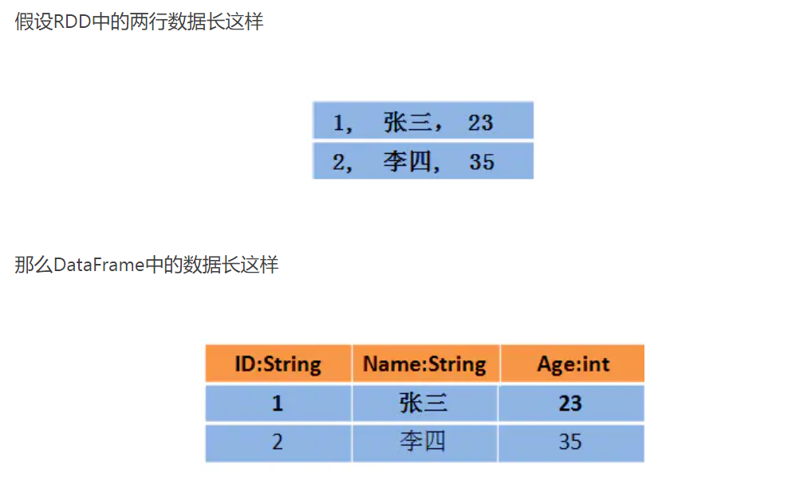
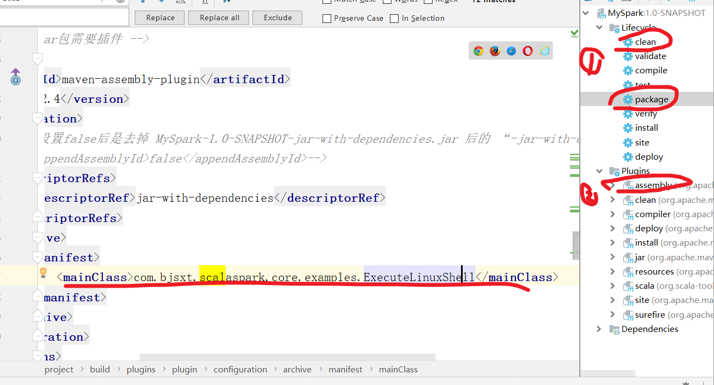

# SparkSql

# 1 介绍

## 1.1 shark -> ssql

```
#1，shark  （在1.2被舍弃）

交互性： hive的MR，换成了Spark      
       （shark速度快，SQL也是交互，但Hive不行）      
兼容性： 完全兼容hive的语法，同时还有新特性

问题：  底层是依赖hive的解析器，查询优化器，对hive依赖太强，
```


```
#2，sparksql (取代Shark)
优势：
	脱离HIVE，自己底层解析
	能直接查询原生的RDD     
	   （core操作是RDD,是core的核心，，不用把RDD变数据，然后再查看）
	能直接写SQL/HQL， 返回是Dataframe 
		(DF是个二维表，可转换成RDD[Row])
        (ssQL操作的是DF,是核心，同时也能转换成rdd，自身操作也像rdd)	

```


```
#3，综述
–    Hive on Spark    （shark）
    •    Hive承担了一部分计算（解析SQL，优化SQL...）的和存储 
    •    Spark作为了执行引擎的角
    
 –    Spark on Hive   （ssql）
    •    Hive只是作为了存储的角色 
    •    SparkSQL作为计算的角色 
```


## 1.2 Dataframe

```
#1,概述
DataFrame也是一个分布式数据容器，但像二维表  有（schema 列信息   和  数据）
DF 底层是 RDD[Row]类型，有比RDD更好的操作
DF 和 hive 一样，，也有嵌套数据结构：struct、array 和map
```


```
#2，展示
1） 第一张： 上面是整个DF 打印样子，，下面是schema

2）第二张  ： 和RDD对比 ：DF的数据可以直接取特定列
```


## 1.3 数据源 和 底层架构

```
#1，数据源
内置：
可以是JSON类型的字符串，JDBC,Parquent（一种压缩格式，hive就是用这个压缩）,Hive，HDFS等。

外：
# es可以做hbase 的 row索引，这样查hbase快
```


```
#2，底层架构  （简单看下就行）
首先拿到sql后解析一批未被解决的逻辑计划，再经过分析得到分析后的逻辑计划，再经过一批优化规则转换成一批最佳优化的逻辑计划，再经过SparkPlanner的策略转化成一批物理计划，随后经过消费模型转换成一个个的Spark任务执行。
```


## 1.4 谓词下推

```
就是换执行顺序的，，如果按顺序可能会慢同时数据大
```


# 2 创建操作DF

## 2.0  sql2.x 1.6区别

```
1）
Spark 1.6中 要创建SQLContext(SparkContext)  和 HiveContext
Spark2.0+ 使用的SparkSession(整合上面了)，用hive 只要再开启下就行

2）得到DataFrame后注册临时表不一样
spark1.6【df.registerTempTable】
spark2.0+【df.createOrReplaceTempView或者df.createOrReplaceGlobalTempView】

3）DataSet:
2.X 引入，，，json的RDD 以及被废弃
```


## 2.1 json格式文件

### 1）*基本测试*

```
#1，scala 写2.X

#数据  {"name":"wangwu1","age":18}

1) 2.X通过session，，两种读json文件  (类型是DF)
val spark = SparkSession.builder().appName("test").master("local").getOrCreate()

//val df: DataFrame = spark.read.json("./data/json")
val df = spark.read.format("json").load("./data/json")

2）展示DF （默认前20行） 和 schema
df.show(100)
df.printSchema()
#图1：
	列没有操作，按照ASCI，排序
	

3）像取出了纯数据  （Row 就像一行数据）
//val rows: Array[Row] = df.take(10)
//rows.foreach(println)
#图2：
就是打印数组


-----------------------------------------
#操作DF,返回DF

4.1）DF，api操作数据   （可以用到隐式来简便）        
 //select name ,age from table

#一般
val frame: DataFrame = df.select(df.col("name"),df.col("age"))
frame.show()

#隐式操作：
import spark.implicits._
val frame: DataFrame = df.select($"name".equalTo("zhangsan"),$"age")
frame.show()

#有操作，，列按照谁先选谁在前面

4.2）DF，用SQL语句操作   （要用到注册表  也就是视图）
    //select name ,age from table where age>18
df.createOrReplaceTempView("aaa")
df.createOrReplaceGlobalTempView("bbb")
val frame: DataFrame = spark.sql("select name,age from aaa where age>18")
frame.show()

val sparkSession1: SparkSession = spark.newSession()
sparkSession1.sql("select name,age from global_temp.bbb where age>18").show()


#表名不要给关键字
#全局表，可以不同session用，，使用要加前缀
```

#图1


#图2


```
#2，java  写1.6

1）通过SQLContext 读
SparkConf conf = new SparkConf();
conf.setMaster("local").setAppName("jsonfile");
SparkContext sc = new SparkContext(conf);
		
//创建sqlContext
SQLContext sqlContext = new SQLContext(sc);

--------------------------

2）一些展示等操作
       /**
		* DataFrame的底层是一个一个的RDD  RDD的泛型是Row类型。
		* 以下两种方式都可以读取json格式的文件
 		*/

DataFrame df = sqlContext.read().format("json").load("./sparksql/json");
//DataFrame df2 = sqlContext.read().json("sparksql/json");
df.show();

		/**
		 * 显示 DataFrame中的内容，默认显示前20行。如果现实多行要指定多少行show(行数)
		 * 注意：当有多个列时，显示的列先后顺序是按列的ascii码先后显示。
		 */
//		df.show(100);


		/**
		 * DataFrame转换成RDD
		 */
//		JavaRDD<Row> javaRDD = df.javaRDD();
		
		/**
		 * 树形的形式显示schema信息
		 */
		df.printSchema();

--------------------------

3）操作
		/**
		 * dataFram自带的API 操作DataFrame
		 */
  select name from table
//df.select("name").show();
  select name ,age+10 as addage from table
//df.select(df.col("name"),df.col("age").plus(10).alias("addage")).show();
  select name ,age from table where age>19
//df.select(df.col("name"),df.col("age")).where(df.col("age").gt(19)).show();

  select age,count(*) from table group by age
//df.groupBy(df.col("age")).count().show();

--------------------------

4）
		/**
		 * 将DataFrame注册成临时的一张表，这张表相当于临时注册到内存中，是逻辑上的表，不会雾化到磁盘
		 */
		 
df.registerTempTable("jtable");
DataFrame sql = sqlContext.sql("select age,count(*) as gg from jtable group by age");
sql.show();
DataFrame sql2 = sqlContext.sql("select name,age from jtable");
sql2.show();

sc.stop();
```


### 2）DF api

```
一些原生操作
import  spark.implicits._
val frame: DataFrame = df.select(df.col("name"))
val frame = df.select("name")
val frame = df.select("name","age")

val frame = df.filter($"age">18)//查找年龄大于18的人
val frame = df.filter(df.col("name").equalTo("zhangsan"))
val frame = df.filter("name='zhangsan4' or name = 'zhangsan5'")//可以写表达式

val frame = df.sort($"age".asc,$"name".desc)//按照age升序，按照name降序排列
val frame = df.sort(df.col("age").asc,df.col("name").desc)//按照age升序，按照name降序排列

val frame = df.select(df.col("name").as("studentName"),df.col("age").alias("studentAge"))//给定别名
val frame = df.select($"name".alias("studentName"),$"age")//给定别名
val frame = df.select($"name",($"age"+1).as("addAge"))//age+1之后，直接列名 成为了 age+1
val frame = df.groupBy("age").count()//按照age 分组


frame.show(100)
```


### 3）总结

```
#1，概述
总体就是 api操作 或者 临时表操作 
#前面已经介绍了前5
```


```
#2，补充

1) 两种嵌套   ：嵌套json   和  数组json            (1.6 和 2.X 都要)

1.1）嵌套json ：
#数据：{"name":"wangwu","score":80,"infos":{"age":23,"gender":'man'}}

#操作：
frame.printSchema()
frame.show(100)

#嵌套整体当做个列
#属性的值是json    ，类型是struct  

frame.createOrReplaceTempView("infosView")
spark.sql("select name,infos.age,score,infos.gender from infosView").show(100)
#嵌套列弄成两列


#总结：
struct类型，可以直接 总.列  取

```


```
1.2）嵌套数组json
#数据：
{
"name":"zhangsan","age":18,
"scores":[{"yuwen":98,"shuxue":90,"yingyu":100},{"dili":98,"shengwu":78,"huaxue":100}]  }
#一般数组内的json, key都是对应相同的，，，这样就像整体数据 其他都是公用的，，后面是变化的


#操作：
frame.show(false)
frame.printSchema()
#折叠truncate, 数组那嵌套列就显示不全了
#属性的值 是数组，数组里面是json    类型 array                  (array不能取用)


//一列嵌套数组   分开嵌套json
import org.apache.spark.sql.functions._
import spark.implicits._
val transDF: DataFrame = frame.select($"name", $"age", explode($"scores")).toDF("name", "age","allScores")
transDF.show(10,false)
transDF.printSchema()
#属性的值是 json  类型  struct  
#行变多了，因为把那个列拆开了


//把一列嵌套的json，，拆开
val result: DataFrame = transDF.select($"name",$"age",
            $"allScores.yuwen" as "yuwen",
            $"allScores.shuxue" as "shuxue",
            $"allScores.yingyu" as "yingyu",
            $"allScores.dili" as "dili",
            $"allScores.shengwu" as "shengwu",
            $"allScores.huaxue" as "huaxue"
    )
result.show(10)

#总结：
就是数组得，，先把他分散成行，，然后再和上面json嵌套一致
一般都是嵌套的列名字一样，要同类数组，，这个例子不是
```

#1 折叠不折叠图 ： 看有没有… 


#1 看最原始嵌套  ： 先是array,,然后struct


#2 看分散处理


#3 最终效果： 都是一列一列的了


```
#2，操作是DF，返回的也是DF，，同测试DF 和 RDD相互转化

val rdd: RDD[Row] = df.rdd
rdd.foreach(row=>{
	println(row)
      /**
        * row中获取值,两大类 
        *1) getAs[]("字段名")  或 getAs[](下标)
        *  #这种写法类型可以要写
        *2) 直接row()
        */
      val name = row.getAs[String]("name")
      val age = row.getAs[Long]("age")
      println("name = "+name+",age = "+age)

      val name1 = row(1)
      val age1 = row.getAs[Long](0)
      println("name1 = "+name1+",age1 = "+age1)
    })

#效果
[20,zhangsan]
name = zhangsan,age = 20
name1 = zhangsan,age1 = 20
```


## 2.2 json的DS,RDD

#2.X 只有DS读，，json的RDD已经废弃

### 1）DataSet

#### – 介绍DS

[介绍DS]: https://www.jianshu.com/p/77811ae29fdd

```
#1，概述

#特点：
用特定的编码 同时动态编码  和  操作的时候不需要数据反序列化成对象 （性能高）
有个强类型              （也是在RDD的每行数据加了类型约束）

#比较
相同：
与RDD类似，，几乎都有它的方法  （rdd 没有agg）
像DF的一列，默认列名是value，也有DF方法

不同： （也是引入DS的意义）
与RDD，加了强类型，给每行数据约束
与DF， DS提供了编译时的类型检查，DF只能等打包好后，运行发现错误

通过RDD创建DataFrame，再通过DataFrame转换成RDD，发现RDD的类型变成了Row类型
通过RDD创建Dataset，再通过Dataset转换为RDD，发现RDD还是原始类型
```




```
#2，三种方法创建DS

 import spark.implicits._


case class Student(name:String,age:Long)
#{"name":"wangwu1","age":18}

case class Person(id:Int,name:String,age:Int,score:Double)
#1,zhangsan,18,100

1）由集合创建DataSet   （RDD用的是makeRDD 和 paralle.）

    //直接映射成Person类型的DataSet
    val list = List[Person](
      Person(1,"zhangsan",18,100),
      Person(2,"lisi",19,200),
      Person(3,"wangwu",20,300)
    )
    val personDs: Dataset[Person] = list.toDS()
    #val v: RDD[Person] = spark.sparkContext.makeRDD(list)
    personDs.show(100)

    //直接由集合得到
    val value: Dataset[Int] = List[Int](1, 2, 3, 4, 5).toDS()
    value.show()


2) 由json文件和类直接映射成DataSet   (json文件，自动)
#前部分df，加了个as[类型]

    val lines: Dataset[Student] = spark.read.json("./data/json").as[Student]
    lines.show()


3）读取外部文件直接加载DataSet       (普通文件，手动)

val dataSet: Dataset[String] = spark.read.textFile("./data/people.txt")
val result: Dataset[Person] = dataSet.map(line => {
      val arr: Array[String] = line.split(",")
      Person(arr(0).toInt, arr(1).toString, arr(2).toInt, arr(3).toDouble)
    })
result.show()

#外部普通文件，，只能 XX.as[String] String 这一个类型，表示一行
（不写也行，还是是表示String）

```


```
#3，用DS实现WC
import spark.implicits._
import org.apache.spark.sql.functions._
1）准备数据
/**
      * 读取 集合创建DataSet  （可以自己构造数据）
      */
//    val jsonList = List[String](
//      "hello spark","hello sparksql","hello sparkStreaming"
//    )
//    val linesDs: Dataset[String] = jsonList.toDS()
//    linesDs.show()


    /**
      * 读取外部文件创建DataSet
      */
val linesDs: Dataset[String] = spark.read.textFile("./data/words").as[String]
val words: Dataset[String] = linesDs.flatMap(line=>{line.split(" ")})


2）操作

    /**
      * 使用DataSet api 处理
      * 这里需要导入隐式转换  ：spark.implicits._
      * 使用agg聚合中的聚合函数  ：import org.apache.spark.sql.functions._
      */

val groupDs: RelationalGroupedDataset = words.groupBy($"value" as "word")
val aggDs: DataFrame = groupDs.agg(count("*") as "totalCount")
val result: Dataset[Row] = aggDs.sort($"totalCount" desc)
aggDs.show(100)

	/**
      * 使用sql处理 ：弄临时表，然后写sql
      * 这里默认 words中有个 value列，withColumnRenamed 是给列重新命名
      */
      
val frame: DataFrame = words.withColumnRenamed("value","word")
frame.createOrReplaceTempView("myWords")
spark.sql("select word ,count(word) as totalCount from myWords group by word order by totalCount desc").show()
```


#### – *DS ->DF*

```
#用scala  写2.X


//转义
    val jsonList = List[String](
      "{\"name\":\"zhangsan\",\"age\":20}",
      "{\"name\":\"lisi\",\"age\":21}",
      "{\"name\":\"wangwu\",\"age\":22}"
    )
    val jsonList2 = List[String](
      "{\"name\":\"zhangsan\",\"score\":100}",
      "{\"name\":\"lisi\",\"score\":200}",
      "{\"name\":\"wangwu\",\"score\":300}"
    )


    /**
      * 2.3+版本
      */

    import spark.implicits._

//先构造出 json字符串 类型的DS
val jsonDs: Dataset[String] = jsonList.toDS()
val scoreDs: Dataset[String] = jsonList2.toDS()

//读取 json格式的 DS  ，，返回DF                                  ！！！！！！！！！！！
val df2: DataFrame = spark.read.json(jsonDs)
val df3 :DataFrame = spark.read.json(scoreDs)
df2.show()

//操作
df2.createOrReplaceTempView("person")
df3.createOrReplaceTempView("score")
val frame: DataFrame = spark.sql("select * from person")
frame.show()

spark.sql("select t1.name ,t1.age,t2.score from person  t1, score  t2 where t1.name = t2.name").show()

```


### 2）*rdd->DF*

```
#用scala  写1.6   ：已经被丢弃

/**
      * 1.6版本方式
      */
//构建json 的RDD      
val jsonRDD: RDD[String] = spark.sparkContext.parallelize(jsonList)
//读取
val df1: DataFrame = spark.read.json(jsonRDD)
df1.show(100)
```


### 3）总结

```
#Spark1.6中读取json格式的RDD,Spark2.0+只有读取json格式的DataSet

操作都是：直接用spark.read.json (RDD/DS)，，返回DF
```


---


## 2.3 *非js的RDD*

```
#非rdd  ->DF  ： 有两种 :反射 或者 动态 
             (前者是直接变成变成类的类型，后者是row)
			（1.6 和 2.X基本没区别）
			（java 与 scala 写法有一点区别）
```


```
#1，反射 ：Reflection
#步骤：
RDD转换成自定义类型RDD
RDD 映射 DF

1）scala 2.X
val rdd: RDD[String] = spark.sparkContext.textFile("./data/people.txt")

#转化
val personDs: RDD[Person] = rdd.map(one => {
      val arr = one.split(",")
      Person(arr(0).toInt, arr(1).toString, arr(2).toInt, arr(3).toDouble)
    })

#RDD->DF
val frame: DataFrame = personDs.toDF()
frame.show()

/**
      * dataFrame api 操作
      */
    frame.createOrReplaceTempView("people")
    val teenagersDF: DataFrame = spark.sql("SELECT name, age FROM people WHERE age BETWEEN 13 AND 19")
    teenagersDF.show()
    //根据row中的下标获取值
    teenagersDF.map(teenager => "Name: " + teenager(0)).show()
    //根据row中的字段获取值
    teenagersDF.map(teenager => "Name: " + teenager.getAs[String]("name")).show()

------------------------------------
 
2）1.6
#java  :就映射不同：sqlContext.createDataFrame(personRDD, Person.class);
#scala :完全一模一样 可以toDF
```


```
#2,动态  ： Schema
#步骤：
RDD 转换成Row类型RDD
然后指定属性,,  （位置要保证对应）
然后映射

1）scala 2.X
val rowRDD: RDD[Row] = peopleRDD.map(one => {
      val arr: Array[String] = one.split(",")
      Row(  arr(0).toInt, arr(1), arr(2).toInt, arr(3).toLong )
    })

val structType: StructType = StructType(List[StructField](
      StructField("id", IntegerType, nullable = true),
      StructField("name", StringType, nullable = true),
      StructField("age", IntegerType, nullable = true),
      StructField("score", LongType, nullable = true)
    ))

val frame: DataFrame = spark.createDataFrame(rowRDD,structType)
    frame.show()
    frame.printSchema()

------------------------------------
 
 2）1.6
 scala 还是一样
 java：
 	用RowFactory.create  来转换类型  scala 也有，不过直接用2.X的更方便更方便
    和属性不同。
    映射一样
```


## 2.4 *parquet格式*

```
#和读json类型
val df: DataFrame = spark.read.parquet("./data/parquet")
val df: DataFrame = spark.read.format("parquet").load("./data/parquet")
```


## 2.5 *Mysql*数据

```
#1，测试

# scala  写 2X ： 主要看那个分区参数的影响   和  四种mysql写法

1）先配置
val spark = SparkSession.builder().master("local").appName("createdataframefrommysql")
      .config("spark.sql.shuffle.partitions",1)
      .getOrCreate()
//    spark.sparkContext.setLogLevel("Error")   （关闭日志，就看到那个分区了）


2）四种写法
    /**
      * 读取mysql表第一种方式
      */
    val properties = new Properties()
    properties.setProperty("user", "root")
    properties.setProperty("password", "123456")
    val person: DataFrame = spark.read.jdbc("jdbc:mysql://192.168.179.4:3306/spark","person",properties)
    person.show()

    /**
      * 读取mysql表第二种方式
      */
    val map = Map[String,String](
      "url"->"jdbc:mysql://192.168.179.4:3306/spark",
      "driver"->"com.mysql.jdbc.Driver",
      "user"->"root",
      "password"->"123456",
      "dbtable"->"score"//表名
    )
    val score: DataFrame = spark.read.format("jdbc").options(map).load()
    score.show()

    /**
      * 读取mysql数据第三种方式
      */
    val reader: DataFrameReader = spark.read.format("jdbc")
      .option("url", "jdbc:mysql://192.168.179.4:3306/spark")
      .option("driver", "com.mysql.jdbc.Driver")
      .option("user", "root")
      .option("password", "123456")
      .option("dbtable", "score")
    val score2: DataFrame = reader.load()
    score2.show()

    //将以上两张表注册临时表，关联查询
    person.createOrReplaceTempView("person")
    score.createOrReplaceTempView("score")
    spark.sql("select person.id,person.name,person.age,score.score from person ,score where  person.id = score.id").show()


    /**
      * 读取mysql中数据的第四种方式  : “ ( select  XX  )  T”
      */
    spark.read.jdbc("jdbc:mysql://192.168.179.4:3306/spark","(select person.id,person.name,person.age,score.score from person ,score where  person.id = score.id) T",properties).show()

```


```
#2,总结

1）参数
"spark.sql.shuffle.partitions" ：当 shuffle  for join 或者agg 的分区情况 
 #默认值是200，太大了,就算空分区，也会跑task 


2）四种创建

spark.read.jdbc :  通过( URL , " 表名 或者 SQL语句 "   ,Properties)
spark.read.format("jdbc").option(map) or ...  : 一个map 或者 多个option
```


##   2.6 Hive

### 1）spark on hive

#### - 搭建


```
1）准备
#节点：
n3 : hive服务端  n4：hive客户端  
(现在的操作是  让spark客户端也当Hive客户端  能找到metastore，从而操作 hive)

#启动：
启动zk,hdfs
启动standalone 集群   和 master-HA 
hive --service metastore &   :后台运行 :显示runjar进程说明成功

2）spark客户端配置
#hive的客户端 发hive-site.xml  给 spark客户端
修改hive-site:
	只留下连接hive 的服务端地址
修改log4j.properties:
	log4j.logger.org.apache.spark.repl.Main  改成INFO 显示  打印级别，能看到耗时等信息

```


#### - 测试

```
#就是看看统一操作，，hive原生  和 spark on hive 的速度

1）hive:
#连接： 直接输入hive
show tables;
select count(*) from XX; 

2）spark on hive:
#连接 ：  bin: ./spark-shell --master spark://node2:7077,node3:7077 
spark.sql("select tables").show();
spark.sql("select count(*) from XX").show();
#说明：
	2.X 中shell,sparkSession创建好了spark,  且操作还是.sql(" ") 返回DF，然后.show()
	1.6 中：hiveContext.sql("")


3）结果说明
90W+数据 ：  150s+  40s+    
```

#show  的结果展示


#时间结果


### 2）*hive ->DF*

2.X 用scala

#### - 集群

```
#1，代码  

1）准备  ：开启enableHiveSupport()
val spark = SparkSession.builder().appName("CreateDataFrameFromHive").enableHiveSupport().getOrCreate()

2.1) spark.sql 操作 HQL语句                   （新操作）

2.1.1) 操作HQL 的DDL  ：返回DF                 
spark.sql("use spark")
spark.sql("drop table if exists student_infos")
spark.sql("create table if not exists student_infos (name string,age int) row format  delimited fields terminated by '\t'")
spark.sql("load data local inpath '/root/test/student_infos' into table student_infos")

spark.sql("drop table if exists student_scores")
spark.sql("create table if not exists student_scores (name string,score int) row format delimited fields terminated by '\t'")
spark.sql("load data local inpath '/root/test/student_scores' into table student_scores")

2.1.2）操作HQL 的DML  ： 返回DF
val df = spark.sql("select si.name,si.age,ss.score from student_infos si,student_scores ss where si.name = ss.name")
df.show(100)

----------------

2.2）spark.sql 操作 SQL                       （老操作了）

val frame: DataFrame = spark.table("student_infos")           // 直接加载整个表
frame.show(100)  
frame.createTempView("a")                 
spark.sql("select * from a")               

spark.sql("drop table if exists good_student_infos")

	/**
      * 将结果写入到hive表中
      */
    df.write.mode(SaveMode.Overwrite).saveAsTable("good_student_infos")
```

```
#总结： (2.X)
操作hive ， 还是用spark.sql就行 ：             （不过要开启.enableHiveSupport()）
可以直接弄上hql   或者spark.table  直接整个表 ，
还是返回DF
```


```
#2，运行

1) 介绍
开启支持
没有写master  和 app   就是集群模式   --->  自己找配置，集群中能找到

2）准备：
hive先建库
把两个数据文件丢 spark客户端 /root/test目录下

3）打包：jar
#第一种：原生的： clean 先清除target，，然后package  生成 target目录 （有错就是scala版本）
#第二种：利用插件，，还可以配置主类，这样提交的时候就不用写了

4）提交
spark客户端 bin ： ./spark-submit --master spark://url  --class  jar（最长名字那个有依赖的）
```




#### - 本地

```
#1,代码
val spark = SparkSession.builder().appName("CreateDataFrameFromHive").master("local").enableHiveSupport().getOrCreate()

#其他一致
```

```
#2，运行
#一般不，压力太大了
添加配置文件  ：   resoucre 目录下 加hive-site  core-site  hdfs-site  （自动加载这个目录）
可能报错内存问题：   自己适当调整下
-server -Xms512M -Xmx1024M -XX:PermSize=256M -XX:MaxNewSize=512M -XX:MaxPermSize=512M
```


#### - 用 java写1.6 

```
#1，代码
SparkConf conf = new SparkConf();
JavaSparkContext sc = new JavaSparkContext(conf);  
HiveContext hiveContext = new HiveContext(sc);

hiveContext.sql("XXXX");   (一定要有hiveContext ,,是sc 的子类)
```

```
#2，运行

1）本地
把那三个文件放在src目录下

2）集群
export： 选特定那个包 和文件，，然后下一步写上主类，，就不用提交的时候写了
```


# 3 保存DF

## 3.1 json

```
df1.write.mode(SaveMode.Append).format("json").save("./data/tt")

#数据图：
```


## 3.2 parquet

```
df1.write.mode(SaveMode.Append).format("parquet").save("./data/parquet")

#mode参数：
Append, Overwrite, ErrorIfExists（有文件就报错）, Ignore（有文件就不写了，）

#数据如上类似
```

## 3.3 mysql表

```
#表自动创建，可以先不存在 (但类型都是默认的)


//将结果保存在Mysql表中,String 格式的数据在MySQL中默认保存成text格式，如果不想使用这个格式 ，可以自己建表创建各个列的格式再保存。
val result: DataFrame = spark.sql("select person.id,person.name,person.age,score.score from person ,score where  person.id = score.id")
    result.write.mode(SaveMode.Overwrite).jdbc("jdbc:mysql://192.168.179.4:3306/spark", "result", properties)
    

#建表语句：
create table table_name( id VARCHAR(12) , age INT(10) ); 等等类似的
```


----

## 3.4 hive表

```
#表自动创建，可以不先存在
df.write.mode(SaveMode.Overwrite).saveAsTable("good_student_infos")
```


# 4 函数

## 4.1 UDF

```
#user defined function ：一对一
#实现： 
   注册(func_name  , 匿名操作类（传参，输出一个），java还有类型参数  ) 


#1，scala 2.X

1）scala：  list也可以直接 toDF("列名")
val spark = SparkSession.builder().master("local").appName("UDF").getOrCreate()
val nameList: List[String] = List[String]("zhangsan", "lisi", "wangwu", "zhaoliu", "tianqi")
import spark.implicits._
val nameDF: DataFrame = nameList.toDF("name")

2）操作 ： 执泥匿名类写
nameDF.createOrReplaceTempView("students")
spark.udf.register("STRLEN",(n:String)=>{
      n.length
    })
spark.sql("select name ,STRLEN(name) as length from students sort by length desc").show(100)
 
```

```
#2，java  1.6

1）java 动态一系列：list –> RDD<Row> -> 创建成DF

JavaRDD<String> parallelize = 
sc.parallelize(Arrays.asList("zhangsan","lisi","wangwu"));

JavaRDD<Row> rowRDD = parallelize.map(new Function<String, Row>() {

			private static final long serialVersionUID = 1L;
			@Override
			public Row call(String s) throws Exception {
				return RowFactory.create(s);
			}
		});
List<StructField> fields = new ArrayList<StructField>();
fields.add(DataTypes.createStructField("name", DataTypes.StringType,true));
StructType schema = DataTypes.createStructType(fields);
DataFrame df = sqlContext.createDataFrame(rowRDD,schema);
df.registerTempTable("user");

2）操作
sqlContext.udf().register("StrLen", new UDF1<String,Integer>() {

			private static final long serialVersionUID = 1L;

			@Override
			public Integer call(String name) throws Exception {
				return name.length();
			}
		}, DataTypes.IntegerType);
		
sqlContext.sql("select name ,StrLen(name) as length from user").show();

#传入几个参数，调用UDF1,2,.。。最多22
#lamda 表达式：可以简化
```


## 4.2 UDAF


```
#1，概述
多对一 ：聚合
SQL中 ：聚合后面要加group by 和 聚合一起的列 要写在group by后面

实现  ： （比UDF麻烦）
	注册("NAMECOUNT",new 类A)
	类A要继承UserDefinedAggregateFunction抽象类，
	     实现3个关键方法，5个辅助方法
```


```
#2，操作
#例子是自定义个count 用来WC

1）scala 实现2.X

#整体框架：
object UDAF {
  def main(args: Array[String]): Unit = {
   #数据和上面类似，就是一列的名字


	spark.udf.register("NAMECOUNT",new UserDefinedAggregateFunction(){

    })
    spark.sql("select name,NAMECOUNT(name) as count from students group by name").show(100)
  }
  
  
#实现类：
class MyUDAF extends UserDefinedAggregateFunction  {
   //输入数据的类型                                                  、、、、
  def inputSchema: StructType = {
    DataTypes.createStructType(Array(DataTypes.createStructField("uuuu", StringType, true)))
  }
  // 为每个分组的数据执行初始化值                                        ！！！！
  def initialize(buffer: MutableAggregationBuffer): Unit = {
    buffer(0) = 0
  }
  // 每个组，有新的值进来的时候，进行分组对应的聚合值的计算                  ！！！！
  def update(buffer: MutableAggregationBuffer, input: Row): Unit = {
    buffer(0) = buffer.getAs[Int](0)+1
  }
  // 最后merger的时候，在各个节点上的聚合值，要进行merge，也就是合并         ！！！！
  def merge(buffer1: MutableAggregationBuffer, buffer2: Row): Unit = {
    buffer1(0) = buffer1.getAs[Int](0)+buffer2.getAs[Int](0)
  }
  // 聚合操作时，所处理的数据的类型									   、、、、
  def bufferSchema: StructType = {
    DataTypes.createStructType(Array(DataTypes.createStructField("xxxs", IntegerType, true)))
  }
  // 最后返回一个最终的聚合值要和dataType的类型一一对应					、、、、
  def evaluate(buffer: Row): Any = {
    buffer.getAs[Int](0)
  }
  // 最终函数返回值的类型												、、、、
  def dataType: DataType = {
    DataTypes.IntegerType
  }
  //多次运行 相同的输入总是相同的输出，确保一致性							、、、、
  def deterministic: Boolean = {
    true
  }
}
```


```
#详细解释：

//没有用到具体的值内容，都是有个值算1，这么计算的

~ 重要方法

{
​  初始化： 两个部分  
	map，： 每个RDD  ,都有所有分区，都初始化为0
	re:    总的分区   做初始化为0

​  更新:    逻辑是小分区  累加有多个  
   这例子没有用到input
   是一个RDD 的一个分区  来一个自己的数据更新一下，得到自己的总值

​  合并：  逻辑是 大分区   累加小区的数据
   每个分区拉取  所有自己的东西总值 ，，，然后得到这个分区的总结果

}

~ 辅助方法
{
​ 输入类型
​ 聚合的时候类型

​ 最终的结果  用Row包着
​ 最终结果的类型

​ 保证一致性  : true
}
```


```
2） java 1.6X
#前面依旧是list–>RDD-->DF

sqlContext.udf().register("StringCount",new UserDefinedAggregateFunction() {
			
			/**
			 * 
			 */
			private static final long serialVersionUID = 1L;
			
			/**
		1	 * 初始化一个内部的自己定义的值,在Aggregate之前每组数据的初始化结果
			 */
			@Override
			public void initialize(MutableAggregationBuffer buffer) {
				buffer.update(0, 0);
			}


			/**
			 * 更新 可以认为一个一个地将组内的字段值传递进来 实现拼接的逻辑
		2	 * buffer.getInt(0)获取的是上一次聚合后的值
			 * 相当于map端的combiner，combiner就是对每一个map task的处理结果进行一次小聚合 
			 * 大聚和发生在reduce端.
			 * 这里即是:在进行聚合的时候，每当有新的值进来，对分组后的聚合如何进行计算
			 */
			@Override
			public void update(MutableAggregationBuffer buffer, Row arg1) {
				buffer.update(0, buffer.getInt(0)+1);
				
			}
			/**
	3		 * 合并 update操作，可能是针对一个分组内的部分数据，在某个节点上发生的 但是可能一个分组内的数据，会分布在多个节点上处理
			 * 此时就要用merge操作，将各个节点上分布式拼接好的串，合并起来
			 * buffer1.getInt(0) : 大聚合的时候 上一次聚合后的值       
			 * buffer2.getInt(0) : 这次计算传入进来的update的结果
			 * 这里即是：最后在分布式节点完成后需要进行全局级别的Merge操作
			 */
			@Override
			public void merge(MutableAggregationBuffer buffer1, Row buffer2) {
				buffer1.update(0, buffer1.getInt(0) + buffer2.getInt(0));
			}
			/**
			 * 在进行聚合操作的时候所要处理的数据的结果的类型
			 */
			@Override
			public StructType bufferSchema() {
				return DataTypes.createStructType(Arrays.asList(DataTypes.createStructField("bffer22", DataTypes.IntegerType, true)));
			}
			/**
	5		 * 最后返回一个和dataType方法的类型要一致的类型，返回UDAF最后的计算结果
			 */
			@Override
			public Object evaluate(Row row) {
				return row.getInt(0);
			}
			/**
	6		 * 指定UDAF函数计算后返回的结果类型
			 */
			@Override
			public DataType dataType() {
				return DataTypes.IntegerType;
			}
			/**
	7		 * 指定输入字段的字段及类型
			 */
			@Override
			public StructType inputSchema() {
				return DataTypes.createStructType(
						Arrays.asList(
								DataTypes.createStructField("name111", DataTypes.StringType, true)
						));
			}
			/**
	8		 * 确保一致性 一般用true,用以标记针对给定的一组输入，UDAF是否总是生成相同的结果。
			 */
			@Override
			public boolean deterministic() {
				return true;
			}
			
		});
```


## 4.3 开窗函数

```
#1, 概述
业务:    每个类别下的价格top3  的日期
数据：  
		1  A  10
		1  B  9
        2  A  11  ...

实现：
	#core： 分组取TOP-n  但是带了多余的列，有点麻烦
	#sql :  over 开窗函数  （hive  and  mysql (8以上) 创建DF  ）
           (格式row_number() over (partitin by XXX order by XXX)
            分组排序了，，还有个组内下标从1开始，，最后能像top-N,,  这个就像个辅助东西
            )
```


```
#2，实现

1）hive
#创造数据
val spark = SparkSession.builder().appName("over").enableHiveSupport().getOrCreate()
spark.sql("use spark")
spark.sql("create table if not exists sales (riqi string,leibie string,jine Int) " + "row format delimited fields terminated by '\t'")
spark.sql("load data local inpath '/root/test/sales' into table sales")

#读取数据

val result = spark.sql(    
 "select riqi,leibie,jine "
 + "from ("
    + "select "
    +"riqi,leibie,jine," + "row_number() over (partition by leibie order by jine desc) rank "
    + "from sales) t "
 + "where t.rank<=3")
 
result.write.mode(SaveMode.Append).saveAsTable("salesResult")
result.show(100)

#运行：
~ 现有数据库，导入数据 
~ 打包spark on hive  运行
./spark-submit --master spark://node2:7077,node3:7077 --class com.bjsxt.scalaspark.sql.windows.OverFunctionOnHive ../examples/jars/Myspark-1.0-SNAPSHOT-jar-with-dependencies.jar

```


```
#目前问题：
在spark-shell运行，没有问题，说明集群没啥问题，
但是打成jar包，，就报找不到，，，？？？？不知道为啥
```


-------------------


```
2）mysql  ： 第四种方式： table 是个SQL语句
val spark = SparkSession.builder().master("local").appName("overfunctioonmysql").getOrCreate()
val properties = new Properties()
properties.setProperty("user", "root")
properties.setProperty("password", "123456")

#其他知识：mysql -uroot -p123456


val sql = "select  riqi,leibie,jine from " 
 + "(select riqi,leibie,jine, row_number() over (partition by leibie order by jine desc) as 'rank'  " 
 +"from sales) t  where t.rank<=3"

val person: DataFrame = spark.read.jdbc("jdbc:mysql://192.168.179.101:3306/spark",s"($sql) T",properties)
person.show()
```

