# SparkStreaming

# 1 初始

## 1.1 介绍

### 1）简介

```
#是流式处理框架，是Spark API的扩展，支持可扩展、高吞吐量、容错的"实时"数据流处理 
#数据来源： 
	Kafka, Flume, Twitter, ZeroMQ或者TCP sockets
#数据处理：
	以使用高级功能的复杂算子
#数据存储：
	以存放在文件系统，数据库等，方便实时展现
```

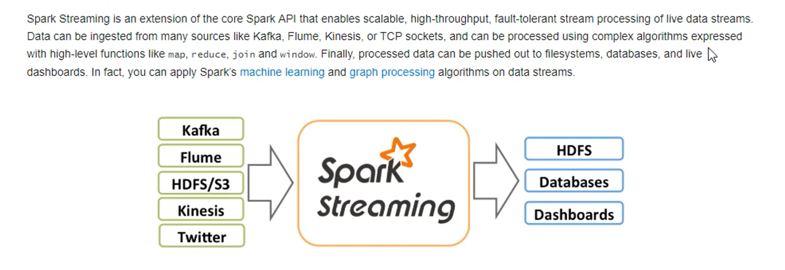


### 2）与storm

```
2区别：
1） 微批
2） storm 因为只拿一条，所以简单汇总任务，，，
3)  stream 可以手动管理事务，，storm 自动保证数据一定都读了，更完善
4）都可以动态申请资源  （粗细粒度要资源，）

```

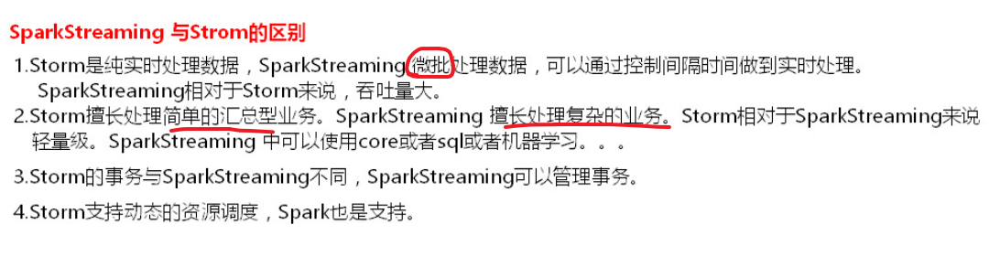


## 1.2  *监控端口WC例子*

## *print 和 foreachRDD*

### 1）原理图

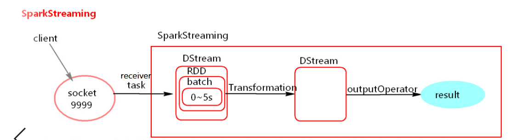


```
#注意：
1）流程：
streaming 7*24小时一直开启 ,streaming启动后，
开启个receiver task，用来监控端口数据  （每隔一段时间batchInterval，将数据弄到bacth里面）
batch没有分布式计算特性，这一个batch的数据又被封装到一个RDD中，RDD最终封装到一个DStream中
streaming底层操作 的是DSt,, 先经过tran算子（懒） ，然后opo算子（类似action算子，触发）

(等全收集完这个批次内的数据，才给下一步处理)

2）batchInterval 与 处理时间p 的讨论

b > p  ： 处理能力强，资源不能充分利用
b < p  ： 处理能力弱，如果接受数据设置的级别是仅内存，数据会越堆积越多，导致OOM（
					如果设置StorageLevel包含disk, 则内存存放不下的数据会溢写至disk, 加大延迟 

```


### 2）操作

#WC，，但每次只是统计这个批次的，

#### --代码

```
#1，代码
1) 准备ssc
val conf = new SparkConf()
conf.setMaster("local[2]")    #两个线程
conf.setAppName("streamingTest")

val ssc = new StreamingContext(conf,Durations.seconds(5))  #批次间隔5S
ssc.sparkContext.setLogLevel("Error")
//val sc = new SparkContext(conf)         #两种创建方式
//val ssc = new StreamingContext(sc,Durations.seconds(5))
 //sc.setLogLevel("Error")

2) 算子逻辑： 
  STS(监听数据) =>   fm—>  map —> redbykey–>print（触发算子）（后面都要操作DSt）
  #一个线程  把一个批次时间内的所有数据  给stream处理
  
val lines: ReceiverInputDStream[String] = ssc.socketTextStream("node4",9999)

val words: DStream[String] = lines.flatMap(one=>{one.split(" ")})
val pairWords: DStream[(String, Int)] = words.map(one=>{(one,1)})
val result: DStream[(String, Int)] = pairWords.reduceByKey((v1:Int, v2:Int)=>{v1+v2})
//result.print(100)       

3）foreachRDD 算子：里面也要有action算子，才能触发里面逻辑，同时又触发stream逻辑
result.foreachRDD(wordCountRDD=>{

      println("******* produce in Driver *******")

      val sortRDD: RDD[(String, Int)] = wordCountRDD.sortByKey(false)
      val result: RDD[(String, Int)] = sortRDD.filter(tp => {
        println("******* produce in Executor *******")
        true
      })
      result.count()
    })


4) ssc操作
ssc.start()                             #激活
ssc.awaitTermination()                  #等，然后往上循环
//ssc.stop(stopSparkContext= false)     #运行不到这里
```


```
#2，运行
1）节点启动，并开始输入数据
nc -lk 9999

2）运行代码，查看结果
#没有显示结果：
    因为如果是一个local，只有一个线程，一直来接受数据，没有处理的
    或者foreachRDD算子 里面没有act算子

3）效果：
#print 算子
 ~当没有数据的时候，啥也没有反应，就一直打印时间间隔
 ~有数据的时候， 监听线程把一个时间间隔内的数据，发送给stream处理，，
 #每次只处理本批次的数据
```

#没有数据

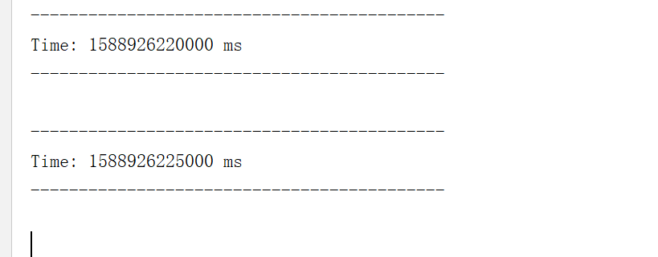

#有数据，，前5秒输入上面，后5S输入下面


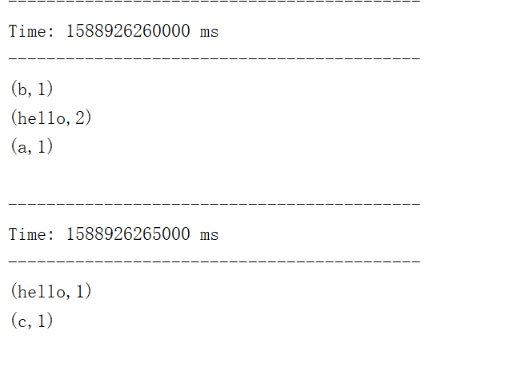

```
#foreachRDD 算子
	~当没有数据的时候，非RDD算子逻辑 的代码也会执行，，因为是这部分在D中执行
 	~有数据的时候， 就正常操作
 #可以说明DSt 里面包含着RDD，里面要有act算子来触发内外
```

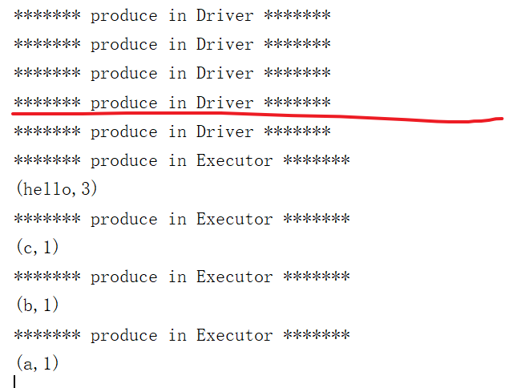

#### --UI分析

```
#讨论批次时间设置
WEBUI :4040  (之前 spark 的jobUI  多了streaming)

#1，介绍UI

#上：(左边都可以点，点了就跳到下具体的表格  ，  右边是分布条状图)

Input :  输入数据
Delay :  每个batch job submit前准备时间
Processing:  处理时间  
total  上面两个加起来的时间


#中
Active : 还有多少bacthes 没有处理

#下：
具体表格数据

```

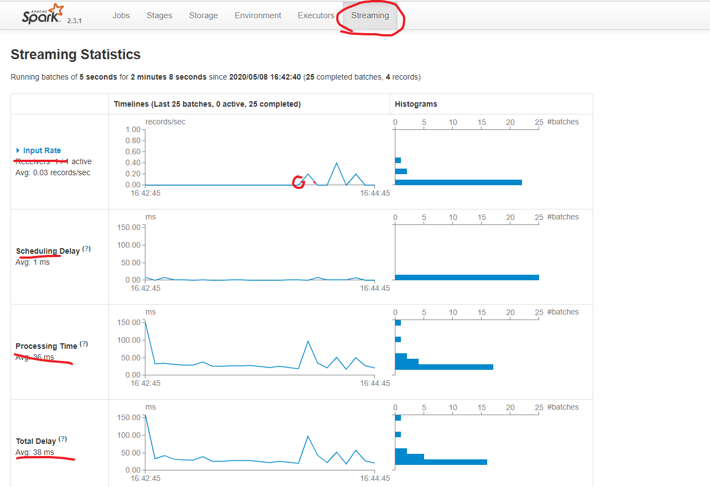

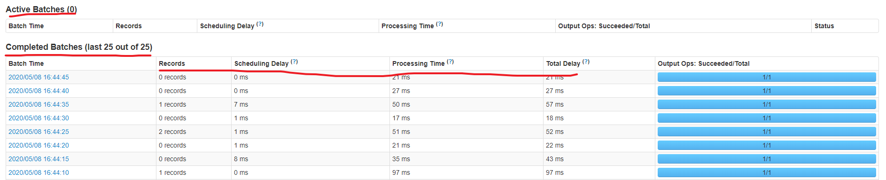

```
#2，结论
#现象
当 中间active 有大量显示，， 上面图不是平稳下降，是上升 --->  说明有任务堆积

#解决： (现在已经是 B < P ，，P的能力不足 )
 ~批次调小  ：  因为处理的能力弱，所以要给小点数据，，不然你批次调大，处理时间也大，永远跟不上 
										  （调小，还有可能追上）

 ~如果不让调批次：那只能加后面处理流程的资源

```


#### --总结

```
拿来求一个批次的WC

#1，框架层面的 
1） 需要设置local[2]， receiver模式下接受数据 ，必须有个单独的线程是读取数据
2） 创建StreamingContext两种方式，
    (conf,Durations) ：不能再new SparkContext(里面已经包括了)
    (sc  , Durations)
3)  Durations 批次间隔时间的设置,可以同WEBUI 来看
4） SparkStreaming    需要有一个output operato操作
5)  streamingContext.start()  框架启动之后是不能在次添加业务逻辑
6)  StreamingContext.stop()   stop 在例子中没法自己调用，同时stop后面不能再start（被销毁对象）
     默认为true ,将sparkContext一同关闭
     stop(false) 不一同


#2，算子介绍
#其他算子都和之前的类似
1）print(num): 触发算子   （打印该DSt 的几个数据）  （图就是有打印显示时间的UI）

2）foreachRDD：触发算子   （拿到DSt里面RD--> 用RDD的算子操作）
  *RDD算子操作外的代码， 是在Driver端执行的，可以利用这点做到动态的改变广播变量 
  *RDD的action算子触发内外逻辑执行，不然DStream的逻辑也不会执行 ，在EX执行，没有数据，不执行

```


```
#java 写 1.6

SparkConf conf = new SparkConf().setMaster("local[2]").setAppName("WordCountOnline");
/**
 * 在创建streaminContext的时候 设置batch Interval
 */
JavaStreamingContext jsc = new JavaStreamingContext(conf, Durations.seconds(5));

JavaReceiverInputDStream<String> lines = jsc.socketTextStream("node5", 9999);


JavaDStream<String> words = lines.flatMap(new FlatMapFunction<String, String>() {
	/**
	 * 
	 */
	private static final long serialVersionUID = 1L;

	@Override
	public Iterable<String> call(String s) {
           return Arrays.asList(s.split(" "));
	}
});

JavaPairDStream<String, Integer> ones = words.mapToPair(new PairFunction<String, String, Integer>() {
	/**
	 * 
	 */
	private static final long serialVersionUID = 1L;

	@Override
	public Tuple2<String, Integer> call(String s) {
          return new Tuple2<String, Integer>(s, 1);
	}
});

JavaPairDStream<String, Integer> counts = ones.reduceByKey(new Function2<Integer, Integer, Integer>() {
	/**
	 * 
	 */
	private static final long serialVersionUID = 1L;

	@Override
	public Integer call(Integer i1, Integer i2) {
           return i1 + i2;
	}
});
 
//outputoperator类的算子   
 counts.print();
  
 jsc.start();
 //等待spark程序被终止
 jsc.awaitTermination();
 jsc.stop(false);
	
```


# 2 算子操作

## 2.1 算子概述

### 1）transformation

#红线在spark是act算子

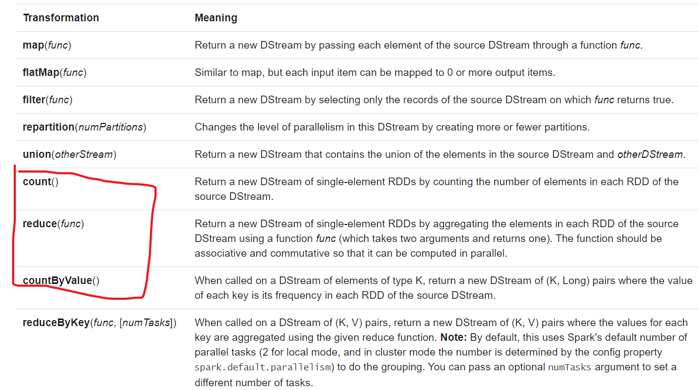

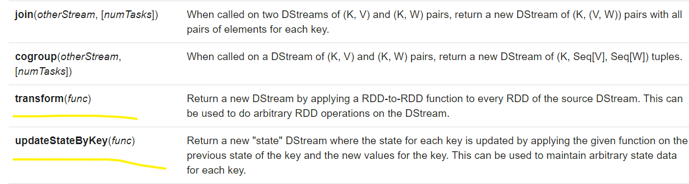

### 2）outputoperation

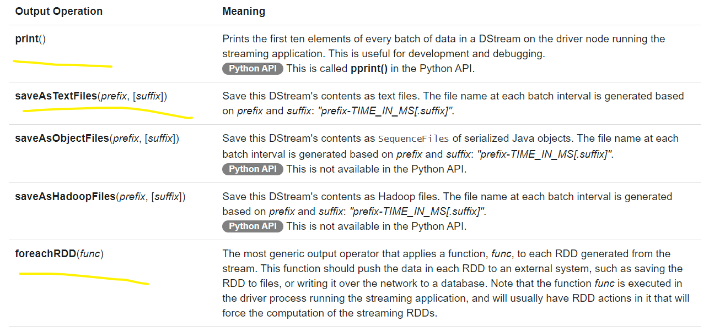


### 3）持久化

```
#1，checkpoint
这个只是表名要存储，，还要看后面要不要操作，要看逻辑代码，，操作结果就能留下，不操作了，和没有一样
（就是看到数据的存活周期）
```


## 2.2 *计算总WC例子*

## *UpdateStateByKey*

#只会计算从这次开启streaming后，，总的WC

### 1）操作

```
#1，代码

1) 准备ssc
val conf = new SparkConf()
conf.setMaster("local[2]")
conf.setAppName("UpdateStateByKey")
val ssc = new StreamingContext(conf,Durations.seconds(5))
ssc.sparkContext.setLogLevel("ERROR")


2）算子逻辑：  fm—>  map —> update(tran算子) –>print

2.1）前面准备
val lines: ReceiverInputDStream[String] = ssc.socketTextStream("node4",9999)

    val words: DStream[String] = lines.flatMap(line=>{line.split(" ")})
    val pairWords: DStream[(String, Int)] = words.map(word => {(word, 1)})

2.2） 更新算子 (tran算子)
//ssc.checkpoint("./data/streamingCheckpoint")             #开启
ssc.sparkContext.setCheckpointDir("./data/streamingCheckpoint")

	/**
      * currentValues :当前批次某个 key 对应所有的value 组成的一个集合 Seq[]
      * preValue : 以往批次当前key 对应的总状态值Option[]
      * 能拿到之前的总值，，然后这个批次的同key下的所有值的集合，，然后遍历操作，返回这次的总值
      */
 
val result: DStream[(String, Int)] = pairWords.updateStateByKey((currentValues: Seq[Int], preValue: Option[Int]) => {
      var totalValues = 0
      if (!preValue.isEmpty) {
        totalValues += preValue.get
      }
      for(value <- currentValues){
        totalValues += value
      }

      Option(totalValues)
    })
   
2.3） 触发
result.print()

3) ssc操作
ssc.start()
ssc.awaitTermination()
ssc.stop()
```


```  
#2，运行

1）运行效果
#没有目录，也没事会自动创建，，有了目录有数据清不清空也没事，不会影响
#效果：
  一开始没数据，没数据
  有了数据后，计算本批次，同时后面能一直显示总值
  在下 下个批次操作，能正确显示    (CP:  总值先在内存，过会才写磁盘磁盘)
  （没有数据输入，也会一直打印当前的总值）
```

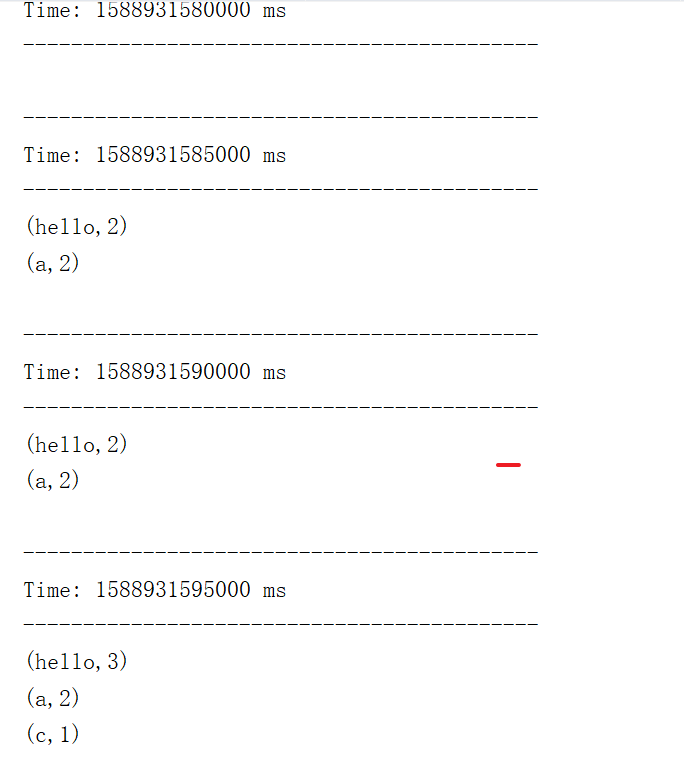

```
2）目录展示
#我是测试了三次启停streaming， 发现总值WC只是本次streaming的，
#每次的cp都有自己的目录
```

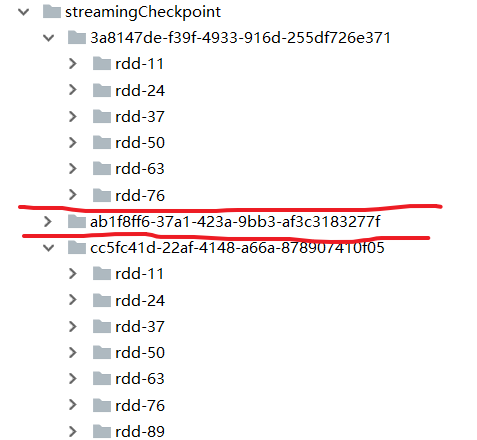

### 2）总结

```
拿来 计算的本次开启streaming后的总WC （之前开启的streaming的总值，不包括）

#1，
#UpdateStateByKey算子 ：tran算子
1）配合：两种方法开启checkpoint   （不然报错）

2）内容：(currentValues: Seq[Int], preValue: Option[Int])=> {更新的逻辑操作}

3）总值保存： 
 计算得出后，是在内存，，然后一段时间后会保存在磁盘 (个人理解，找总值：先内存，然后再找磁盘，找最新的)
   batchInterval设置的时间小于10秒，那么10秒写入磁盘一份。
   batchInterval设置的时间大于10秒，那么就会batchInterval时间间隔写入磁盘一份。
   （防止频繁写IO）
   （个人理解：因为你每次bacth都会拿到当前的总值在内存，所以其实这个例子中，一直是从内存恢复的）
```


```
#2，java 写1.6
	public static void main(String[] args) {
		SparkConf conf = new SparkConf().setMaster("local[2]").setAppName("UpdateStateByKeyDemo");
		JavaStreamingContext jsc = new JavaStreamingContext(conf, Durations.seconds(5));
		jsc.sparkContext().setLogLevel("ERROR");
		
//		JavaSparkContext sc = jsc.sparkContext();
//		sc.setCheckpointDir("./checkpoint");
// 		jsc.checkpoint("hdfs://node1:9000/spark/checkpoint");
 		jsc.checkpoint("./checkpoint");
 		
		JavaReceiverInputDStream<String> lines = jsc.socketTextStream("node5", 9999);

		JavaDStream<String> words = lines.flatMap(new FlatMapFunction<String, String>() {

			private static final long serialVersionUID = 1L;

			@Override
			public Iterable<String> call(String s) {
				return Arrays.asList(s.split(" "));
			}
		});

		JavaPairDStream<String, Integer> ones = words.mapToPair(new PairFunction<String, String, Integer>() {

			private static final long serialVersionUID = 1L;

			@Override
			public Tuple2<String, Integer> call(String s) {
				return new Tuple2<String, Integer>(s, 1);
			}
		});

		JavaPairDStream<String, Integer> counts = 
				ones.updateStateByKey(new Function2<List<Integer>, Optional<Integer>, Optional<Integer>>() {

			private static final long serialVersionUID = 1L;

			@Override
			public Optional<Integer> call(List<Integer> values, Optional<Integer> state) throws Exception {
				/**
				 * values:经过分组最后 这个key所对应的value  [1,1,1,1,1]
				 * state:这个key在本次之前之前的状态
				 */
				Integer updateValue = 0 ;
				 if(state.isPresent()){
					 updateValue = state.get();
				 }
				 
				for(Integer value : values) {
					 updateValue += value;
				}
				return Optional.of(updateValue);
			}
		});
		
		//output operator
 		counts.print();
 		
 		jsc.start();
 		jsc.awaitTermination();
 		jsc.close();
	}
```


## 2.3 *窗口操作*WC

## *reduceByKeyAndWindow*

### 1）原理图

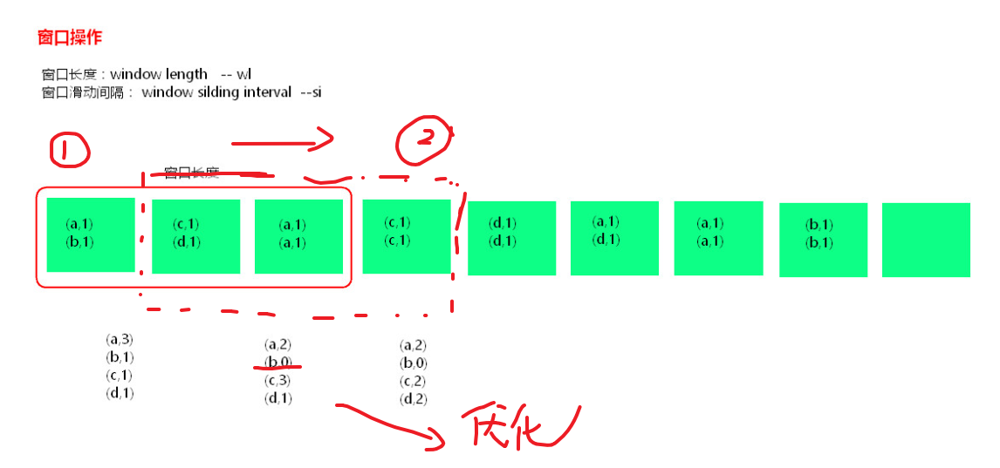

```
#作用： 统计一些数量的批次，，（上面是统计从本次streaming启动后的）
                          （本图是优化的，所以才会出现0，，如果不是优化不会出现0）

#术语：滑动间隔和 窗口长度（例如图上的例子长度是3单位，滑动间隔是1单位，单位是batchInterval整数倍）

#存活周期：    长度与间隔 和 批次 的综合作用
例：
b   si    wl
5   5    15          —>出现 3次  存活15S

5   10   15         —>出现2次    存活20S

5   15   15         —>出现1次    存活15S

```


### 2）操作

#统计一些批次的WC

#### --实现

```
#1，代码

1）窗口操作普通的机制

（代码和上面前面基本一致，所以就拿核心的算子）
val windowResult: DStream[(String, Int)] =
pairWords.reduceByKeyAndWindow((v1:Int, v2:Int)=>{v1+v2},Durations.seconds(15),Durations.seconds(5)  )
windowResult.print()

//reduceByKeyAndWindow( 操作，  计算时间长度15 ， 时间间隔 5  )
//意思是每次都要全部计算  每隔五秒，统计之前15s内  的WC
```


#### --优化

```
2.1）窗口操作优化的机制  (老重新计算，会导致任务堆积)

ssc.checkpoint("./data/streamingCheckpoint")

val windowResult: DStream[(String, Int)] = pairWords.reduceByKeyAndWindow(
                        (v1:Int, v2:Int)=>{v1+v2},
                        (v1:Int, v2:Int)=>{v1-v2},
                        Durations.seconds(15),
                       Durations.seconds(5))

windowResult.print()

//reduceByKeyAndWindow( 加新 ，减没，长度15，间隔5  )
//意思是通过优化方法（原值+新的-没的）算出  ： 每隔五秒，统计之前15s内  的WC


2.2） 原理图
```

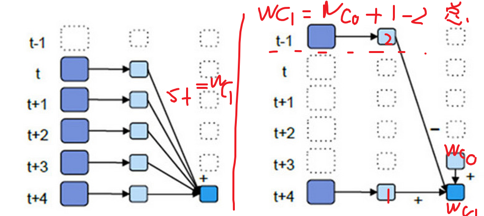


```
#2，运行

1）普通实现：当过了存活时间，就不再显示该k的值
2）优化   ：就算过了存活时间，显示 (k,0),一直留着
```


#### --总结

```
#1，reduceByKeyAndWindow 算子  ： tran算子      (用来完成窗口操作的，计算一些批次的)
#实现：
  普通：reduceByKeyAndWindow( 操作，时间长度 ，时间间隔   )
  优化：reduceByKeyAndWindow( 加  ， 减     ， 长度  ， 间隔)
#注意：  
  长度和间隔要是批次的整数倍


#2，自定义操作
#先获取一些批次的DSt
val ds : DStream[(String,Int)] = pairWords.window(Durations.seconds(15),Durations.seconds(5))

#然后自己写操作
```


--------------------

## 2.4 *动态改广播过滤*

## *transform*

### 1）操作

#有个名单，执行时，自动过滤，同时还要更新名单  （目前没有完全解决）

```
#1，代码
val conf = new SparkConf()
conf.setAppName("transform")
conf.setMaster("local[2 /3  ]")   核数大于2都可以
val ssc = new StreamingContext(conf,Durations.seconds(5))
ssc.sparkContext.setLogLevel("Error")
 
   /**
      * 广播名单
      */
val blackList: Broadcast[ListBuffer[String]] = ssc.sparkContext.broadcast(ListBuffer[String]("zhangsan","lisi"))


    /**
      * 从实时数据【"hello zhangsan","hello lisi"】中发现 数据的第二位是黑名单人员，过滤掉
      */
val lines: ReceiverInputDStream[String] = ssc.socketTextStream("node4",9999)
val pairLines: DStream[(String, String)] = lines.map(line=>{(line.split(" ")(1),line)})
    /**
      * transform 算子可以拿到DStream中的RDD，对RDD使用RDD的算子操作，但是最后要返回RDD，返回的RDD又被封装到一个DStream  （就像foreachRDD,但是tran）
      */
val resultDStream: DStream[String] = pairLines.transform((pairRDD:RDD[(String,String)]) => {
      println("++++++ Driver1+++++++")
      blackList.value.foreach(println)

      val filterRDD: RDD[(String, String)] = pairRDD.filter(tp => {
        val nameList: ListBuffer[String] = blackList.value
        !nameList.contains(tp._1)
      })

1） 这么写，有点问题，但是不知问题在哪里
////     filterRDD.map(tp => tp._1).collect().foreach(println)
//      val a = filterRDD.map(tp => tp._1).collect()
//       a.foreach( (one) =>{
//             println(one)
//             blackList.value.append(one)})
//      println("++++++ Driver Code  end +++++++")

      val returnRDD: RDD[String] = filterRDD.map(tp => tp._2)

      returnRDD
    })

    resultDStream.print()

2）这样写，就能实现功能，但是冗余过多
    pairLines.foreachRDD(  (pairRDD:RDD[(String,String)]) => {


      val filterRDD: RDD[(String, String)] = pairRDD.filter(tp => {
        val nameList: ListBuffer[String] = blackList.value
        !nameList.contains(tp._1)
      })
      println("++++++ Driver2 Code start+++++++")
      //     filterRDD.map(tp => tp._1).collect().foreach(println)
      val a = filterRDD.map(tp => tp._1).collect()
      a.foreach( (one) =>{
        println(one)
        blackList.value.append(one)})
      println("++++++ Driver2 Code  end +++++++")

    })
   
ssc.start()
ssc.awaitTermination()
ssc.stop()
```


```
#2，运行

1）如果是简单的测试transform算子，，程序完全正常  (测试的是tran 里面没有action 算子)

2）如果是一个transform算子下，完成动态广播修改，有一定问题，，但不知道如何解决  ？？？？？？
	能做到内部实现过滤，同时把数据加到广播数组里面，，但是在最后的DTs没打印或者是空，不知道为什么
	
3）如果用transform 实现过滤打印，， foreachRDD 实现过滤修改广播，，则顺利完成功能，但浪费了

#和核数没有关系，已经测试2,3核

```

```
#结果展示：  (能够说明，能实现动态广播，，同时顺利过滤)

++++++ Driver1+++++++
zhangsan
lisi
-------------------------------------------
Time: 1588950520000 ms
-------------------------------------------

++++++ Driver2 Code start+++++++
++++++ Driver2 Code  end +++++++

！！！！！！！！！！！！

++++++ Driver1+++++++
zhangsan
lisi
-------------------------------------------
Time: 1588950540000 ms
-------------------------------------------
hello a

++++++ Driver2 Code start+++++++
a
++++++ Driver2 Code  end +++++++

！！！！！！！！！！！！   （再次输入 hello a 没有结果，，）

++++++ Driver1+++++++
zhangsan
lisi
a
-------------------------------------------
Time: 1588950545000 ms
-------------------------------------------

++++++ Driver2 Code start+++++++
++++++ Driver2 Code  end +++++++


！！！！！！！！！！！！ （再次输入 hello ab 有结果，，说明成功）

++++++ Driver1+++++++
zhangsan
lisi
a
-------------------------------------------
Time: 1588950570000 ms
-------------------------------------------
hello ab

++++++ Driver2 Code start+++++++
ab
++++++ Driver2 Code  end +++++++

！！！！！！！！！！！！

++++++ Driver1+++++++
zhangsan
lisi
a
ab
-------------------------------------------
Time: 1588950575000 ms
-------------------------------------------

++++++ Driver2 Code start+++++++
++++++ Driver2 Code  end +++++++

```


### 2）总结

```
#transform算子： (与foreach,功能像，但是transformation算子)
	transform 算子可以拿到DStream中的RDD，
	对RDD使用RDD的算子操作，但是最后要返回RDD，返回的RDD又被封装到一个DStream。
	

```


## 2.5 监控目录保存WC

### 1）操作

#监控一个目录，然后统计新增文件WC，然后保存结果

```
#1，主程序

val conf = new SparkConf() 
conf.setMaster("local")                 //1核就行
conf.setAppName("saveAsTextFile")
val ssc = new StreamingContext(conf,Durations.seconds(5))

//监控目录，要新增的文件
val lines: DStream[String] = ssc.textFileStream("./data/streamingCopyFile")
val words: DStream[String] = lines.flatMap(line=>{line.split(" ")})
val pairWords: DStream[(String, Int)] = words.map(word=>{(word,1)})
 val result: DStream[(String, Int)] = pairWords.reduceByKey((v1:Int, v2:Int)=>{v1+v2})

//保存的多级目录就直接写在前缀中：文件命名 prefix + XXXX时间  + .suffix
result.saveAsTextFiles("./data/streamingSavePath/prefix","suffix")
ssc.start()
ssc.awaitTermination()
ssc.stop()
```


```
#2，工具类
    while(true){
      Thread.sleep(5000);
      val uuid = UUID.randomUUID().toString();
      println(uuid);
      copyFile(new File("./data/copyFileWord"),new File(".\\data\\streamingCopyFile\\"+uuid+"----words.txt"));
    }
  }

  /**
    * 复制文件到文件夹目录下
    */
  def copyFile(fromFile: File, toFile: File): Unit ={
    val ins = new FileInputStream(fromFile);
    val out = new FileOutputStream(toFile);
    val buffer = new Array[Byte](1024*1024)
    var size = 0
    while (size != -1) {
      out.write(buffer, 0, buffer.length);
      size = ins.read(buffer)
    }
    ins.close();
    out.close();

```


```
#3，运行
#效果：
	已经有的文件不会统计，同时必须是要增个文件，，，单单内容也不会统计	
```


### 2）总结

```
#1，程序：
sparkStreamig监控某个文件夹时，不需要设置local[2],没有采用 receiver 接收器的模式读取数据
这个文件必须是原子性的在目录中产生，已经存在的文件后面追加数据不能被监控到，被删除的文件也不能被监控到

#2，saveAsTextFiles  ：（act 算子）
  saveAsTextFiles("path/prefix","suffix")
  #格式是prefix-TIME_IN_MS[.suffix]   里面有文件  和  成功的标识
```


-------------------

# 3 Driver HA

## 3.1 概述

```
#意义：
D 和 SC SCC 有关系，D挂了  ，stream 就没了 ，所以有必要对Driver HA

#说明：
Client模式就无法实现Driver HA ，这里针对的是cluster模式

Yarn平台cluster模式提交任务，AM(AplicationMaster)相当于Driver，如果挂掉会自动启动AM。
这里所说的DriverHA针对的是Spark standalone和Mesos资源调度的情况下

#步骤： （第一只是恢复D，第二是让D恢复原来的元数据）
第一：提交任务层面，在提交任务的时候加上选项 --supervise,当Driver挂掉的时候会自动重启Driver。
第二：代码层面，
StreamingContext.getOrCreate(ckDir,CreateStreamingContext)   JavaStreamingContext.getOrCreate（ckDir，JavaStreamingContextFactory）

	#默认checkpoint ，Driver中元数据包括：
		创建应用程序的配置信息。
		DStream的操作逻辑。
		job中没有完成的批次数据，也就是job的执行进度。
		offset
```


## 3.2 操作

### 1）代码

```
#1
1）设置checkpoint目录
val ckDir = "./data/streamingCheckpoint"
  
  def main(args: Array[String]): Unit = {

2） main ： 恢复或者创建，，整个框架
    /**
      * StreamingContext.getOrCreate(ckDir,CreateStreamingContext)
      *   这个方法首先会从ckDir目录中获取StreamingContext【 因为StreamingContext是序列化存储在Checkpoint目录中，恢复时会尝试反序列化这些objects。
      *   如果用修改过的class可能会导致错误，此时需要更换checkpoint目录或者删除checkpoint目录中的数据，程序才能起来。】
      *
      *   若能获取回来StreamingContext,就不会执行CreateStreamingContext这个方法创建，否则就会创建
      *
      */
    val ssc: StreamingContext = StreamingContext.getOrCreate(ckDir,CreateStreamingContext)
    ssc.start()
    ssc.awaitTermination()
    ssc.stop()

  }


3）创建ssc，和 具体的逻辑 (可以试试文件 或者 端口的，)

  def CreateStreamingContext() = {
    println("=======Create new StreamingContext =======")
    val conf = new SparkConf()
   // conf.setMaster("local")
     conf.setMaster("local[2]")
    conf.setAppName("DriverHA")
    val ssc: StreamingContext = new StreamingContext(conf,Durations.seconds(5))
    ssc.sparkContext.setLogLevel("Error")

    /**
      *   默认checkpoint 存储：
      *     1.配置信息
      *   	2.DStream操作逻辑
      *   	3.job的执行进度
      *   * 4.offset
      */
    ssc.checkpoint(ckDir)
    val lines: ReceiverInputDStream[String] = ssc.socketTextStream("node4",9999)
//   val lines: DStream[String] = ssc.textFileStream("./data/streamingCopyFile")
    val words: DStream[String] = lines.flatMap(line=>{line.trim.split(" ")})
    val pairWords: DStream[(String, Int)] = words.map(word=>{(word,1)})
    val result: DStream[(String, Int)] = pairWords.reduceByKey((v1:Int, v2:Int)=>{v1+v2})

//    result.print()

    /**
      * 更改逻辑
      */
    result.foreachRDD(pairRDD=>{
      pairRDD.filter(one=>{
        println("*********** filter *********")
        true
      })
      pairRDD.foreach(println)
    })

    ssc
    }
```


```
#2，运行

#正常一直运行：
	当你只输入一次，，后面的就只显示这一次
	 (因为cp 只是恢复数据，但是如果你后面的逻辑没有操作cp里面的原来值(像update 和 window)，后面的逻辑就把这个值直接代替了，所以值输入一次，后面都是空)


#中断：（自己手动启停D）
	~普通： 能恢复数据操作，，但是恢复到停止点之前几个，不精确
	~修改代码： 还是依旧执行原理的逻辑（因为，D会恢复，想要新的逻辑：要不换目录，，，要不清空）
```


### 2）问题

```
#1，getOrCreate方法问题：
1）只适用于一直不变的代码
能保存宕机的时候数据读到哪里了，但是和旧的代码逻辑捆绑了，
也就是说，想要改逻辑，就要清空目录，或者换目录，但是就不知道读到哪里了

#所以后面是手动管理偏移量，解除捆绑


2）不会丢失数据，，但还有最近几个批次的重复消费

#所以后面也有精准消费


```


----------------------------

# 4 整合kafka

## 4.1 kafka

### 1）介绍

```
#1，概述：
kafka是一个高吞吐的分布式消息队列系统。
特点是生产者消费者模式，相对先进先出（FIFO）保证顺序，自己不丢数据，默认每隔7天清理数据。
消息列队常见场景：系统之间解耦合、峰值压力缓冲、异步通信。
#配合flume + kafka +streaming,,避免直接。
```

```
#2，特点具体：

1）队列特点：
	相对的FIFO （因为kafka是分布式的，在一个节点上的数据，肯定FIFO，一起就不一定了）
	想要绝对的FIFO，就一个topic主题，就只有一个分区，，这样只有一个节点

2）持久性：                
	直接直接append，存磁盘，不丢数据
	同时是顺序写的，所以读的时候顺序读，性能好一点
	数据读完了，还存在默认7天，不用再消除

3）高性能：
	单节点支持上千个客户端，百MB/s吞吐，接近网卡的极限
     #吞吐量大因为：采用了零拷贝  （
				以前是磁盘先JVM 然后JVM，到网卡buffer
				现在 JVM，发个命令，然后磁盘直接网卡B
							  ）

4）调整性
 当峰值的时候，kafka，可以适当，然后低谷的时候，也可以适当调整消费者的输入


5）分布式：
  可靠：有数据副本，
  负载均衡，可扩展，在线扩展，不需要停服务等等。

6) 灵活：
  消费的时间可以长
  消费状态，可以修改，从而精确一次或者重复消费

```


### 2）架构

#图是0.82 的架构：（就在用ZK存偏移量的区别，后面是存kafka）

#其实消费者还可以把数据存到消费者内存和cp中  或者  其他存储数据的地方：数据库啥的

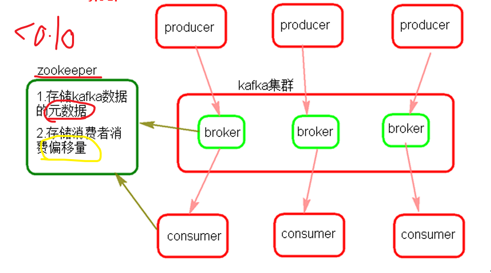

```
#1，kafka集群的server
 
1）broker:    （真实节点）
	组成kafka集群的节点，broker之间没有主从关系，依赖zookeeper协调。
	broker负责消息的读写和存储。

2）topic:      （某类消息的逻辑组件总和， 分析操作都是以topic为基准来看）
 {#就某个topic的组成而言：
   
   2.1）该的生产者 和 该t的消费者
 
   2.2）partition ：   (该t的存消息数据的逻辑， 实际是在多个broker的磁盘空间）
 	  组成该t的单元， 一个t 可创建多个p （一个p 只能由一个b管理，但一个b可以管理多个p）
	  一个p内消息强有序(该p内消息有自己的offset)  ; 并行p 消费消息不一定有序 
   
   2.3) p的副本 ：      （和p的并行度一样，也是创建topic指定）
    一个p可以有多个副本 ，但副本总数超过b数量，没有意义       （如下图，的副本分布）
 
    2.4）消息数据：
      存储策略   ： 消息直接写入分区"文件",并不是存储在内存中 
      时间策略   :  默认一周删除，而不是消费完就删除 
   
 }

```

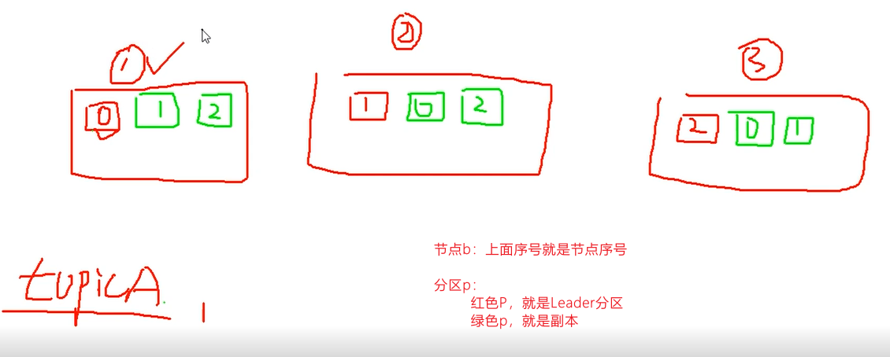

```
#2，ZK：
  存储原数据，broker，topic,partition..
  存储offset:
  		在之前版本还可以存储消费者offset
  		后面版本的是存到kafka
  		(版本都有：直接存在消费者磁盘那  和  数据库啥的等等 )
```

```
#3，kafka集群的生产者 和 消费者

1）生产者：
	两者策略： 有key，就hash或自定义分布  ； 没有key，轮训
```

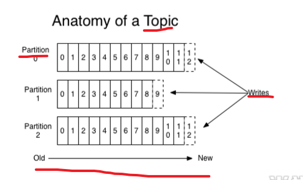

```
2）消费者：
#图介绍： 
一个k集群，两个b，某个topic, 四个p，（P还可以可以有副本）  ，消息放在P上
该topic，有两个消费组，，组里面消费者


#组介绍
同个组内，同topic数据，整体上，所有消息只能消费一次 
		（该组某个消费者，读完整，其他就不读这个分区，不完整，其他就这个分区接着读）
不同组互不影响   
		（组内消费者数量大于分区，没有意义）

#消费者 ：
自己维护消费到哪个offset （要读，自己从某个地方读取offset, 读完，自己发送新的offset，到该地方，）
	之前是ZK，现在新版本是kafka
	一直都可以 保存在消费者自己的cp磁盘   或者  数据库等存储的地方
	
```

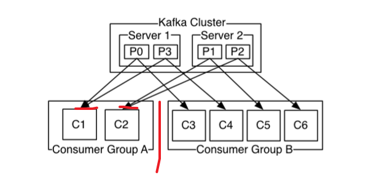

### 3）测试

#### --操作

```
#1，低版本搭建

#配置config/server.properties：	
	节点编号 ， ZK  ， 和真实存储地址
	
#启动：
先Zk，然后K集群
阻塞执行：   bin/kafka-server-start.sh   config/server.properties
弄个脚本，后台执行：
	nohup bin/kafka-server-start.sh   config/server.properties > kafka.log 2>&1 &
	chmod +x

```


```
#2，一些命令
（报错就根据提示去补全必须参数）
（基本还是老规律，往里面写就是要k的端口，，从里面读 和 topic等就是zk ）

1）topic：
#创建
./kafka-topics.sh --zookeeper node2:2181,node3:2181,node4:2181  --create --topic topictest --partitions 3 --replication-factor 3

#查看
./kafka-topics.sh  --list --zookeeper node2:2181,node3:2181,node4:2181

#描述
./kafka-topics.sh --describe --zookeeper node2:2181,node3:2181,node4:2181  --topic topictest

{
1）东西介绍
Partition:分区编号
Leader:  主在哪个节点编号
Replicas ： 指副本在哪个b上，，顺序表明优先级
Isr: 和前面副本一致，，就是启动的时候，去那些节点检查数据副本的一致性，平时副本数据要同步

2）均衡机制介绍 
一个分区而言
当Leader节点上的挂了 ，  其他节点上的副本启动，顺序是副本那个优先级
当你节点重新启动，，自动把分区弄回原来的Leader节点上（为了恢复后，能均衡，省得全在一个节点上）
（在server.p配置，默认开启   auto.leader.rebalance.enable  默认true）
}

```

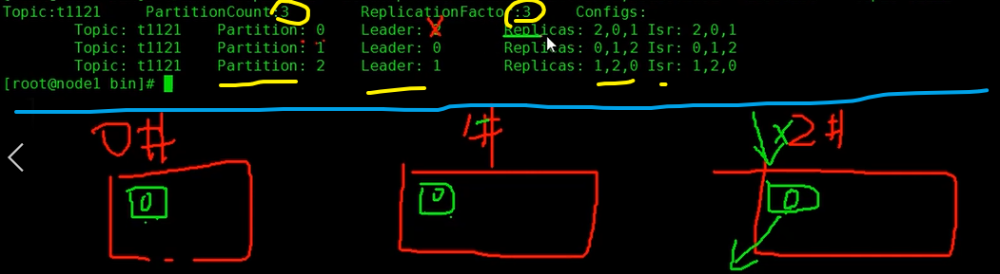


```
#删除:

1)标记（现在还可以读写，一周后删除）

2）复杂手动
{
#集群  所有的那个真实存储路径 : 然后rm
#ZK -cli  ： rmr
    broker/topic 删除元数据   
	config/topic  也有一些信息
	admin/ delete_topic
}
3)  配置自动
核心是delete.topic.enable=true ,还有一些其他东西，如下链接
```

[网址]: https://blog.csdn.net/belalds/article/details/80575751
[本地]: /source/streaming/txt


```
2）生产消费

#控制台生产者：
./kafka-console-producer.sh  --topic  topictest --broker-list node1:9092,node2:9092,node3:9092

#控制台消费者：
./kafka-console-consumer.sh --zookeeper node2:2181,node3:2181,nod4:2181 --topic topictest


{
启动zookeeper客户端：
	./zkCli.sh   (先ls  ,空了就   get)
查看topic相关信息： 
	ls /brokers/topics/
查看消费者相关信息： (里面offset能看到消费了几个)
	ls /consumers
}
```


#### --新版本

----

```
#1，版本升级 0.11

1）先把之前版本的一些信息删了
#zkCli.sh 
【 consumers, admin, config, controller, brokers, controller_epoch】
#之前存ka真实的地址

2) 新的版本配置
#sever文件的 ： broker  , zk  , dir
#再弄个那个启动脚本（start-k.sh）

```


```
#2，命令行

1） topic类基本没变

2）生产者 和 消费者 变了

#生产者：没变
./kafka-console-producer.sh  --topic  topictest --broker-list node1:9092,node2:9092,node3:9092

#消费者：名称变了， 不用ZK，用ka管理offset了  
./kafka-console-consumer.sh --bootstrap-server node1:9092,node2:9092,node3:9092 --topic topictest

3) 查看消费情况：

#查看所有消费者组
./kafka-consumer-groups.sh --bootstrap-server node1:9092,node2:9092,node3:9092 --list

#查看组，，显示消费者消费的offset位置信息
./kafka-consumer-groups.sh --bootstrap-server node1:9092,node2:9092,node3:9092 --describe --group MyGroupId

#重置消费者组的消费offset信息 ，
./kafka-consumer-groups.sh --bootstrap-server node1:9092,node2:9092,node3:9092:9092 --group MyGroupId --reset-offsets --all-topics --to-earliest --execute

	--reset-offsets –all-topics 所有offset。
	--to-earliest 最小位置。
	--execute 执行
	
#图是xshell,展示不下，所以有些混乱，但也能看出，有几个分区，同时该消费组只有一个消费者，该消费者在每个分区上的消费偏移量
```

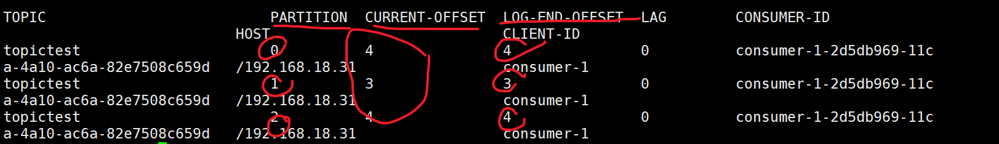

```

kafka 0.8.2版本消费者offset存储在zookeeper中，对于zookeeper而言每次写操作代价是很昂贵的，而且zookeeper集群是不能扩展写能力。

kafka 0.11版本默认使用新的消费者api ,消费者offset会更新到一个kafka自带的topic【__consumer_offsets】中。以消费者组groupid 为单位，可以查询每个组的消费topic情况：
```


## 4.2 Streaming + ka

### 1）s 1.6 + k 0.8 

#由java写的

#### -receiver(舍弃)

```
#1，概述
#补充：
这个模式是一直都要被动接受数据  （Local 不是1）

圈3：是开启WAL后，备份到HDFS， 然后都备份好了，再由消费者更新offset


原来的用途： 能接收大量的日志等东西就行，粗略丢几个也没事,也不在乎偏移量
```

#原理图

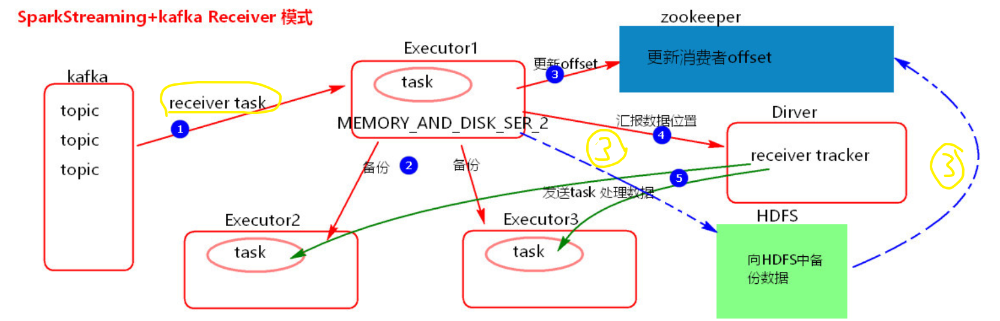

#细节 ：（R模式存在的问题  ， 分区问题 ， R模式总结）

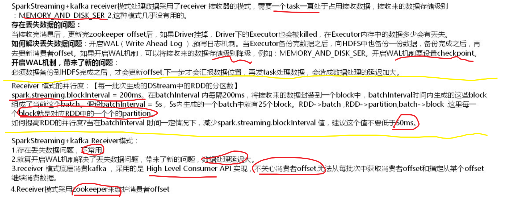


```
#2，代码

1） 往Ka生产数据
#就是用个线程，一直运行，每写两条数据暂停2秒
#有key,没key得

2）整合

SparkConf conf = new SparkConf().setAppName("SparkStreamingOnKafkaReceiver").setMaster("local[2]");

//开启预写日志 WAL机制
//conf.set("spark.streaming.receiver.writeAheadLog.enable","true");		
JavaStreamingContext jsc = new JavaStreamingContext(conf, Durations.seconds(5));
//jsc.checkpoint("./receivedata");
		

Map<String, Integer> topicConsumerConcurrency = new HashMap<String, Integer>();
//设置读取的topic和接受数据的线程数 （receiver task的线程数）
topicConsumerConcurrency.put("cmcccdr",1);
		
		/**
		 * 第一个参数是StreamingContext
		 * 第二个参数是ZooKeeper集群信息（接受Kafka数据的时候会从Zookeeper中获得Offset等元数据信息）
		 * 第三个参数是Consumer Group 消费者组
		 * 第四个参数是消费的Topic以及并发读取Topic中Partition的线程数
		 * 
		 * 注意：
		 * KafkaUtils.createStream 使用五个参数的方法，设置receiver的存储级别
		 */
JavaPairReceiverInputDStream<String,String> lines = KafkaUtils.createStream(
				jsc,
				"node3:2181,node4:2181,node5:2181",
				"MyFirstConsumerGroup", 
				topicConsumerConcurrency/*,StorageLevel.MEMORY_AND_DISK()*/
				);
		JavaDStream<String> words = lines.flatMap(new FlatMapFunction<Tuple2<String,String>, String>() { 


			private static final long serialVersionUID = 1L;

			public Iterable<String> call(Tuple2<String,String> tuple) throws Exception {
				System.out.println("key = "+tuple._1);
				System.out.println("value = "+tuple._2);
				return Arrays.asList(tuple._2.split("\t"));
			}
		});
		
		  
		JavaPairDStream<String, Integer> pairs = words.mapToPair(new PairFunction<String, String, Integer>() {

			private static final long serialVersionUID = 1L;

			public Tuple2<String, Integer> call(String word) throws Exception {
				return new Tuple2<String, Integer>(word, 1);
			}
		});
		
		  
		JavaPairDStream<String, Integer> wordsCount = pairs.reduceByKey(new Function2<Integer, Integer, Integer>() { 
			//对相同的Key，进行Value的累计（包括Local和Reducer级别同时Reduce）

			private static final long serialVersionUID = 1L;

			public Integer call(Integer v1, Integer v2) throws Exception {
				return v1 + v2;
			}
		});
		
		 
		wordsCount.print(100);
		
		jsc.start();
		jsc.awaitTermination();
		jsc.close();
```

```
3）,总结

#代码： 核心就createStream()  获得输入的数据    (要ZK 因为存着offset)
			(里面有默认存储级别)    (返回值 ： 第一个是key，，第二个value)

#运行效果：
   生产有key,,没key  (控制台的消费者，都不看到key，都是显示相同的，只有数据value)
	光WAL，不cp，，报错  （用来存收到的数据）
```


#### -direct

```
#1, 概述

#补充：
这个模式是要数据才去拿，不是被动一直接收
分区是一对一，，想调整就调整topic分区  或者  后面repartition

#存储offset类型：  （1.6 + 0.8）
	该模式下默认是 s集群内存，如果设置了cp，则cp也有一份
	还可以手动管理，（因为API能拿到offset）
	  用其他的，比如数据库等等  ；一般不用ZK，但ZK也可以存(主要是CDH等可以监控)
```

#原理图

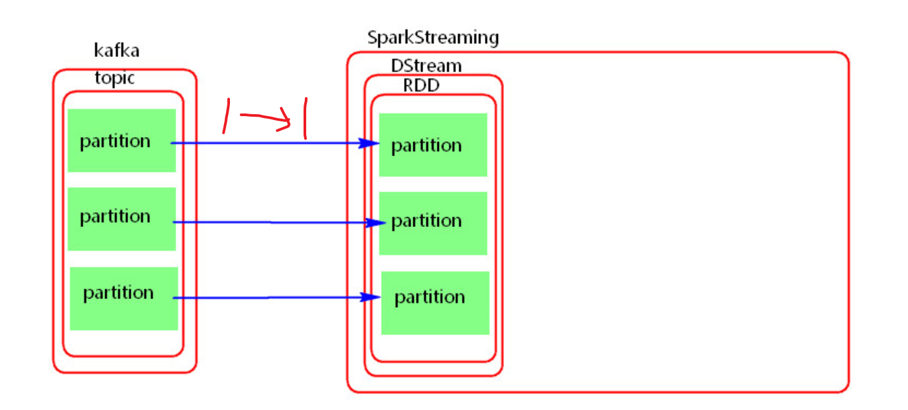

#1.6 + 0.8 的细节： 

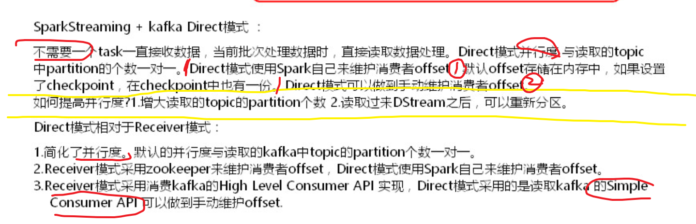

```
#2，代码

1）还是生产数据

2）整合
SparkConf conf = new SparkConf().setMaster("local").setAppName("SparkStreamingOnKafkaDirected");
//反压机制
conf.set("spark.streaming.backpressure.enabled", "false");
//每s，每个分区读多少条
conf.set("spark.streaming.kafka.maxRatePerPartition	", "100");
		JavaStreamingContext jsc = new JavaStreamingContext(conf, Durations.seconds(5));
		
		/**
		 * 可以不设置checkpoint 不设置不保存offset,offset默认在内存中有一份，如果设置checkpoint在checkpoint也有一份offset， 一般要设置。
		 */
jsc.checkpoint("./checkpoint");
Map<String, String> kafkaParameters = new HashMap<String, String>();
kafkaParameters.put("metadata.broker.list", "node1:9092,node2:9092,node3:9092");
//kafkaParameters.put("auto.offset.reset", "smallest");
		
		HashSet<String> topics = new HashSet<String>();
		topics.add("cmcccdr");
		
		JavaPairInputDStream<String,String> lines = KafkaUtils.createDirectStream(jsc,
				String.class,  
				String.class,
				StringDecoder.class,
				StringDecoder.class,
				kafkaParameters,
				topics);
		JavaDStream<String> words = lines.flatMap(new FlatMapFunction<Tuple2<String,String>, String>() { //如果是Scala，由于SAM转换，所以可以写成val words = lines.flatMap { line => line.split(" ")}

			private static final long serialVersionUID = 1L;

			public Iterable<String> call(Tuple2<String,String> tuple) throws Exception {
				return Arrays.asList(tuple._2.split("\t"));
			}
		});
		
		JavaPairDStream<String, Integer> pairs = words.mapToPair(new PairFunction<String, String, Integer>() {


			private static final long serialVersionUID = 1L;

			public Tuple2<String, Integer> call(String word) throws Exception {
				return new Tuple2<String, Integer>(word, 1);
			}
		});
		
		
		JavaPairDStream<String, Integer> wordsCount = pairs.reduceByKey(new Function2<Integer, Integer, Integer>() { //对相同的Key，进行Value的累计（包括Local和Reducer级别同时Reduce）

			private static final long serialVersionUID = 1L;

			public Integer call(Integer v1, Integer v2) throws Exception {
				return v1 + v2;
			}
		});
		
		
		wordsCount.print();
		jsc.start();
		jsc.awaitTermination();
		jsc.close();

```


```
#3，总结

1）代码：
	topic 不用接受task了，也不设置线程数了
	createDirectStream    （没有ZK了，要有broker了）

2）偏移量：
默认在内存中拿offset
用 cp配合那个getOrCreate 能够拿到offset，然后接着读，，
   但是还恢复了之前的代码逻辑
   但是从前几个批次读，重复
```


### 2）s 2.3 + k 0.11

#### -direct(只有)

```
#1，代码
 def main(args: Array[String]): Unit = {
    val conf = new SparkConf()
    conf.setMaster("local")
    conf.setAppName("SparkStreamingOnKafkaDirect")
    val ssc = new StreamingContext(conf,Durations.seconds(5))
    //设置日志级别
    ssc.sparkContext.setLogLevel("Error")

    val kafkaParams = Map[String, Object](
      "bootstrap.servers" -> "node1:9092,node2:9092,node3:9092",
      "key.deserializer" -> classOf[StringDeserializer],
      "value.deserializer" -> classOf[StringDeserializer],
      "group.id" -> "MyGroupId",//

      /**
        * 当没有初始的offset，或者当前的offset不存在，如何处理数据
        *  earliest ：自动重置偏移量为最小偏移量
        *  largest：自动重置偏移量为最大偏移量【默认】
        *  none:没有找到以前的offset,抛出异常
        */
      "auto.offset.reset" -> "earliest",

      /**
        * 当设置 enable.auto.commit为false时，不会自动向kafka中保存消费者offset.需要异步的处理完数据之后手动提交  (自动提交，只管看到了数据，不管你有没有处理完，直接更新偏移量，不准确)
        */
      "enable.auto.commit" -> (false: java.lang.Boolean)//默认是true
    )

    val topics = Array("testtopic")
    val stream: InputDStream[ConsumerRecord[String, String]] = KafkaUtils.createDirectStream[String, String](
      ssc,
      PreferConsistent,//策略
      Subscribe[String, String](topics, kafkaParams)
    )

    val transStrem: DStream[String] = stream.map(record => {
      val key_value = (record.key, record.value)
      println("receive message key = "+key_value._1)
      println("receive message value = "+key_value._2)
      key_value._2
    })
    val wordsDS: DStream[String] = transStrem.flatMap(line=>{line.split(" ")})
    val result: DStream[(String, Int)] = wordsDS.map((_,1)).reduceByKey(_+_)
    result.print()

    /**
      * 以上业务处理完成之后，异步的提交消费者offset,这里将 enable.auto.commit 设置成false,就是使用kafka 自己来管理消费者offset
      * 注意这里，获取 offsetRanges: Array[OffsetRange] 每一批次topic 中的offset时，必须从 源头读取过来的 stream中获取，不能从经过stream转换之后的DStream中获取。
      */
    stream.foreachRDD { rdd =>
      val offsetRanges: Array[OffsetRange] = rdd.asInstanceOf[HasOffsetRanges].offsetRanges
      // some time later, after outputs have completed
      stream.asInstanceOf[CanCommitOffsets].commitAsync(offsetRanges)
    }
    ssc.start()
    ssc.awaitTermination()
    ssc.stop()
```


```
#2，总结
本D模式，，使用KA管理的 ，同时处理完了，才异步手动提交的

R不要了，直留了D模式，但D变了：
	broker 节点  ，createD 传入了一个策略参数
	
生产数据的代码也变了些
```


#### -新版本注意

```
1) 丢弃了SparkStreaming+kafka的receiver模式

2）采用了新的消费者api实现， new api , 并行度概念啥的一样。

3)	api使用上有很大差别。未来这种api有可能继续变化

4）大多数情况下，SparkStreaming读取数据使用 LocationStrategies.PreferConsistent 这种策略，这种策略会将分区均匀的分布在集群的Executor之间。

如果Executor在kafka 集群中的某些节点上，可以使用 LocationStrategies.PreferBrokers 这种策略，那么当前这个Executor 中的数据会来自当前broker节点。

如果节点之间的分区有明显的分布不均，可以使用 LocationStrategies.PreferFixed 这种策略,可以通过一个map 指定将topic分区分布在哪些节点中。

5)	新的消费者api 可以将kafka 中的消息预读取到缓存区中，默认大小为64k。默认缓存区在 Executor 中，加快处理数据速度。
可以通过参数 spark.streaming.kafka.consumer.cache.maxCapacity 来增大，spark.streaming.kafka.consumer.cache.enabled 设置成false 关闭缓存机制。
```


### 3）D下管理偏移量

```
#1，概述

1） D模式下
```

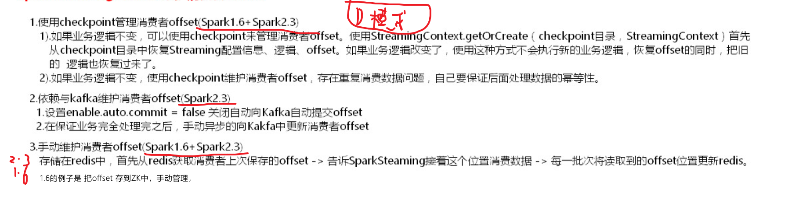


```
2）R模式下；
只有1.6，靠ZK自动维护offset
```


```
#2实现

#  1,2上面都有实现，所以实现个2.3的靠redis的手动管理

1）Redis连接
object RedisClient {
  val redisHost = "node1"
  val redisPort = 6379
  val redisTimeout = 30000
  /**
    * JedisPool是一个连接池，既可以保证线程安全，又可以保证了较高的效率。
    */
  lazy val pool = new JedisPool(new GenericObjectPoolConfig(), redisHost, redisPort, redisTimeout)
  }
  
```

```
2) 具体手动管理  ： 获取offset --> ka 读,然后操作  ----> 保存offset


#从Redis中获取保存的消费者offset
[有就拿redis库中的map,,没有就手动返回自己设置的 ]

  def getOffSetFromRedis(db:Int,topic:String)  ={
    val jedis = RedisClient.pool.getResource
    jedis.select(db)
    val result: util.Map[String, String] = jedis.hgetAll(topic)
    RedisClient.pool.returnResource(jedis)
    if(result.size()==0){
      result.put("0","0")
      result.put("1","0")
      result.put("2","0")
    }
    import scala.collection.JavaConversions.mapAsScalaMap
    val offsetMap: scala.collection.mutable.Map[String, String] = result
    offsetMap
    
# 将消费者offset 保存到 Redis中

  def saveOffsetToRedis(db:Int,offsetRanges:Array[OffsetRange]) = {
    val jedis = RedisClient.pool.getResource
    jedis.select(db)
    offsetRanges.foreach(one=>{
      jedis.hset(one.topic, one.partition.toString,one.untilOffset.toString)
    })
    RedisClient.pool.returnResource(jedis)
  }  
  


----------------------------------------
#操作
def main(args: Array[String]): Unit = {
    val conf = new SparkConf()
    conf.setMaster("local")
    conf.setAppName("manageoffsetuseredis")
    //设置每个分区每秒读取多少条数据
    conf.set("spark.streaming.kafka.maxRatePerPartition","10")
    val ssc = new StreamingContext(conf,Durations.seconds(5))
    //设置日志级别
    ssc.sparkContext.setLogLevel("Error")

    val topic = "testtopic"
    /**
      * 从Redis 中获取消费者offset
      */
    val dbIndex = 3
    val currentTopicOffset: mutable.Map[String, String] = getOffSetFromRedis(dbIndex,topic)
    //初始读取到的topic offset:
    currentTopicOffset.foreach(x=>{println(s" 初始读取到的offset: $x")})

    //转换成需要的类型
    val fromOffsets: Predef.Map[TopicPartition, Long] = currentTopicOffset.map { resultSet =>
      new TopicPartition(topic, resultSet._1.toInt) -> resultSet._2.toLong
    }.toMap

    val kafkaParams = Map[String, Object](
      "bootstrap.servers" -> "node1:9092,node2:9092,node3:9092",
      "key.deserializer" -> classOf[StringDeserializer],
      "value.deserializer" -> classOf[StringDeserializer],
      "group.id" -> "MyGroupId",
      "auto.offset.reset" -> "latest"
    )
    /**
      * 将获取到的消费者offset 传递给SparkStreaming
      */
    val stream = KafkaUtils.createDirectStream[String, String](
      ssc,
      PreferConsistent,
      ConsumerStrategies.Assign[String, String](fromOffsets.keys.toList, kafkaParams, fromOffsets)
    )


    stream.foreachRDD { rdd =>

      println("**** 业务处理完成  ****")

      val offsetRanges: Array[OffsetRange] = rdd.asInstanceOf[HasOffsetRanges].offsetRanges

      rdd.foreachPartition { iter =>
        val o: OffsetRange = offsetRanges(TaskContext.get.partitionId)
        println(s"topic:${o.topic}  partition:${o.partition}  fromOffset:${o.fromOffset}  untilOffset: ${o.untilOffset}")
      }

      //将当前批次最后的所有分区offsets 保存到 Redis中
      saveOffsetToRedis(dbIndex,offsetRanges)
    }

    ssc.start()
    ssc.awaitTermination()
    ssc.stop()

```


```
3 ） 其他
Redis ：
	这里用的是散列也就是map  ， topic: [partition1 : offset1 ，...  ]
	这里用3号库，可查看  config get databases  ， select 3 ， keys *  ，hgetall  “topic” 

```


### 4）参数

#### --conf参数

```
#混合版本的一部分参数
spark.streaming.receiver.maxRate   not set
spark.streaming.receiver.writeAheadLog.enable  false
spark.streaming.blockInterval	  200ms	

spark.streaming.stopGracefullyOnShutdown   false   （优雅的停止，也就是中断时，是否先完成手头）


上面那个新的api 缓存那个
spark.streaming.kafka.maxRatePerPartition   not set  （每s，一个分区，读取的条数，从而限制输入的量）
spark.streaming.backpressure.enabled   false （反压， 在上那个参数设置好一个相对准的基准线后， 然后这个参数开始动态调节，不会任务堆积。。如果没有那个准的基准线，能反压的合适的，但是需要时间，又造成了任务堆积）
```


#### --ka参数

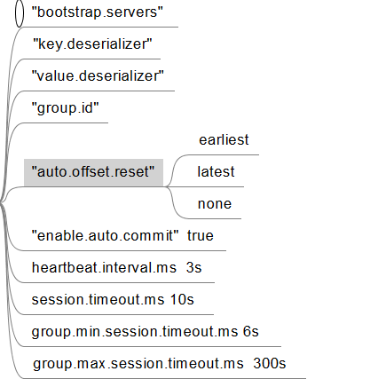

```
#就是用在设置一个map，，关于Ka的配置，然后传给KafkaUtils.createXXX

#解释没出现的一些参数
#heartbeat.interval.ms： kafka集群与消费者之间的发送心跳间隔时间间隔，这个时间默认是3s.
  这个值必须设置的比session.timeout.ms appropriately 小，
  一般设置不大于 session.timeout.ms appropriately 的1/3

#session.timeout.ms appropriately：消费者与k之间的session 会话超时时间，这个时间默认是10s
	在会话时间内，k没收到消费者的心跳 ，那么kafka将移除当前的消费者
	值在group.min.session.timeout.ms【6s】 和 group.max.session.timeout.ms【300s】之间
	
  
*如果SparkSteaming 批次间隔时间大于大于300s,那么就要调大group.max.session.timeout.ms
（不然你还在等这个批次呢，这个session直接就过期了，直接就移除消费者了， 都还没消费完呢）

#spark.streaming.kafka.consumer.cache.enabled:
设置成false: 用来缓存的，可能版本有问题，不安全
```

