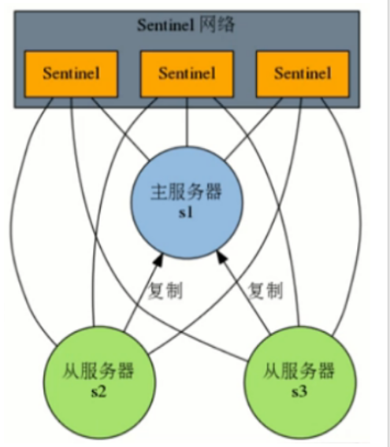

redis

# 1 介绍

```
#1，数据库类型的发展

1）文件
例子  文件查找字符  （I/O瓶颈）
grep pattern filename (全表扫描)

#hadoop: 分块，并行查找

```

```
2）文本--->关联数据库 （一整个化小片，但不是并行找）

数据库存储结构：
--datapage 切割一片一片（默认4K 字节）：有很多dp
	#计算机底层一次IO也是4K，
	#物理磁道：最小单位扇区512字节 ，，改一个字符，要把一个扇区都拿出来改了
	#引导模式：文件系统，，

--索引：也是4K


模式：
内存B+树有个索引范围（给索引排好了顺序啥的，分别用词找索引）
找到索引dp页，然后找dp。

#总共两次I/O ： 先把那个索引DP页加入内存查找，，然后再把DP加入内存（都是4K，总共8K）


#解决了  全量---》分量
#但是，并发还是问题，还会I/O瓶颈，
```


------

```
3）二代内存数据库 redis：

/*
磁盘与内存交互，有速度差,所以I/O瓶颈。
这个关系型数据库 磁盘与内存还是要交互。（数据，索引在磁盘，，维护在内存）

#hadoop 的NN 除了持久化，全在内存。

解决：全都把数据，索引全丢内存。  
（最好的是三代产品 SAP HANA ，关系型内存数据库，但是太贵。
* /


redis：

#冷热数据，，清除机制
#不选内存数据库mechached
（m只有string，获取不方便，如果你只需要一部分，不能直接取，要全取出来转化，再取一部分）

r优点：
开源的（BSD协议），（genu）使用ANSI  C 编写，
基于内存的且支持 ·持久化 ·，  高性能的Key-Value的 ·NoSQL数据库· （*）
支持数据结构类型丰富 （*）
主流语言客户端多
```


```
#2，NoSQL分类
```


--------

# 2 安装单机

```
单机：
1)
yum  install  -y  gcc   tcl
tar xf  -C ./  就行 
make && make PREFIX=/opt/sxt/redis install
#这个不是绿色版，，要编译

2)
服务器：（安装服务器了，每次都开机都自动启动,可以直接连接Cli）
export REDIS_HOME=/opt/sxt/redis
export PATH=$PATH:$REDIS_HOME/bin

software/redis/utils目录：
./install_server.sh

#db就是r存储键值对的地方，r本质上一个数组，每个db保存着键值对。
#每个dbs都是一个实例，都是一个端口-----配置，日志，数据存储，服务器命令安装路径

redis-cli -h   cli的help

??这个帮助图
-n  指定数据库（不写默认0 db  一般默认16个）
--raw  展示中文
-p   端口（不写默认连的之前弄得端口）
```


```
#查看有多少库  （有16个）
config get databases

```


# 3 Value数据类型


```
--key （String）
是二进制安全的，这意味着可以用任何二进制序列作为key值，
字符串到JPEG文件的内容都可以。空字符串也是有效key值
#字符串是一种最基本的Redis值类型。Redis字符串是二进制安全的，这意味着一个Redis字符串能包含任意类型的数据


--v：如上

#一个字符串类型的值最多能存储512M字节的内容
key的表征一直是字符串，变的是value

客户端 help
#组命令  和 单独
```


------


## 3.1 字符串

```
基本操作是字符串操作，追加，截取
set，get，append。。。。。。

数值类型计算

位图（计算机是字节，，str还可以更小用位图）

```

### 1）基本

```
#1，基本
1）set get
--set 
#单个
SET key   value [EX seconds] [PX milliseconds] [NX|XX]
	EX 设置过期时间，秒，等同于SETEX key seconds value
	PX 设置过期时间，毫秒，等同于PSETEX key milliseconds value
	NX 键不存在，才能设置，等同于SETNX key value（建值）（成功返回0）
	XX 键存在时，才能设置（改值）

#多个键的字符串值
	MSET key value [key value ...]  
	#键不存在时，设置字符串值
	MSETNX key value [key value ...]
	#注意：这是原子操作,全成功或者全失败

--get
也是单或多 GET key /  MGET key [key ...]

--GETSET key value
如果键不存在，就创建并赋值


2）存活 与 时间   ：都是返回(integer) 根据情况

--临时设计存活：

EXPIRE key s  
PEXPIRE key ms
PEXPIREAT(Unix时间戳 timestamp )
PEXPIREAT（ms）
PERSIST key(删除过期)


--查看还有时间:
TTL/PTTL key
	key存在但没有设置TTL，返回-1
	key存在，但还在生存期内，返回剩余的秒或者毫秒
	key曾经存在，但已经消亡，返回-2（2.8版本之前返回-1）

```

```
例子：
set k1 a     get k1 
set k2 b     get  k2
keys  *  

#expire（粗活时间），， set k3 c ex 12   (单位S   TTL k3  查看倒计时。。，，px  ms)
#nx   not exist      只允许创建，不允许修改  set k3 c   nx   (有就创建失败)，，xx  反之。只允许修改
```


```
3) 查找key

-- key 内容
keys *   (所有)
KEYS pattern
 	* 任意长度字符
    ? 任意一个字符 可以 ?? 多个一起
    [] 字符集合，表示可以是集合中的任意一个  keys k[12]----> k1 或者k2 
   
-- key长度
STRLEN key （长度，，都当成字符，，abc =3   12 =2）   
#中文 key，和你编码有关。（GBK 2  UTF-8  3）  
#存是字节数组。。要显示中文  连接的时候--raw

--类型
TYPE key    都是String
object encoding key    可以标识下，，“a”  raw，1，int 
#属性提前设置好，，不然后面判断，

4) 属性
--键是否存在
EXISTS key

--键重命名
RENAME key newkey
RENAMENX key newkey （防止newkey，之前已经有了）

--键删除
DEL key [key ...]
FLUSHALL （全清空） FlushDB(当前db)
```

```
5) 操作value的一部分
--追加字符串
APPEND key value
#如果键存在就追加；如果不存在就等同于SET key value

--获取子字符串   用索引
getrange  k1  4 5    得到—->substring   (0开始，负数也可以)

--覆盖字符串
SETRANGE key offset value
#setrange k2 1  aaaa    value:  abc --> aaaaa
```


### 2）计算

```
#步长1的增减
INCR key
DECR key


#步长增减   
INCRBY key decrement
DECRBY key decrement  
INCRBY支持浮点：  INCRBYFLOAT  (减法通过加负)
#字符串值会被解释成64位有符号的十进制整数来操作，结果依然转成字符串
```


### 3）位图

```
#介绍
位图不是真正的数据类型，它是定义在字符串类型中

#字符串（最大512M字节）。  
一个字节，八位
结构：
0000 0000  0100 0000    （偏移量9为1，，这是bit的结构）
	0	 	   1		（这个是字符串结构，偏移量0,1）

#一个字节为一个整体，多了新字符
#（A 65 - a 97 差32） 127 内都是ASCI码

(左往后扩充)
```


```
#1，操作
基本操作，位操作，统计

1）基本
--设置某一位值
SETBIT key offset value（v只有0,1）   

#setbit k1 7  2 不行
setbit k1 9 1 就行 
（【老0】 -【新1】）0000 0000 0100 0000

--获取
GETBIT key offset


2）位操作
--bitpos:  返回指定bit值 在指定区间上 第一次出现的 位置偏移量

BITPOS key bit [start] [end]  
（后面区间等于字节，，不写默认全局，0,1 表示 第0和1个字节）
例：
k2:    0  1  0  0  0  0  1  0        0  1  0  0  0  0  0  0  （表示@A）
bitpos k1  1  1 1  (返回 9)


--bitop : 对一或多个保存二进制位的字符串 key 进行位元操作，并将结果保存到 destkey 上

XX有：operation 可以是 AND 、 OR 、 NOT 、 XOR 

BITOP XX destkey key [key ...]
#除了 NOT 操作之外，其他操作都可以接受一个或多个 key 作为输入
#空的 key 也被看作是包含 0 的字符串序列

3）bitcount：计数 也要范围（范围内有多少1）
```

#一些显示


```
#2，实践

1）用户  的哪些天上线
key 为 UID，，value：为天（一共366位）

366 /8  50Byte  （哪天上线哪天设bit为1）
最后按照天区域来  BITCOUNT key

2）天    有哪些用户
天作为key，用户ID为offset，上线置为1
SETBIT 20160601 15   1    1 1 0 1 00 00 00 0 00 00 
SETBIT 20160603 123 1    0 1 0 0 00 00 01 0 00 00 0

最后BITOP OR  弄出总的上线用户 
然后统计总共有多少用户
```


## 3.2 列表

```
#简介
redis的列表有四个特性：队列，栈，数组。阻塞

#最多包含2^32-1元素
#元素是string，可重复

下标永远是0，XXX，max(或者-1)  不管怎么样，，都是左到右。
```


### 1）队列栈：pop push （L/R）

```
#0，总结：
1）Rpush （R是正常思维:你写的顺序就是你list展示顺序) 
2）异方向操作：队列，，同操作：队列。
```


```
#1，操作
--PUSH
LPUSH key value [value ...]
LPUSHX key value
RPUSH key value [value ...]
RPUSHX key value
	L left 左开始
	R right 右
	X exist 存在

--pop
LPOP key
RPOP  key

--一起 pop  到新的 push   （只有Rpop，，左push）
RPOPLPUSH source destination

```


### 2）数组：下标操作和长度

#stop包括最后（redis都包含）

```
#1，遍历，改值，长度
1）返回列表中指定范围元素
LRANGE key start stop
#0 -1 表示返回所有元素

2）获取指定位置的元素
LINDEX key index

3）设置指定位置元素的值
LSET key index value

4）在存在的值（pivot）前或后插入元素
LINSERT key BEFORE|AFTER pivot value
#key和pivot不存在，不进行任何操作

5）列表长度，元素个数   
LLEN key   


```


```
#2，删除
1）删除值等于value的元素count次
#正负表示方向，0 表示全部 （超了，也就是全部等于0）

LREM key count value

2）去除指定范围外元素
LTRIM key start stop

```


### 3）阻塞

```
阻塞队列：  0是一直阻塞   设置了就是s  
	#当前弹出队列或者为空不存在
	#这个队列阻塞，，客户端按照顺序顺通

BLPOP key [key ...] timeout
BRPOP key [key ...] timeout

BRPOPLPUSH source destination timeout （随便写time）

```


### 4）例子

```
#1，微博的评论最后500条： 
lpush X comments  （时间新的在左边）
LTRIM X 0 499

#2，阻塞
可以自动实现，先来的用户，后面先被服务

```


-------------------

## 3.3 散列

```
#简介

元素是f 和 v 的map （f,v是字符串）
key  —feild1:v  feild2:v  …

#一个hash中最多包含2^32-1键值对

```


### 1）基本

```
#1，设置set

1）设置单个字段
HSET key field value
HSETNX key field value
	#key的filed不存在的情况下执行，key不存在直接创建

2）设置多个字段
HMSET key field value [field value ...]
```

```
#2, 返回 get

1）返回字段值
HGET key field

2) 返回多个字段值
HMGET key field [field ...]

3) 返回所有的键值对
HGETALL key

4)其他
#所有字段名   fileds
HKEYS key

#返回所有值   values
HVALS key

#返回字段个数  
HLEN key

#判断字段是否存在
HEXISTS key field
	key或者field不存在，返回0

```

```
#3，删除指定的字段
HDEL key field [field ...]
```


### 2）计算

```
在字段对应的值上进行整数的增量计算
HINCRBY key field increment

在字段对应的值上进行浮点数的增量计算
HINCRBYFLOAT key field increment

要减就加负数
```

### 3）内存问题

```
#字符串set也能做到散列，但是HSET  一个key就能解决。
---键越多，附加的信息也越多，要更多的内存和CPU维护


---删除东西的解决办法： 
#删除：虽然到期了，，只是个属性。。
一般有两种：
真正要删是遍历整个内存看这个属性，然后删除。（主动删除，，会一直在这用内存删除）
当访问时候，才删除（被动删除，，但是要是不访问就一直留这里）

redis解决：折中。
每次一个时间，只遍历一个内存区，，，同时有访问其他区，也删了
```


### 4）例子

```
#不适合hash的情况：
value对象不能要以下操作
1）如果要二进制位操作：只有字符串支持
2）过期的功能也是同理
```

```
#1，粉丝关注表
Iuser     Ouser   time
key		  field    value

1000      606    20150808
1000      605    20150807


#2,维度统计（抽象）关注数、粉丝数、喜欢商品数、发帖数
用户为Key，不同维度为Field， Value为统计数

HSET user:100000 follow 5
HINCRBY user:100000 follow 1


为什么容易实现：当你同时需要操作一个key时。
关系数据库 维护麻烦  要加个锁，，不能同时。
redis  是个单进程，队列啥的，你要排队
```


-----

## 3.4 集合

```
#简介
无序，不重

#没有下标索引访问，不像list
#元素是字符串类型
#最多2^32-1元素
```


### 1）基本：插入，移除，遍历,存在，个数，移动

```
#1，插入
SADD key member [member ...]
如果元素已经存在，则自动忽略

#2，移除一个或者多个元素
SREM key member [member ...]
元素不存在，自动忽略

#3，遍历
返回集合包含的所有元素
SMEMBERS key
#如果集合元素过多，例如百万个，需要遍历，可能会造成服务器阻塞，生产环境应避免使用
#SMEMBERS 有可能返回不同的结果顺序，


#4，检查给定元素是否存在于集合中
SISMEMBER key member

#5，返回集合中元素的个数
SCARD key
键的结果会保存信息，集合长度就记录在里面，所以不需要遍历


#6，把元素从源集合移动到目标集合
SMOVE source destination member

```


### 2）随机

```
#1,随机弹出一个 （会删掉）
SPOP key


#2，随机返回集合中指定个数的
SRANDMEMBER key [count]

count指定，
	>0超了，只返回整个set。  
	<0，返回一个数组，个数要求的count，可能有重复的（小的也会重复。每次就是随机取）
	
    0  返回空
    不指定，随机一个

```


### 3）操作：差，交，并

#第一个key是自己

```
#1，差
SDIFF key [key ...]
#去除第一个key的集合中   其他集合和自己的交集部分

SDIFFSTORE destination key [key ...]，
#将差集结果存储在目标key中

#2，交
SINTER key [key ...]，
取所有集合交集部分
SINTERSTORE destination key [key ...]，
将交集结果存储在目标key中


#3，并
SUNION key [key ...]，
#取所有集合并集
SUNIONSTORE destination key [key ...]，
#将并集结果存储在目标key中

```


### 4）例子

```
#共同关注
SINTER peter ben 
```


------------------------

## 3.5 有序集合

```
#简介
有序集合 （比上面用的更多）
有序，不重

有序，体现元素有个浮点分值，小到大排序（分值可以通过）
#计算机并不能精确表达每一个浮点数，都是一种近似表达

元素是字符串类型
2^32-1


#把新的值，插进去很麻烦。 
解决：先把现有的数据排序  ，然后弄几个新的轴，，来二分法比较。牺牲空间
```


### 1）基础：插入，移除，正反排名

```
#1，增加一个或多个元素
ZADD key score member [score member ...]
如果元素已经存在，则使用新的score

#2，移除一个或者多个元素
ZREM key member [member ...]
元素不存在，自动忽略

#3，返回元素的排名（索引）
ZRANK key member
ZREVRANK key member
#返回元素的逆序排名

```


### 2）分数 ：显示，增减，整体和分范围个数

```
#1，显示分值
ZSCORE key member

#2，增加或者减少分值
ZINCRBY key increment member
increment为负数就是减少

#3，个数
返回集合中元素个数
ZCARD key

返回指定分值范围中元素的个数
ZCOUNT key min max
ZCOUNT fruits (4 (7
```


### 3）区间 ：索引和分值 筛选，删除。

```

--------------
#1，返回指定索引区间元素
ZRANGE key start stop [WITHSCORES]
	#如果score相同，则按照字典序排列
默认按照score从小到大，如果需要score从大到小排列，使用ZREVRANGE

#显示分数：withscores
#0 -1  头到尾

#2，返回指定分值区间元素
ZRANGEBYSCORE key min max [WITHSCORES] [LIMIT offset count]
返回score默认属于[min,max]之间，
使用小括号，修改区间为开区间，min,max 都是(5、(10
LIMIT中offset代表跳过多少个元素，count是返回几个
	#一定要一起写  offset可以是0，表示不跳。

#-inf和+inf表示负无穷和正无穷

-------------
#3,移除指定排名范围的元素
ZREMRANGEBYRANK key start stop

#4,移除指定分值范围的元素
ZREMRANGEBYSCORE key min max

```


### 3）操作:并，交

```
必须指定数量
默认相加  
权重比：set所有的V，都要乘，然后加
```

```
#1，并
ZUNIONSTORE destination numkeys key [key ...] [WEIGHTS weight] [AGGREGATE SUM|MIN|MAX]

#2，交
ZINTERSTORE destination numkeys key [key ...] [WEIGHTS weight] [AGGREGATE SUM|MIN|MAX]

```


### 4）例子

就是用来排序的，如果要从小到大，就逆序筛选

```
#1，歌排序。（简单，只涉及单个集合筛选）
key:  QQ音乐  set:   score:点击量  value:歌名

#incr  增加
#查看ZREVRANGE


#2，不同时间长度的销量榜 （涉及多个时间集合 的操作）

周，月，年
最小单位 天 出发

key:天   set:  value:书名，，score多少本

选择一些key，，并加，然后逆序筛选

#3，不同文章多个维度的排名  （涉及多个文章集合 的不同权重操作）

对一个文章展示进行排序，，考虑到时间先后，以及点击量

key:  时间    value:     文章ID   score： 时间

key: 点击量  value:    文章ID   score:   大小

time :  ID1:10,,ID2:9
num  :  ID2:8  ,ID1 :7

选择维度，取个并集权重加， 得到  排好序ID


```

#更准确来说，set指value ，，而不是整个K,V


# 4 持久化

## 4.1 介绍

```
#持久化是将数据从掉电易失的内存存放到能够永久存储的设备上

Redis持久化方式：
RDB（Redis DB）   hdfs: fsimage
AOF（AppendOnlyFile）   hdfs : edit logs   默认关闭的

#redis只使用一种，默认RDB的自动非阻塞模式
#AOF默认关闭，一旦开启，则rdb不作为恢复的选择。
```

 

## 4.2 RDB

#在默认情况下，Redis 将数据库快照保存在名字为 dump.rdb的二进制文件中

#DB 序列化  恢复快，相对耗时

### 1）方式

```
#1，简介
有两种方法：阻塞 和 非阻塞

#RDB都是每隔一段时间操作，，，因为要全盘操作，而且要和磁盘IO
```

```
#2，阻塞：
客户端中执行save命令（停止一切其他操作）
#数据完整
```


```
#3，非阻塞（问题是：在持久化工程中，值被改变怎么存？）
1）操作流程
```


```
2） 问题解决 （借鉴linux的父子进程数据拷贝）
#linux 的 export 父子进程数据互不影响：  
数据copy on write  子数据一开始都是给链接指向父数据，当你父修改时，子创建新的变量来存原来的数据 （快，省空间）


RDB，父fork（)出子进程,cow下数据。
如果持久化过程中，数据改变再创建新的，保证数据是原来节点的
（省内存，以及保证是原来的数据）
#redis服务器，不用弄很多内存来持久化，还可以保证数据是原节点
```


### 2）策略

```
#1，手动：
客户端发起SAVE、BGSAVE命令

#2，自动：（实际用的是非阻塞）
自动执行
	本质上就是BGSAVE
默认配置
	save 900 1   
	save 300 10
	save 60 10000  （60S内有1W个操作，上面类推）
	dbfilename dump.rdb
	dir /var/lib/redis/6379
	只要上面三个条件满足一个，就自动执行备份。
	创建RDB文件之后，时间计数器和次数计数器会清零。所以多个条件的效果不是叠加的

```


### 3）优缺点

```
#1，优点：
完全备份，不同时间的数据集备份可以做到多版本恢复
（会覆盖 手动写脚本扫描目录拿走不同阶段备份，异地备份）

紧凑的单一文件，方便网络传输，适合灾难恢复

恢复大数据集速度较AOF快

#2，缺点：
会丢失最近写入、修改的而未能持久化的数据
fork过程相对计算机耗时，但对人没有影响

```


## 4.3 AOF

#Append only file，采用追加的方式保存（文件appendonly.aof）

#记录所有的写操作命令，在服务启动的时候使用这些命令就可以还原数据库

#AOF   写得简单，数据也相对完整，但文件大，恢复慢


### 1）方式

```
#1，写入机制
#AOF方式不能保证绝对不丢失数据。（但是相对更完整）
#服务器，先写到缓冲区，然后根据策略，刷到磁盘上。
```


```
#2，重写机制
#为了防止数据过大，写入过程中，还要重写数据（合并一些命令）

1）重写过程
fork一个子进程负责重写AOF文件
子进程会创建一个临时文件写入AOF信息

父进程会开辟一个内存缓冲区接收新的写命令
子进程重写完成后，父进程会获得一个信号，将父进程接收到的新的写操作由子进程写入到临时文件中
新文件替代旧文件

#如果写入操作的时候出现故障导致命令写半截，可以使用redis-check-aof工具修复

客户端--> 服务器--->子进程（重写命令）-->父进程（把原来替换）
```


```
2） 重写触发条件
--手动：
客户端向服务器发送BGREWRITEAOF命令

--自动：
配置文件中的选项，自动执行BGREWRITEAOF命令

----auto-aof-rewrite-min-size <size>，
触发AOF重写所需的最小体积：只要在AOF文件的体积大于等于size时，才会考虑是否需要进行AOF重写，这个选项用于避免对体积过小的AOF文件进行重写

---auto-aof-rewrite-percentage  <percent>，
指定触发重写所需的AOF文件体积百分比：当AOF文件的体积大于auto-aof-rewrite-min-size指定的体积，并且超过上一次重写之后的AOF文件体积的percent %时，就会触发AOF重写。（如果服务器刚刚启动不久，还没有进行过AOF重写，那么使用服务器启动时载入的AOF文件的体积来作为基准值）。将这个值设置为0表示关闭自动AOF重写

64M，100%
#例如，你一开始要满足AOF文件大于64M，然后触发重写，当你重写完又到64M时，如果没有后面的条件，服务器会陷入一个“卡死”，（你的重写文件已经达到了64M，子进程不能再精简了，父和子来回在这卡传着。）
#当有100%时，这时候重写条件变成了 64 *2 128M，依次类推。

#当你服务器是关机，然后启动的时候。这个基准值是当前AOF文件大小，不再是64M

```

```
3）配置
auto-aof-rewrite-percentage 100
auto-aof-rewrite-min-size 64mb
appendonly no  /  yes

当AOF文件大于64MB时候，可以考虑重写AOF文件
只有当AOF文件的增量大于前一次size的100%时（就是文件大小翻了一倍），启动重写

默认关闭，请开启

```


### 2）策略

```
#考虑系统什么时候把缓冲区数据，弄到磁盘上（频率快，数据完整，但影响性能）

appendfsync选项，这个选项的值可以是always、everysec或者no
#1，Always：
服务器每写入一个命令，就调用一次fdatasync，将缓冲区里面的命令写入到硬盘。这种模式下，服务器出现故障，也不会丢失任何已经成功执行的命令数据

#2，Everysec（默认）：
服务器每一秒重调用一次fdatasync，将缓冲区里面的命令写入到硬盘。这种模式下，服务器出现故障，最多只丢失一秒钟内的执行的命令数据

#3，No：
服务器不主动调用fdatasync，由操作系统决定何时将缓冲区里面的命令写入到硬盘。这种模式下，服务器遭遇意外停机时，丢失命令的数量是不确定的

运行速度：always的速度慢，everysec和no都很快


原因：
目前常见的操作系统中，执行系统调用write函数，将一些内容写入到某个文件里面时，为了提高效率，系统通常不会直接将内容写入硬盘里面，而是先将内容放入一个内存缓冲区（buffer）里面，等到缓冲区被填满，或者用户执行fsync调用和fdatasync调用时才将储存在缓冲区里的内容真正的写入到硬盘里，未写入磁盘之前，数据可能会丢失
```


### 3）优缺点

```
#1，优点
写入机制，默认fysnc每秒执行，性能很好不阻塞服务，最多丢失一秒的数据
重写机制，优化AOF文件
如果误操作了（FLUSHALL等），只要AOF未被重写，停止服务移除AOF文件尾部FLUSHALL命令，重启Redis，可以将数据集恢复到 FLUSHALL 执行之前的状态

#2，缺点
相同数据集，AOF文件体积较RDB大了很多
恢复数据库速度叫RDB慢（文本，命令重演）

```


# 5 集群

## 5.0 总起

### 1）最终一致性理解

```
#1，
单机会有：
	单点故障：一台机子解决不了，
	单点瓶颈：升级当前机子性能。
因而解决办法就是一边多，

就单点故障而言：（一边多是备份）
而当你一边多后，就会有两个大事情：
	要不要每次收到所有OK，以及每台服务器数据一致问题。
```

```
#2，
拿无主模型来讨论（Cli访问谁都可以）

CLI ---other ---(S1,S2,S3)
s都要OK，还是单点故障(阻塞住)，
不要都OK，过半OK就行，
然后没OK得，先不对外服务，自己再慢慢同步去。（最终肯定一致）

#最终一致性：
--过半只是为了更快去服务客户端，

--只有在一个实例范围内的s，才能对外服务，
不在范围内的要standby，然后慢慢同步。

（同时过半还保证了不会出现两个对外服务的势力范围，实例范围保证了，达到有过半数量的机器，才对外服务。保证了数据的相对准确）


#但是问题可能是你出现了两个实例范围卡住了。


```


### 2）ZK和Re的主从比较

```
#ZK
--是比较特殊的主从架构：它的任何s都可以接受进行服务，如果是改的服务，则给master，不是就自己处理（从还要往主封一层）
--对外：最终一致性
--对内：同时内部切换主快（谦让选举制）


#redis：
--2.X的主从架构，从只能查，（3.X有Redirected to slot，帮你连接对应节点）
--对外：主只管同步数据，不管有没有结果。（主单点返确认即可）
--对内：借助哨兵集群来实现切换（比ZK的慢得多）

#之所以不考虑主备，是因为主备一时间只能一个服务，主从是 从辅助主。
```


### 2）2.X 和 3.X对比

```
之前是一台服务器，有单点故障，以及单点瓶颈问题。

#2.X中，只解决单点故障。
通过引用哨兵，用多台服务器变成主从，解决纵向扩展
#2.X的从，不仅备份，还能对外提供查服务。（因而不仅仅是备）

#3.X中，还解决了单点瓶颈。
通过引用槽点一层，用多台服务器，横向扩展。
同时又有多台服务器，纵向高可用扩展。
```


## 5.1 -2.X 集群

### 1）介绍

```
#1，角色
这个Redis主服务称为Master，其他复制品称为Slaves

只要网络连接正常，Master采用异步同步数据给Slaves，

#主只管同步数据命令，结果不管。（主返回Cli确认即可）
（可能从会没同步好，但是redis没考虑，他默认你的网络是好的，所以没管，只有网络好，效果也还可以）

```

```
#2，功能
只有Master可以执行写命令，Slaves只能执行读命令
#从减缓主压力
#从服务器执行客户端发送的读命令，比如GET、LRANGE、SMEMMBERS、HGET、ZRANGE等等
```


### 2）2.X 哨兵（HA）

```
#1，介绍
Sentinel 哨兵解决自动切换主 （主备要引新东西，太麻烦了）
#redis集群，大家都认为是主，用从切换主的。

Sentinel会不断检查Master和Slaves是否正常
每一个Sentinel可以监控任意多个Master和该Master下的Slaves
#一个哨兵群可以看多个r集群
```


```
#2，哨兵结构
当有不同哨兵监控同一个Master，他们会交换监视的情况（当做集群）

（哨兵是无主模型，不是用来存数据，而是监视做决策）

#哨兵约束：
	设置达到多少票，才能换主。
	
当监视的一个服务器下线：
--当一个sentinel认为被监视的服务器已经下线时，它会向网络中的其他Sentinel进行确认，判断该服务器是否真的已经下线（投票约束）
--如为主服务器，sentinel集群将对下线主服务器进行自动故障转移，通过将下线主服务器的某个从服务器提升为新的主服务器，并让其从服务器转为复制新的主服务器，以此来让系统重新回到上线的状态

```




### 3）搭建

#### 	--手动切换

在一台服务器上，用三个端口模拟s，，三个Xshell来客户端

```
#1，准备
准备放置三个子文件
在对应目录启动，用来保存持久化文件
redis-server --port 6380
redis-server --port 6381 --slaveof 127.0.0.1 6380
redis-server --port 6382 --slaveof 127.0.0.1 6380
#除非指定哪个是主，不然大家都认为自己是主
#RDB文件自动同步
```


```
#2，操作
1）准备三个客户端连接。（redis-cli -p XXX）
测试下 crud权限。
#从查数据没关系
#从写数据 CLI:(error) READONLY You can't write against a read only slave.

2）手动切换
在对应客户端分别操作
redis > SLAVEOF 127.0.0.1  6381，将服务器转换为Slave
redis > SLAVEOF NO ONE  ，将服务变为主
 
 #剩下一个客户端自动完成操作，不用管
 
 #当你只是把主变成从： 集群还没指定新的从（只可以读）
SERVER: MASTER aborted replication with an error: ERR Can't SYNC while not connected with my master
 
#申请主后：
#MASTER MODE enabled (user request)

```


#### 	--自动切换

```
拷贝src下的redis-sentinel至bin目录下
创建哨兵配置文件目录： mkdir sent
目录下创建启动配置文件病拷贝： vi s1.conf cp s2.conf s3.conf

	port 26380,1,2  （三个端口号）
	sentinel monitor sxt 127.0.0.1 6380 2
#要写主的IP


先跑集群。然后跑三个哨兵进程

#找到自己监控的节点，同时发现哨兵同伴

连接客户端
挂断主，
哨兵开始切换。另一个变成主


```


----


## 5.2 -3.X 集群

### 1）介绍

```
2.X 只解决了读性能和高可用问题，但是没有解决写性能问题
（即纵向）
#3.X 哨兵进化，跟着启动，，，同时3.0还解决了横向扩展

最大的特定：Redirected to slot，，自动连接对应节点。（从基本只复制了）
```


### 2）3.X

```
#1，一开始Twitter公司的Twemproxy
问题如下：
数据倾斜，，，，（可能数据就是全走一个server）
代理的HA，，	
当你扩展机器的时候，新的hashcode变了要全新写。。。。。
```


```
#2，3.X  ：redis公司自己的

#1，两个核心点：槽位  和  哨兵
```

```
1）槽点
集群将整个数据库分为16384个槽位slot，所有key都属于这些slot（槽位）中的一个，key的槽位计算公式为slot_number=crc16(key)%16384，其中crc16为16位的循环冗余校验和函数 （该key的槽位是不变的）

集群中的每个主节点都可以处理0个至16383个槽，当16384个槽都有某个节点在负责处理时，集群进入上线状态，并开始处理客户端发送的数据命令请求 （即槽位可以自己分配）

#综上：
给key先映射一层槽位（这个值是不变的），根据之前的槽位节点分配来找对应节点

当你需要变化槽位的对应关系时，不需要动key，简单得槽位对应节点修改就行，数据自己跑去现在槽位对应的槽点。


例：
节点7000指派的槽位为0到5060
节点7001指派的槽位为5461到10022
节点7002指派的槽位为10923到16383

```

```
解决Twitter的问题：
倾斜：重新划分槽位（数据多的就少一点槽位）
扩充：不需要重算key的hashcode，数据自己找槽位对应的节点
```

```
2）哨兵  ：（主节点又是服务，又是哨兵）
Redis集群的主节点内置了类似Redis Sentinel的节点故障检测和自动故障转移功能，当集群中的某个主节点下线时，集群中的其他在线主节点会注意到这一点，并对已下线的主节点进行故障转移

集群进行故障转移的方法和Redis Sentinel进行故障转移的方法基本一样，不同的是，在集群里面，故障转移是由集群中其他在线的主节点负责进行的，所以集群不必另外使用Redis Sentinel

```


```
#2，综合
横向扩展：
不同的主节点（靠槽位轻易分工）

纵向备份：
每个主节点又有从（主又是哨兵）


放：主计算看看属不属于自己的节点，不属于推回去，让客户端重新算，找到对应的

取：不在自己这里，给客户返回在哪里位置


```


### 3）搭建


```
#1，安装

1）准备
#先删 2.8的bin

redis-cluster目录下解压redis 3.0 : 
#  tar xf XX gz

安装rubby编译环境 （用来弄槽点）
# yum -y install ruby rubygems 

redis-cluster 目录下安装 redis gem 模块:（用来弄槽点）
# gem install --local redis-3.3.0.gem

cd redis目录下make命令编译拷贝bin至 /opt/sxt/redis/下
#  make && make  PREFIX=/opt/sxt/redis install

2）配置
创建文件目录、主从节点并匹配端口（已完成）
redis集群 3.x版本
	物理节点1个	
	指定3个主节点端口为7000、7001、7002
	对应的3个从节点端口为7003、7004、7005
	
各个对应目录下创建配置文件redis.conf	
	cluster-enabled yes
	port 700X 
```


```
3）启动
#分别在目录启动集群（直接就行，默认读取配置文件了）
redis-server redis.conf

#还要分配槽位（不然节点都没有角色。和slots）
在安装目录下的src中,找到 redis-trib.rb 这是rubby脚本执行程序，完成redis3.0集群创建

# ./redis-trib.rb create --replicas 1 127.0.0.1:7000 127.0.0.1:7001 \
127.0.0.1:7002 127.0.0.1:7003 127.0.0.1:7004 127.0.0.1:7005

Using 3 masters:
127.0.0.1:7000
127.0.0.1:7001
127.0.0.1:7002
Adding replica 127.0.0.1:7003 to 127.0.0.1:7000
Adding replica 127.0.0.1:7004 to 127.0.0.1:7001
Adding replica 127.0.0.1:7005 to 127.0.0.1:7002

#自动分配了主从，自动分配了slots，所有槽都有节点处理，集群上线

客户端连接
redis-cli -p 7000 -c（集群启动）    7001 7002
```


```
#2，操作
核心：Redirected to slot （set /get  都转到了响应的主节点操作）

主与主 之间的：  set/get转到对饮的主
主与从	之间的：  get 也转到对应的主（就算是自己的主）。

keys *  只能展示当前的主从节点key  ？？？
```


```
#2，挂断自动切换
#过程要短暂下线，槽位重新对IP 
```


hadoop 持久化过程。。

String—     list–set    hash–zset

```
总结：

是包括的右边的。start stop  的stop  ,  min  max 的 max
#左右不想包含，zset的 min,max左边加(
bitmap  的三个操作
```


