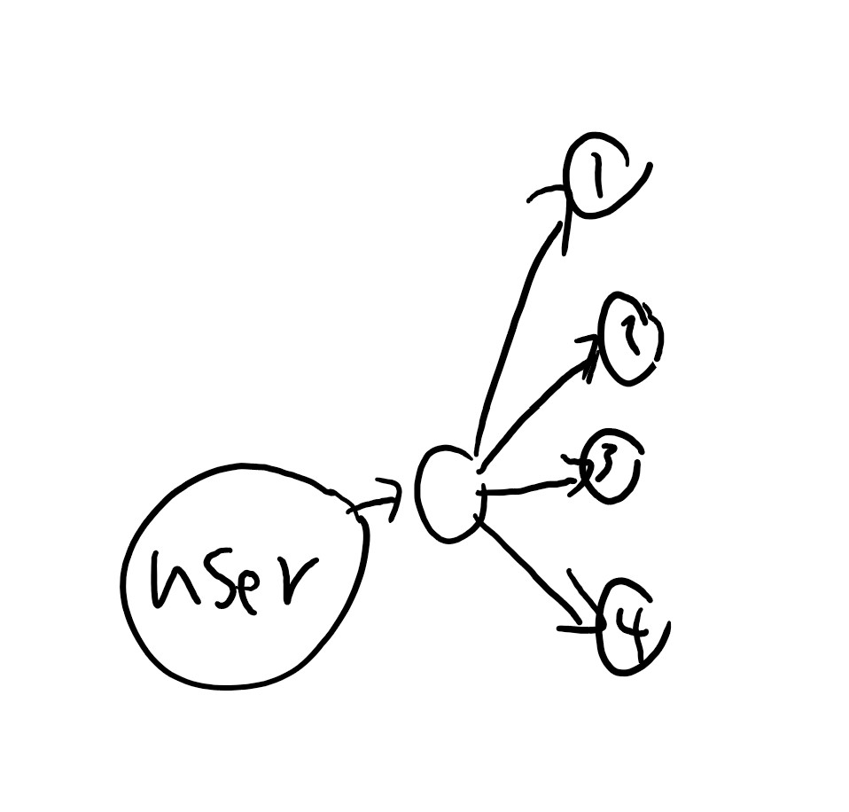
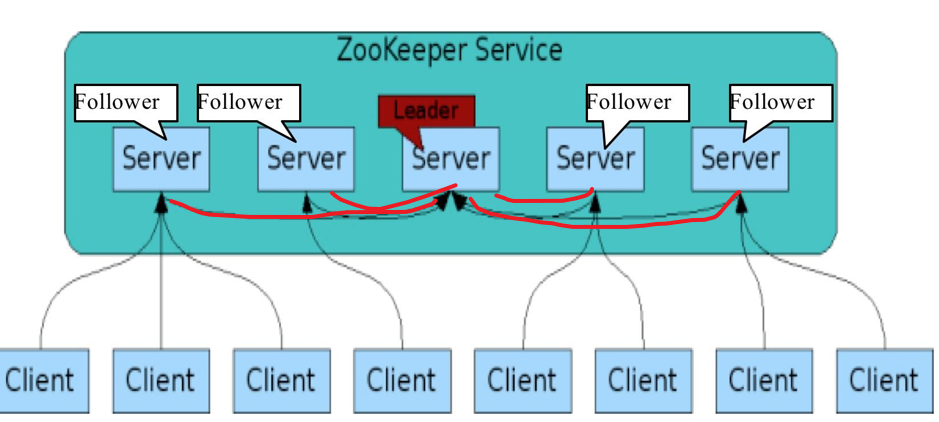
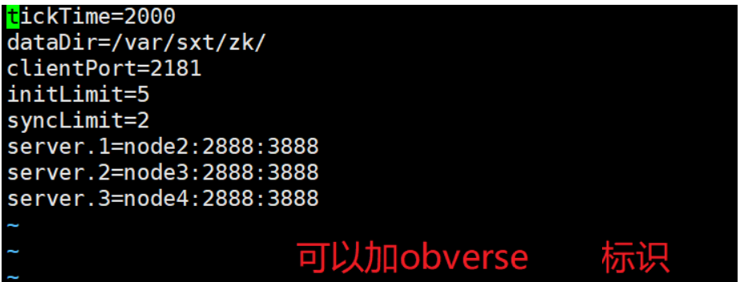
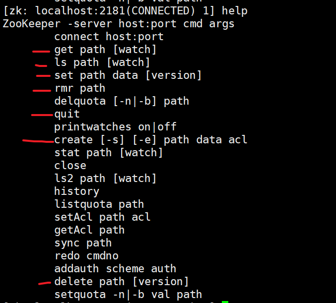
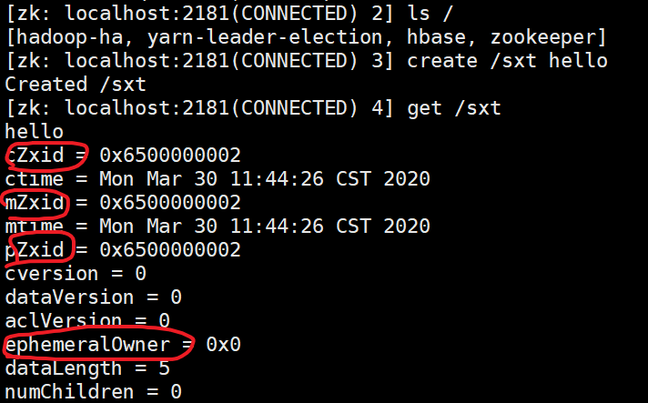
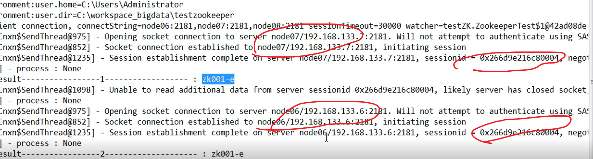
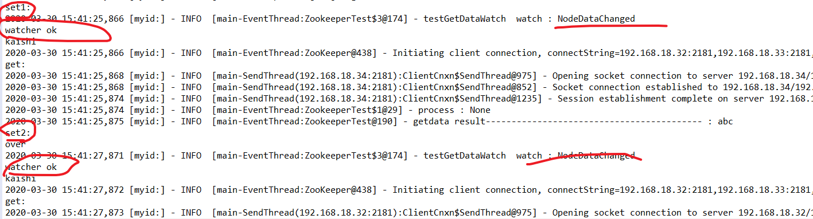
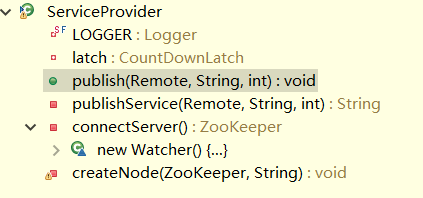
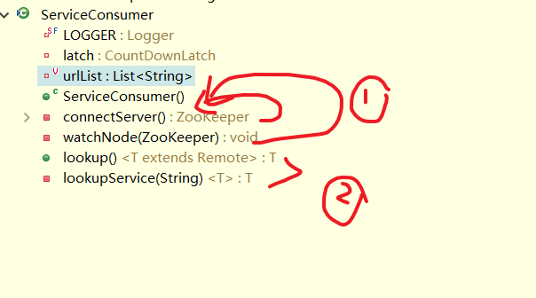
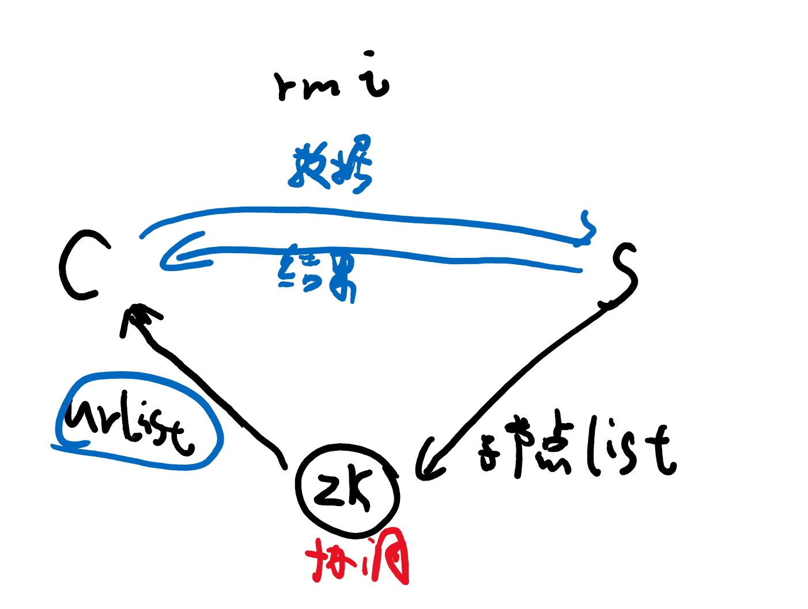

# zookeeper
# 1 介绍

```
#1，zk （主从）
#特点：
200ms处理：快 ，， ZK多台服务器：并发的。
解决单点故障，，以及分布协调。

#基于paxos 论文

#ZK两大问题：
对外如何消息一致。  （ZK多台服务器对外，哪台服务器都一样）
对内怎么自己协调。  （ZK自身是高可用的）
```


```
#2，数据承载模型
1）mirror全量:  所有节点，都是同样的数据。  扩展性不好，数据保存好
2）shards切片:把数据分给每个节点，，，。  扩展性好，但是没有任何数保存
3）取1,2好处。高可用，存储多。

#3 台服务器4G ：1）不管多少台只能4G，2）3台12G，，3）不备份那么多
```


```
#3，单机问题
1）问题
故障 和 瓶颈
	单点瓶颈，加强单台服务器还能解决点，但是故障没法解决。
解决： 一变多服务器，最终一致性。
	#（强一致性）大数据都是弱一致性（过半）

有无主模型，和 主从模型（ZK用的是这个）

2）无主模型：
#无主模型：CAP原则：一致性，可用性，，分区容错性，三者不可兼得。
--先只有一个节点，要接受OK，如果中断，阻塞--->所以多服务器。
--如果多服务器全都要ok，都上面一样       --->所以过半原则。
--但是坏的还是会对外提供服务             --->所以好的加入势力范围
--只有势力范围内的服务器才可以对外服务

#势力范围：
对外之前，先统一，，先两（如果3台服务器）成实例范围（过半势力范围），没有加入前不允许对外服务，先去同步，同步失败就变成standy，不对外提供服务了。

最大问题脑裂，当你如果陷入了有多群势力范围。
```



# 2 zk 主从模型

```
#1，概述
master:增删改查，，，slave: 只能r  
（一般主从职责分开,,但是ZK的slave权利更高，可以接受请求然后提交给m）

#Sl都会再连接下m
```



```
#是靠内部自己选举机制，比主备先进。

领导者（leader）
	负责进行投票的发起和决议，更新系统状态

学习者（learner） （所有都要在过半上反应，，但是只有f在选举上反应）
	包括跟随者（follower）和观察者（observer），follower用于接受客户端请求并向客户端返回结果，在选主过程中参与投票
Observer
	可以接受客户端连接，将写请求转发给  leader，但observer不参加投票过程，只同步leader的状态，observer的目的是为了扩展系统，提高读取速度

客户端（client）
	请求发起方
```


```

#2, 解决两大问题
1）对外状态：最终消息一致

Sl, （r请求可以直接处理） 把改请求再提交给M，M再通知所有集群，
---M收到确认（整个集群过半），然后执行命令，
---然后再通知所有服务器(通过消息队列，让消息一定传达到)

#message queue （主节点给每个节点，弄个队列，直到消息被从节点确认，消息才会消失，所以消息一定会被收到------最终一致性）

2）内协调：自身高可用，靠选举
#选举两个原则
	2.1）#serverid:  一开始就要告诉我，每台服务器编号。： （相对的最大编号原则）。
		一起启动时是：最大的编号
		分开启动时，没达到要求时，不启动，达到要求时，局部最大值，就算再加入，也不会改变主。

	2，2）#ZXid: 谁的事务编号大，（就是说明谁是最新的）  （在2.2的前提下，再2.1）

--详细：
主挂了
如果都能第一时间知道啥问题都没有。
如果假如只有一台的话，，自荐模式，，这个机子先和其他人说，然后依次比较。
所以无论如何也会得到谁是新的Leader


----------------------------------------	

--当给给hadoop HA： （yarn的 RS也是HA）
#ZK功能：注册，，事件观察，，，函数回调

首先在两个NN，开启ZKFC进程，，通过选举机制，在ZK抢先注册Znode节点的是active。
如果挂了，ZK事件观察，然后会通过ZKFC通知另一个NN，先降对方级，然后自己active

--当给Hbase:
是给给存节点消息的，用于对外协调的。
还给HM  HA

```


# 3 搭建和操作

#大数据都是CS架构。

```
#1，搭建
1) zoo.cfg  图1-1
2)那个路径设置id  存到 myid文件
	#告知了有几台，且编号。
	#vi + ，，进去就是最后

#在hadoop上，用zk，不仅仅要配置还要把hadoop注册上，通过zk格式化命令
```




```
#2, 操作
1）zkServer：
zkS  start    zkS  status

2)zkCli ：（路径要/）
help 
```



```
ls /

create     create  /sxt  hello
#注册，，就是在/  目录下，弄个新目录（目录是节点） .  而且还要注册信息
#节点目录重名，就不能不能create。（Node already exists: /sxt）

get /   get /sxt
#获得节点注册消息
#看zxid：
	c,  创建 
	m, set /sxt word (通过这个改变)
	p,子目录有变化，就父的p加。 
	#create  /sxt/sxt1  hello  get子的，三个zxid 和 和父的更新后的pxid同（父只变p）

#主节点自己直接注册信息，，，从的交给主完成
（ZK，在大数据优点，就是任何一个节点都可以完成任务，虽然交给主）

delete只能删除当前为最下级目录，  rmr任意
```



```
节点类型：两大类（四小类）

持久化， 默认create                         0  （那个啥0wner的值）

临时，  create -e        				  一个随机号 （那个啥0wner的值）

#session:决定 倒计时长，，，就是断了之后，倒计时，没有再连接，就没了  设置是ms
（session被销毁，节点也被销毁，因为临时的s被毁了，所以临时没了）

#在Web，，session解决http 超文本无状态传输（没有认证这个功能），即就是为了让下一次C，能访问S


序列化：
create  -s  /sxt  hello      自己后面给你加0000000X
#防止重名要省得自己改，系统帮你自动加。


```


# 4 API

## 4.1 简单测试

 eclipse 作为ZkC

```
#测试简单操作
猪呢比：
private static final int SESSION_TIMEOUT = 30000;
	
	public static final Logger LOGGER = LoggerFactory.getLogger(ZookeeperTest.class);
	
	private Watcher watcher =  new Watcher() {

		public void process(WatchedEvent event) {
			LOGGER.info("process : " + event.getType());
		}
	};
	
	private ZooKeeper zooKeeper;
```

```
#1，连接 与 关闭
1）建立连接
@Before
	public void connect() throws IOException {
		zooKeeper  = new ZooKeeper("192.168.18.32:2181,192.168.18.33:2181,192.168.18.34:2181", SESSION_TIMEOUT, watcher);
	}

2）关闭
@After
	public void close() {
		try {
			zooKeeper.close();
		} catch (InterruptedException e) {
			e.printStackTrace();
		}
	}
```


```
#2，创建 与 删除

1）/**
	 * 创建 znode 
	 *  1.
	 *  CreateMode
	 *  	PERSISTENT
	 *  	PERSISTENT_SEQUENTIAL
	 *  	EPHEMERAL
	 *  	EPHEMERAL_SEQUENTIAL
	 *  OPEN_ACL_UNSAFE: ANYONE CAN VISIT 
	 */
	@Test
	public void testCreate() {
		String result = null;
		 try {
			 result = zooKeeper.create("/zk002", "zk002data-e".getBytes(), Ids.OPEN_ACL_UNSAFE, CreateMode.EPHEMERAL);
			 Thread.sleep(30000);
		} catch (Exception e) {
			 LOGGER.error(e.getMessage());
			 Assert.fail();
		}
		 LOGGER.info("create result : {}", result);
	 }

2）删除
	@Test
	public void testDelete() {
		 try {
			zooKeeper.delete("/zk001", -1);  //rmr /xx
		} catch (Exception e) {
			 LOGGER.error(e.getMessage());
			 Assert.fail();
		}
	}


#close,,Cli关闭。临时session也没了
测试创建临时节点，，，session一失效，临时节点就没了。
```


```
#3，获取数据  （得到注册信息名字）
	@Test
	public void testGetData01() throws Exception {
		String result = null;
		try {
		byte[] bytes = zooKeeper.getData("/zk001", null, null);//null，表示Wacther不用
			result = new String(bytes);
		} catch (Exception e) {
			LOGGER.error(e.getMessage());
			Assert.fail();
		}
		LOGGER.info("getdata result-----------------1------------------ : {}", result);
		
		Thread.sleep(30000);
		
		byte[] bytes;
		try {
			bytes = zooKeeper.getData("/zk001", null, null);
			result = new String(bytes);
		} catch (KeeperException | InterruptedException e) {
			// TODO Auto-generated catch block
			e.printStackTrace();
		}
		LOGGER.info("getdata result-----------------2-------------------- : {}", result);
		
	}
	
#中间断了， C还是能拿到节点信息（手动关闭那个运行的服务器）
能输出，换ZK服务，session不变（（seesion唯一对应节点））
```




```
#4，客户端监控
前部分。监视
后部分测试
@Test
	public void  testGetDataWatch() throws Exception {
		zooKeeper  =new ZooKeeper("192.168.18.32:2181,192.168.18.33:2181,192.168.18.34:2181", SESSION_TIMEOUT, watcher);
		String result = null;
		 try {
			 System.out.println("get:");
			 byte[] bytes = zooKeeper.getData("/zk001", new Watcher() {
				public void process(WatchedEvent event) {

					LOGGER.info("testGetDataWatch  watch : {}", event.getType());
					System.out.println("watcher ok");
					try {
						System.out.println("kaishi");
						testGetDataWatch();
					} catch (Exception e) {
						// TODO Auto-generated catch block
						e.printStackTrace();
					}				
				}
			 }, null);
			 result = new String(bytes);
		} catch (Exception e) {
			 LOGGER.error(e.getMessage());
			 Assert.fail();
		}
		 LOGGER.info("getdata result------------------------------------------ : {}", result);
		 
		 // wacth  NodeDataChanged
		 try {
			 Thread.sleep(6000);
			 System.out.println("set1:");
			 zooKeeper.setData("/zk001", "abc".getBytes(), -1);
			 Thread.sleep(2000);
			 System.out.println("set2:");
			 zooKeeper.setData("/zk001", "def".getBytes(), -1);

	
		} catch (Exception e) {
			 LOGGER.error(e.getMessage());
			 Assert.fail();
		}
		 System.out.println("over");
	}


Wacther监控类，节点有问题 事件封装下。
get方法来绑定事件注册。  W观察节点有没有变化，并且记录类型
有变化就执行那个方法。process


问题：节点数据改变类型‘
1）出现位置：  W异步线程，，，一般W比主线程速度慢，
2）为什么一次：process只一次。。。如果要反复，就递归进去。

#同一个对象的监控器，只能监控一次，要想多次就递归前新对象。
#主线程结束，就结束，不管W这个异步线程
```




----


## 4.2 rmi测试

### 1）rmi

rmi：（C远程调用S：C提供数据给S，S返回结果给C）

```
#1，简单测试
本地一个端口做服务器。

1）RmiServer
public class RmiServer {
 
    public static void main(String[] args) throws Exception {
        int port = 1099;

        String url = "rmi://localhost:1099/demo.zookeeper.remoting.server.HelloServiceImpl";
      //打开服务窗口
        LocateRegistry.createRegistry(port); 
      //绑定url 与 实例类
        Naming.rebind(url, new HelloServiceImpl());
    }
}

#rebind ：url绑定了 对象，访问url就是访问对象
```

```
2）接口（继承Remote）与实现类

public interface HelloService extends Remote {
    String sayHello(String name) throws RemoteException;
}


public class HelloServiceImpl extends UnicastRemoteObject implements HelloService {
 
    protected HelloServiceImpl() throws RemoteException {
    }
 
    @Override
    public String sayHello(String name) throws RemoteException {
    	System.out.println("server:  "+name);
        return String.format("Hello %s", name);
    }
}

#在重写方法中，写的运行过程在S中，结果返回给C

C调用类的方法，，只是把数据传给S，实际运行是S，运回结果给C。
```


```
3）RmiClient
public class RmiClient {
 
    public static void main(String[] args) throws Exception {
  
        String url = "rmi://localhost:1099/demo.zookeeper.remoting.server.HelloServiceImpl";
    
        //返回那个实例类。
        HelloService helloService = (HelloService) Naming.lookup(url);
        String result = helloService.sayHello("Jack");
        System.out.println(result);
    }
}

```


---

### 2）ZK协调测试

C,,S集群   测试ZK服务器  自动切换S服务（出故障），自动增加新的S（有新S）

多个C  调用远程服务，看zk如何分配协调S


#ZK协调：需要协调的东西，都要在ZK注册（注册管理）

```
来一台S，就在ZK连接，注册节点信息，最后形成注册列表
C能访问ZK列表任何S，，并且C连接，委托监控S
#S有问题，get方法 的watch 就通知C。

#序列化 和 临时节点（不至于名字冲突，以及当你挂断开始倒计时节点能被删）
```


```
#1, Server 端：

1）S ：要运行的S端
public class Server {
 
    public static void main(String[] args) throws Exception {

  
        String host = "192.168.18.1";//虚拟网卡:windows 和linux通讯的地址（S写在这里，，ZK 和 C都能通信） 
        int port = Integer.parseInt("11211");//每启动一个s，端口增，手动启动
        //1，辅助类对象
        ServiceProvider provider = new ServiceProvider();
        HelloService helloService = new HelloServiceImpl();
        //2,
        provider.publish(helloService, host, port);
 
        Thread.sleep(Long.MAX_VALUE);
    }
}
```



```
2） 辅助类 :实际操作类
只要三大方法： 绑定类，，ZK连接，，创建注册节点。

public class ServiceProvider {
 
    private static final Logger LOGGER = LoggerFactory.getLogger(ServiceProvider.class);
	 private CountDownLatch latch = new CountDownLatch(1);
 
    //0，主功能函数 绑定类，，ZK连接，，创建注册节点。
    public void publish(Remote remote, String host, int port) {
        String url = publishService(remote, host, port); // 对象绑定url
        if (url != null) {
            ZooKeeper zk = connectServer(); // 
            if (zk != null) {
                createNode(zk, url); // 
            }
        }
    }
 	
    // 1 发布RMI服务  注册端口 绑定对象
    private String publishService(Remote remote, String host, int port) {
        String url = null;
        try {
            url = String.format("rmi://%s:%d/%s", host, port, remote.getClass().getName());
            LocateRegistry.createRegistry(port);
            Naming.rebind(url, remote);
            LOGGER.debug("publish rmi service (url: {})", url);
        } catch (RemoteException | MalformedURLException e) {
            LOGGER.error("", e);
        }
        return url;
    }
 
    // 2，连接 ZooKeeper 服务器 集群
    private ZooKeeper connectServer() {
        ZooKeeper zk = null;
        try {
            zk = new ZooKeeper(Constant.ZK_CONNECTION_STRING, Constant.ZK_SESSION_TIMEOUT, new Watcher() {
                @Override
                public void process(WatchedEvent event) {
                    if (event.getState() == Event.KeeperState.SyncConnected) {
                        latch.countDown(); 
                    }
                }
            });
            latch.await();
        } catch (IOException | InterruptedException e) {
            LOGGER.error("", e);
        }
        return zk;
    }
 
    //3 ， 带序列化的临时性节点
    private void createNode(ZooKeeper zk, String url) {
        try {
            byte[] data = url.getBytes();
            //要先先创建父路径，才不会报错
            String path = zk.create(Constant.ZK_PROVIDER_PATH, data, ZooDefs.Ids.OPEN_ACL_UNSAFE, CreateMode.EPHEMERAL_SEQUENTIAL); 
        } catch (KeeperException | InterruptedException e) {
            LOGGER.error("", e);
        }
    }
        
}
```

#zk先创建父节点。

#s:  提供hello 服务，并且 注册 ZK上。   跑多台服务器

#hello类上面有省略了

---------------

#C 一个一直跑，测试当S挂断，或者S增加，ZK协调提供服务

```
#2，C端
1） Client 
public class Client {
 
    public static void main(String[] args) throws Exception {
        ServiceConsumer consumer = new ServiceConsumer();

        while (true) {
            HelloService helloService = consumer.lookup();
            String result = helloService.sayHello("Jack");
            System.out.println(result);
            Thread.sleep(3000);
        }
    }
}
```



```
2）辅助类
构造器：初始化 ：ZK连接，，以及监视注册节点
返回实例类

public class ServiceConsumer {
 
    private static final Logger LOGGER = LoggerFactory.getLogger(ServiceConsumer.class);
    private CountDownLatch latch = new CountDownLatch(1);
 

    // url list
    private volatile List<String> urlList = new ArrayList<>(); 
 
    // 1，初始化 ：ZK连接，，以及监视注册节点
    public ServiceConsumer() {
        ZooKeeper zk = connectServer(); 
        if (zk != null) {
            watchNode(zk); 
        }
    }
 
    //1,1 连接
    private ZooKeeper connectServer() {
        ZooKeeper zk = null;
        try {
            zk = new ZooKeeper(Constant.ZK_CONNECTION_STRING, Constant.ZK_SESSION_TIMEOUT, new Watcher() {
                @Override
                public void process(WatchedEvent event) {
                    if (event.getState() == Event.KeeperState.SyncConnected) {
                        latch.countDown(); 
                    }
                }
            });
            latch.await();
        } catch (IOException | InterruptedException e) {
            LOGGER.error("", e);
        }
        return zk;
    }
 
    //1,2 监视 ： 子节点的变化，节点列表变url列表 （因为当你服务器变化是子节点变化了。所以要看这个，）
    private void watchNode(final ZooKeeper zk) {
        try {
        	//获得节点列表
            List<String> nodeList = zk.getChildren(Constant.ZK_REGISTRY_PATH, new Watcher() {
                @Override
                public void process(WatchedEvent event) {
                    if (event.getType() == Event.EventType.NodeChildrenChanged) {
                        watchNode(zk); 
                    }
                }
            } );
            //节点列表变信息列表
            List<String> dataList = new ArrayList<>(); 
            
            for (String node : nodeList) {
                byte[] data = zk.getData(Constant.ZK_REGISTRY_PATH + "/" + node, false, null); 
                dataList.add(new String(data));
            }
            LOGGER.debug("node data: {}", dataList);
            urlList = dataList; 
        } catch (KeeperException | InterruptedException e) {
            LOGGER.error("", e);
        }
    }
 
    // 2 查找 RMI 服务 
    public <T extends Remote> T lookup() {
        T service = null;
        int size = urlList.size();
        if (size > 0) {
            String url;
            if (size == 1) {
                url = urlList.get(0); 
                LOGGER.debug("using only url: {}", url);
            } else {
                url = urlList.get(ThreadLocalRandom.current().nextInt(size)); 
                LOGGER.debug("using random url: {}", url);
            }
            System.out.println(url);
            service = lookupService(url); 
        }
        return service;
    }
 
    @SuppressWarnings("unchecked")
    private <T> T lookupService(String url) {
        T remote = null;
        try {
            remote = (T) Naming.lookup(url);
        } catch (NotBoundException | MalformedURLException | RemoteException e) {
            if (e instanceof ConnectException) {
            
                LOGGER.error("ConnectException -> url: {}", url);
                if (urlList.size() != 0) {
                    url = urlList.get(0);
                    return lookupService(url);
                }
            }
            LOGGER.error("", e);
        }
        return remote;
    }
}
```


```
#3，参数类
public interface Constant {
    String ZK_CONNECTION_STRING = "192.168.18.32:2181,192.168.18.33:2181,192.168.18.34:2181";
    int ZK_SESSION_TIMEOUT = 5000;
    String ZK_REGISTRY_PATH = "/registry";
    String ZK_PROVIDER_PATH = ZK_REGISTRY_PATH + "/provider";
}
```




```
大总结：
1）两个用途：HA 与 协调

2）ZK自身特点： 对内自身HA，对外消息一致

3）get 方法让wacth 和 要获取注册节点绑定 从而监控

4）ZK协调外部集群：自动切换集群S的服务，自动增加新的S  （和C,S都绑定。。然后S的create注册，C的get监控。）

5) RMI应用： （那个类继承Remote）

	C获取类实例，传递数据（Naming.lookup(url)）
	S绑定类实例，实际运行（Naming.rebind(url, new HelloServiceImpl() )
	#在实现类中的方法重写S要做的事情，C得到结果
```


还差个案例。。。

