# **elasticsearch**

#2.2。1 版本

# 1 Lucene的介绍

## 1.1 关系型数据库

```
在关系型数据库中, 
特点：
	基于字段
	字段中放置的是非结构化
	索引，面向字段

如果查询某个字段 ： 要全文检索

解决：
#建了索引，可以更快的查找
#假如要查询的字段不代表整个ceil的字段 （不是=，是like）
	最小单位是ceil，再小，模糊查询，没有索引了，不仅要全文检索，还要每个ceil再和 给定字段逐个匹配了

#所以，传统数据库查询还不满足要求
```


## 1.2 Lucene框架

### 1）介绍

[Lucene介绍]: /source

```
#1, 介绍
Lucene是一个全文搜索框架，不是应用产品。 （像库一样，，es所用的就是lucene）
提供本质就是快速给搜索内容定位 （用了倒排，doc封装等）

#在动态中，很有效。
```

### 2）正排倒排

```
#2，原理
（doc : content + path 等信息）
 (doc 是最小单位， 例如java的实例是最小操作单位)
 
1）先说正排索引  （以d 为key）

#步骤：
把每个doc 提前切词，然后弄每个doc词的索引

#解析：
只是省略了 类似每个ceil中切词时间，以及每个doc重复匹配词的时间

但是在整体流程中还是要全doc匹配，同时docs中，重复的词很多，索引表又很大

#例子：
在一篇文章中:Tom is a boy，Tom is a student too

（doc 为ID，然后每个词，出现的次数啊，以及偏移量）
```


```
2）倒排    （以词为key）
#步骤：
把所有的词当做索引，然后附加出现docid，次数，偏移量等

#解析：
倒排最大意义： 同一个词就出现了一次，而上面正排一个content一次。（索引表大小，像word  换 doc ）

从根本思想突破了，你在整个流程中，不用一一去比较，你可以快速定位到 所要查找词的行，然后直接得到出现的位置。

#例子：
中国 (1:1) {2},(2:2){0，15} （复杂点的）
word  (id : num) {offset}

简单：
```


### 3）搜索流程

#### --单机

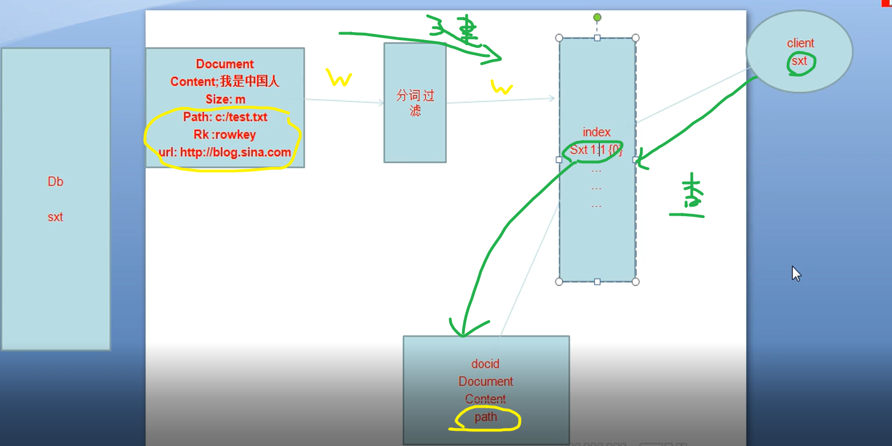

```
#1，数据类型：
Context 只是douctm 一部分。（就像d还有来源path信息等）
D是基本单位，是必须要的格式

#2，处理
1）建立：
给提示，问你是否要做分词和倒排 ，强制保存   
（index 和 doc 要在本机的）
	#不是所有的都要做分词  例如基本就content做分词倒排
	#index 是 词 对应 建立的doc 的映射
	#但可选保存的东西：doc还有唯一标识ID，（context都可以不要）

2）查询：
#没有这个搜索引擎,
要找原始数据源
不同数据源（根本没法去匹配），，还有字段可能模糊搜索（要再进一步匹配，慢）

#有了
就Cli找index ，能和关键词匹配到， 然后找DID找到一些列详细信息（path等）
（对数据源不要求了，全都和index匹配） （又快，同时兼容性好）
```

```
#3，应用
#像中转，东西还是原来的数据，只是速度帮你定位，同时content能展示一些东西

1）数据库 ：输入的doc，可以自己写，（排名在redis后面）
2）搜索引擎：快（ms），准，大   （path 就是 url连链接，，然后content就是展示的一些内容）
  #单机就不行了，一定要集群，es本身也是集群
  #测试单机瓶颈，然后算下平时峰值，就大概知道要几台机器了

```


#### --es集群

```
#数据承载方式： 沙丁,全量

把一个集群的一个服务理解成一片，然后一个机器上可以有多个不同片
	#基本上，主机数小于片种类（准备扩充用的），然后一种片数量要小于集群数-1.
```

```
#1，沙丁：

1）创建
考虑数据怎么分发  （目的均衡） （lecene 只支持 doc文档）

根据原来的DOCID，的 hashcode 分发，到每个机子上面分别按照单机处理。
因而：每个节点上面有各自片的index,,以及doc

#要提前建立好
```

```
2）查询流程

虽然有主从概念（淡化的主，简单处理管理分片），但是更多是无主的联盟，任何节点都能接受cli的任意请求

在空闲的节点中弄个 汇总master（执行代理，不是那个上面的主从）
	#知道查询通知，然后通知集群，然后集群开始工作 （并发去找。速度要大家差不多）
	#然后集群汇总到master，然后master汇报给cli

例如： 查一个词 sxt,,就要所有集群同时查找，最后返回所有的结果汇总给执行代理进程，然后返回
```

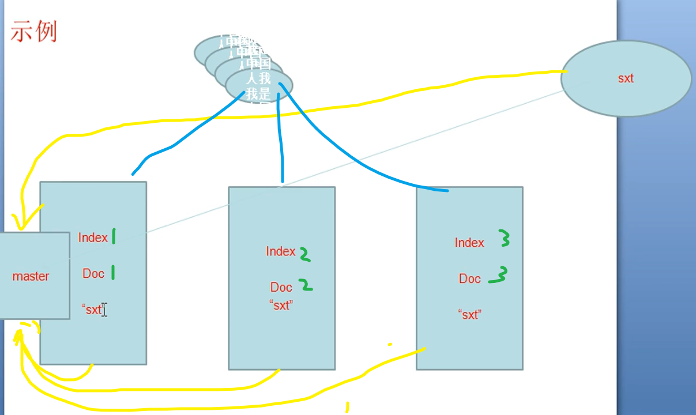

```
#2，纵向
#高可用，把自己的服务，拷贝给其他集群主机
#类似于DN 的副本

主片，从片：（主能读写，从片，读）
从片放置策略：不能放主片上，放其他节点上 数量低于服务器-1
```


#### --集群扩展

```
#扩展 （每台机子都到了上限，只能加机器，提高性能）
假如扩展了：加到六台

数据迁移，hashcode又要改，
	redis: 封了一层，key都是静态数据，不涉及计算，ID一致
	lec  ：你分发是原ID，保留是计算后的，后面反正都要移动（所以不保留原ID，采用另一个）
#个人理解


提前规划了下。，有一点富裕的余地 （多弄几个主片）
	一台主机，还能放多个主片，多算几个（比如一上来弄10个片）
	然后当你，有需求了，在进行片的迁移就行了


#这里的hashcode，其实不涉及后续的任何操作，只是为了均衡。（不像redis后续还要查）
#只是把你的原来的数据，平均丢到机器中，去弄索引，反正后续都要并行集群 （后续，关键是后来的id和index）


```


# 2 es 

## 2.1 介绍

### 1）es

```
#1，Elasticsearch

是一个基于Lucene的实时的分布式搜索和分析引擎。
设计用于云计算中，能够达到实时搜索，稳定，可靠，快速，安装使用方便。
基于RESTful接口。
	普通请求是...get?a=1
	rest请求....get/a/1

#2，ES VS SOLR  (ES延迟50%左右)
接口
	类似webservice的接口
	REST风格的访问接口
分布式存储
	solrCloud  solr4.x才支持
	es是为分布式而生的
支持的格式
	solr  xml   json
	es  json
近实时动态搜索
```

### 2）rest

```
#之前写得太麻烦了，无非增删改查，rest暴露接口，简约写

	REST的操作分为以下几种
	GET：获取对象的当前状态；
	PUT：改变对象的状态；
	POST：创建对象；
	DELETE：删除对象；
	HEAD：获取头信息。
```


## 2.2 安装

```
#1，安装
 一定要普通用户操作
 	#具体操作看doc （es 和 插件）
 	
 
 本人配置： 
 用户： sxt
 es:   es1
 集群：node1,node2,node3
```


```
#2，操作

1) 启动
普通用户启动 ： bin 下： ./elasticsearch
	#错误： 可能权限（-R 所有目录） ，配置文件的host和 Ip写对

启动后 ，阻塞：（涉及选举，自己的机制，很慢)
	#ss -nal  9200 :对外，，，9300内部通信接口

http://node1:9200/_plugin/head/  (node1.2.3都可以访问，反正都是一个界面）
	#没插件前，是json
	#能看到集群名称才是正确启动
	#健康状态
```

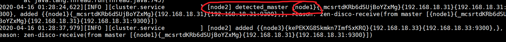

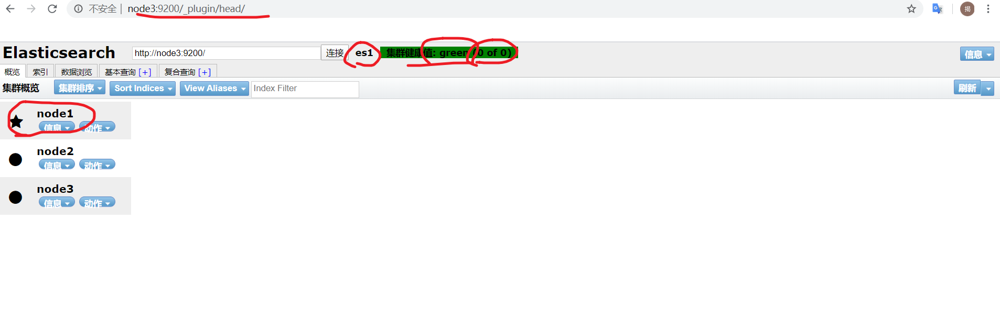

```
2）测试
root下执行curl，，（等于cli 按照 rest风格）

#创建索引库
curl -XPUT http://192.168.18.31:9200/bjsxt/
	（默认，三个节点下，5种片，一片1个副本，总共10个片）
    （当你没有挂掉过半时，都能有完整种类的片）
```

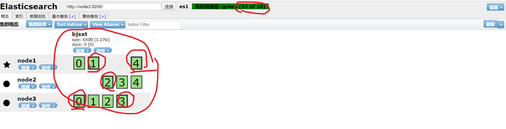


```
#停止一个从 ：ctrl + c 或者 kill

第一阶段：
被停止的这个节点网页访问不了，集群变成亚健康，这个节点变成unassinged
原来的主片，不变，没有主片的从片变成主片。

第二阶段：
然后自动调整之后，沙丁切片充分，变绿
补全到 5主5从

#总结
一共三个服务器，五片主，预先做了冗余配置（可以自己设置）
之前三个机器是一个主一个备份，，现在两个机器也是
```


## 2.3 操作

### 1）概述

```
#下面的curl操作cli 命令行
主要是偏向感觉像数据库的操作 
	（el不仅仅数据库存数据，还自动加了倒排索引））
	
SQL 一开始结构就要定，，es的 列可以增加

file：
	segment（段，多个document组成）
	document（一条记录，一个对象实例）
	field（对象的属性）
	term（项，分词之后的词条）
```


### 2）内置Rest


### 3）curl操作

```
CURL命令
简单认为是可以在命令行下访问url的一个工具
curl是利用URL语法在命令行方式下工作的开源文件传输工具，
使用curl可以简单实现常见的get/post请求。

格式：
curl  
 -X  指定http请求的方法 （HEAD  GET POST  PUT DELETE）
-d   指定要传输的数据

#增（一般用post），删，改，查
#讲述curl,,客户端如何操作，，以及主从片设置
```


#### -  post和put

```
#1，post   （自动手动ID建表 created true，更新 created false）

1) 建type(表)
curl -XPOST http://192.168.133.6:9200/bjsxt/employee -d '
{
 "first_name" : "bin",
 "age" : 33,
 "about" : "I love to go rock climbing",
 "interests": [ "sports", "music" ]
}'

#自动ID

2）
curl -XPOST http://192.168.18.32:9200/bjsxt/employee/1 -d '
{
 "first_name" : "pablo2",
 "age" : 33,
 "about" : "I love to go rock climbing",
 "interests": [ "sports", "music" ],
 "sex": "man"
}'

#加列，可以改变结构
#可以手动ID，
#可以更新值  

web点击数据浏览看表，全局刷新，能看到，（字段的显示有点问题）
```

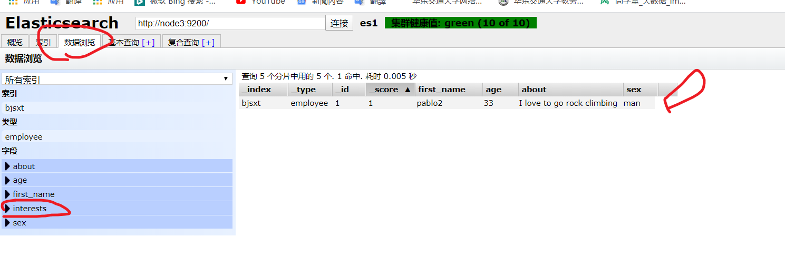

```
#2，put   （手动ID创建，，以及更新,, ，片只能创建的时候决定）

curl -XPUT http://192.168.133.6:9200/bjsxt/employee/1 -d '
{
 "first_name" : "god bin",
 "last_name" : "pang",
 "age" : 40,
 "about" : "I love to go rock climbing",
 "interests": [ "sports", "music" ]
}'

手动ID创建
	#不给ID：不行
	#给了有的ID  ： 更新


```


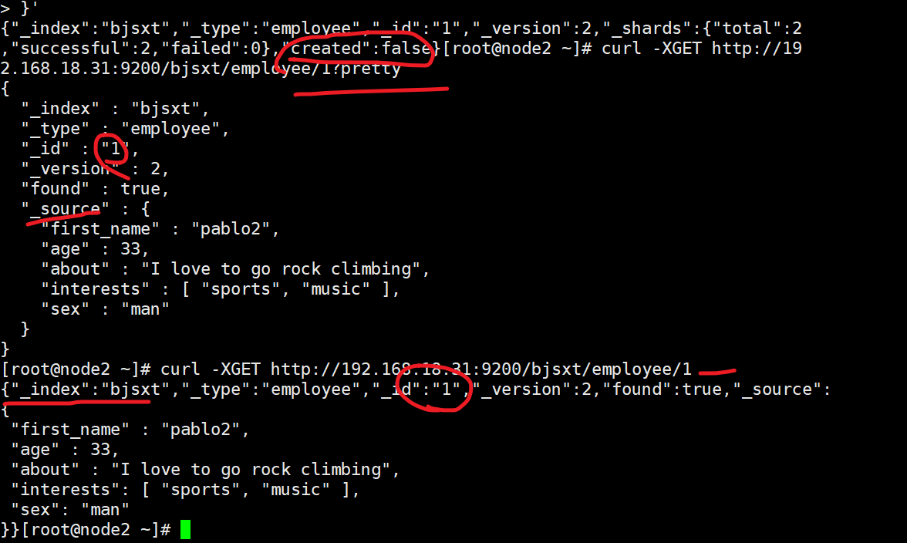

#### - get 查询

```
#1，精确ID查询  （没有用到倒排）
根据document的id来获取数据：(without pretty)
curl -XGET http://192.168.18.31:9200/bjsxt/employee/1?pretty

#pretty : 美化 ，用了就全用jsoN显示，，上面元数据，下面内容
#doc 和 _source 在 es指同一个东西

---------------------

#2，根据field来模糊查询数据：（用到了倒排）
curl -XGET http://192.168.18.31:9200/bjsxt/employee/_search?q=first_name="bin"

#含有所有的满足的
#结构： 切片，hits，具体的

------------------

#3，用格式来写
curl -XGET http://192.168.18.31:9200/bjsxt/employee/_search?pretty -d '
{
 "query":
  {"match":
   {"age":33}
  }
}'

```

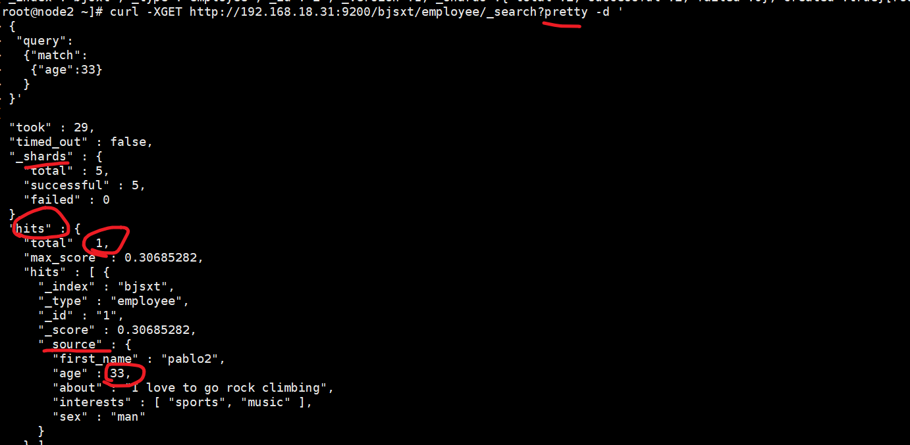

```
#4，对多属性
curl -XGET http://192.168.133.6:9200/bjsxt/employee/_search?pretty -d '
{
 "query":
  {"multi_match":
   {
    "query":"bin",
    "fields":["last_name","first_name"],
    "operator":"and"
   }
  }
}'
# 在属性last，和 first 任意一个中，满足的就返回

#5，多个term 对多个field 发起查询:bool（boolean） 
1）
# 组合查询，must，must_not,should 
	#  must + must : 交集
	#  must +must_not ：差集
	#  should+should  : 并集

curl -XGET http://192.168.133.6:9200/bjsxt/employee/_search?pretty -d '
{
 "query":
  {"bool" :
   {
    "must" : 
     {"match":
      {"first_name":"bin"}
     },
    "must" : 
     {"match":
      {"age":33}
     }
   }
  }
}'

2）范围 加 还加上范围的
curl -XGET http://192.168.18.31:9200/bjsxt/employee/_search -d '
{
 "query":
  {"bool" :
   {
   "must" :
    {"term" : 
     { "first_name" : "bin" }
    }
   ,
   "must_not" : 
    {"range":
     {"age" : { "from" : 20, "to" : 33 }
    }
   }
   }
  }
}'
```


#### - delete 删

```
curl -XDELETE http://192.168.133.6:9200/test2/
```


#### -片设置

```
#只能创建库

curl -XPUT 'http://192.168.133.6:9200/test2/' -d'{"settings":{"number_of_replicas":2}}'

#不设置沙丁，副本两个，，主片默认有预留的（5主片）
#不设置副本，也是默认的（默认1个）


curl -XPUT 'http://192.168.18.31:9200/bjsxt/' -d'{"settings":{"number_of_shards":6,"number_of_replicas":3}}'

#副本设置超了集群（健康值变了，有组从片没地方放了）没效果，

#主片在性能内随便，，从本要集群-1

```


# 3 搜索引擎项目

#先配置好tomcat

## 3.1 获取数据

```
爬虫，来获取网站的html数据
#nutch，Python（主流），wget（c语言）

本次用wget 为例子（root操作）
wget -o /tmp/wget.log  -P /root/data  
--no-parent --no-verbose -m -D news.cctv.com   
-N --convert-links --random-wait -A html,HTML,shtml,SHTML http://news.cctv.com

{
-o :日志
-P :输出目录
--no-parent :不追溯至父目录
--no-verbose：关闭详尽输出，但不进入安静模式
-D ：逗号分隔的可接受的域列表。
--convert-links ：让下载得到的 HTML 或 CSS 中的链接指向本地文件
--random-wait  ：随机等会
-A 逗号分隔的可接受的扩展名列表
}
```

[参数解析]: https://www.cnblogs.com/hcduguo/p/4690238.html

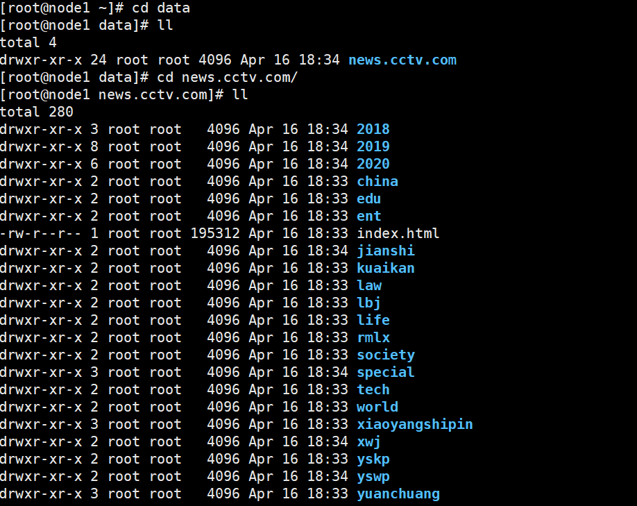

#放置D://data


```
#包介绍
searchController  和 jsp  后前端逻辑
tool 加单完成数据提取，变成doc
html bean : 封装输入输出doc   ，，page bean :分页的
核心：indexservice:  
```

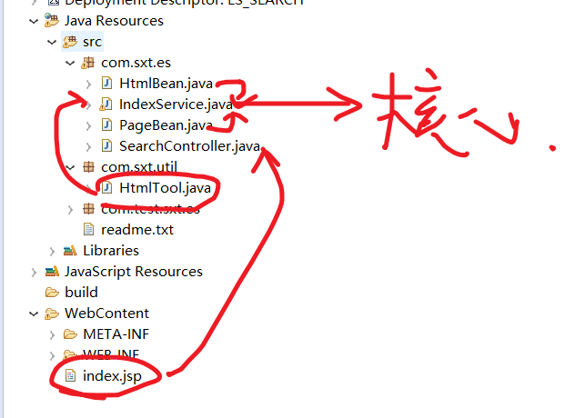

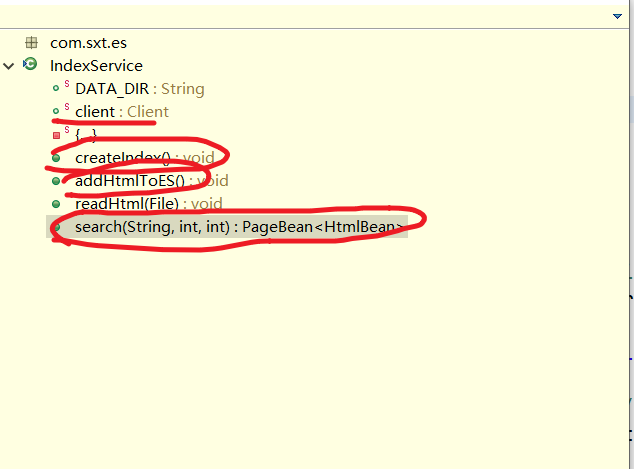

## 3.2 提取数据

```
#从网页中过滤数据，把doc数据封装到htmlbean中。（Tool.java）
(net 的Source解析操作)
把title,contenet,url（差http字符） 封装到bean (还差个id属性)
```

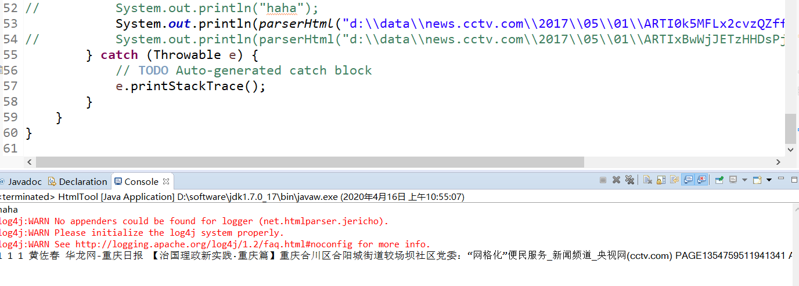

## 3.3  es  处理

```
#核心包：IndexService.java   （可以junit测试）
连接，建索引库，，输入数据
```


### 1）连接

```
#Client对象
#在静态初始块中完成连接
```


### 2）建索引库

```
#1，实践  （目的是建索引库，同时提供分词，索引，保留的doc格式）
#admin():管理索引库的。client.admin().indices()
1）建库
2）完善表，设置格式（title 和 content有操作）
	#构建者构建模式 ：分成构造Builder  和  装配Director
	#工厂模式：创造者 和 使用者分离
```

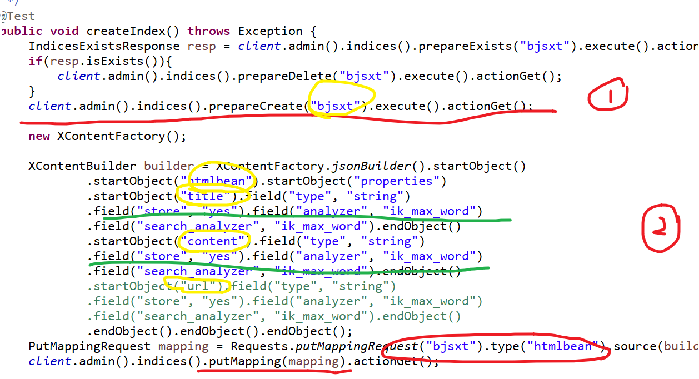

```
#2，测试 （普通用户）
#必须要提前把 ik分词插件弄到es目录下（参考操作文档）
(版本要对应 vi plugin-descriptor.properties ，版本2.2.1)

#启动集群

#junit :create （没有url,后面增加列，动态改变结构）
```


### 3）插入数据

```
#1，实践
递归出目录下的所有文件，
然后插值
#这时候等会给定的是原来的doc，集群会自动分配，然后切词，索引，保存格式的doc。
```


```
#2，测试

jnuit: add

#查看索引库 （有了url，，ID 对应着Doc（一行数据））
```

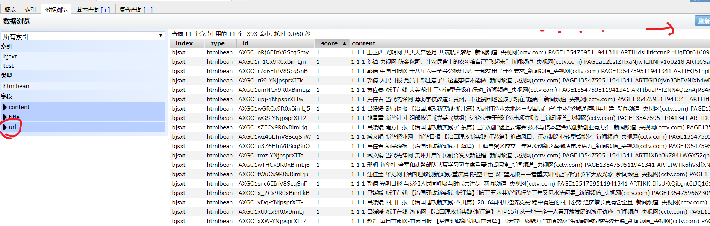


#至此，以及完成了 索引库（有倒排），，以及doc的保存

## 3.4 查询数据

```
#1，效果展示
Servers 视图。加载Tomcat
部署项目（add and remove），启动tomcat

#http://localhost:8080/ES_SEARCH/index.jsp

#点击搜索效果展示 （url ， title，content）
	#目前没有分页，一页只显示10个
```


```
#2，实践

1）前端
发送输入的keywords，然后分页展示返回的结果
```

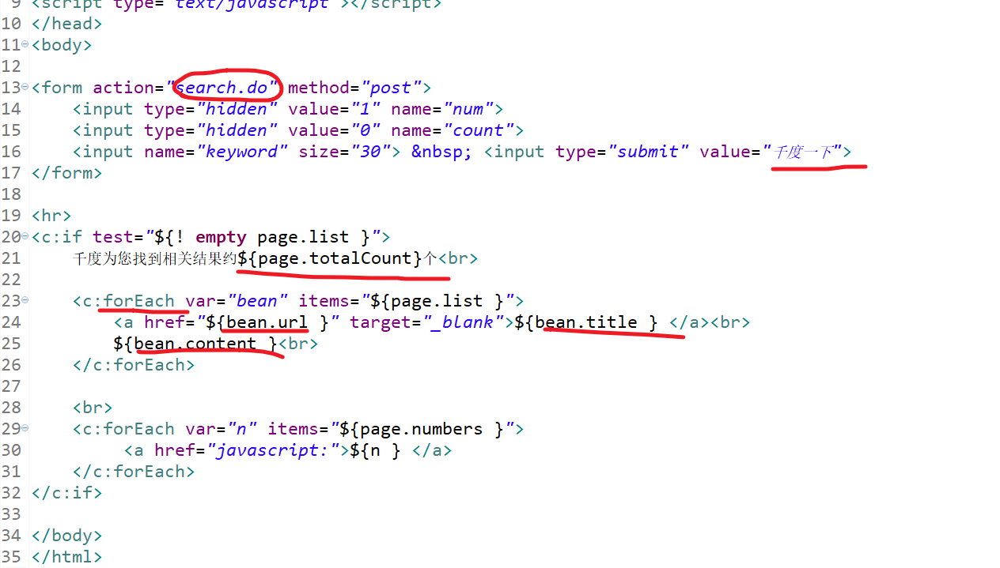

```
2）后端逻辑
map到前端语句，，然后调用核心方法search，
封装html bean的分页 page bean
```

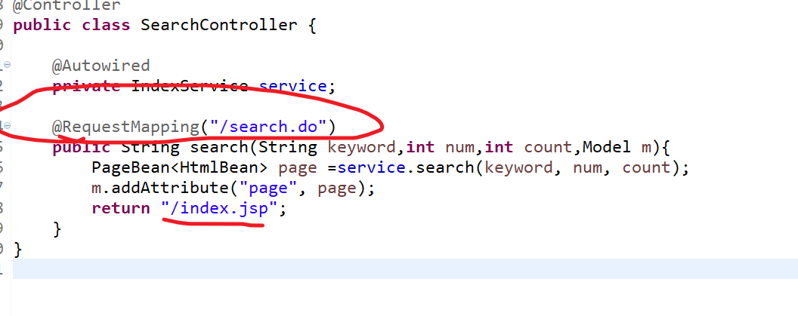

```
3）核心包里面的核心方法
不用client 的admin，普通就行
提前准备搜索返回格式，，然后返回特定的bean结果
```


[分词]: https://zhuanlan.zhihu.com/p/42151612
[介绍]: https://zhuanlan.zhihu.com/p/94181307

