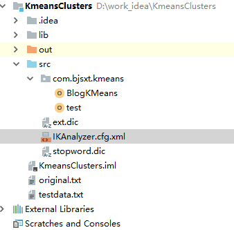
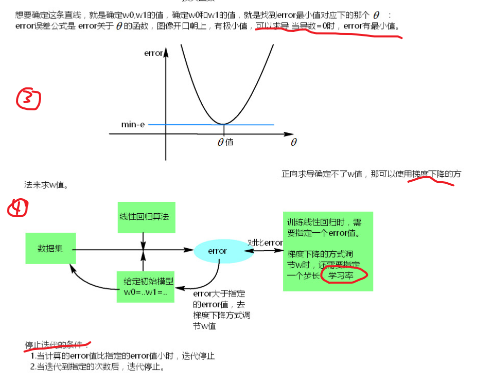
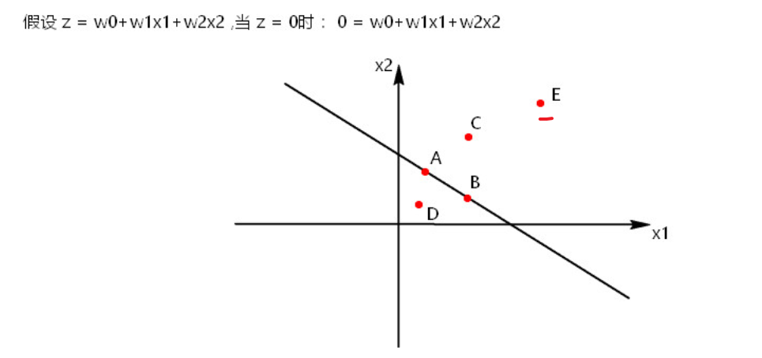
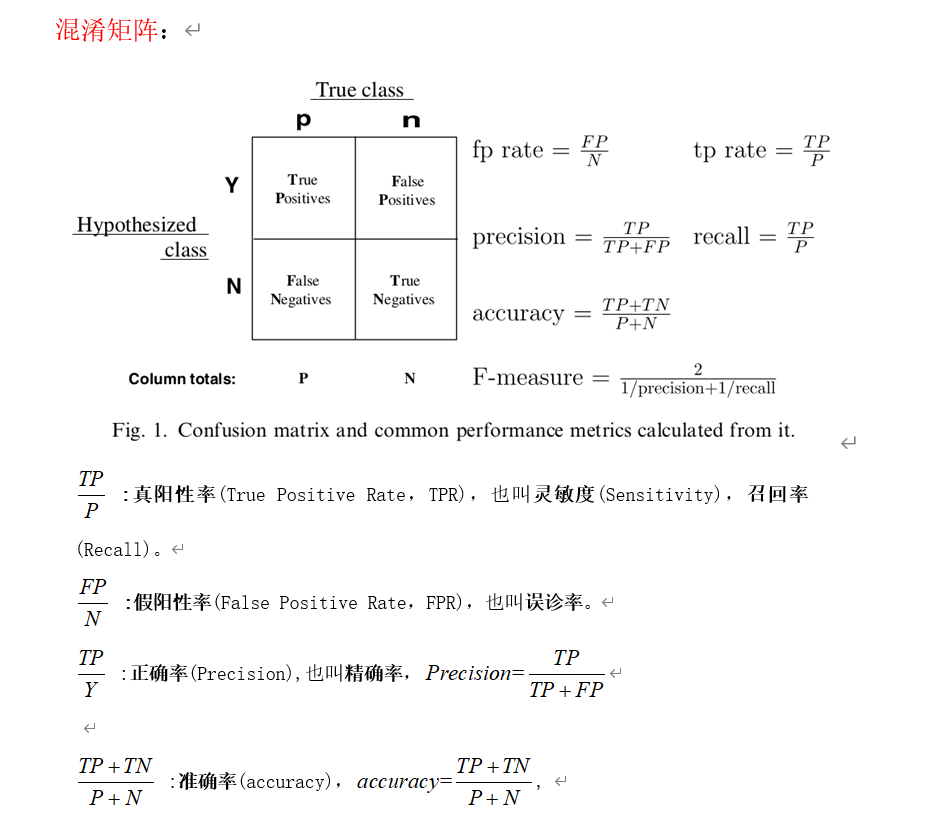
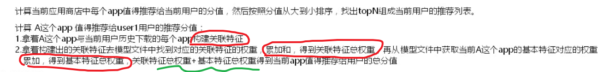
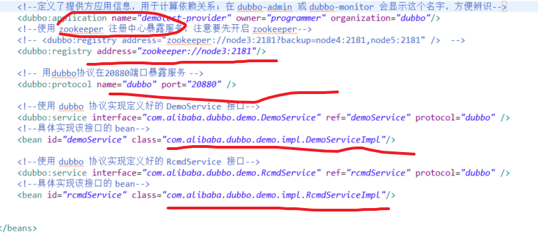

# ML

```
#1，目录
#python目录： G:\anad （3.7.1）  (视频用的是3.6.5 和 3.5)
#spark目录:    D:\usr\spark-2.3.1-bin-hadoop2.6

#2，比较
spark源码用scala写的
pyspark的用数据处理不广泛（操作要少， py4j若频繁转成jvm的问题) ，主要是用在机器学上
```


# 0 pyspark前言

## 0.1 准备

### 1）py的四个准备

#3.X 解决编码 ，默认 utf-8

```
#四步：
python:
	可用ana来安装，视频用的3.6.5，本人用3.7.1  (安装在py.md)
SPARK_HOME:
	spark安装地址

py4j  :  
	python底层是c，，c与java通信模块  因为要jvm
pyspark:
	
（把SPARK_HOME/python/lib 里面的py4j/pysark
  放在anad /Lib/site-pack   (pip,一般会联网，而且下最新的) )
#import测试时候成功

```


### 2）开发工具

```
（尽量不要名字test）
#1，ecilpse:
	help/marketplace 搜索pydev  然后window/prefer/配置python解释器
	测试写py： 建pydev project，然后弄包弄文件module（选空就行）

#2，pycharm：
	不用插件
	close_project，然后建project，可以选解释器


```

```
#3, idea:
1)操作
	close_project,然后下面configure/plugins 联网或本地安装插件python：
	（官网： 往下面找插件仓库，然后搜python,  看idea 版本 help/about ，下载插件，，不要解压）
	创建py_project，选解释器

2）测试
from pyspark import SparkConf,SparkContext
if __name__ =="__main__":
    conf=SparkConf()
    conf.setMaster("local").setAppName("wc")

    sc=SparkContext(conf=conf)
    lines=sc.textFile("./ws")
    words=lines.flatMap(lambda line:line.split(" "))
    pairWords=words.map(lambda word:(word,1))
    result=pairWords.reduceByKey(lambda v1,v2: v1+v2)
    result.foreach(print)
 
 #如果有问题：
项目 和 pyspark(PYSPARK_PYTHON)的 python版本环境变量    一致
jvm啥的有问题：  图1，加JAVA_HOME
```


### 3）切换版本

```
安装指定版本: （ana.doc文件）  (安装到anad/envs里)
	conda create --name python35 python=3.5

切换开发工具解释器:
	idea : File / project structure，
	eclipse : 上面给的地址
	pycharm ：和idea差不多，找右边那个如上图，或者 File / settings
修改PYSPARK_PYTHON 和现在解释器的版本一致
```


## 0.2 PV/UV 例子

#pyspark写

### 1）实现

```
统计PV,UV
统计某个地区的PV

统计每个网站最活跃的top3地区
统计每个网站下最活跃的top3用户

```


```
#模拟数据：

一些python的操作 : 
sys.argv[0] : 获得当前  路径/文件
sys.argv[1]: 你给定的第一个参数 (上面那个图1,可以给运行的参数)

time.strftime("%Y-%m-%d") : 格式化时间的
random.randint(a,b)   ： [a,b] 的整数
```


```
#业务:

1) pv :  line --> （com , 1）
2) uv :  line -->  com_ip  (distinct)--> （com , 1）
3）条件下的pv： 先加个filter(条件)，过滤
```


------------------


```
4）分组 取topn : 普通下 的原生list排序 

函数：
returnlist = sortedlist[:3] if len(sortedlist >3) else sortedlist
```

#框架


#取topn函数


-------------


```
5）分组取 topn  ； 优化数据可能过大 的定长数组排序
刚刚的思路，也依旧可以做
优化 ：  
	用户多，可能EX的压力大 ，（因为，k,v v多，所以单个EX处理多）
						 (所以弄成v,k, 进行一些操作,然后再k,v这时候，v没有那么多了)

#原理图
```


```
#代码：

~框架：
	前面是把每个k，里面user去重了
	后面操作一致，就定长数组取

//得打散的( com , (id,count) )  : 同时也没有相同的com,id了
userid_site = lines.map(lambda line: (line.split("\t")[2], line.split("\t")[4]))
userid_site.groupByKey().flatMap(lambda one: getSiteInfos(one)) 

//把同com下的，不同id取topn
.groupByKey().map(lambda one:getTop3User(one)).foreach(print)

~去重函数: 
def getSiteInfos(one):
    userid = one[0]
    siteIteable = one[1]
    sitedic = {}
    for site in siteIteable:
        if site in sitedic:
            sitedic[site] += 1
        else:
            sitedic[site] = 1
    returnlist = []
    for site, count in sitedic.items():
        returnlist.append((site, (userid, count)))
    return returnlist

~定长数组: 
def getTop3User(one):
    site = one[0]
    userid_count_iteable = one[1]
    top3UserInfo = ["", "", ""]   
    for elem in userid_count_iteable:
        userid = elem[0]
        count = elem[1]
        for i in range(len(top3UserInfo)):
            if top3UserInfo[i] == "":      // 首先3个的空位
                top3UserInfo[i] = elem
                break
            elif top3UserInfo[i][1] < count:  //大于才替代
                for j in range(2, i, -1):    //根据第几个位置，动态数组改变后移     
                    top3UserInfo[j] = top3UserInfo[j-1]  
                top3UserInfo[i] = elem
                break
    return site, top3UserInfo

```


### 2）python补充

```
python 用[X] ，scala 用tp._  
/ 换行写

python 三目运算符  a= XX if  else 
对{}，进行排序筛选： 先.items()得类似list嵌套元组, 然后sorted(list, 匿名函数选怎么排序，倒序)
```


# 包概述

```
#sparkMLlib: 没用maven管理
勾是讲过用过的
圈是没讲过，但是有用的
```


```
#SK：python的包
```


```
微博聚类 ML
```



```
道路预测 ML
```


 

```
推荐系统
Recommonder: ML
	模拟数据生成 和 模拟训练权重   (maven管理，先选下maven的地址 和 setting文件路径）)

recommend：SK中
	有真实的  app基本list  和 历史下载表 和 模型 的数据文件

四个Dubbo那个  :  用了eclipse_java_maven管理(有Bug,还没有改正)
	目的是远程服务
```


# 1 线性回归（s）

#supervisor : 监督学习

## 1.1 概述

```
	一些概念
​	损失函数： 估计的yi->    hθ(xi) =  θ(W向量) 乘X  
```


```
#目标就是确定W
	​  求损失函数的导  （线性的回归可用矩阵求导推导）
	​  梯度下降：（因为有的求不了导，所以才用梯度下降）
			学习率，停止条件(  小于error值 或者 大于次数  )
```



[推导链接]: https://blog.csdn.net/u012421852/article/details/79562125?utm_medium=distribute.pc_relevant.none-task-blog-baidujs-4


```
拟合问题： 过 / 欠拟合
```


## 1.2 ML

#jdk1.8   scala2.11 (视频是2.11.8)

```
#准备：
没用Maven管理： 要导入大的包spark2.3 下jars下的所有包 (和之前操作，弄lib目录，然后加入路径)
切换scala sdk

#数据：
Y, X1 X2 X3 ... X8  
```


```
#代码：
还是设置conf,sc

1）数据 RDD[LabeledPoint(y,x)]  
 //读取样本数据
val data = sc.textFile("lpsa.data")
val examples = data.map { line =>
      val parts = line.split(',')
      val y = parts(0)
      val xs = parts(1)
      LabeledPoint(parts(0).toDouble, Vectors.dense(parts(1).split(' ').map(_.toDouble)))
    }
// 分训练测试集
val train2TestData = examples.randomSplit(Array(0.8, 0.2), 1L)

2) 训练
val numIterations = 100
val stepSize = 1
val miniBatchFraction = 1

val lrs = new LinearRegressionWithSGD()  (该已经被舍弃)

//让训练出来的模型有w0参数，就是有截距
lrs.setIntercept(true)
// 步长，迭代次数，
lrs.optimizer.setStepSize(stepSize)
lrs.optimizer.setNumIterations(numIterations)
//每一次，是否计算所有样本的误差值,1代表所有样本,默认就是1.0
lrs.optimizer.setMiniBatchFraction(miniBatchFraction)

val model = lrs.run(train2TestData(0))
println(model.weights)
println(model.intercept)

3）测试
val prediction = model.predict(train2TestData(1).map(_.features))
// 得 (y_估计，y_label)
val predictionAndLabel = prediction.zip(train2TestData(1).map(_.label))

val print_predict = predictionAndLabel.take(20)
println("prediction" + "\t" + "label")
for (i <- 0 to print_predict.length - 1) {
      println(print_predict(i)._1 + "\t" + 	print_predict(i)._2)
    }

// 计算测试集平均误差
val loss = predictionAndLabel.map {
      case (p, v) =>
        val err = p - v
        Math.abs(err)
    }.reduce(_ + _)  //RDD[Double].reduce
    
val error = loss / train2TestData(1).count
 println("Test RMSE = " + error)

// 模型保存
//    val ModelPath = "model"
//    model.save(sc, ModelPath)
//    val sameModel = LinearRegressionModel.load(sc, ModelPath)
sc.stop()
```


## 1.3 补充

```
#本次：
训练是给训练出W，然后测试直接带入就行

#其他：
监督学习有标签的操作，RDD[LabeledPoint(Y,X)]
设置有无截距
新的API：（变化挺大）
	Use ml.regression.LinearRegression or LBFGS
```

[LinearRegression]: https://www.jianshu.com/p/7a5f63ee6524


---

# 2 朴素贝叶斯分类  (s)

## 2.1 概述

```
#1，引子：贝叶斯的例子  [ 先验—-> 后验概率  (就是要求的概率，和给的都是反的)]
已知( 裤子|XX )等概率，现在求后验概率( XX | 裤子)        (条件只有一维)
用到贝叶斯公式（就是下图的蓝色部分）
```


```
#2，细节
朴素贝叶斯（Naive Bayes ,NB）算法是基于贝叶斯定理与特征条件独立假设的  有监督 分类方法 (看哪个概率大，就是分到哪个)


概念：
P(B)叫先验概率
P(A|B)叫做似然或类条件概率，   (朴素贝叶斯认为B中各个伟大的度独立，来简化)
P(A) : 证归一化的“证据因子"    (分类的话关系不大，有时都省略了)

P(B|A)叫做后验概率，

```


```
#3，邮件例子 （引出朴素贝叶斯，拉普拉斯估计值）

1）一个特征
V 是指V这个词，出现的总概率
```


```
现在不知道这个条件概率 (用统计值，来估计这个值)
P(垃圾邮件|V)=P(V|垃圾邮件)*P(垃圾邮件)/P(V)=
(4/20)*(20/100)/(5/100)=0.8
#这面更大，因此可分为垃圾邮件
```


```
2）多个特征
2.1）引出朴素

出不出现某个词都要说清楚了
假设单词独立，概率全拆开---》这就是朴素贝叶斯
```

#两面：

#频率代替概率


```
分母都一样，可忽略先
垃圾邮件的总似然为：
(4/20)*(10/20)*(20/20)*(12/20)*(20/100)=0.012
非垃圾邮件的总似然为：
(1/80)*(66/80)*(71/80)*(23/80)*(80/100)=0.002
#因而可以看出是垃圾邮件

-------------

2.2） 引出拉普拉斯

#问题 （如上图，所圈出红色）：
有一个没有出现过的W值，概率会为0，整个概率会拉成0， (直接忽略其他因素得影响，这样明显有问题)

#解决：
所以要用个小的值，拉普拉斯估计一般为1。
```


## 2.2 实践

### 1）SK：邮件分类

```
（核心：词袋法，提取单词弄成稀疏的词频向量）
#数据: 
type,text
ham,you are having a good week. Just checking in
ham,K..give back my thanks.

from sklearn.naive_bayes import MultinomialNB
from sklearn.feature_extraction.text import CountVectorizer
```

```
#代码：(就提供个矩阵，sk会自动计算好)

1) 构建语料库
corpus = [] (shape= (行数，邮件) ) ， labels = []
corpus_test = [] ，labels_test = []

2）训练：
//词袋法:  
	字符串--->向量(len为cp词数，有哪词有X次[ 0 ，X，X，0])  
	所有向量---> 矩阵

//构建词袋	
vectorizer = CountVectorizer()
fea_train = vectorizer.fit_transform(corpus)
 	#print("vectorizer.get_feature_names is ", vectorizer.get_feature_names()):语料词
    #print("fea_train is ", fea_train.toarray())  ： 看看矩阵

//训练：加上拉普拉斯估计
clf = MultinomialNB(alpha=1)
clf.fit(fea_train, labels)

3）测试:
vectorizer2 = CountVectorizer(vocabulary=vectorizer.vocabulary_) ： 只用语料中的词特征
fea_test = vectorizer2.fit_transform(corpus_test)
pred = clf.predict(fea_test);
```


### 2）ML：

```
#数据:
0,1 0 0
1,0 1 0

#代码：
1）获取训练和测试集
//和1.2 操作基本类似

2)
//训练 ,lambda拉普拉斯估计 (training 是个LabeledPoint(label,,Vectors)的RDD ，也类似矩阵 )
val model = NaiveBayes.train(training, lambda = 1.0)

//测试                    (test 是测试集)
val predictionAndLabel = test.map(p => (model.predict(p.features), p.label))
    
//效果：    
val accuracy = 1.0 * predictionAndLabel.filter(x => x._1 == x._2).count() / test.count()
println(accuracy)
val result = model.predict(Vectors.dense(Array[Double](0,1.5,0)))  ： 新的向量
println("result = "+result)
```


## 2.3 补充：

```
#本次：
训练是把所有概率都确定了，测试直接看看你有词，带入就行

#python补充：
codecs.open() : 3.X已经open内置编码了，用不用c模块都一样，
```


------

# 3 knn分类 （s）

## 3.1 概述

```
思路：如果一个样本 在特征空间中的k个最相似的样本中的大多数属于某一个类别，则该样本也属于这个类别
复杂度: 分类时间复杂度为O(n) : 要算出和所有n个的距离，然后选

#三要素：
	k:  一般小于20
	距离： 一般欧式（差平分的和开根号）
	决策：以多数出现的类为准

#问题：
上面是同权重，所以数量多的概率大
可以加个权重，1/ （distance**2） ( 相对程度上，把近的推远了，把远的拉近，，从而可以弥补一定程度数量少的 )
```


## 2.2 实践:

### 1）手写和SK:   打分

```
#数据:
72993	10.141740	1.032955	1
35948	6.830792	1.213192	3

#1，手写代码：
1) 获取数据 ( x , y  )
return ndarray( (numOfLines, 3) ) , [] (classLabelVector)

2) 归一化: 不然某个因素量级影响太大  （ v _=  v - min / max - min   （0-1间） ）

//最值： 按行间操作，留下每列的最值  ( 1, 3 )
minVals = dataSet.min(0)
maxVals = dataSet.max(0)
ranges = maxVals - minVals

//分子: m是数据有多少行， tile：行复制m次，列复制一次  (1,3)-->(m,3)
normDataSet = dataSet - np.tile(minVals, (m, 1))
normDataSet = normDataSet / np.tile(ranges, (m, 1))

3) 测试 ： 就是和所有的点，算出距离来，然后比较哪个类出现多
classify(normData, dataSet, labels, k)
         某个测试行，训练集 ，labels ，k
{
//当前点到所有点的坐标差值 ,然后平方
diffMat = np.tile(normData, (dataSetSize, 1)) - dataSet
sqDiffMat = diffMat ** 2

//按列求和(留下(m,1))，然后开根号
sqDistances = sqDiffMat.sum(axis=1)
distance = sqDistances ** 0.5

// 返回 值排好序的索引的数组 ([10,3]--> [1,0 ]  ) 
sortedDistIndicies = distance.argsort()
//遍历k次，根据索引，取出labels，然后放进dict里，然后和0.2中，list嵌套元组 排序一样，取出最多出现的类 

}
```


```
#2，SK代码
from sklearn.neighbors import NearestNeighbors
//用了手写的归一化，已经读取数据

//默认是5,默认欧式距离，，先把所有归一化的测试集弄进模型
nbrs = NearestNeighbors(n_neighbors=3).fit(normMat)

//S是测试的一个数据， 返回 K个距离 以及数据的下标  ([[0. 0.02772355 0.08121282]] 以及 [[ 16 412 420]] )  
distances, indices = nbrs.kneighbors([S])

//然后根据下标索引,取出类，和上面一样排好序看哪个类多
```


### 3）SK：分类txt数

```
#数据:
用0,1 组成的 32 * 32 然后看起来像数字
名称前面是label，后面是第几个
```


```
#代码：
核心就是：32 * 32 —> 1*1024
//不用调用归一化 ，后面可以调用手写或者sk中的,来看看前k个
```


----

## 2.3 补充

```
#本次：
就是先有归一化的数据，然后每次测试，都反复计算和数据的距离
（KNN：某个特征量级太大了，而X都是同等重要的，但这又暗示大的重要）
（线性回归也有影响：因为x大，所以W小，而又是同步长，所以拟合会出现问题 ）

#ML:
没有封装的库

#python：
min,max(0) 等操作，，比较行间，求得每列的最小值
sum(1)，按列加，得到每行的举例

tile  （X，（r,  c）） --> X数组行列分别扩展r ，c
argsort() : [10,0] -->[1,0]

和0.2 中 dict排序相比没用匿名函数，sorted(dict.items(), key=operator.itemgetter(1), reverse=True)
```

# 4 kmeans++聚类  (ns)

#无监督学习

## 4.1 概述

```
#1，kmeans:
#思路：
	1）随机选择k个类的初始中心
	2）对任意一个样本，求其到各类中心的距离，将该样本归到距离最短的中心所在的类
	3）利用均值等方法更新每个聚类的中心值
	4) 重复2,3的迭代，直到k个中心点值保持不变，则迭代结束，否则继续迭代

#评价标准：
	一个分组一个簇。组内小，组件大效果好

#距离：
	欧式，平方欧式
	曼哈顿距离：只能横竖移动（所以无论啥，距离都是相同），所以没有斜边，
	切比雪夫：可以横，竖，斜，然后取最小的距离、

	余弦距离：夹角          （求向量相似，欧氏距离和长度大小有关系）
	谷本：夹角和距离同时 
	
	闵可夫斯基距离： 统一概念
	
	加权距离： 不同特征的重要权重不同
```


#选择图


```
#选择k:
肘部法：不同K下，各自内部距离的总平均，的图  ( 大小表明内部的相似度，变化程度表示可压榨的外部距离  )
                                     (K越多，距离各自中心的距离总和有小，但变化也不明显，同时外部空间小)
                                     
#问题：
K要事先给定
和初始点的随机如果聚在一起 有一些关系
```


```
#2，kmeans++:
解决初始点的：第一个点随机取，后面点都是离远，总体表现是打散
```


KM:  问题： 和初始点的随机有一些关系

KM+:  把初始点打散

----

## 4.2 实践

### 1）手写聚类

```
#数据：
1.658985	4.285136
-3.453687	3.424321
```


```
#1，手写聚类  （用的矩阵 np.mat(ndarrary) ： 本例没啥区别）
1) 获取数据, 弄成80*2 的矩阵 : 

//list(map  就是把str-->double 的list    (curLine: 每行切割后的list， )
fltLine = list(map(float, curLine))
dataMat.append(fltLine)


#操作 ：传入的是欧式距离函数 和 随机初始化函数  （体现了函数式编程）
centerids, clusterAssment = kMeans(dataMat, k=3, distMeas=distEclud, createCent=randCent)
{

2）随机初始化中心点 :核心  minJ + rangeJ * np.random.rand(k, 1)    (中心点一定在点的 每列 （最低 + 差) )
centerids = createCent(dataSet, k)   ( matrix(3,2) )

while 大循环：
{
  3）计算到中心的距离，从而重新归类
	for{
        //所有点到3个中心的距离，然后哪个近，重归类。
        //如果归类变了，则一会还要while循环
	   }

    4) 计算新中心

	for{
		// ds[] 里面是获得了该类所有点的行数的list,取出来求新的中心
		currNewCenter = dataSet[np.nonzero(clusterAssment[:, 0].A == cent)[0]]
		centerids[cent, :] = np.mean(currNewCenter, axis=0)
	   }

}
return centerids, clusterAssment  (类中心 ， (类别 , 距离)*80行 )
```


### 2）SK：聚类并展示

```
#数据：
1）sk生成的， x: 坐标数据集，，y是类别，，下面的为基准然后变化
x= [[ 1.88577252e+00  1.41185693e-03] ... ] <class 'numpy.ndarray'> 
y= [1 1 0 ... 2 2 2] <class 'numpy.ndarray'>

2）上面的数据

#2，SK实现：（并画图）
import matplotlib.pyplot as plt
from sklearn.cluster import KMeans
from sklearn.datasets import make_blobs

1）生成数据
//产生一个数据集和相应的标签 
 n_samples:表示数据样本点个数,默认值100 ; n_features:表示数据的维度，特征，默认值是2 shuffle ：洗乱，True 
            centers:产生数据的中心点，默认值3个  ;  random_state:官网解释是随机生成器的种子 

x, y = make_blobs(n_samples=1500, random_state=170)


------------------------
//dpi=80 分辨率
plt.figure(figsize=(12, 12)，dpi=80)

（KMeans参数 init='k-means++' 默认就是k-means++  如果设置为'random'是随机找中心点）
(散点图参数：c颜色 s 大小)
2.1) kmeans++: 聚类效果 
y_pred = KMeans(n_clusters=3, random_state=random_state).fit_predict(x)
plt.subplot(221)
plt.scatter(x[:, 0], x[:, 1], c=y_pred)
plt.title("kmeans01")

2.2) 点乘拉伸输入特征效果
transformation = [[0.60834549, -0.63667341],
                  [-0.40887718, 0.85253229]]
X_aniso = np.dot(x, transformation)
y_pred = KMeans(n_clusters=3).fit_predict(X_aniso)
plt.subplot(222)
plt.scatter(X_aniso[:, 0], X_aniso[:, 1], c=y_pred，s=8) 
plt.title("kmeans02")

2.3）取出部分点聚类效果
X_filtered = np.vstack((x[y == 0][:500], x[y == 1][:100], x[y == 2][:200])) //y 和X有关联
y_pred = KMeans(n_clusters=3, random_state=random_state).fit_predict(X_filtered)
plt.subplot(223)
plt.scatter(X_filtered[:, 0], X_filtered[:, 1], c=y_pred)
plt.title("kmeans03")

2.4）对刚刚手写的数据，用kmeans++，然后数组操作
dataMat = np.array(data)
y_pred = KMeans(n_clusters=6).fit_predict(dataMat)
plt.subplot(224)
plt.scatter(dataMat[:, 0], dataMat[:, 1], c=y_pred)
plt.title("kmeans04")


plt.savefig("./kmeans.png")
plt.show()
```


### 3）ML：模型和设置

```
#数据： 非监督没有标签
0.0 0.0 0.0
0.1 0.1 0.1
9.0 9.0 9.0
```

```
#1,测试： 运行 以及 测试保存模式
1）获取数据： session，且RDD[x] (不是lablepoint)
val spark = SparkSession.builder.appName("KMeans").getOrCreate()

val sc = spark.sparkContext
val sqlContext=spark.sqlContext
    
val data = sc.textFile("kmeans_data.txt")
val parsedData = data.map(s => Vectors.dense(s.split(' ').map(_.toDouble))).cache()

2) 操作
// 设置几个k，迭代几次， 运行
val model = new KMeans().setK(numClusters).setMaxIterations(numIterations).run(parsedData)
// 中心点 和 组数 : (结果：  [0.1,0.1,0.1] [9.1,9.1,9.1]  2)
val centers = model.clusterCenters
val k = model.k

3）保存加载测试模型: （保存格式就是parquent，有data 和 metadata两部分）
//保存： 路径要先没有
model.save(sc, "./Kmeans_model")
//加载测试
val sameModel = KMeansModel.load(sc, "./Kmeans_model")
println(sameModel.predict(Vectors.dense(1,1,1)))                           ---> 0

//SparkSQL读取显示2个中心点坐标
sqlContext.read.parquet("./Kmeans_model/data").show()
```


```
#2，测试: 指定中心点，然后可以直接预测
//指定文件 kmeans_data.txt 中的六个点为中心点坐标。
val centroids: Array[Vector] = sc.textFile("kmeans_data.txt")
       .map(_.split(" ").map(_.toDouble)).map(Vectors.dense(_))
        .collect()
 val model = new KMeansModel(clusterCenters=centroids)
 val result = model.predict(XX) 
```


### 4）*ML：微博案例*

```
#数据:真实是5000+条 (id没有重复的)  (测试效果的数据如下)
3794020835114249	九阳必须是其中之一的其中之一日出
3794020835114250	我要天天和当家看日出
3794020835114251	我要天天和当家看日出

#思路:
​IK分词器，然后弄成词向量，来聚类
​TF-IDF： 看看不同类的中心内容
```


#### --准备

```
#操作： （向量的值不是词频，改成TF-IDF了 聚类）----> (得出每类 I-D值高的几个词)

#1，准备
1）读取：
conf（.setMaster("local[*]") ） ， sc
rdd = sc.textFile("./original.txt")      （默认是Min(* , 2 ),所以是2分区并行）

-----------------

2)分词: wordRDD[( id,ArrayBuffer(分词) )]
/**
IK分词器，把每行数据分词
*/

 var wordRDD = rdd.mapPartitions(iterator => {
      val list = new ListBuffer[(String, ArrayBuffer[String])]
      while (iterator.hasNext) {
        //创建分词对象   IKAnalyzer支持两种分词模式：最细粒度和智能分词模式，如果构造函数参数为false，那么使用最细粒度分词。
        val analyzer = new IKAnalyzer(true)
        val line = iterator.next()
        val textArr = line.split("\t")
        val id = textArr(0)
        val text = textArr(1)
        //分词     第一个参数只是标识性，没有实际作用，第二个读取的数据
        val ts : TokenStream = analyzer.tokenStream("", text)
        //得到相应词汇的内容
        val term : CharTermAttribute = ts.getAttribute(classOf[CharTermAttribute])
        //重置分词器，使得tokenstream可以重新返回各个分词
    		ts.reset()
    		val arr = new ArrayBuffer[String]
        //遍历分词数据
        while (ts.incrementToken()) {
          arr.+=(term.toString())
        }
        
        list.append((id, arr))
        analyzer.close()
      }
      list.iterator
    })
    wordRDD = wordRDD.cache() 

//效果
(3794020835114251,ArrayBuffer(我, 要, 天, 天和, 当家, 看, 日出))
(3794020835114249,ArrayBuffer(九阳, 必须, 是, 其中之一, 的, 其中之一, 日出))
(3794020835114250,ArrayBuffer(我, 要, 天, 天和, 当家, 看, 日出))

-----------------

3）转换：tfRDD[(String, Vector)]
			[ (id  , (num_word=1000, [hash] , [词频] )  )]
/**
HashingTF是个Transformer 转换器，在文本处理中，接收词条的集合然后把这些集合转化成固定长度的特征向量,这个算法在哈希的同时会统计各个词条的词频
*/

//弄个1000长度的转换器
val hashingTF: HashingTF = new HashingTF(1000)
//把分词映射hash，成向量
val tfRDD = wordRDD.map(x => {
      (x._1, hashingTF.transform(x._2))
    })
    
//效果
(3794020835114251,(100,[9,14,22,46,57,64,81],[1.0,1.0,1.0,1.0,1.0,1.0,1.0]))
(3794020835114249,(100,[15,33,38,50,81,96],[1.0,1.0,1.0,1.0,1.0,2.0]))
(3794020835114250,(100,[9,14,22,46,57,64,81],[1.0,1.0,1.0,1.0,1.0,1.0,1.0]))

```

```
4) 计算TF-IDF：tfIdfs[(String, Vector)]
			[ (id  , (num_word, [升序的hash] , [tf-idf] )  )]
				
/**
IDFModel 计算每个词在整个语料库中的IDF
然后transform，知道tf-idf
*/

//得IDF
val idf: IDFModel = new IDF().fit(tfRDD.map(_._2))
//得TF-IDF
val tfIdfs= tfRDD.mapValues(idf.transform(_))

//效果：
(3794020835114251,(100,[9,14,22,46,57,64,81],[0.28768207245178085,0.28768207245178085,0.28768207245178085,0.28768207245178085,0.28768207245178085,0.28768207245178085,0.0]))
#其他两个类似


5）重新对应：wordRDD[(id,[重新一定程度上，调整分词])]
/**
HashTF 计算hash值
*/
//把词用hash，对应上面的hash的，重新排序
wordRDD = wordRDD.mapValues(buffer=>{buffer.distinct.sortBy(item=>{hashingTF.indexOf(item)})})

//效果:
(3794020835114249,ArrayBuffer(九阳, 必须, 是, 的, 日出, 其中之一))
#其他两个类似
```

#### --训练

```
#2，训练

val kmeans = new KMeans()

//设置聚类个数
val kcluster = 20
kmeans.setK(kcluster)
//使用的是kemans++算法来训练模型  "random"|"k-means||"
kmeans.setInitializationMode("k-means||")
//设置最大迭代次数
 kmeans.setMaxIterations(100)

//训练模型
 val kmeansModel: KMeansModel= kmeans.run(tfIdfs.map(_._2))
// kmeansModel.save(sc, "d:/model001")
//打印模型的20个中心点
println(kmeansModel.clusterCenters)


```

#### --分析

```
1）分类结果 ：predicetionRDD[(String, Int)]
val modelBroadcast = sc.broadcast(kmeansModel)
val predicetionRDD = tfIdfs.mapValues(vetor => {
      val model = modelBroadcast.value
      model.predict(vetor)
    })

2）聚合结果 :RDD (行id, () )
// ( id , (Vector( 里面有tfidf1,....),ArrayBuffer(word,....)) )
val tfIdfs2wordsRDD = tfIdfs.join(wordRDD)

//（id，  (类别int id，(Vector(),ArrayBuffer()) ) )
val result  = predicetionRDD.join(tfIdfs2wordsRDD)


3）查看特定某类的主题的30个单词：

//查看第一类
 result.filter(x => x._2._1 == 1)

//第一类的所有单词  变成(tf-idf，单词)
	   .flatMap(line => {      
        val tfIdfV: Vector = line._2._2._1
        val words: ArrayBuffer[String] = line._2._2._2
        val list = new ListBuffer[(Double, String)]
        
        for (i <- 0 until words.length) {
          //当前单词在1000个向量中的位置，然后对应tf-idf
          list.append
          ((tfIdfV(hashingTF.indexOf(words(i)))  ,  words(i)))
        }
        list
      })
//tf-idf值排序, 去空，去重，取出单词
      .sortBy(x => x._1, false)
      .map(_._2).filter(_.length()>1).distinct()
      .take(30).foreach(println)

```


#### --总结

```
三阶段：
1）准备:
IK:分词
hashTF转化：为了计算tf-idf值的
#得到：
	[id, [ word..]]
	[id , (num, [hash] , [tf-idf] )]

2）训练
为了得到中心点

3）分析
针对某一类，然后看tf-idf大的关键词
```


## 4.3 补充

```
#本次:
要给定k，然后算中心点，改变类，反复知道不变

#python:
plt画图流程 ： 4.2 的2)

map函数:就是给list里面的元素转变类型  
	3.X : list(map(float, XXlist))   （包装一下）
	2.X:  map直接返回list

np:
	np.random.rand(shape) 或者.reshape    [0,1）
	数组矩阵基本没区别，有的地方有点操作区别，本例中没体现
	np.mat(ndarray) –> matrix.A            转换
	
  	//这两个配合一下，取值
    np.nonzero( 对数组或矩阵的条件比如 值 ==1 ) ：里面true/false  ；外面返回符合的行，符合的列 的二维元组 
    数组和矩阵都可以  a[ [1,2..用行下标数组取值] ]


```


# 5 逻辑回归 (s)

## 5.1 概述

```
#logistic是广义的线性回归，用来二分类 或 多分类（先弄成二分类，依次分下去） 的

公式：
```


```
原理：
   值映射0-1 之间  (有很多0.5则表明分类器不好)
   实际就是找一条直线分割数据点, 也就是找W的参数（线的上面是属于上分类，更偏离就表示更大概率）
   

优点：
	计算代价低
	易于理解和实现
缺点：
	容易欠拟合
	分类精度可能不高
```




----

## 5.2 实践

### 1）SK：音乐分类


```
#傅里叶介绍: （y好确定，但特征X时域上不好确定）
1）傅里叶核心： 波由有不同的正弦波累加
  目前有的数据是音轨，时域上的不好做特征 ； 可以尝试弄成频域上，频域图像是一个个独立的，可以做特征
  (不同频率下的正弦波，然后映射过去是幅度)

2）傅里叶操作： （测试怎么读书wav文件，，以及怎么傅里叶，从而得到振幅数组）
from scipy import fft
from scipy.io import wavfile
from matplotlib.pyplot import specgram
import matplotlib.pyplot as plt

plt.figure(figsize=(9, 6), dpi=80)

//读取wavfile文件， 返回:  s每秒样本的采样率（hz）  ； X代表读取文件的所有音轨信息 (单音轨是一维数组)
sample_rate, X = wavfile.read("d:/genres/jazz/converted/jazz.00001.au.wav")
plt.subplot(211)
specgram(X, Fs=sample_rate) :  画wav文件时频分析的函数
plt.xlabel("time")
plt.ylabel("frequency")

plt.subplot(212)
fft_X = abs(fft(X))   : 快速傅里叶，该采样下 振幅绝对值的数组
specgram(fft_X, Fs=sample_rate)
plt.show()

#效果：
采样率：22050 
单轨一维数组：<class 'int'> [ 79 180 284 ...  66  82  39]  <class 'numpy.ndarray'>  
       长度：661794

傅里叶振幅数组：
[6238111.  147518.59342517   92812.65184529 ...   33576.176153292812.65184529  147518.59342517] <class 'numpy.ndarray'>
	长度：661794 
```


```
#数据：
	原数据 :    每种风格下 各100首* 30s， 单音轨wav文件
	训练   :  原数据 ---> 傅里叶变成频域上   (np array类型一维数据)
	测试：   随便给个音乐                   (预测要输入二维特征，所以[np array])    
```


```
#代码： logistic.py

1） 构建数据
# 准备音乐数据

def create_fft(g,n):
    rad="g:/genres/"+g+"/converted/"+g+"."+str(n).zfill(5)+".au.wav"
    #sample_rate 音频的采样率，X代表读取文件的所有信息
    (sample_rate, X) = wavfile.read(rad)
    fft_features = abs(fft(X)[:1000])    ： 取前1000个频率的特征  也就是振幅
    save="i:/trainset/"+g+"."+str(n).zfill(5)+ ".fft" ：zfill(5) 字符串不足5位，前面补0
    np.save(save, fft_features) ： np 保存数组

//每个风格下，每首歌 进行傅里叶然后保存数组
genre_list = ["classical", "jazz", "country", "pop", "rock", "metal","hiphop"]
for g in genre_list:
    for n in range(100):
        create_fft(g,n)
        
2）构造训练集
genre_list = ["classical", "jazz", "country", "pop", "rock", "metal", "hiphop"]
X = []
Y = []
for g in genre_list:
    for n in range(100):
        rad = "i:/trainset/" + g + "." + str(n).zfill(5) + ".fft" + ".npy"
        # 加载文件
        fft_features = np.load(rad)
        X.append(fft_features)
        Y.append(genre_list.index(g))  :返回匹配上类别的索引号 

# 构建的训练集
X = np.array(X)
# 构建的训练集对应的类别
Y = np.array(Y)

3）训练测试
model = LogisticRegression()
model.fit(X, Y)

sample_rate, test = wavfile.read("i:/heibao-wudizirong-remix.wav")
testdata_fft_features = abs(fft(test))[:1000]
type_index = model.predict([testdata_fft_features]) ：预测结果是一个数组， 输入后面要二维所以[XX]

print(type_index, type(type_index))
print(genre_list[type_index[0]])

#效果
[4] <class 'numpy.ndarray'>
rock
```


### 2）ML：道路预测

#### --概述

```
#1，引子
预测下一阶段 与 自身和周围的前几次有关
```


```
#2，数据
本例中训练集： 
	拿当前时刻的 前5个小时与自己有关的所有道路 的每一分钟的前三分钟的速度作为特征
	这一分钟的速度情况作为标签	 (speed/10， 得0-10, 如果大于10，就是10，，所以一共有11类)
```


---

#### --代码

```
#1，准备

1）模拟生产原始数据:  KafkaEventProducer文件  
启动zk,然后kafka集群  (找到自己写的那个后台运行的脚本./start-k.sh)
然后运行文件  (rdd读数据，然后调用k_api写 )

每隔200ms，总共写1000条原始数据
./kafka-console-consumer.sh --bootstrap-server node1:9092,node2:9092,node3:9092 --topic car_events （监控）
```


```
2）流式  处理和保存数据 ：CarEventCountAnalytics文件  
#一些注意:
spark.streaming.kafka.consumer.cache.enabled。： 默认true本来是缓存，但不安全，有bug,所以设置false
enable.auto.commit: false，自己写手动管理的方式(本例用kafka 手动)
异步更新offset要用源头的DStream


5s 读取ka，，1min处理1min的窗口函数
{
​取出特定的两列 : camera_id,speed
​和3 porject中预测道路的类似的算速度的窗口操作
​存数据到redis: 
	改RedisClient文件的host，为自己的redis主机
	启动bin :redis -cli  （service  自动启动的）
	flushdb  X  清空某库
}
#数据格式: date_camera  ： (hourmin,speed_count)  
```


---

```
#2, 训练 :TrainLRwithLBFGS文件

#对两个卡口依次操作  
{
​读数据 :relations = array[ (camera_id, minute_speed_car_map) ] (当天下，读该口有关的所有口，每分钟速度 )
​构造特征和标签：
  for(i <- Range(60*hours,0,-1))  //前5个小时
  {
  	#构造： //三分钟一次:300, 299 ,298   
  	  1,2,3所有本卡口有关的速度特征 ; 第3秒时候的下一秒的速度label
  	#弄成LabeledPoint
	  LabeledPoint(速度的0到10类 标签， 和该三秒下所有自己和邻居的特征  )
  }
​训练:
	data = sc.parallelize(dataSet：ArrayBuffer[LabeledPoint] ) 
     //训练
     model = new LogisticRegressionWithLBFGS()
                        .setNumClasses(11)
                        .setIntercept(true)
                        .run(training)

	//测试
     val predictionAndLabels = test.map ({ case LabeledPoint(label, features) =>
                val prediction = model.predict(features)
                (prediction, label)
                })

	//评估
     val metrics: MulticlassMetrics = new MulticlassMetrics(predictionAndLabels)
     val precision = metrics.accuracy// 准确率  (还可以可以指定类别的准确率，accuracy(X))
     
     //保存
	if(precision > 0.5){
           val path = "hdfs://node1:8020/model/model_"+camera_id+"_"+nowtimelong
           												（保存模型到hdfs，内部通信端口8020）
           model.save(sc, path)
           jedis.hset("model", camera_id , path)
           											     (保存hdfs地址，到redis)
			}
	
```


```
#3，预测：PredictLRwithLBFGS文件
从redis中 : 
	找到预测时刻前三分钟的数据，从而构建特征向量
	找到预测时刻前5个小时训练出的模型，从而得到预测类别
```


#### –总结

```
#注意：
	训练和测试  特征顺序要一致
	分多类，然后再封一层： 目的是可以提高抗干扰能力，因为容错率大

#项目流程:
往ka生产原始数据 -->  stream 操作保存真正数据   --> spark 构建x,y，训练数据  --> spark 预测数据	
```


------

## 5.3 细节

### 1）推导

```
#1，概述
1） 单样本损失函数:
	直接构造出的  同时也符合总损失函数摘下来的
	满足让预测对的，错误小，，预测错的，错误大

2)  总损失函数 :  J(θ) 
	直接累加单样本的 同时也符合最大似然法所推出的
	函数为凹函数，所以有极小值。
```

#单：


#总：


```
#2，准备知识：
1）对数
2）导数
3）极大似然法:
	概述：
		已知一个事件l1(θ1)，又发生另一个事件l2，想求l2的θ2。
		不能直接用θ1的，而是要用能最大可能发生l1事件下的θ，去估计θ2
	举例：
		一个10个球
		第一组：抽到8个黑，2个白
		第二组：不能直接认为黑的概率是0.8，而是当p什么时候，发生第一组可能最大下的概率
```

#对数：


#导数：


```
#3，推导
```

#单样本预测概率


#总损失函数推导


#利用梯度下降，使得导数为0


---

### 2）ML：调优

```
有无截距，线性不可分，调整阈值
鲁棒性正则化，
归一化，均值归一化
训练法选择
```


```
#1, 有无截距

1）概述:
和线性回归一样，大多数分割直线都是不过原点的

2）操作:
//libsvm 文件格式    0 1:1.0140641394573489 2:1.0053491794300906
val inputData: RDD[LabeledPoint] = MLUtils.loadLibSVMFile(sc, "w0.txt")

val splits = inputData.randomSplit(Array(0.7, 0.3),seed=11L)
val (trainingData, testData) = (splits(0), splits(1))

val lr = new LogisticRegressionWithSGD  ：被舍弃的方法，但能用

// 设置截距
lr.setIntercept(true)
val model=lr.run(trainingData)
val result=testData.map{labeledpoint=>
Math.abs(labeledpoint.label-model.predict(labeledpoint.features)) } 

println("正确率="+(1.0-result.mean()))  
println(model.weights.toArray.mkString(" "))
println(model.intercept)

-------------------------------
-------------------------------

#2，线性不可分的情况
1）概述 ：
可以使用升高维度的方式转换成线性可分问题。低维空间的非线性问题在高维空间往往会成为线性问题。
用旧维度进行操作，例如乘 ； 计算代价增加了

2）操作
val inputData = MLUtils.loadLibSVMFile(sc, "w.txt")
      .map { labelpoint =>
        val label = labelpoint.label
        val feature = labelpoint.features
        //新维度的值，必须基于已有的维度值的基础上，经过一系列的数学变换得来
        val array = Array(feature(0), feature(1), feature(0) * feature(1))
        val convertFeature = Vectors.dense(array)
        new LabeledPoint(label, convertFeature)
      }

val lr = new LogisticRegressionWithLBFGS()  ；用这种模型写法，其他操作一致

-------------------------------
-------------------------------

#3，调整分类阈值
1）概述:
要根据业务场合，，虽然正确率会降低，当能更好的满足 (低：更早注意  ，高：更有把握 )

2）操作：
// clearThreshold() 能得到的是概率值，不是分类号
val model = lr.run(trainingData).clearThreshold()
//手动分类
val errorRate = testData.map{p=>
      //score就是一个概率值
      val score = model.predict(p.features)
      // 癌症病人宁愿判断出得癌症也别错过一个得癌症的病人
      val result = score>0.3 match {case true => 1 ; case false => 0}
      Math.abs(result-p.label)
    }.mean()
```


```
#4, 鲁棒性
1）概述：
以一条直线来说，同乘不同大小的数 ： W小的，X变化时，y的波动性小，也就是抗干扰能力强
	但是 太大：过拟合(一点X变化，就变化)  ；太小 ：欠拟合(只与W0有关)，
一般情况， 数据不是很多，维度多，所以容易过拟合
	因此需要正则化，来让W不太大，从而不过拟合
正则化:牺牲正确率，防止W过大    （加在误差函数上，是个正数，所以惩罚项，不能太大）
	 L1倾向于使所有的w要么取1，要么取0。  (因此还可以降维)
	 L2倾向于使w整体偏小。
	 λ ： 一般小于1                    (出现太多0，调整λ)

2）操作
 /**
     * LogisticRegressionWithSGD 既有L1 又有L2正则化(默认)
  */
    val lr = new LogisticRegressionWithSGD()
    lr.setIntercept(true)
	//lr.optimizer.setUpdater(new L1Updater())
    lr.optimizer.setUpdater(new SquaredL2Updater)
    
/**
  * LogisticRegressionWithLBFGS 既有L1 又有L2正则化(默认)
 */

	val lr = new LogisticRegressionWithLBFGS()
	lr.setIntercept(true)
	//lr.optimizer.setUpdater(new L1Updater)
	//lr.optimizer.setUpdater(new SquaredL2Updater)
    
/**
   *  这块设置的是我们的lambda,越大越看重这个模型的推广能力,一般不会超过1,0.4是个比较好的值
 */
     lr.optimizer.setRegParam(0.4)
```


```
#5，归一化
1）概述
理论上，如果拿全特征，就一定要归一化，但决策树不用一化
之前是KNN，和 线性回归用到了
	逻辑本质也是线性回归： 所以也是X大的，W小，同步长下，所以迭代有问题


2）操作： 都是在外面归一化(然后下面跟选择模型，然后训练测试   LBFGS 和 SGD都行)
2.1）最大最小归一化  (之前KNN是手写的，这是调用sql的api)

val spark = SparkSession.builder().appName("spark").master("local").getOrCreate()

//加载生成的DataFrame自动有两列：label features
val df = spark.read.format("libsvm").load("XX.txt")
df.show()

//构造个归一器
    /**
     * MinMaxScaler fit需要DataFrame类型数据
     * setInputCol：设置输入的特征名
     * setOutputCol：设置归一化后输出的特征名
     * 
     */
     
val minMaxScalerModel = new MinMaxScaler()
                            .setInputCol("features")
                            .setOutputCol("scaledFeatures")
                            .fit(df)
//将所有数据归一化
val features = minMaxScalerModel.transform(df)
features.show(false) ： false 是显示全部字符

//取归一化后的列，构造数据rdd
val normalizeInputData = features.rdd.map(row=>{
      val label = row.getAs("label").toString().toDouble
      val dense: linalg.DenseVector = (row.getAs[linalg.DenseVector]("scaledFeatures")).toDense
      val vector: mllib.linalg.Vector = org.apache.spark.mllib.linalg.Vectors.fromML(dense)
      //      val dense = (row.getAs("scaledFeatures")).asInstanceOf[DenseVector]
      new LabeledPoint(label,vector)
    })
    
val splits = normalizeInputData.randomSplit(Array(0.7, 0.3),11L)


2.2）方差归一化
val sc = new SparkContext(conf)

    /**
     * scalerModel 这个对象中已经有每一列的均值和方差
     * withStd:代表的是方差归一化
     * withMean:代表的是均值归一化
     * scalerModel：存放每一列的方差值
     * 
     * withMean默认为false, withStd默认为true
     * 当withMean=true，withStd=false时，向量中的各元素均减去它相应的均值。
     * 当withMean=true，withStd=true时，各元素在减去相应的均值之后，还要除以它们相应的标准差。 
     * 
     */
val inputData = MLUtils.loadLibSVMFile(sc, "XX.txt")
val vectors = inputData.map(_.features)
val scalerModel = new StandardScaler(withMean=true, withStd=true).fit(vectors)

//取归一化后，构造数据新rdd
    val normalizeInputData = inputData.map{point =>  
      val label = point.label
      val features = scalerModel.transform(point.features.toDense)
      println(features)
      new LabeledPoint(label,features)
    }

val splits = normalizeInputData.randomSplit(Array(0.7, 0.3),100)
```


#均值归一化


```
#6，均值归一化
1）概述
X只有正或负： 都在一定程度上走远路迭代
2）操作
在方差归一化中，包含了

--------------------------
--------------------------

#7，训练方法选择：
```


-----

### 3）ROC / AUC

#评价二分类的好坏的

```
#1，混淆矩阵
```



```
#2，ROC曲线
#操作
	概率逆序排好，然后设置阈值为当前的概率，  用排在该概率和之前的东西 算出TPR /P , FPR/N (召回率和误诊率) 
	依次遍历，每次只看新增的这个啥情况就行   (因为排好序了，所以当概率递减时，只改变当前这个的情况)
#规律：
	效果是，对了往上走，错了往右走。起点是0（全都认为是错的），终点是1(全都认为是对的)
	而若是随机分类，就是效果是 一条45度直线
	越陡峭，效果越好（低于45度的，可以试试倒着翻转）
```


​    

```
#3，AUC值
 #老画图看陡不陡峭，不行，所以可以用面积来衡量  

1）操作：
 倒着来，也就是重新概率正序贴索引，找到为P的新索引累加，然后用下面的公式	
```

 #公式


#操作


```
2）规律:
AUC=1，完美的分类器，绝大多数情况下，不存在这种分类器。
0.5<AUC<1,优于随机猜测，可以调节分类阈值，使AUC越靠近1，模型效果越好。
AUC=0.5,和随机分类一样，就是随机瞎蒙，模型没有预测价值。
AUC<0.5,比随机分类还差，大多数情况下成功避开了正确的结果。


3）和用准确率当准则来比较
假设有两个模型M1与M2,两个模型的准确率都是80% ，但概率分布不同

	准确率：而没法去评估概率分布
	auc：因为更大的概率下，正序索引更大，所以AUC更大，从而能进一步更彻底比较
```


----

## 5.4 补充

```
#python ：
读取wave格式
"str".zfill(X) :字符串方法，字符串不足X位，前面补0
np.save  ,  np.load   能保存加载数组
list.index(元素)  ： 获得元素下标

#scala：
读取libsvm格式文件
list 的map，里面( { X => 然后随便写多行  } )    （多行外面不写{}，也行）
能倒着循环 :
	 Range(Y,X,-1) 
	 Y to (X,-1)
	 
/ :    和java一样是整除
if else  写一行，作为变量
json格式字符串变json     JSONObject.fromObject(line.value())  XX.getInt(key=" ") / getXX

```


---

# 6 推荐系统：

## 6.1 原理

### 1）协同过滤

```
协同过滤是目前应用最广泛的推荐算法，仅仅通过了解用户与物品之间的关系进行推荐，而根本不会考虑到物品本身的属性。
可分成两类：

1）基于用户（user-based）的协同过滤
#思想：
	基于用户对物品的偏好找到邻居用户（相似用户），然后将邻居用户（相似用户）喜欢的东西推荐给当前用户
#缺点：
	很难形成有意义的邻居 ： 因为就算有几个两两共同的商品，但这些商品还更可能是大众常用的商品
	用户间的距离，可能变化很快，老需要重新算，因此很难做到实时更新
--------

2）基于商品（item-based）的协同过滤
#思想：
	基于用户对物品的偏好找到相似的物品，然后根据用户的历史偏好，推荐相似的物品
#操作：
	商品间的同现关联表，然后针对某个人的喜好， 去乘关联表中的某个商品，也就是某行，然后看哪个商品的评分高
#优点：
	物品之间的距离可能是根据成百上千万的用户的评分计算得出，往往能在一段时间内保持稳定。因此，这种算法可以预先计算距离，其在线部分能更快地生产推荐列表。
#缺点：
	不同领域的最热门物品之间经常具有较高的相似度。也就是说，给推荐的都是最热门的东西，可能不满足需求
```

#基于商品的：同现矩阵 * 评分表


---

### 2）推荐系统

```
#概念：
根据用户的兴趣特点和购买行为，向用户推荐用户感兴趣的信息和商品. 
（因为信息商品过载，所以需要推荐用户商品）

#简要架构
数据：
	物品信息 和 用户信息
	打分表： 显示反馈或者隐式反馈 获得
```


### 3）本例引子

#### –概述 和   数据

```
#1，概述
本例是基于商品的协同过滤 和用户的隐式反馈 来推荐

需要的数据： (app 假如总数不变)
	app的基本信息表
	用户历史下载app表
	用户的浏览下载表
初步操作概述：
	也就是一个用户，搜索一个app后， 
	和该用户的历史下载表，以及评分表作用下，然后给出推荐列表
	（要模拟出思想： 同现矩阵 * 评分向量 ）

#2，数据概述
```


#### --计算初版

```
#1，同现矩阵：(用逻辑回归训练出的特征参数，代替标准同现矩阵的同时出现次数)

1）逻辑回归训练参数
特征:
	搜索_所有商品 
	该用户下载某商品A，搜索_A这个特征值就是1 
	(当样本足够多后，特征就是所有商品的两两组合，特征总数也就是n * n-1 列)
标签:
	是否下载这个输入特征，下载就是1

训练：
	逻辑回归训练好后，能根据输入 ，然后能够看是否下载，
	 但是我们需要的是逻辑回归的参数W （若两两商品同现关联次数多，则该列的W大）
	 
2）图展示
可以想象成，列 变成 矩阵：
```


#s: 表示搜索，d:表示所有的商品 


```
#2，评分向量
根据用户的下载列表：
	向量总长度是商品总个数 ，下载过某商品就是1，其他剩余商品就是0
	
#3，计算： (只有关联特征)
求对某用户u，某个app推荐分值：
	就是用该app矩阵的行 * 该用户u的历史下载 =  也就是该行_下载列 的 分数累加和
```


#### --计算次版

```
#1，数据具体
特征有：关联特征（表示两关联情况） 和 基本特征(表示本身的属性)
```


```
#2，计算
和 =  两部分累加和
```



#### --冷启动问题 

```
概述：第一次用户，则没有评分向量 （因为没有下载列表），则没法推荐
解决： 
1）不管啥新用户，推荐的都是相同的app
	自己设置 ： 下载榜top  或者 给钱的
	基本特征     ：基本特征的W累加和大的

 2）抓取用户信息： 相对精准推荐
	分类或者聚类用户，然后去找同类的商品
```

----

-----

## 6.2 真例操作

### 1）架构

```
#一般架构：
左边是实时 ： 产生隐式数据等 和 搜索服务
右边是离线：  sparkML 或者 MRML 离线分析， （接受数据 和 返回结果）
```


```
#本例架构：
(离线训练好两种W的权重，用户远程调用在线推荐，在线推荐根据W计算出分值 )
Dubbo：这也是个远程调用，然后返回结果
抽取样本：要注意抽取出来的各类数量差不多
```


### 2）搭建全步骤

[推荐系统搭建全程图文攻略.docx]: 

#### -模拟离线训练 

#为了测试模拟生成权重W

##### --数据

#scala文件 :Recommonder的generator

```
1）操作
makelist(args(0).toInt,args(1)) // 基本信息表
makeappdown(args(0).toInt,args(1)) // 用户历史下载 
makesample(args(0).toInt,args(1))  // 浏览下载表

#靠这个写：new PrintWriter(new FileOutputStream(path,append=true)) 
#运行时，要输入参数，模拟次数

2）展示
```


##### --清洗

```
#0，概述
#用hive，操作4个hql文件, 最终导出清洗后的 每行特征 和 label 的表

```

#4个hql


#流程图


```
#1,弄原始数据的3张外部表
#hive -f 1createHiveTables.sql （建表 和 导入数据）
{
	use recommend;
#重复三种
	CREATE EXTERNAL TABLE IF NOT EXISTS XX
	()row format delimited fields terminated by '\t';
	load data local inpath 数据 XX;
}
```


```
#2，准备中间表
1）准备一个中间的表 和 最终表
（中间表：混着历史下载 和 浏览 的信息）
#hive -f 2createTempTables.sql
{
CREATE TABLE IF NOT EXISTS tmp_dw_rcm_hitop_prepare2train_dm  
CREATE TABLE IF NOT EXISTS dw_rcm_hitop_prepare2train_dm 
}

---------------------------

2）join 历史表 和 浏览表  记载到中间表
#hive -f 3prepareDataForTmpTable.sql
{
INSERT OVERWRITE TABLE tmp_dw_rcm_hitop_prepare2train_dm
SELECT
    t2.X
    t1.X
FROM
	(
	   SELECT
		device_id,devid_applist,device_name,pay_ability
		FROM
			dw_rcm_hitop_userapps_dm
	) t1
	
// join ！！！！！！！！！！！！！！
RIGHT OUTER JOIN 
	(
		SELECT
			device_id,
			label,
			hitop_id,
			XX，
			
			//有条件的筛选    ！！！！！！！！！
			IF (icon_count <= 5,icon_count,6)   AS   icon_count,
			//离散化          ！！！！！！！！
			IF (file_size <= 2*1024*1024,2,
			IF (file_size <= 4*1024*1024,4,
			。。。
			))  AS    file_size,
			
		FROM
			dw_rcm_hitop_sample2learn_dm
	) t2
ON (t1.device_id = t2.device_id);
```


```
#3，用py脚本，进行最终的特征工程  (特征只是一份雏形)
 最终表： ( label: +_ 1 ,   XX:1;XX:1)
  （特征：只有本行部分的关联特征 和 基本信息；；； label  : 是否下载1 或 -1）
  （不用python，用MR，Spark的UDF操作也行）

#hive -f  4prepareDataForTable.sql
{

1) dw_rcm_hitop_prepare2train_dm.py

//hive中 添加py脚本：（以输入流的形式输入一行，得到本行的关联特征和基本 ，输出流输出一行）
ADD FILE /root/test/dw_rcm_hitop_prepare2train_dm.py;
  {#for l in sys.stdin: 每次只输入一行
      spilt得到混有label 和 属性 的list
	  然后list.pop(0)，依次弹出每个属性
	  features.append(XX)：先添加属性(搜索的app，一些人和app的基本特征)，格式(X,1)
	  构建添加 本行最多三个的关联特征：（一种思想）
	  		如果基数多，少部分就够了，最终所有行一定能凑齐完整的关联特征
	 
	  输出流输出本行： 要输出字符串类型，然后中间用\t分割
	 output = "%s\t%s" % (label, ";".join([ "%s:%d" % (f, v) for f, v in features ]))
      print output 
  }

-----------------------

2）弄数据到最终表
INSERT OVERWRITE TABLE dw_rcm_hitop_prepare2train_dm
SELECT
TRANSFORM (t.*)  //会自动用\t 分开字符串
USING 'python dw_rcm_hitop_prepare2train_dm.py'
AS (label,features)
FROM
(
    SELECT 
        label, hitop_id,idlist,
        XX
    FROM 
        tmp_dw_rcm_hitop_prepare2train_dm
) t;

}

```

 

```
#4，导出最终表数据，然后发到本地txt
insert overwrite local directory '/opt/data/traindata' row format delimited fields terminated by '\t' select * from dw_rcm_hitop_prepare2train_dm;

#没有运行下去，看看是不是MR掉了 8088UI
```

​    

---

##### --训练：

#scala文件 :Recommonder的Recommonder

```
#1，概述
真正的生产环境：
	是直接用脚本提交spark任务，从hdfs取数据结果仍然在hdfs，再用ETL工具将训练的模型结果文件输出到web项目的文件目录下，用来做新的模型，web项目设置了定时更新模型文件，每天按时读取新模型文件

本例：
	把数据导出本地，然后设置了本地运行，权重也生成在本地

#2，代码
1)准备
conf.setAPPName.setMaster   (集群就不要设置Master，然后打包提交)
//加载数据，用\t分隔开 , 无放回抽样
val data: RDD[Array[String]] = sc.textFile("./traindata").map(_.split("\t"))
                                      .sample(false,0.1,100L)
//label
val label: RDD[String] = data.map(_(0))  
//每行的特征名
val sample: RDD[Array[String]] = data.map(_(1)).map(x => {
      val arr: Array[String] = x.split(";").map(_.split(":")(0))
      arr
    })


//{所有特征中的某个 ： 索引号}
//压平-->去重-->用(下标，特征)zip --> 回收成map
val allFeaturesMap: Map[String, Long] = sample.flatMap(x =>x).distinct().zipWithIndex().collectAsMap()

2) 处理label 和 特征  : 变成LabelPoint(Y,X)

//对每行特征，进行填充向量化
val sam: RDD[SparseVector] = sample.map(sampleFeatures => {
      //该行特征下标的数组
      val index: Array[Int] = sampleFeatures.map(feature => 
      	{
          #找到本行某特征 对应 所有特征中  的下标
          val rs: Long = allFeaturesMap.get(feature).get
          rs.toInt
         })
      
      //SparseVector创建一个向量 : (向量总长度，下标数组，一样长的[1.0,1.0，。。] )
      new SparseVector(allFeaturesMap.size, index, Array.fill(index.length)(1.0))
    })

//处理label ： 逻辑回归只认 0 或 1
val trainData: RDD[LabeledPoint] = label.map(x => {
      x match {
        case "-1" => 0.0
        case "1"  => 1.0
      }
      
    })

//标签组合向量得到labelPoint
   .zip(sam).map(x => new LabeledPoint(x._1, x._2.toDense))

3) 训练并输出权重文件
#训练
 val model = new LogisticRegressionWithLBFGS()
              .setNumClasses(2)
              .setIntercept(true)
              .run(trainData)
// 设置正则化
	//lr.optimizer.setUpdater(new SquaredL2Updater)
// 看中W模型推广能力的权重
	lr.optimizer.setRegParam(0.01)


#输出
//模型结果权重
val weights: Array[Double] = model.weights.toArray
//将所有特征的map反转， (下标，特征)
val map: Map[Long, String] = allFeaturesMap.map(_.swap)

    val pw = new PrintWriter("./model");
    //遍历
    for(i<- 0 until weights.length){
      //通过map得到每个下标相应的特征名
      val featureName = map.get(i)
        
      //特征名对应相应的权重
      val str = featureName+"\t" + weights(i)
      pw.write(str)
      pw.println()
    }
    pw.flush()
    pw.close() 
  }
```


----

#### -线上模型本地

##### --流程图


```
先把真实的三个数据导入到redis中
然后本地一个模拟开启dubbo服务，然后提供推荐的服务
然后本地一个模拟用户，发出请求，然后远程调用服务，然后返回推荐列表
```


##### --存数据

#把SK中 app基本list  和 历史下载表 和 模型 导入redis

```
运行那程序，导入到redis  (app都是用数字ID代替了)
redis  -cli --raw：    (改下查看的格式)
 
```


##### –Dubbo远程

```
#1,介绍

提供的远程方，把方法注册到Re仓库
消费者，去订阅Re，能看到里面有啥方法，引用的时候，远程调用提供者
#ZK可以用作管理仓库
#下面就是简单的计数，可以舍弃
```


```
#2，代码

1）概述
eclipse_java_maven
#包概述：
	Dubbo: 就是把4个整合起来的，里面啥也没
	dubbo-api : 提供了接口，然后提供者和消费者使用
	d_pro:  提供者，实现了接口的方法
	d_con:  消费者，远程调用方法
```

​                                                     


	#pom文件 :
	~Dubbo:
	jdk  1.7
	<modules>
		<module>dubbo-api</module>
		<module>dubbo-consumer2</module>		
		<module>dubbo-provider</module>
	</modules>
	
	~子： 剩下三
	#父的
	<parent>
	    <groupId>com.bjsxt</groupId>
	    <artifactId>Dubbo</artifactId>
	    <version>0.0.1-SNAPSHOT</version>
	</parent>
	
	#子互相用，就写上其他的名字
	<dependency>
		<groupId>com.bjsxt</groupId>
		<artifactId>dubbo-api</artifactId>
		<version>0.0.1-SNAPSHOT</version>
	</dependency>
	


```
2）测试 ：Demo

~提供方:
#运行provider文件：(本地模拟web运行)
ClassPathXmlApplicationContext context = new ClassPathXmlApplicationContext("provider.xml");
  
  context.start();
 //暴露服务的服务提供方需要一直启动，长连接
 System.in.read();
 
 #xml文件：(ZK应该写全)
```



```
~消费者：
#测试远程调用：
ClassPathXmlApplicationContext context = new ClassPathXmlApplicationContext("consumer.xml");
context.start();
//远程调用，返回结果      
DemoService demoService = context.getBean(DemoService.class);
String sayName = demoService.sayName("zhangsan");

#xml：
```


```
3）操作
就是远程调用，然后返回推荐列表
```


----

# 7 树分类(s)

## 7.1 概述

#非线性的监督分类

#线性分类模型比如说逻辑回归，可能会存在不可分问题，但是非线性分类就不存在

### 1）决策树

```
#1，术语
```


```
#2, 分类准则
深度
更彻底纯粹（其他条件的分类 不会再用其他用过的条件分类）
```


```
#3，值衡量纯粹度： (要用数据量化，机器才可以操作)

1）度量信息混乱程度指标：
信息熵 ：越混乱，越不确定，信息量越大，从而值更大
基尼系数： 和上类似
```

#后面的p, 表示某个类别下的具体情况


```
2）ID3模式 ：增益 
条件熵：等于该条件下，里面每种的类别的信息熵和  (例如天气下，每种天气下的是否购买情况信息熵)
信息增益：原熵 -  某条件熵， 看哪个差值大，表明这种条件分得相对彻底

#基尼也是类似
#问题：  倾向于找更混乱的条件，分更多的类出来(最极限：该条件下，类别都不一样，则只有一个具体情况，则1log1=0)，但因此过拟合 
```


```
3）信息增益率：C4.5
gr(D,A) = g(D,A)/H(A) = 信息增益  /  该条件的信息熵
(g：会分类越多，越大 ；  H：也会分类越多，越大)
（因此，限制了趋向于分很多类，一定程度上缓解过拟合）
```


```
#4，决策树注意：

1）最后还是没出来， 取概率大的作为叶子类别
2）特征和标签都要离散化
3）运算量大，需要一次加载所有数据进内存  ---> 可以试试减少样本
4）抗干扰差   ：
	预剪枝:  规定层数，然后看概率大的 ，  
	后剪枝 : 训练完后，依次试试直接去掉，看看误差率变化，可控变化范围就去掉
5) 逻辑回归能告诉概率， 决策树只能0 或 1
```


### 2）随机森林

```
#概述：
	很多决策树 (行和列都随机抽来训练)组成(啥形状的都有)，然后投票，取分类多的
#好处：	
	随机森林中的每个决策树可以分布式的训练，解决了单决策树在数据量大的情况下预算量大的问题。	当训练样本中异常数据时，决策树的抗干扰能力差，对于随机森林来说也解决了模型的抗干扰能力
```


## 7.2 代码 ：ML

```
#数据
LibSVM格式的
1 1:2 2:1 3:1 4:1 5:80 
（Y X：1-4 都是1开始的离散变量 5：是类连续变量）
```


```
#1，决策树

1）预设置
//指明分类的类别
val numClasses=2

//指定离散变量，未指明的都当作连续变量处理
//某列下有1,2,3类别 处理时候要自定为4类，虽然没有0，但是程序默认从0开始分类
val categoricalFeaturesInfo=Map[Int,Int](0->4,1->4,2->3,3->3)

//设定评判标准  "gini"/"entropy"
val impurity="entropy"
//树的最大深度,太深运算量大也没有必要  纵剪枝
val maxDepth=3
//设置离散化程度,连续数据需要离散化,分成32个区间,默认其实就是32,分割的区间保证数量差不多  横剪枝
val maxBins=32
 
 2）训练
 //生成模型
val model =DecisionTree.trainClassifier(trainingData,numClasses,categoricalFeaturesInfo,
                    impurity,maxDepth,maxBins)

默认 C4.5
没有指定的特征，都用离散化
训练得到：得到一堆 if else （model.toDebugString）
```


```
#2 随机森林 (就一点区别)
val numClasses = 2
val categoricalFeaturesInfo =Map[Int, Int](0->4,1->4,2->3,3->3)
//树的个数
val numTrees = 3 
//特征子集采样策略，auto "auto"根据特征数量在4个中进行选择
     1：all 全部特征 。2：sqrt 把特征数量开根号后随机选择的 。 3：log2 取对数个。 4：onethird 三分之一
val featureSubsetStrategy = "auto"
    
val impurity = "entropy"
    
val maxDepth = 3
val maxBins = 32
val model = RandomForest.trainClassifier(trainingData, numClasses, categoricalFeaturesInfo, numTrees, featureSubsetStrategy, impurity, maxDepth, maxBins)
```

