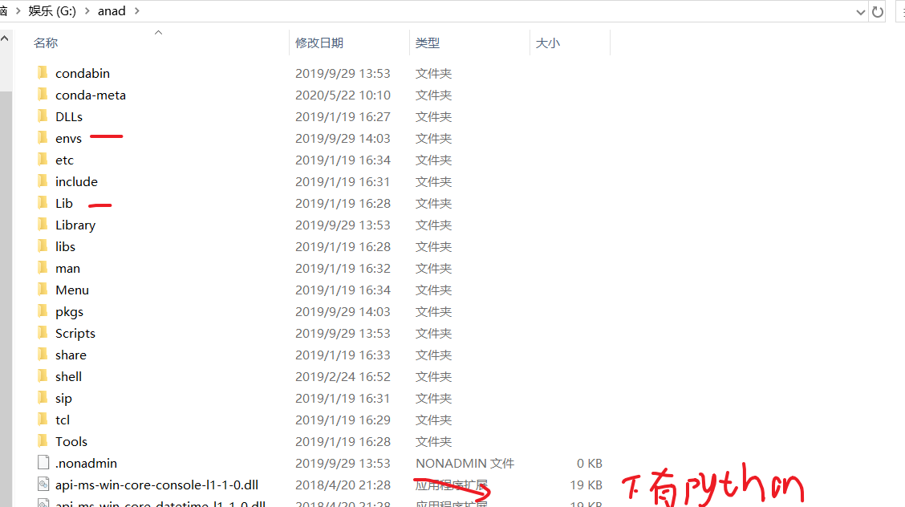
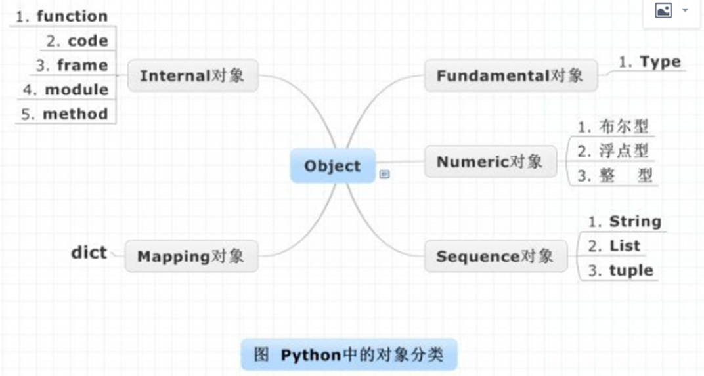

# python

#参考 : python基础教程word 和 Python语言程序设计pdf 

# 1 概述

## 1.1 安装

```
#1, 介绍
python 面向对象，函数   (方法函数区别，前者在类里面，要使用还要对象。所以叫做面向函数编程，不是面向方法 )
用C写的，解释语言
可扩展：可穿插c，c++ (作用是隐藏 和 加速)
```


```
#2，安装
1）Windows（用anaconda）
配置3个环境变量
目录介绍
	下面有python.exe
	envs： 到时候安装多版本python用的
	Lib: 有包，里面site_package ：是import找的地址
```

#环境变量


#目录介绍



```
2）linux
#Python2.x
	下载Python2.x的包
	tar –zxvf python-2.7.15.tar
	yum install gcc
	./configure
	Make && make install

#Python3.x
	依赖环境：yum -y install zlib-devel bzip2-devel openssl-devel ncurses-devel sqlite-devel readline-devel tk-devel gdbm-devel db4-devel libpcap-devel xz-devel
	下载Python3的包
	tar –zxvf python-3.6.1.tgz
	./configure
	Make && make install
	添加环境变量 

```


```
#3，运行测试

1）commond : 
	python    ：exit()
	ipython   :   交互  和  shell命令   和提示 quit()

2）pycharm: 
	创建项目helloword （选择解释器版本）  （自动有init文件） （不要起名test开头）
	#也可以选kepmap，eclipse快捷键

3）eclipse插件安装
     Help—> eclipse marketplace—> pydev(较慢)
	 插件包：加压拷贝到eclipse的dropins中，重启即可
```

 

---


## 1.2 注意点

```
#3, 知识点

1）引用问题
创建东西时，开辟个空间
赋值到一个地方，是给地址
所有传递的东西，都是传递地址的引用，
（有的能改变真正空间原来的值，不能的就是不可变）

( 元祖元素是list等，值就可变 ； 形参 list等细节改变 ； 变量间赋值，同对象，list等细节改变   )

2）
\ 换行接着
```


# 2 基础语法：

## 2.1 注释和乱码

```
#注释
	#单行   ’’’多行

#乱码 （2.X的编码问题较多）
	# -*- coding:utf-8 -*-
	# coding=utf-8
```


## 2.2 标识符和关键字

```
#标识符：
	字符数组下划线，不数字开头
	命名规则 ： 驼峰 或者下划线连接读单词
	区分大小写，

#关键字
```


## 	2.3	   变量和类型

```
#格式
	X=Y ,不用显示声明类型    （弱类型语言）
	type(X)

#类型
  object  ： o小写，最父类
  set等同dict ，只是没有value的dict
  没有char，就是str    “ 或‘ 都一样  (作用： 规范" 表示字符串  或  嵌套就不用\了)
  True False 首字母大写
  None: 表示空值，啥都没有，，不是0，0还有值
```



```
#转化
	repr,就是啥弄出来都是字符串， 连String都能再加一层引号，' "b" ' 
	eval： 就是给算出结果
```

​      


## 2.4 输出输入

```
#1,输出
标准： 
	print(value1, ..., sep=' ', end='\n', file=sys.stdout, flush=False)
格式化：
	 % ()  
	 	类型：d,f,s,x
	 	转义  %% 打印出%
	 	%X.Yf : 没超过时总共长度为X，小数点Y为，四舍五入
	 	%s，处了字符串，对任何类型永远也起作用
	 format(X,Y)
	 	Y的类型具体看pdf 79，简要图如下
```


```
#2，输入

1) 2.X
	input  （输入变量 ，数字，手动加引号的字符串）   /  raw_input  把东西变成字符串
	
2) 3.X
	input(“ please 请输入”) : ,得到的是String，所以有时要转换成整数
```


## 2.5 运算符

#主要介绍一些

```
#1，算术运算符
//是取 除的整数部分  (java / 就是 //) (如果有任何一个是浮点数，结果就是浮点数)

#2，赋值
a,b = 1,2

#3，比较运算符
不等于两种 !=    , <>

#其他：
没有++
```


# 3 逻辑结构

## 3.1 条件

```
if -elif -else
```

## 3.2 循环

```
#1， for i in XX （列表或者字符串）
 	range(X1,X2,s)   （s的正负 得正反）
	最后可以跟个else:  执行完循环执行的

#2,  while

#python : 有continue，break
```


# 4 集合

## 4.1 字符串

#字符的不可变list

```
#1，获取
1) 索引
str[i]

2) 切片 (字符串、列表、元组都支持切片操作)
[起始:结束:步长] : 前面的正负是下标 ， 步长正负是方向
```

```
#2，常用操作
字符串mystr = 'hello world and bjsxt yunshuxueyuan sxt beijing'，

<1>find == java Indexof方法
	检测 str 是否包含在 mystr中，如果是返回开始的索引值，否则返回-1
	mystr.find(str, start=0, end=len(mystr))
<2>index
	跟find()方法一样，只不过如果str不在 mystr中会报一个异常.
	mystr.index(str, start=0, end=len(mystr)) 
<18>rfind
	类似于 find()函数，不过是从右边开始查找.
	mystr.rfind(str, start=0,end=len(mystr) )
<19>rindex
	类似于 index()，不过是从右边开始.
	mystr.rindex( str, start=0,end=len(mystr))


<3>count
	返回 str在start和end之间 在 mystr里面出现的次数
	mystr.count(str, start=0, end=len(mystr))
<4>replace
	把 mystr 中的 str1 替换成 str2,如果 count 指定，则替换不超过 count 次.
	mystr.replace(str1, str2,  mystr.count(str1))
<5>split
	以 str 为分隔符切片 mystr，如果 maxsplit有指定值，则仅分隔 maxsplit 个子字符串
	mystr.split(str=" ", 2)    

<6>capitalize
	把字符串的第一个字符大写
	mystr.capitalize()
<7>title
	把字符串的每个单词首字母大写

<8>startswith
	检查字符串是否是以 obj 开头, 是则返回 True，否则返回 False
	mystr.startswith(obj)
<9>endswith
	检查字符串是否以obj结束，如果是返回True,否则返回 False.
	mystr.endswith(obj)

<10>lower
	转换 mystr 中所有大写字符为小写
	mystr.lower()        
<11>upper
	转换 mystr 中的小写字母为大写
	mystr.upper()    

<12>ljust
	返回一个原字符串左对齐,并使用空格填充至长度 width 的新字符串
	mystr.ljust(width) 
<13>rjust
	返回一个原字符串右对齐,并使用空格填充至长度 width 的新字符串
	mystr.rjust(width)    
<14>center
	返回一个原字符串居中,并使用空格填充至长度 width 的新字符串
	mystr.center(width)   

<15>lstrip
	删除 mystr 左边的空白字符
	mystr.lstrip()
<16>rstrip
	删除 mystr 字符串末尾的空白字符
	mystr.rstrip()    
<17>strip ---java trim
	删除mystr字符串两端的空白字符


<20>partition
	把mystr以str分割成三部分,str前，str和str后
	mystr.partition(str)
<21>rpartition
	类似于 partition()函数,不过是从右边开始.
	mystr.rpartition(str)

<22>splitlines
	按照换行符分隔，返回一个包含各行作为元素的列表
	mystr.splitlines()  

<23>isalpha
	如果 mystr 所有字符都是字母 则返回 True,否则返回 False
	mystr.isalpha()  
<24>isdigit
	如果 mystr 只包含数字则返回 True 否则返回 False.
	mystr.isdigit() 
<25>isalnum
	如果 mystr 所有字符都是字母或数字则返回 True,否则返回 False
	mystr.isalnum()  
<26>isspace
	如果 mystr 中只包含空格，则返回 True，否则返回 False.
	mystr.isspace()   

<27>join
	mystr插入list的每两两元素之间,构造出一个新的字符串
	mystr.join(list(要字符串list   [“1”,”2”]) )   -> “1mystr2”

```


## 4.2 列表

```
#相关操作

1）增(append,+=,  extend, insert)
append , +=  : [1, 2, [3, 4]]
extend       : [1,2,3,4]  （逐一添加）
insert(index, object) : 在指定位置index前插入元素object

2）删(del, pop, remove)
del：根据下标进行删除，其实可以删除所有变量
pop：默认删除最后一个元素
remove：根据元素的值进行删除第一个

3) 改
直接通过下标 list[i] = X

4) 查（in, not in, index, count）
x in / not in list
list.index / count

5) 其他
sort(reverse默认 False，默认小大)
reverse(list 直接逆序了)
enumerate() ：   for i, chr in enumerate(chars):  ---> 给list得元素整个编号
```

## 4.3 元组

#指大的层面不能修改的list 

```
#1，定义
a=(1,2)
a=()  (空)
a=(1,) (一个元素，不加,就是整数1了)
```


```
#2，操作

遍历 : 也是如上
修改 : 只能够修改 如果元素是可修改的集合，改变集合里面的东西  ;  不能删除元素
count,index
```


## 4.4 字典

#其他语言叫map，

#set 是没有value 的字典

```
#1，概述 d={k1:v1,  k2:v2 }
效率：
	没有字典的话，需要两个list，时间和长度有关  (字典是hash实现，速度不变)
	但是内存占用大，空间换时间
查找：
	没有下标了，只能k查找，d[k]不存在报错
	d.get(k,v)，，没有不报错，返回设置值
	
#2，操作
1）修改:
d[k]=v 有就直接修改

2）添加
d[k]=v 没有有就添加

3）删除:
del  : 指定元素 或者所有
clear() 清空元素而已

4）遍历：
 print(dict)  ：{1: 100, 'b': 2}
d.keys()  : 返回k的list
d.values():
d.items():

5）常见函数
len() :
in  / has_key(key) (2.x才有后者)
```


## 4.5 可变不可变类型

```
可变类型，值可以改变：
	列表 list
	字典 dict
	set  （没有value的字典，有add方法）
不可变类型，值不可以改变：
	数值类型 int, long, bool, float
	字符串 str
	元组 tuple  (嵌套的可变集合，里面细节可改变)

#python传递的是变量具体内容的地址，就算你这变量变了，另外那个一直拿着原来值的地址
```


## 4.6 列表推导式

```
[ x   for *   if * ]   
	x: 有多种类型(上面的集合)  或者 表达式 (配合np，弄数组的list，可以for _ in range)
	*可以表示多个
	某变量的if 应该出现在该for的后面
#如果是嵌套set ，则显示的每个元素内部无序，且唯一


```


# 5 函数：

## 5.1 概述

```
#定义： def func():
#调用:  func()

方法函数区别，前者在类里面，要使用还要对象。所以叫做面向函数编程，不是面向方法
```


## 5.2 参数 和 返回值

```
参数

#类型
1) 一般  def func(a,b)
2) 默认值 def func(a,b=1) (带有默认值的参数一定要位于参数列表的最后面)
3) 不定长:
	#def functionname([formal_args,] *args, **kwargs)  (*是元祖，，** 是字典)
	 fun(1, 2, 3, 4, 5, m=6, n=7, p=8)
	  fun(1, 2, *c, **d) (前面定义好两个变量 c = (3, 4, 5) , d = {"m":6, "n":7, "p":8} )

#说明
Python中函数参数是引用传递（注意不是值传递）。    (传递地址)
对于不可变类型，因变量不能修改，所以运算不会影响到变量自身；而对于可变类型来说，函数体中的运算有可能会更改传入的参数变量。

//换句话
不变类型，就是操作半天，内容还是不变，变类型，里面引用的细节变了，所以实参变了
（java效果一样：（大体不会变，但是细节变了就变化） 和python一样 ））

```


```
返回值
1) 用return返回
2）多个返回值 a,b  = func()
```


## 5.3 局部全局变量

```
#1，概念
就不可变类型而言：
	先在赋值前，使用了变量，就表示函数里面是全局变量 （但不能修改内容）
	要想表明是局部变量，则直接先定义赋值同名局部变量
	如果在后面位置加上了global（前面不能定义该局部变量了，也不能使用该变量，就是上面两条），后面变为可修改的全局变量
(下图表示，global前面，不能弄局部变量 或者 引用不能修改得到全局)
```


```
#2，总结
在函数中不使用global声明全局变量时不能修改全局变量的本质是不能修改全局变量的指向，即不能将全局变量指向新的数据。
对于不可变类型的全局变量来说，因其指向的数据不能修改，所以不使用global时无法修改全局变量。
对于可变类型的全局变量来说，因其指向的数据可以修改，所以不使用global时也可修改全局变量。

用global:
可变类型：值可以修改（内存地址不变但是所保存的值变化了），引用可以修改（变量的内存地址变化了）
不可变类型：值不可以修改，可以修改变量的引用（=赋值号）。

```


## 5.4 递归和匿名

```
#1，概述
用lambda关键词能创建小型匿名函数，省def步骤
只包含一个语句，能接收任何数量的参数 ， 只能返回一个表达式的值
sum = lambda arg1, arg2: arg1 + arg2

#2，应用：
作为参数传递 :fun(1, 2, lambda x,y:x+y)
作为内置函数的参数 ：.sort(key=lambda x:x[k])  (选择list嵌套dict ， list用dict哪个k的v,排序)
```


---

# 6 文件操作

## 6.1 打开关闭

```
#手动
f = open(r'd:\nata\test.txt', 'w') 
XX(读写操作)
f.close()

#自动:
with open( , ) as f:
	XX
```

```
#python 地址:  \\ 或 r \    或者  /
#参数:
	r:默认
	w:直接覆盖了
```


## 6.2 读写操作

```
#1，写
f.write()
f.writelines()
f.writeline()

#2，读  (在同一文件open内，注意读的游标读到哪了)
全部：f.read()
字节大小：read(1024)
一行: readline(),  返回字符串
所有行:readlines() ， 按行弄成一个list
```


## 6.3 定位读写

```
#1，获取位置 (行最后\n也要被统计)
f.tell()

#2,定位位置
f.seek(offset, from)
	offset:偏移量 ，有正负
	from:方向
		0:表示文件开头
		1:表示当前位置
		2:表示文件末尾, 必须配负
(#如果使用seek，3.X这里必须使用rb)
```


---

# 7 类和对象

## 7.1 基本

```
#1，类的定义
class Car:
	def func(self):
		pass

#类两种：经典类(如上，没有继承) 和 新式类(继承了 形如class Car(object)  )
		（ java类不能有括号，python表示继承，scala表示传入的参数 ）
#类命名规范

```

```
#2，创建对象
BMW = Car()  (有参数就写入)
BMW.color = "red"  （动态添加本对象的属性）
BMW1=BMW
BMW.color = "blue"

BWM1--> 也变成了blue

#第一次创建某对象，会真实在内存弄个空间
#当赋值时，传递的是地址，底层都是用同对象，改变情况同list
```


## 7.2 具体

### 1）self

```
#概述
表示当前对象的引用，可以理解为自己    (所以表示目前已经有了对象，没有时或者属于类的用cls)

#作用：( 像this )
一般方法属性啥的要加上self，来引用对象的东西

```


### 2）\__init\__

```
#概述
若某些属性是某类的对象共有的，就弄个初始化，省得都动态添加

#细节
class Car:
    def__init__(self , color ，price=100): 
		self.color = color
		self.type = “车”
		self.price = price
	def func(self): 
		print(self.color) 

BMW = Car("blue")
BMW.__init__(XX)

-----------

#参数可以设置默认值 ， 属性也可以有默认值 , 参数还可以用不定长的def __init__(self,*args,**kwargs)
#init，是用来初始化对象属性的，说明对象已经有了，也就是在创建好对象后，自动调用的方法
#init, 也可以后面手动再调用
```


### 3） *\_new_*

```
#概述
就是构造，创建对象时，一上来自动调用的

#细节
classA(object):
	def __init__(self，XX): 
		print("这是 init 方法") 
		self.XX=XX
	def __new__(cls，XX): 
		print("这是 new 方法") 
		return object.__new__(cls) 
A() 

-----------

#new 必须传入cls （cls表示本类，因为现在还没有对象） ， 其他参数与init要保持一致
#必须return 本对象 。 调用父类构造出自己的实例（这个其实就是self）
#最好是init赋值，，执行循序是先new,然后init
```


###   4）*\_del\_*

```
#概述
真正删除对象时，调用的方法

#具体:
a=A()
b=a
del a
del b 

只会new 一次，init一次，只有当所有引用都删除了，才会del一次

-----------
#某对象有引用计数器，当真正空间上的对象没了才调用del
#del 一个变量，只是删除自己的引用地址
```


###  5）\_str_  和 id

```
#概述
str 和toString类似，就是打印对象时调用的
id  是和hashcode差不多 ,  返回唯一标识符

#具体
print(a)
<__main__.A object at 0x0000020A14F492E8> 
(在init里面print(self) ， 也是如上结果，说明self就是本对象)

print(id(A))
2242307464776
(在new里面print(id)  ,  也是如上结果，  说明cls 就是本类)
```


## 7.3 三大特性

### 1）封装

```
#控制访问

私有 ： 只能本类使用， 然后用公有的方法来封装  （_ _属性 或者 _ _方法）

class People(object):
	def__init__(self, name): 
		self.__name = name 
    def getName(self):
		return self.__name 
    def setName(self, newName):
		if len(newName) >= 5: 
			self.__name = newName 
		else: 
			print("error:名字长度需要大于或者等于5") 

xiaoming = People("bin") 
print(xiaoming.__name or .name)  //报错


--------------

#没有像C++中public和private这些关键字来区别公有属性和私有属性
#用两个_ 来标识属性和方法
```


### 2）继承

```
#1，概述
定义类的时候，括号里面写父类名字
子类继承公有的属性 和 方法  (别忘记上面的“魔法方法”)

子类调用父类的方法：
	super().__init__(XX)
     父类.__init__(self,XX)
     super(本类,self).__init__(XX)

```


```
#2, 多继承
class A(object):
    def show(self):
        print("show   A")
class B(object):
    def show(self):
        print("show   B")
class C(A,B):
    def show(self):
        print("show   C")
c=C()
c.show()
print(C.__mro__)

show   C
(<class '__main__.C'>, <class '__main__.A'>, <class '__main__.B'>, <class 'object'>)

1）重写
2）同名方法执行顺序
C没重写，就先A 然后B ， 最后obj （C.__mro__ 能查看） 


```


### 3）多态

```
#多态的概念是应用于Java和C#这一类强类型语言中，而Python崇尚“鸭子类型”。(其实就是伪多态，因为没有显类型)
#所谓多态：定义时的类型和运行时的类型不一样，此时就成为多态  （传父类(py 是传的随便东西)，调用子类）


class F1(object):
    def show(self):
        print("F1   show")
class S1(F1):
    def show(self):
        print("S1   show")
class S2(F1):
    def show(self):
        print("S2   show")
class S3:
    def show(self):
        print("S3   show")
def Func(随便):
    随便.show()
s1=S1()
s2=S2()
f1=F1()
s3=S3()
Func(s1)
Func(s2)
Func(f1)
Func(s3)

都可以执行： 因为形参没有显类型，所以传入啥都可以，你传啥执行啥
```


## 7.4  属性方法范围

```
class Person(object):
    name="zhangsan"
    __age=30
    def __init__(self,name,age):
        self.name=name
        self.__age=age
    # @classmethod
	#def getAge():	
	#   return cls.__age

    @staticmethod
    def getAge():
        return Person.__age
    def getAge2(self):
        return self.__age
        
print(Person.name)     --》zhangsan

p=Person("lisi",100)
Person.name="wangwu"
print(p.name)           --》lisi
print(p.getAge())       --》30
print(p.getAge2())		-》100
print(Person.name)      --》wangwu
```


### 1）类属性与实例属性

```
#类属性：
	这个类下所有的对象都可以共享这个类属性。 相当于java中静态属性。  (内存中只存在一个副本)
	可以 类.类属性 或者 对象.类属性
	
#当有同名的实例属性，用对象.属性后面代码会屏蔽掉类属性
```


### 2）类/静态与对象方法

```
#两种写法
```


----

# 8 设计模式

## 8.1 单例

```
确保某一个类只有一个不变的实例，单例模式是一种对象创建型模式。
省内存空间，回收的时候也有帮助

class Singleton:
    __instance=None
    __First_init=True
	
	2）
    def __init__(self,name):
        if self.__First_init:
            self.__First_init=False
            self.name=name
            print("init....")
    1）       
    def __new__(cls,name):
        print("new")
        if not cls.__instance:
            cls.__instance=object.__new__(cls)
        return cls.__instance
    def run(self):
        print("running....")
s=Singleton("zhangsan")
s1=Singleton("lisi")
print(id(s))
print(id(s1))
print(s.name)
print(s1.name)

------------------

1）new:
有判断，保证每次弄新对象时，都是返回那个唯一对象
2)init:
有判断，保证只初始化一次属性 （第一次是类属性，然后赋值后，以后都是对象属性）
```


## 8.2 工厂

```
创建者和使用者分离，给系统带来更大的可扩展性和尽量少的修改量 (就是别直接new了，静态封一层)

#静态工厂：
class Axe(object):
    def __init__(self,name):
        self.name=name
    def cut_tree(self):
        print("使用",self.name,"砍树")

class StoneAxe(Axe):
    def cut_tree(self):
        print("使用石斧开始砍树")
        
class SteelAxe(Axe):
    def cut_tree(self):
        print("使用钢斧开始砍树")
        
class DianJu(Axe):
    def cut_tree(self):
        print("使用电锯砍树")
        
class Factory(object):
    @staticmethod
    def getAxe(type):
        if "stone"==type:
            return StoneAxe()
        elif "steel"==type:
            return SteelAxe()
        elif "dianju"==type:
            return DianJu()
        else:
            print("参数有问题")
            
class Person(object):
    def __init__(self,name):
        self.name=name
    def work(self,type):
        print(self.name,"开始工作了")
        
        # if type :  axe = StoneAxe()    (没有工厂类的话，得修改这里,有工厂就修改工厂类就能满足新功能)
        axe=Factory.getAxe(type)
        axe.cut_tree()

p=Person("zhangsan")
p.work("dianju")

```


# 9 异常

## 9.1 基础

```
#1，概述
目的：发生异常，让程序也能接着往后执行
python只有一个类型：Error   (java :  Error（jvm错误，不可能程序改） 和 checked / Runtime EXception )
```


```
#2，格式

try:
	XX
except Exception as e: （用别名才能打印完整的） （这是最大的异常） （ java是catch ）
else :                  （不出异常的时候）
finally :                （最终一定执行）


```


```
#3, 多异常
分开多级写 （最好先小异常，然后大异常 ）  或  写元祖在一起 except (IOError,NameError): 

分开写（最好先小异常，然后大异常 ）
```


```
#4，异常传递

 内部有捕获，就捕获且符合 :
	内层捕获处理完，不运行内层了，直接外层接着运行 
 不符合或者没捕获，就提交给外层: (内外，都不接着运行了，也当做个外层异常了)
 	外层捕获能处理，就处理	
 	没处理，直接给Python解释器，就报错了
 	
 （try的嵌套，函数间嵌套的异常放置）
```


## 9.2 自定义

```
配合raise 抛出，然后自定义处理


class ShortInputError(Exception):
    def __init__(self,length,atleast):
        self.length = length
        self.atleast=atleast

def func():
    str = input("请输入参数")
    try:
        if len(str)<3:
            raise ShortInputError(len(str),5)
    except ShortInputError as msg:
        print("字符串的长度是%d,至少需要长度是：%d"%(msg.length,msg.atleast))
    finally:
        print("执行完毕")
func()
```


----

# 10 模块

## 10.1 使用和安装

```
#1，使用
1）格式
import module      
from XX import XX / * 
# 还可以起别名 as XX

2) 定位
sys.path 可查看:  包含当前目录那一层，PYTHONPATH  和由安装过程决定的默认目录
														（linux默认/usr/local/lib/python/）。
														
```

```
#2, 安装
conda install 模块
pip install 模块 
```


## 10.2 自制模块

### 1）基础

```
#1，制作：
__all__   [ 函数名] ：用list，标识当前文件，啥函数可以被引用
if__name__ =="__main__" :       加测试代码，当引用时不会执行

#2，引用:
#同个项目下：
同级目录的(同包，同时也是在定位的范围内)，  所以直接导py的名字，就可以引用
不同包     ：       from 全.类名 import *
```


### 2）init.py

```
每个包都自动创建个__init__.py
里面可以写代码啥的，但更主要是为引用本包的py文件,提前导入包

在init文件, 导入XX后
	py文件 可以 from / import 本包 ， 然后就有XX了
```

3）发布


# 11  数据库

```
from pymysql import  *

conn = connect("localhost","root","123456","demo",3306)
cur = conn.cursor()

#查询
# count = cur.execute("select * from emp") ：返回影响行数
# print(count)
# result = cur.fetchall() ： 返回list
# for i in result:
#     print(i)

#添加记录 :
	要提交事务
	直接写  或者 注入（注意字符串还要‘ ’ ，因为替换后要没有引号了，多加个）
count = cur.execute("insert into emp(empno,ename) values(%d,%s)"%(2222,"'aaaa'"))
				#"insert into emp(empno,ename) values(2222,'aaaa') "
print(count)
conn.commit()
conn.close()

```


# 12 numpy

## 12.1 基础

```
#1，概述
使用NumPy，就可以很自然地使用数组和矩阵，同时有很多科学计算的函数

#2，基础
主要对象是同种元素的多维数组(也叫矩阵)
ndim（轴个数，也就是秩），shape,  size(元素个数), dtype（类型） (n.XX,便可操作)
```


## 12.2 操作

### 1）创建

```
#array：
	np.array([[1,2,3],[4,5,6]])

#arange()： (按层次填，如下先6个最外每组，然后3个中间每组)  (形状要精确)
	np.arange(1,13).reshape(2,2,3)
		array([[[ 1,  2,  3],
                 [4,  5,  6]],
               [[ 7,  8,  9],
                [10, 11, 12]]])
 
 #随机数:（都要reshape，调整下形状）（或者直接输入shape）
 	randint ( l ,h , size） :[l  , h)  ,size是多少个
	rand  (size)   :  [0，1）  ：取值
	randn (size)    正太分布,有正负

#特殊:
	empty(size/shape)   趋近0
	ones(size/shape)    1      
	zeros(size/shape)   0
	eye(size)     单位矩阵
```


### 2）取值

```
#下标：
	[][] 或者 [ , ]
#切片： （如果用[][]少了[]就是那维度所有的  ；  切片只能用[ ，]）
	：               [0:5, 1] --> 0 到 4 行，一列 (5,1)
	：：             [0::5, 1]--->0 和 4 行，一列  (2,1)
	…                x[1,2,…] 等同于 x[1,2,:,:,:] 

#可以直接print(arrary) 打印
#还可以for遍历
```


### 3）基本运算

```
+，- ，*  (形状要一致)
数乘 
乘：np.dot(a,b) / a.dot(b)      (形状要对应)
求逆：T
转置：np.linalg.inv(array)
sum()   :    不写全部，，0：把所有行的加了（[列1，列2。。。]），，1
```


### 4）形状操作

```
ravel() :   扁平化，弄成一维

np.vstack(a1,a2)  : 行拼，行多了  =row_stack      (只是简单的落起来，没有新加轴)
np.hstack(a1,a2)   :  列多了	  =column_stack

stack ( (a1,a2) ,axis=0,1,2)    ：(X,X,X),,a如果是二维的，，然后就是axis按照第几个加个新轴，值为2

split :   （arrary ,   几份（1 or  总大小）， 0 or 1 （0 是v）   ）    ：拆后放进list
vsplit :   (arrary ,  几份)
hsplit
```


