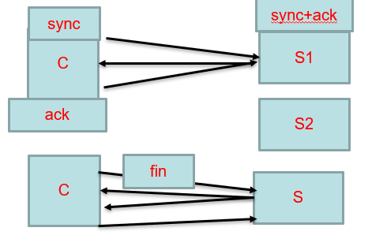
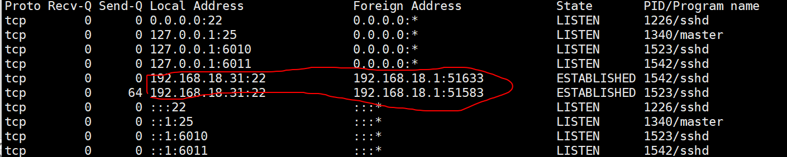
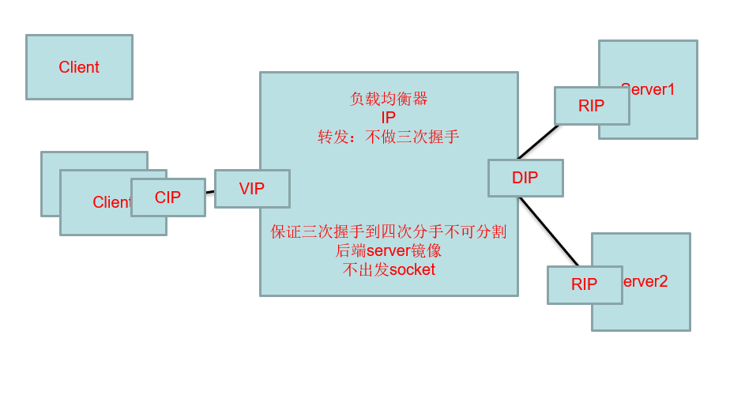
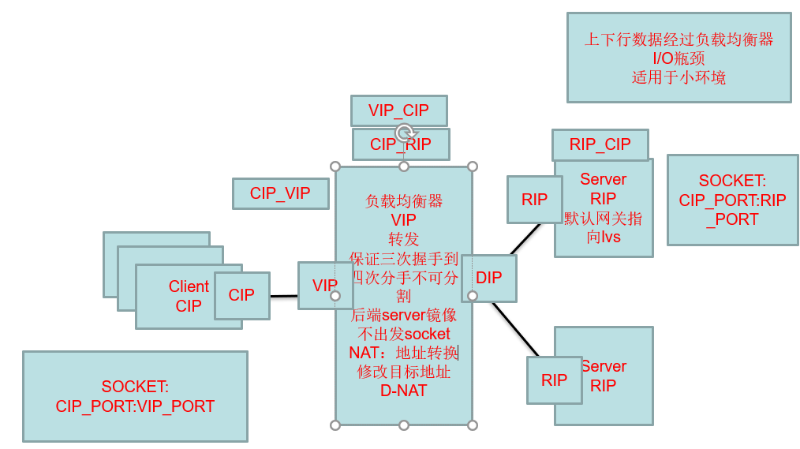
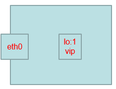

# Load balancing

## LVS

（Linux Virtual Server）

### 结构：

一共七层

`7:应用层`      ：把域名解析IP

www.baidu.com IP:80 1212      

•http，smtp，ssh

表示层6

------

会话层5

`4:传输层控制`  :先发个包弄连接的

•tcp，udp

确认机制：[三次握手>>（传输数据）>>四次分手]




•SOCKET：IP:PORT-IP:PORT

​	–netstat –natp （用ip显示,all,tcp,process）



自己的IP，以及所连的。

------

`3:网络层`   :找下一跳的

•ip，icmp

•ROUTE：

​	–route -n

路由表：数据由配置文件 etc/ipconfig


```
IP和MASK余运算得到网络号。
局域网内不需要跳点走交换机（192.168.18.0如果得到这个，说明局域网）

目标IP，如果和MASK余，得到符合Des那行的，就得到对于网关GATE（也就是路由的），也就是下一跳IP地址


```

------

2:链路层：得到真实MAC地址

•以太网：Ethernet：MAC

•ARP：数据关机没有，学习来的。

​	-arp -a

```
链路层，下一跳的网关地址映射的实际MAC的地址

计算机A---交换机----计算机B（网关）---网线---其他计算机
一开始要广播机制。A发个包，里面全FFF，和B。B收到打开，然后带上自己的MAC地址，和A回去，不用广播机制。

TCP, 就存了最近的人，内有目标。一直转，多次了包会被丢弃。
MAC （网关） 一直变包在目标地址外面

```

物理层1

------


拿连接百度为例：也就是填满包的过程


```
1，先是7层解析得到百度IP地址

2，先建立连接，握手：
	调起4层，准备一个空包。
	调起3层，得到最近的一个是谁，也是路由网关IP
	调起2层，得到真实MAC，包裹在目标地址外面，然后传给下一个近的。

3，S收到，然后重复动作。到此，C和S建立三次握手开启传输数据。

4，断开连接，分手
```

------


### 模式：

```
•整个互联网建立在下一跳的模式下
	–IP是逻辑上的两个端点
	–MAC是物理上连接的两个节点

•端点间TCP传输过程中

	–确认机制
	–状态机制
	–不可分割

•解析数据包需要成本
    –交换机：二层，只关心MAC地址
		•学习机制：
	–路由器：三层，只关心IP和路由表
	–LVS服务器：四层，只关心PORT，状态
	–nginx：七层，关心socket对应关系
```

名词介绍：

```

VIP: 虚拟服务器地址
DIP: 转发的网络地址
	1，和RIP通信：ARP协议，获取Real Server的RIP：MAC地址
	2，转发Client的数据包到RIP上（隐藏的VIP）
RIP: 后端真实主机(后端服务器)
CIP: 客户端IP地址
```



```。
C端透明，要处理的后面。

全网公网IP只有一个,可见。私网可以选择不暴露因而IP可以同
```

模式1：D_NAT

S_NAT:


NAT修改Source端，把输入映射公网不同端口，然后公网访问。但是输出不能访问输入，除非也做个映射。

例子：虚拟机上网：虚拟机先映射到笔记本，笔记本再映射到路由器。


D_NAT:  



```
来回要修改两次地址： 去，VIP变RIP （S默认网关，直接先传给均衡器）  回RIP变VIP  

来回的速率影响
```

------

模式2：DR


```
思想不要NAT，直接回去C，只处理一端。

1，负载均衡器那个包一层MAC地址。
2，必须在同一局域网（不然跳来跳去，当你拆开MAC后，不是还得跳回VIP）
3，S端自带隐藏的VIP。
```

------

模式3：TUN


```
实现了S端在不同地方。

1，靠IP背着IP，只解析一层，（不像MAC）
2，回去的时候可以选择直接还是再背着回去
```

------


### 搭建：

```
LVS是Linux Virtual Server的简写，意即Linux虚拟服务器，是一个虚拟的服务器集群系统

	•ipvs : 嵌入到linux的内核

	•ipvsadm：管理应用程序
```


原理图：


```
选浏览器作为C端。
一个虚拟机作为lvs，剩下作为S端。

C端源地址192.168.9.1，目标地址(VIP) 为192.168.9.100。（根据自己，把9改）
node01：要有vip，还要有DIP.
node02,03 要有RIP，和隐藏的VIP.

```


步骤：

1：配置lvs的VIP

```
ifconfig eth0:0 192.168.9.100/24
echo “1” > /proc/sys/net/ipv4/ip_forward 

#/24 表示 255.255.255.0  24个1
#0 表示不是自己的会丢弃，不能传给前面

#补充，一个网卡可以挂多个IP

```


2，调整RS的响应，通告级别（对外隐藏）

```
#内核映射文件，即时生效。
#每一台RS都配

echo 1  > /proc/sys/net/ipv4/conf/eth0/arp_ignore
echo 2  > /proc/sys/net/ipv4/conf/eth0/arp_announce
echo 1  > /proc/sys/net/ipv4/conf/all/arp_ignore
echo 2  > /proc/sys/net/ipv4/conf/all/arp_announce


#kernel parameter:请求不到，听不到
	目标mac地址为全F，交换机触发广播
	/proc/sys/net/ipv4/conf/*IF*/
	
	1，arp_ignore: 定义接收到ARP请求时的响应级别；
		0：只要本地配置的有相应地址，就给予响应；      #自己知道的IP也会回应
		1：仅在请求的目标(MAC)地址配置请求           #等价于叫自己才回应
			到达的接口上的时候，才给予响应；

	2，arp_announce：定义将自己地址向外通告时的通告级别；
		0：将本地任何接口上的任何地址向外通告；
		1：试图仅向目标网络通告与其网络匹配的地址；
		2：仅向与本地接口上地址匹配的网络进行通告；

```


3，配置RS的VIP（对内可见）



```
#每一台RS都配
#自己有个环回网卡。

ifconfig lo:8 192.168.9.100 netmask 255.255.255.255

```


```
#四个255原因：简单来说防止数据包一直在主机内部玩来玩去，最后发不出。

	虚拟机和主机的IP在同一网段内，不会走NAT服务器去访问外网，只会走交换机查询MAC地址，因此之前的没有配置LVS之前，我们ping自己的虚拟网卡，网关等，通过eth0网卡向外发送数据包也是走的是交换机，现在我们将VIP配置在lo环回网卡上，因此想要正常发送数据包也是要走交换机才行。（局域网走交换机）
	之前发送数据包通过eth0网卡走交换机，只需要在当前网段内广播寻找目标IP地址的MAC地址就行了。
	所以VIP地址发送消息也应该是这个过程。如果掩码为255.255.255.0会怎么样呢？
	（Gateway是0.0.0.0或者*表示目标是本主机所属的网络，不需要路由）（lo 实际是不可见）
	
	假设当前目标IP 192.168.9.1  VIP为192.168.9.100
	lo网卡 192.168.9.100 & 255.255.255.0 = 192.168.9.0
	eth0网卡 192.168.9.31 & 255.255.255.0 = 192.168.9.0
	目标IP地址 192.168.9.1 & 255.255.255.0=192.168.9.0
	1，最长匹配原则，所以选两者，同时运算后目标IP和主机局域网，所以也不走网关。
	2，由于Lo离内核近，所以选第一个。然后就会发布出去。
	
	所以必须走网卡，所以必须是四个255。走eth0发送数据包。然后通过eth0向交换机广播，获取192.168.247.1地址的MAC地址，将数据包发送过去就完成了相应的过程。

```


4，启动RS上的httpd

```
yum install httpd -y

cd /var/www/html
vi index.html  
	from ooxxip
service httpd start

#客户端验证：
	RIP：80 能显示
	VIP：80不能显示(还没有配置VIP，如果有了，说明没隐藏住)

```


5，LVS

```
yum install ipvsadm -y

ipvsadm -A -t 192.168.9.100:80 -s rr

ipvsadm -a -t 192.168.9.100:80 -r 192.168.9.12 -g 
ipvsadm -a -t 192.168.9.100:80 -r 192.168.9.13 -g

ipvsadm -ln
浏览器刷新: 访问vip
ipvsadm –lnc
netstat -natp

```


```
补充
1，LV调度方法
四种静态：
	rr:轮循
	wrr:
	dh: 
	sh:
动态调度方法：
	lc: 最少连接
	wlc: 加权最少连接
	sed: 最短期望延迟
	nq: never queue
	LBLC: 基于本地的最少连接
	DH: 
	LBLCR: 基于本地的带复制功能的最少连接
默认方法：wlc，（偷看标志位。Sync，加1，fin减1）

2，LVS命令:监控多个端口号
管理集群服务
添加：-A -t|u|f service-address [-s scheduler]
	-t: TCP协议的集群 
	-u: UDP协议的集群
		service-address:     IP:PORT
	-f: FWM: 防火墙标记 
		service-address: Mark Number
修改：-E
删除：-D -t|u|f service-address

#例：
ipvsadm -A -t 192.168.9.100:80 -s rr
1,2
ipvsadm -A -t 172.16.11.1:8080 -s rr
x，y
#一个服务器可以做多个的LVS。监听不同IP

#LVS：连接RS

添加：-a -t|u|f service-address -r server-address [-g|i|m] [-w weight]
		-t|u|f service-address：事先定义好的某集群服务
		-r server-address: 某RS的地址，在NAT模型中，可使用IP：PORT实现端口映射；
		[-g|i|m]: LVS类型	
			-g: DR
			-i: TUN
			-m: NAT
		[-w weight]: 定义服务器权重
	修改：-e
	删除：-d -t|u|f service-address -r server-address

#例：
# ipvsadm -a -t 172.16.100.1:80 -r 192.168.10.8 –g
# ipvsadm -a -t 172.16.100.1:80 -r 192.168.10.9 -g

查看：
	-L|l
	-n: 数字格式显示主机地址和端口
	--stats：统计数据
	--rate: 速率
	--timeout: 显示tcp、tcpfin和udp的会话超时时长
	-:c 显示当前的ipvs连接状况
ipvsadm -ln
ipvsadm -lnc

删除所有集群服务
	-C：清空ipvs规则
	
保存规则
	-S 
# ipvsadm -S > /path/to/somefile

载入此前的规则：
	-R
# ipvsadm -R < /path/form/somefile

```


### keepalived:

用户空间的 高可用 程序。

```
1，Lvs 
	IP飘移，DR，需要主备（HA）

2，需要心跳机制探测后端RS是否提供服务。
	a) 探测down，需要从lvs中删除该RS
	b) 探测发送从down到up，需要从lvs中再次添加RS。
	
VRRP协议（虚拟路由冗余协议） - Virtual Router Redundancy Protocol

```

步骤：

```
1，安装
yum install  keepalived

2，备份
cd /etc/keepalived
cp  keepalived.conf keepalived.conf.bak

3,操作 ：.,$d  .,$-1y

#没用
! Configuration File for keepalived

global_defs {
   notification_email {
     root@localhost  #发送提醒邮件的目标地址可有多个
     goldbin@126.com
  }
   notification_email_from test@localhost  #发送邮件的from地址，可以随意写
   smtp_server 127.0.0.1             #邮件服务的地址，一般写本地
   smtp_connect_timeout 30
   router_id LVS_DEVEL
}

#IP飘移
vrrp_instance VI_1 {
    state BACKUP        #MASTER 主和从 
    interface eth0        #VIP需要绑定的网卡名称
    virtual_router_id 51  #不同的服务不同虚拟代号不同
    priority 101        #优先级 主的优先级要高
    advert_int 1 		#一次谦让
    authentication {
        auth_type PASS
        auth_pass 1111
    }
    virtual_ipaddress {
        192.168.18.100/24 dev eth0 label eth0:3         #设置VIP
    }
}

#配置LVS
virtual_server 192.168.18.100 80 {       #设置虚拟lvs服务，VIP PORT
    delay_loop 6
    lb_algo rr			#调度算法
    lb_kind DR			#lvs的模式
    nat_mask 255.255.255.0
    persistence_timeout 0 #同一个IP地址在？秒内lvs转发给同一个后端服务器
    protocol TCP

#监听RS
    real_server 192.168.18.32 80 {       #设置真实服务器的心跳机制 RID PORT
        weight 1      #权重
        HTTP_GET {      #心跳检测的方式
            url {
              path /      #心跳检查的地址
              status_code 200      #心跳检查返回的状态
            }
            connect_timeout 2       #超时时间
            nb_get_retry 3      #重复检查3次
            delay_before_retry 1      #每隔1秒钟再次检查
        }
    }
    real_server 192.168.18.33 80 {      #第二个真实服务器设置
            …#参照第一个RS设置
    }

}

4，启动
service keepalived start

5，配置备用的
scp ./keepalived root@192.168.18.34:`pwd`

6,检查
curl

ifconfig
#备用的网卡不显示

ipvsadm -ln
#备用的也显示连接

```

问题：

```
如果keepalived 自己不是稳定的，就有一定问题
```


------


## NGINX

### 介绍：


```
C-----LVS-----NGINX(代理层)----------TOCAT（计算层）
					反向代理负载均衡（外网连内网）

1,LVS和索引模块区别
LVS不建立连接。

2，apache 和 nginx
	前者，执行了内核调度，保护，恢复。切换，阻塞。慢
	后者，一个进程多个连接，省了那个时间，快


```


------


### 配置：

```

1，vi /etc/init.d nginx  #手工复制 nginx

2,	service nginx on
	chmod  +x nginx
	chkconfig nginx on  （启动关闭） 
	
3，vi /opt/sxt/nginx/conf/nginx.conf
	-worker_processes  核心数
		Master，worker  ps -fe | grep nginx （会产生两个进程，master只做简单点的）
	
	-events : worker_connections  最多连接数
				一般内存1G 10W文件描述符   
				ulimit –a (open files) or –n #规定了一个进程最多的文件
				ulimit –SHn 1024    		 #修改 
	-http:
		log_format   日志格式
		Sendfile on: 直接在内核建立个快速，网卡和磁盘直接。让省去了用户态的进程IO两个
					JAVA Netty：offheap 堆外零拷贝在这里，用上面方法
		Tcp_nopush： 要不要攒，发送
		keepalive_timeout  保持一定时间不分手
		gzip on :压缩

其他：top  看CPU使用率，用户空间，内核空间
	！ser 执行上一个ser前缀命令
	service nginx reload

```

```
	-server: 虚拟服务器
		nginx  收到请求头：判定ip，port，hosts决定server
		nginx location匹配：用客户端的uri匹配location的uri
			先普通：
				顺序无关
				最大前缀
				匹配规则简单
			打断：
				^~
				完全匹配
			再正则：
				不完全匹配
				正则特殊性：一条URI可以和多条location匹配上
				有顺序的
				先匹配，先应用，即时退出匹配

location [ = | ~ | ~* | ^~ ] uri { ... }
	location / {}:
		对当前路径及子路径下的所有对象都生效；
	location = URI {}: 注意URL最好为具体路径。
		精确匹配指定的路径，不包括子路径，因此，只对当前资源生效；
	location ~ URI {}:
	location ~* URI {}:
		模式匹配URI，此处的URI可使用正则表达式，~区分字符大小写，~*不区分字符大小写；
	location ^~ URI {}:
		不使用正则表达式
	优先级：= > ^~ > ~ > ~* >  /  


#1 大体：
 location / {
            root   html;   根在哪（nginx下的目录）
            index  index.html index.htm;  主页
        }
 	#一个server一个root，如果自己加个目录文件，也可以Uri显示

#2 两S：
#C:\Windows\System32\drivers\etc hosts文件  
#配置www.test1.com www.test2.com 192.168.18.31
#autoindex 自动生成个索引页面
#并且查看访问：区分两个访问是靠请求头域名
#用IP访问 则选第一个S
	cd  nginx/logs
	tail –f access.log

```


```
#3，之前yum配置
cd /etc/yum.repos.d
vi local.repo 修改里面的baseurl，改向本地服务器的域名
```


```
#Location
	1匹配规则
	2反向代理:隐藏服务端
	
反向代理百度为例：
1） 失败就看看默认网关，route add default gw 192.168.9.2
2）跳脱了：1  加https
3）然后用搜索找不到，，因为uri /s开头 现在只能匹配  / 然后目录没有文件
	在加上 Location  ~* ^/s {  后面不要 / }  没有uri 则会loc代替，有就直接
		该代理百度不能后面加/，否则报错。（否则界面一直停在百度主页，所以不然reload）
效果：
	显示www.test1.com/uri2，展示百度主页
	输入词，百度搜索，显示www.test1.com/s(后面一堆字母)，展示百度搜索的结果

实验：
	一部分符合，替换还是整体，如果没有整体就找不到（/var/www/html 另一台主机所展示的东西地址）
	可以重复proxy
```


```
	3负载均衡
先加个upstream 池子，然后在下面替换域名解析
	#三种：Upstream ，本地host(第二种方法：修改一个域名多个IP) ， DNS

反向代理的负载均衡：
#第一种：
```


```
引入的问题：数据一致性
三种：数据同步，或者外加数据库，或文件系统
#总要求：减少IO  开辟内存的，就算磁盘，也是高效，（顺序读写，随机读写）

```

