# Hadoop                                          
## 基本：

### 讨论：

```
#单
单点上限，单点故障
#集群
存和算 （计算向数据移动）
```

### 简介：

```
组成
	分布式存储系统HDFS （Hadoop Distributed File System ）
	分布式计算框架MapReduce
	分布式资源管理框架YARN
```

### HDFS：

#### 存储模型：

```
1，block
	文件线性切割成块（Block）
	B随便分散存储在集群节点中
	同一文件，B同，但是不同的，可以不同。
	B可以有副本数，副本无序分散不同结点。
		（2.X 默认128M 3blocks） 最小1M
	已上传的B副本数可以调整，大小不行
2，   
   偏移量 offset  （byte，中文？可能前面和后面分开了，在不同块）
   只支持一次写入多次读取，同一时刻只有一个写入者
   可以append追加数据，但是不能改前面的，（不然整个都变了）
```

#### 架构模型：

```
1，文件元数据MetaData，文件数据	
	元数据
	数据本身
	
2，NameNode节点保存文件元数据：单节点      （NN）
	基于内存储蓄：（双向）
		只存在内存（快）
		持久化	  （备份，单向）
	主要功能：
		接受C的读写服务
		收集D汇报的B列表信息
	metadata：
		文件owership和permissions
		文件大小，时间
		Block每个副本位置（由DataNode上报）
		Block列表，Block偏移量，位置信息（持久化不存，#有下面汇报，不然下面死了，不准确）

3，DataNode节点保存文件Block数据：多节点   （DN）
	用本地文件系统存数据  		（Block）
	同时存储Block的元数据信息文件  (MD5,完整性)
	
	启动DN时会向NN汇报block信息
	通过向NN发送心跳保持与其联系（3秒一次），如果NN 10分钟没有收到DN的心跳，则认为其已经lost，
	并copy其上的block到其它DN

4.SecondaryNameNode：1.X持久化用的      （SNN）

5.C--N-—D   （N只告诉，具体自己C,D）
	D和N保持心跳，主动上交B列表
	C与N交互元数据信息
	C与D交B
	

```

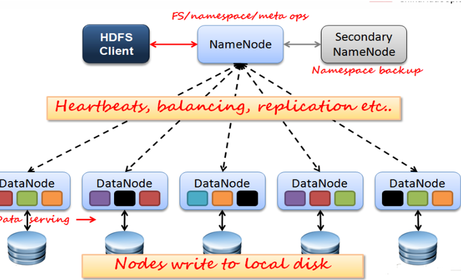


#### 持久化：

1）介绍

```
N的metadata信息在启动后会加载到内存
方法：
	mdata存到磁盘文件名为fsimage（（时点备份）
		序列化（慢），反序列（快），二进制。
		B的位置信息不会保存在f中
	edits记录对metadata的操作日志
		写（快），恢复（慢）
	二者产生时间和过程：
		format时候产生
		一上来先一起格式化，然后写入edits，一定条件下，e和f合并，
```

2）SNN

```
它不是NN的备份（但可以做备份），它的主要工作是帮助NN合并edits，减少NN启动时间。
SNN执行合并时机
	根据配置文件设置的时间间隔fs.checkpoint.period  默认3600秒
	根据配置文件设置edits log大小 fs.checkpoint.size 规定edits文件的最大值默认是64MB
```


#### 其他：

```
优点：
	高容错性
		数据自动保存多个副本
 		副本丢失后，自动恢复
 	适合批处理
		移动计算而非数据
		数据位置暴露给计算框架（Block偏移量）
	适合大数据处理
	可构建在廉价机器上
		通过多副本提高可靠性
		提供了容错和恢复 机制
缺点：
	低延迟数据访问
		比如毫秒级
		低延迟与高吞吐率
	小文件存取
		占用NameNode 大量内存
		寻道时间超过读取时间
	并发写入、文件随机修改
		一个文件只能有一个写者
		仅支持append

副本放置：
	第一个副本：放置在上传文件的DN；如果是集群外提交，则随机挑选一台磁盘不太满，CPU不太忙的节点。
	第二个副本：放置在于第一个副本不同的 机架的节点上。
	第三个副本：与第二个副本相同机架的其他节点。
	更多副本：随机节点
```


#### 读写流程：


```
C：
	切文件B
	先和NN联系，生成PATH
中：
	文件变成Block，BLOCK还是会变成一块一块的，用管道通过PATH和第一个节点联系，然后流入下一个。
后：
	ack ，第一个和C的汇报，其他自己和N汇报
	C再向N汇报完成，然后开始下一个B
	N更新文件状态

集群三种：塔，rack，刀片
	机架RACK，有两种，交换机模式。（区别：一个有再附加总的交换机）
	

```


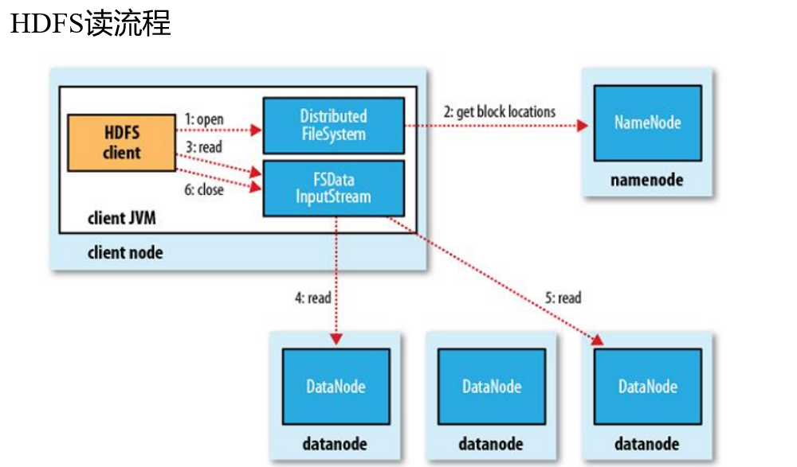

```
还是C和N先，然后再C和D
	在Block副本列表中按距离择优选取
	MD5验证数据完整性
```

权限：

```
POSIX标准（可移植操作系统接口）

与Linux文件权限类似
	r: read; w:write; x:execute
	权限x对于文件忽略，对于文件夹表示是否允许访问其内容
如果Linux系统用户z使用hadoop命令创建一个文件，那么这个文件在HDFS中owner就是z。
HDFS的权限目的：阻止误操作，但不绝对。
	HDFS相信，你告诉我你是谁，我就认为你是谁。

安全模式：
	n启动，首先将映像文件(f)载入内存，并执行编辑日志(e)中的各项操作。
	
	一建立文件系统元数据的映射，建一新f文件(不要SN)和一个空的编辑日志。

	此刻n在安全模式。即n的文件系统对于C来说是只读的。(写、删除、重命名都会失败，尚未获取动态信息)。
	
	在此N收集各个d的报告，当数据块达到最小副本数以上时，会被认为是“安全”的， 在一定比例（可设置）的数  	 据块被确定为“安全”后，再过若干时间，安全模式结束
	
    当检测到副本数不足的数据块时，该块会被复制直到达到最小副本数，系统中数据块的位置并不是由n维护的，     而是以块列表形式存储在d中。	
```

------


#### 伪分布：

简介

```
角色==进程

namenode
	数据元数据
	内存存储，不会有磁盘交换	
	持久化（fsimage，edits log）
	不会持久化block的位置信息
	block：偏移量，因为block不可以调整大小，hdfs，不支持修改文件，偏移量不会改变

datanode
	block块和MD5
	磁盘
	面向文件，大小一样，不能调整
	副本数，调整，（备份，高可用，容错/可以调整很多个，为了计算向数据移动）

SN

NN&DN
	心跳机制
	DN向NN汇报block信息
	安全模式

client
```

步骤：https://hadoop.apache.org/docs/r2.6.5/hadoop-project-dist/hadoop-common/SingleCluster.html

```
#1，依赖软件ssh,jdk
jdk:
#和前面一样能显示JPS就算成功	
vi /etc/profile
	export JAVA_HOME=/usr/java/jdk1.7.0_67
	export PATH=$PATH:$JAVA_HOME/bin
ssh:
ll –a 
#进入.ssh目录 
ssh-keygen -t dsa -P '' -f ~/.ssh/id_dsa
cat ~/.ssh/id_dsa.pub >> ~/.ssh/authorized_keys
chmod 700  .ssh/  给权限

#2，安装hadoop
安装：
mkdir -p /opt/sxt
tar xf hadoop-2.6.5.tar.gz -C /opt/sxt/
#软件path
vi + /etc/profile
	export HADOOP_HOME=/opt/sxt/hadoop-2.6.5
	export PATH=$PATH:$JAVA_HOME/bin:$HADOOP_HOME/bin:$HADOOP_HOME/sbin
. /etc/profile

二次Path：
#Hadoop的第二次JAVA_HOME 环境变量配置
#在hap软件安装目录下，（/opt/sxt）
cd  /etc/hadoop
	vi hadoop-env.sh
	vi mapred-env.sh
	vi yarn-env.sh
	#自己改JAVA的位置：! echo $JAVA_HOME  显示 /usr/java/jdk1.7.0_67

配置：
1)vi core-site.xml

    <property>
        <name>fs.defaultFS</name>
        <value>hdfs://node1:9000</value>
    </property>
    <property>
        <name>hadoop.tmp.dir</name>
        <value>/var/sxt/hadoop/pseudo</value>
    </property>
	#前者是默认一些的，后者存的地方

2)vi hdfs-site.xml
              
    <property>
        <name>dfs.replication</name>
        <value>1</value>
    </property>
    <property>
        <name>dfs.namenode.secondary.http-address</name>
        <value>node1:50090</value>
    </property>
    #前面副本，后面SNN，，由于伪分布，只能有一个副本

3）vi slaves 
  node1
  #之前配置了node1
  
4）格式化
 hdfs namenode -format  (！只能格式化一次，再次启动集群不要执行）
	#fsimage和Id 唯一集群ID，不对了就改这个。

5）启动
start-dfs.sh

6）角色查看
jps
	2354 SecondaryNameNode
	2457 Jps
	1887 DataNode
	2179 NameNode

7)帮助：hdfs
	hdfs dfs （客户端命令）
#ss -nal 
查看web UI: IP:50070
     创建目录：hdfs dfs  -mkdir -p  /user/root   #PATH	
     查看目录:  hdfs dfs -ls   /
     上传文件： hdfs dfs -put  hadoop-2.6.5.tar.gz   /user/root				
      停止集群：stop-dfs.sh

#软件安装在/opt/sxt
#DN的path信息。fs 系统中的 /user/root	
#文件存在/var/sxt/hadoop/pseudo
```

------

#### 全分布：

```
前期准备：
jdk
hostname：       /etc/sysconfig/network
hosts:          /etc/hosts
date:		
安全机制         /etc/sysconfig/selinux   (disabled)
firewall	
windows 域名映射

节点： node06/07/08/09
全分布分配方案：

		  NN		SNN		DN
NODE06		*
NODE07				*		*	
NODE08						*
NODE09						*

#1，秘钥分发

在每个节点上登录一下自己：产生.ssh目录  
#ll -a 查看隐藏目录
从node1向node2/node3/node4分发公钥 (公钥的名称要变化)
scp  id_dsa.pub   node2:`pwd`/node1.pub
各节点把node01的公钥追加到认证文件里：
cat ~/.ssh/node1.pub  >> ~/.ssh/authorized_keys

#2，jdk安装
分发，安装

#3，配置

cp -r hadoop   hadoop-local
#copy node06 下的 hadoop 为 hadoop-local   备份
#管理脚本只会读取hadoop-2.6.5/etc/hadoop目录

先改NN的三个那个JAVA二次path
配置core-site.xml
	存的地方改了full
配置hdfs-site.xml
	second，副本改
配置slaves
	从节点 (7-9)

#分发/opt/sxt到其他07,08，09节点
scp -r hadoop-2.6.5/ node3:`pwd`

#node06分发/etc/profile给其他节点，并 . 配置文件

#4 操作
#主操作
格式化集群：hdfs namenode -format
#这时候只有主才先有full目录
启动集群：start-dfs.sh

#查看
Jps  查看各节点进程启动情况
错误看日志 /opt/下软件的logs

#上传
for i in `seq 100000`;do echo "hello  sxt $i" >>test.txt; done
	#seq 打印一系列
	#本身1.7M
	
hdfs dfs -mkdir -p /user/root
hdfs dfs -D dfs.blocksize=1048576 -put test.txt


#实验是 一个N，两个D，一个又是D又是SN，
	两个副本，分1M一块。
结论：
	#去full找，被严格分开。
	#不同副本部分可能在不同结点
```

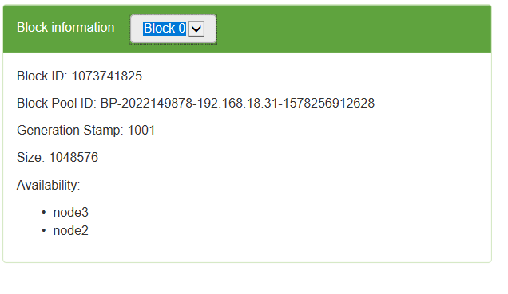

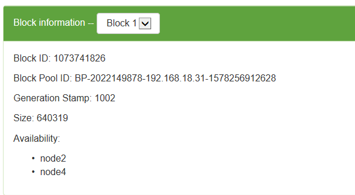

------


# Hadoop2.X

## 背景：

```
Hadoop 1.0中HDFS和MapReduce在高可用、扩展性等方面存在问题

HDFS存在的问题(2个)
	NameNode单点故障，难以应用于在线场景    HA  highavailable    一时间单个运行
	NameNode压力过大，且内存受限，影扩展性   F  federation            多

MapReduce存在的问题响系统（？）
	JobTracker访问压力大，影响系统扩展性
	难以支持除MapReduce之外的计算框架，比如Spark、Storm等

Hadoop 2.x由HDFS、MapReduce和YARN三个分支构成；
	HDFS：NN Federation（联邦）、HA；
		2.X:只支持2个节点HA，3.0实现了一主多从
	MapReduce：运行在YARN上的MR；
		离线计算，基于磁盘I/O计算
	YARN：资源管理系统
```


## HDFS 2.X:

```
解决HDFS 1.0中单点故障和内存受限问题。
解决单点故障
	HDFS HA：通过主备NameNode解决
	如果主NameNode发生故障，则切换到备NameNode上
	
解决内存受限问题
	HDFS Federation(联邦)
	水平扩展，支持多个NameNode；
	（2）每个NameNode分管一部分目录；
	（1）所有NameNode共享所有DataNode存储资源
	
2.x仅是架构上发生了变化，使用方式不变
对HDFS使用者透明
HDFS 1.x中的命令和API仍可以使用


```

### HA:

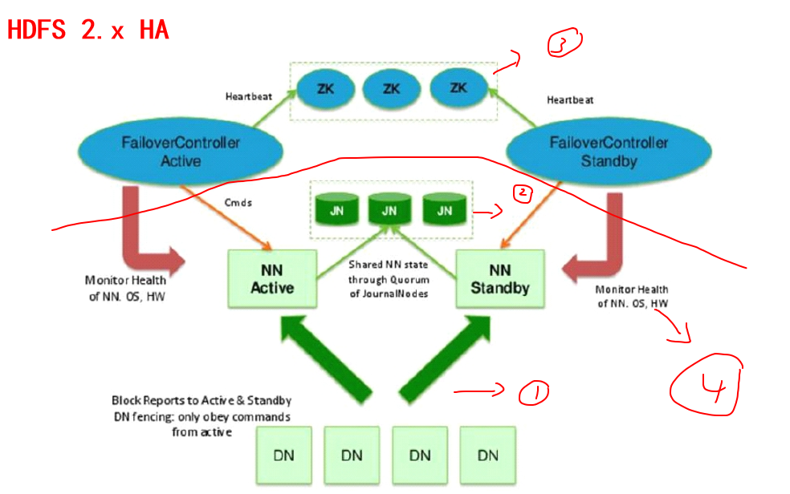

```
数据有动态数据1，和静态数据2
切换有自动3，手动4.
```

```
主备NameNode

解决单点故障（属性，位置）
	主NameNode对外提供服务，备NameNode同步主NameNode元数据，以待切换
	所有DataNode同时向两个NameNode汇报数据块信息（位置）1
	JNN:集群（属性）(journalnode) （原来 linux nfs net filesystem）2
		过半机制：弱一致性
	standby：备，完成了edits.log文件的合并产生新的image，推送回ANN（充当SN）

两种切换选择
	手动切换：通过命令实现主备之间的切换，可以用HDFS升级等场合4
	自动切换：基于Zookeeper实现3

基于Zookeeper自动切换方案
	ZooKeeper Failover Controller：（ZKFC） 故障转移
		监控NN健康状态，和选举
		在NN上的进程
	开始时候向Zookeeper注册NN，先的为主，Znode
	ZK只帮你看，函数回调自己决定做啥
		ANN挂掉后，ZKFC选举告诉ZK，自己挂了，
		然后通知备，备再通过选举变为active，原来的立刻切换成备

```

配置：

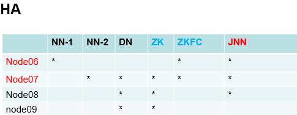


```
只要配置ZK和JNN就行

#1，免密
两个nn节点免秘钥
ssh-keygen -t dsa -P '' -f ~/.ssh/id_dsa
cat ~/.ssh/id_dsa.pub >> ~/.ssh/authorized_keys

再给对方公钥。
scp  id_dsa.pub   node1:`pwd`/node2.pub
cat ~/.ssh/node2.pub  >> ~/.ssh/authorized_keys

#2，修改配置
启动前先JN和ZK
1）进入进入hadoop-2.6.5/etc目录 (可以通过变量：cd $HADOOP_HOME)
拷贝hadoop 为 hadoop-full

2）hdfs-site.xml
去掉snn的配置
 <property>
	<name>dfs.namenode.secondary.http-address</name>
    <value>node07:50090</value>
 </property>
 
增加：NN逻辑名称

<property>
  	<name>dfs.nameservices</name>
  	<value>mycluster</value>
</property>
<property>
  	<name>dfs.ha.namenodes.mycluster</name>
 	 <value>nn1,nn2</value>
</property> 

rpc远程服务调用：实际的
<property>
  	<name>dfs.namenode.rpc-address.mycluster.nn1</name>
  	<value>node1:8020</value>
</property>
<property>
  	<name>dfs.namenode.rpc-address.mycluster.nn2</name>
  	<value>node2:8020</value>
</property>

给浏览器服务的  （超文本传输协议）
<property>
	<name>dfs.namenode.http-address.mycluster.nn1</name>
    <value>node1:50070</value>
</property>
<property>
    <name>dfs.namenode.http-address.mycluster.nn2</name>
    <value>node2:50070</value>
</property>

JNS
<property>
    <name>dfs.namenode.shared.edits.dir</name>
    <value>qjournal://node1:8485;node2:8485;node3:8485/mycluster</value>
</property>

<property>
    <name>dfs.journalnode.edits.dir</name>
    <value>/var/sxt/hadoop/ha/jn</value>
</property>


故障转移
<property>
  <name>dfs.client.failover.proxy.provider.mycluster</name>
  	 <value>org.apache.hadoop.hdfs.server.namenode.ha.ConfiguredFailoverProxyProvider</value>
</property>

立刻隔离
#这种方式
<property>
  	<name>dfs.ha.fencing.methods</name>
  	<value>sshfence</value>
</property>
#找私钥的位置
<property>
 	 <name>dfs.ha.fencing.ssh.private-key-files</name>
  	<value>/root/.ssh/id_dsa</value>
</property>

自动切换：
<property>
   <name>dfs.ha.automatic-failover.enabled</name>
   <value>true</value>
 </property>

3)core-site.xml
主
<property>
  <name>fs.defaultFS</name>
  <value>hdfs://mycluster</value>
</property>

存的
hadoop.tmp.dir的配置要变更：/var/sxt/hadoop/ha

ZK
<property>
   <name>ha.zookeeper.quorum</name>
   <value>node2:2181,node3:2181,node4:2181</value>
</property>

4)分发
#先把其他的拷贝下
mv -r hadoop hadoop-full
scp -r hadoop node4:`pwd`


#3,zookeeper 集群（游离）234装
1) 3节点 java 安装 

2) 所有集群节点创建目录: mkdir opt/sxt  
 
3) zk压缩包解压在其他路径下:：
tar xf zookeeper-3.4.6.tar.gz -C /opt/sxt/

4）进入软件conf目录，改名zoo_sample.cfg zoo.cfg
mv  zoo_sample.cfg zoo.cfg

并配置 dataDir
/var/sxt/zk   （一会先创建）
#原来是临时目录会删除

最后加集群节点。(ZK也是主从,,大号先)
#几台，是谁
sever.1=node2:2888:3888
sever.2=node3:2888:3888
sever.3=node4:2888:3888

分发这个软件  


5） #ID
共享创建 /var/sxt/zk目录，
进入各自目录 分别输出1,2，3 至文件 myid
	echo 1 > /var/sxt/zk/myid
	。。。

6） 单节点配置环境变量、并分发 ZOOKEEPER_PREFIX，共享模式读取profile 
# vi + /etc/profile (两行，加 bin)
export ZOOKEEPER_HOME=/opt/sxt/zookeeper-3.4.6
:$ZOOKEEPER_HOME/bin
source

7） 共享启动zkServer.sh start 集群
#jps 或 zkServer.sh status

#同时启动看谁大，不同时要过半。

8) 启动客户端 help命令查看

1,2,3节点启动jn 集群
-------------------------
hadoop-daemon.sh start journalnode

随意找一个nn节点格式化：
[root@node06 hadoop]# hdfs namenode -format
启动该节点：
[root@node06 hadoop]# hadoop-daemon.sh start namenode
另一nn节点同步：
[root@node07 sxt]# hdfs namenode -bootstrapStandby


格式化zkfc，在zookeeper中可见目录创建：
[root@node06 hadoop]# hdfs zkfc -formatZK
在zookeeper 客户端可见：
#进入：zkCli.sh
	[zk: localhost:2181(CONNECTED) 1] ls /
	[hadoop-ha, zookeeper]
	#维护的信息 
	[zk: localhost:2181(CONNECTED) 2] ls /hadoop-ha
	[mycluster]
	这时候是空。
	
主启动hdfs集群;
start-dfs.sh

	再次查看zk客户端，可见：（之前空。现在两个的都是关于主）
	[zk: localhost:2181(CONNECTED) 9] ls /hadoop-ha/mycluster
	[ActiveBreadCrumb, ActiveStandbyElectorLock]
	或者两个目录的数据，谁是主谁被创建：
	 get /hadoop-ha/mycluster/ActiveBreadCrumb


看信息
node6 node7 50070

实验：变了，只关注主的信息
关闭主：hadoop-daemon.sh stop namenode （挂了）
再启动：hadoop-daemon.sh start namenode（还是备）
或者再  hadoop-daemon.sh stop zkfc（没挂。只是变成了备）


#zk 和集群独立
stop-dfs.sh
共享 zkServer.sh stop

#下次启动
先zk，再启动集群就行

```


### F：

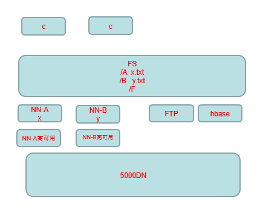

```
多个NN同时工作
在上面封一个FS（接口），分配任务的。
```

------

### Eclispe:

#在windows通过Eclispe 远程控制集群（3.X网页就有这个功能了）

一定要对应相应的JDK（1.7.0_17）和插件


​	https://zhuanlan.zhihu.com/p/93091830

快捷键：

【ALT +/】 此快捷键能为用户提供内容的辅助提示

【Alt+↓】 当前行和下面一行交互位置

【F2】：给提示

【alt+shift+r 】 批量重命名快捷键 

【ctrl+shift+L】 查看当前eclipse快捷键的配置

【Crtl + 1】：操作类


------

# MR

## 简介：

```
map + reduce
```

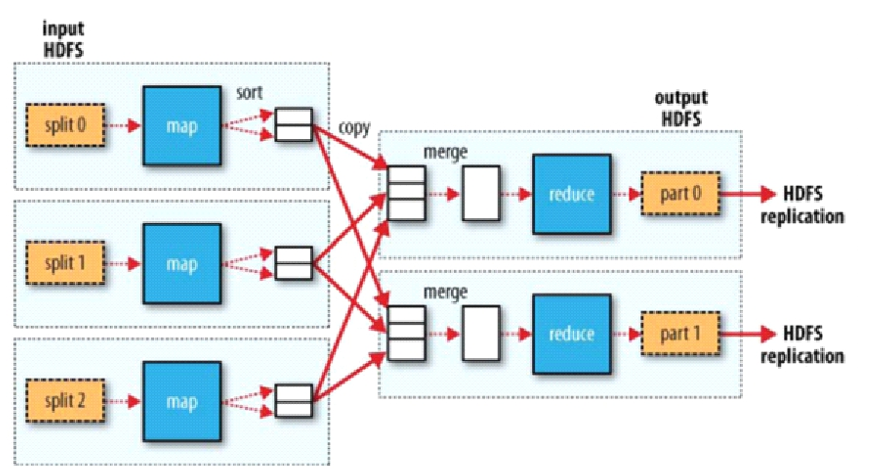


```
切片，  map，  洗牌，  reduce

Block- <  Split = Map
		  分区  =  Reduce
Reduce:一个能多组KEY，但是一个KEY只能同R

工作不要交给R，交互频度慢，（默认一个） 。
M只映射KV，分区自动，不计算
```

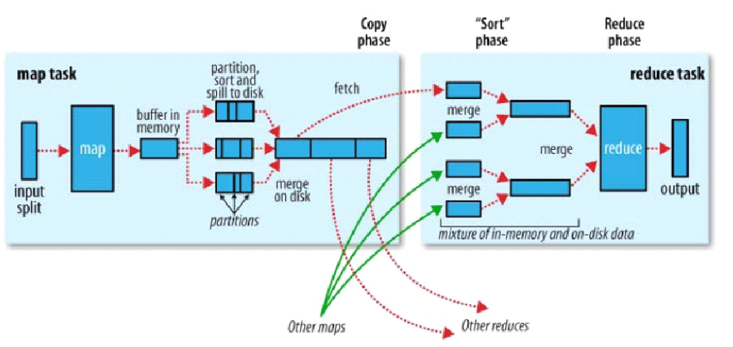

```
细节：内存快
1）
buffer（缓冲区）:   先堆一小波map  
	分好区排好序（R决定，自己设定），  ：粗    
	分区里再二次排序   （可能混）    ：细     
	再压缩，          （先自己算算）

2)
溢写，多个小buffer变一个文件，再排序，变成整体再发送。

3）
 R先不来一个打一个（map多），先之前再合并一次，但不要完全合并（不然浪费时间）


```


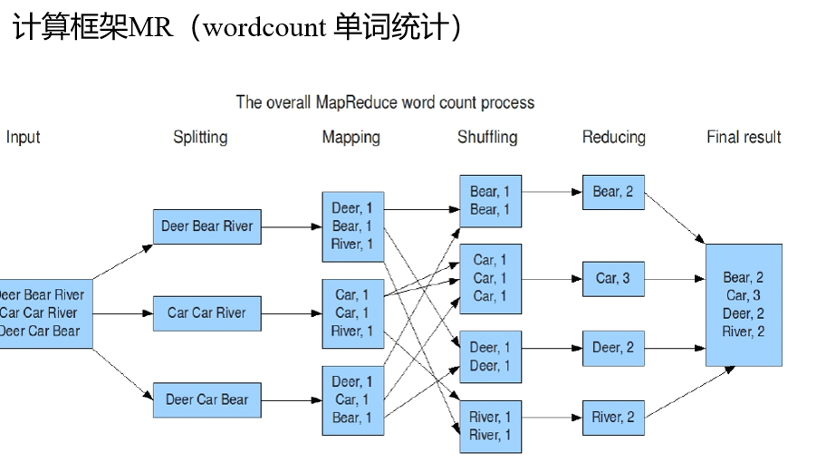

```
理解：
	Map：
		读懂数据 		！
		映射为KV模型
		并行分布式
		计算向数据移动
	Reduce：
		数据全量/分量加工（partition/group） ！
			Reduce中可以包含不同的key
			相同的Key汇聚到一个Reduce中
		相同的Key调用一次reduce方法  		！

	K,V必须使用自定义数据类型
		作为参数传递，节省开发成本，提高程序自由度
		Writable序列化：使能分布式程序数据交互 				！
		Comparable比较器：实现具体排序（字典序，数值序等）		 ！
```

------


## 1.X：


```
C很重要： （打成JAR，提交给HDFS：NN。 T去找NN，看任务）
	规划
		Reduce-Partition 
		块-片- m

J : 管T
	任务调度 
		和NN沟通，块位置。
	资源管理
		整个结点占用情况。
	知道任务

```


```
#3个块，3个片，3个map。
#自定义K和V。
```


```
#一个K，一个区，一个reduce
```

理解：

```
MRv1角色：
	JobTracker
		核心，主，单点
		调度所有的作业
		监控整个集群的资源负载
		知道作业

	TaskTracker：M和R两种
		从，自身节点资源管理
		和JobTracker心跳，汇报资源，获取Task（主动）
		看作业

	Client
		作业为单位  job
		规划作业计算分布
		提交作业资源到HDFS
		最终提交作业到JobTracker


弊端：
	JobTracker：负载过重，单点故障
	资源管理与计算调度强耦合，其他计算框架需要重复实现资源管理
		互相不知道，不知道同一个资源有没有用，如果没用还要再重复申请其他的
		#不同框架对资源不能全局管理

```

------

## 2.X：


#把资源掌控给宅出来了。 两个红线长服务，一直都在。

#自身有HA（ZK管理）

```
理解：

MRv2：On YARN
	YARN：解耦资源与计算
		ResourceManager                   （RM）
			主，核心
			集群节点资源管理
		NodeManager（帮手）                 （NM）
			与RM汇报资源
			管理Container生命周期
			#计算框架中的角色都以Container表示

		Container：【节点NM，CPU,MEM,I/O大小，启动命令】
			默认NodeManager启动线程监控Container大小，超出申请资源额度，kill
			支持Linux内核的Cgroup

	MR ：
		MR-ApplicationMaster-Container    （AM）
			作业为单位，避免单点故障，负载到不同的节点
			创建Task需要和RM申请资源（Container  /MR 1024MB）
		Task-Container

	Client：
		RM-Client：请求资源创建AM
		AM-Client：与AM交互，看任务信息

```

#YARN  –Yet Another Resource Negotiator；

```
Hadoop 2.0新引入的资源管理系统，直接从MRv1演化而来的；
	核心思想：将MRv1中J的资源管理和任务调度两个功能分开，分别由RMr和AM进程实现
		ReM：负责整个集群的资源管理和调度
		AM：负责应用程序相关的事务，比如任务调度、任务监控和容错等

	YARN的引入，使得多个计算框架可运行在一个集群中
		每个应用程序对应一个AnM
		目前多个计算框架可以运行在YARN上，比如MapReduce、Spark、Storm等
```

#MapReduce On YARN：MRv2

```
将MapReduce作业直接运行在YARN上，而不是由JobTracker和TaskTracker构建的MRv1系统中

基本功能模块
	YARN：负责资源管理和调度
	AM：负责任务切分、任务调度、任务监控和容错等
		#MapTask/ReduceTask：任务驱动引擎，与MRv1一致

每个MapRaduce作业对应一个MRAppMaster
	AM任务调度
	YARN将资源分配给MRAppMaster
    MRAppMaster进一步将资源分配给内部的任务

MRAppMaster容错
	失败后，由YARN重新启动
	任务失败后，MRAppMaster重新申请资源

```

## 搭建：


#比之前：

​	加2个RS（减少压力，放3,4）

​	加3个NM（DN上）

```
1，RS免秘钥：
#因为HA，要切换。

3节点 .ssh 目录下： ssh-keygen -t dsa -P '' -f ./id_dsa
		    cat id_dsa.pub >> authorized_keys
		    scp id_dsa.pub node4:`pwd`/node3.pub

4节点 .ssh 目录下 ：
		cat node3.pub >> authorized_keys
		ssh-keygen -t dsa -P '' -f ./id_dsa
		cat id_dsa.pub >> authorized_keys
	        scp id_dsa.pub root@node3:`pwd`/node4.pub
		
3节点 .ssh 目录下：
		cat node4.pub >> authorized_keys


2，配置：
1）mapred-site.xml
==============================
#yarn
<property>
        <name>mapreduce.framework.name</name>
        <value>yarn</value>
</property>


2）yarn-site.xml:
=================================
#洗也归yarn
<property>
        <name>yarn.nodemanager.aux-services</name>
        <value>mapreduce_shuffle</value>
    </property>

<property>
   <name>yarn.resourcemanager.ha.enabled</name>
   <value>true</value>
 </property>

 <property>
   <name>yarn.resourcemanager.cluster-id</name>
   <value>cluster1</value>
 </property>

 <property>
   <name>yarn.resourcemanager.ha.rm-ids</name>
   <value>rm1,rm2</value>
 </property>

 <property>
   <name>yarn.resourcemanager.hostname.rm1</name>
   <value>node3</value>
 </property>
 <property>
   <name>yarn.resourcemanager.hostname.rm2</name>
   <value>node4</value>
 </property>

 <property>
   <name>yarn.resourcemanager.zk-address</name>
   <value>node2:2181,node3:2181,node4:2181</value>
 </property>

3）分发两个文件到：2,3,4节点
scp mapred-site.xml  yarn-site.xml node2:`pwd`
scp mapred-site.xml  yarn-site.xml node3:`pwd`
scp mapred-site.xml  yarn-site.xml node4:`pwd`

3,操作：
1）启动：
	A zookeeper
	 
	B node1:hdfs （注意，有一个脚本不要用，start-all）start-dfs.sh
  		#如果nn1 和 nn2没有启动，需要在1，2分：hadoop-daemon.sh start namenode   
	 node1: start-yarn.sh (启动nodemanager)
	 #上面两个等于start-all.sh（还不知道好不好）
	 
	C 在3,4节点分别执行脚本： yarn-daemon.sh start resourcemanager（必须手动）
	
	UI访问： RS ip：8088

2)开始计算能力  (count)：
cd  /share/hadoop/mapreduce  :有个example.jar （有wordcount）
hadoop jar hadoop-mapreduce-examples-  wordcount  path1 path2
	#path2 要空目录或者没有
大象看或者客户端 hdfs  dfs -cat

3)停止：
node1: stop-dfs.sh 
ZK:zkServer.sh stop
node1: stop-yarn.sh (停止nodemanager)
node3node4: yarn-daemon.sh stop resourcemanager （停止resourcemanager）
```

## WC：

```
步骤：
Src
	添加新的XML（上面那两个配置）
	新的Class  （如图）
```

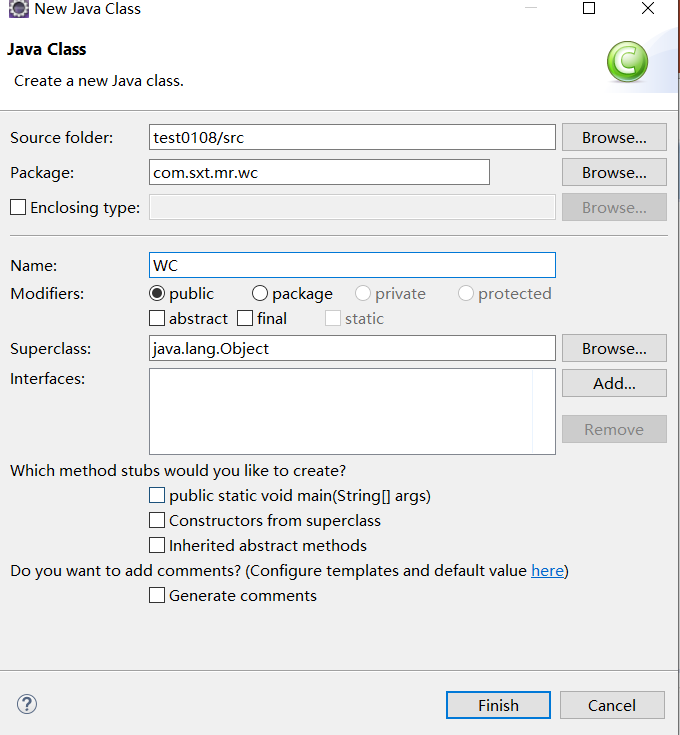

```
程序
	1，创建类
#1，WC.java
package com.sxt.mr.wc;
import java.io.IOException;
import org.apache.hadoop.conf.Configuration;
import org.apache.hadoop.fs.Path;
import org.apache.hadoop.io.IntWritable;
import org.apache.hadoop.io.Text;
import org.apache.hadoop.mapreduce.Job;
import org.apache.hadoop.mapreduce.lib.input.FileInputFormat;
import org.apache.hadoop.mapreduce.lib.output.FileOutputFormat;

public class WC {
	public static void main(String[] args) throws IOException, ClassNotFoundException,InterruptedException{
		//Create
		Configuration conf =new Configuration(); 
		Job job = Job.getInstance(conf);
		job.setJarByClass(WC.class);
		
		//job parameters
		job.setJobName("myjob");
		
		Path inPath = new Path("/user/root/test.txt");
		FileInputFormat.addInputPath(job, inPath);
		Path outPath = new Path("/output/wc");
		// 如果有了输出路径，则先删除
		if(outPath.getFileSystem(conf).exists(outPath))
			outPath.getFileSystem(conf).delete(outPath, true);
		FileOutputFormat.setOutputPath(job, outPath);
		//job规划
		job.setMapperClass(MyMapper.class);
		job.setMapOutputKeyClass(Text.class);
		job.setOutputValueClass(IntWritable.class);
		job.setReducerClass(MyReducer.class);
		
		//submit job
		job.waitForCompletion(true);
   }
```


```
	2,设计规划（job）
#2.1 MyMapper
package com.sxt.mr.wc;

import java.io.IOException;
import java.util.StringTokenizer;

import org.apache.hadoop.io.IntWritable;
import org.apache.hadoop.io.Text;
import org.apache.hadoop.mapreduce.Mapper;

//Map: Kin 下标索引，Vin ：一行数据，OUT：字符串，数字
public class MyMapper extends Mapper<Object, Text, Text,IntWritable>  {
	private final static IntWritable one =new IntWritable(1);
	private Text word =new Text();
	//重写map	
	public void map(Object key,Text value ,Context context ) throws IOException,InterruptedException {
		StringTokenizer itr = new StringTokenizer(value.toString());
		while (itr.hasMoreTokens()){
			word.set(itr.nextToken());
			context.write(word,one);
		}
	}

}
---------------------------------------------------------
#2.1 MyReducer
package com.sxt.mr.wc;
import java.io.IOException;
import org.apache.hadoop.io.IntWritable;
import org.apache.hadoop.io.Text;
import org.apache.hadoop.mapreduce.Reducer;

public class MyReducer extends Reducer<Text,IntWritable, Text,IntWritable> {

	//迭代计算,不同就调用新的reduce
	//hello hello .....sxt,sxt
	private IntWritable result = new IntWritable();		
	public void reduce(Text key , Iterable<IntWritable> values, Context context) 
						throws IOException,InterruptedException{
		int sum =0 ;
		for (IntWritable val :values){
			sum += val.get();
		}
			result.set(sum);
			context.write(key, result);		
	   }	
}

```

```
		3，Jar包
			export jar,,传到linux
			hadoop jar wc.jar com.sxt.mr.wc.WC

#慢（小文件也慢，大文件有一定优势）
```

